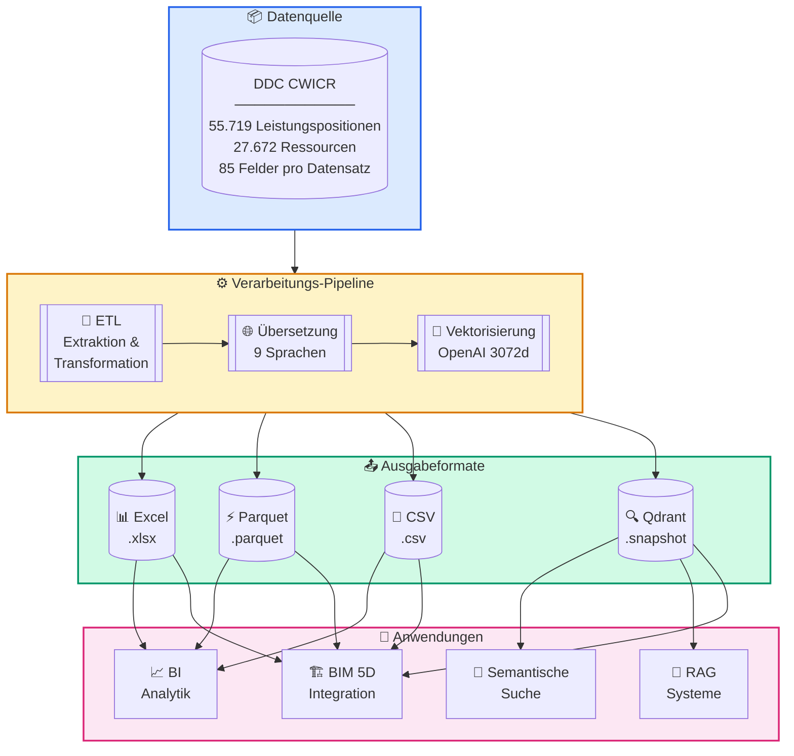
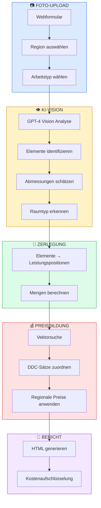
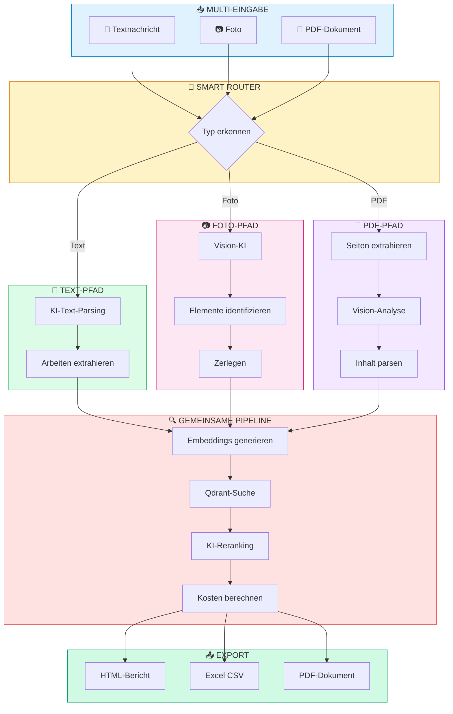
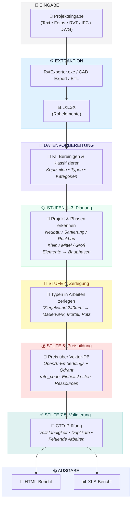

<h3 align="center">DDC CWICR - Bauleistungspositionen, Komponenten & Ressourcen </br>
  + n8n-Pipelines zur Kostenkalkulation auf Basis von Beschreibungen, Fotos und CAD (BIM)</h3>

<p align="center">
  <a href="README.md">English</a> •
  <a href="README.zh-CN.md">中文</a> •
  <a href="README.es.md">Español</a> •
  <a href="README.pt-BR.md">Português</a> •
  <a href="README.ru.md">Русский</a> •
  <a href="README.ja.md">日本語</a> •
  <a href="README.de.md"><b>Deutsch</b></a> •
  <a href="README.fr.md">Français</a>
</p>

<p align="center">
  
</p>

<div align="center">
  
  
  
  
</div>

<div align="center">
  
  
  
  
  
</div>

<p align="center">
  
</p>

<h3 align="center">⚡ n8n Workflows</h3>
<p align="center"><code>Wählen Sie Ihre Eingabe → Erhalten Sie eine Kostenschätzung</code></p>

<br>

<table width="100%">
<tr>

<td align="center" valign="top" width="33%">
<br>
<h3>📝 Text</h3>
<p>Schnelle Schätzung<br>aus einer kurzen Beschreibung</p>
<p><b>Eingabe:</b> Telegram- / Chat-Nachricht<br>
<b>Ausgabe:</b> Zugeordnete Leistungspositionen + Schätzung</p>
<br>
<a href="#1️⃣-text-schätzungs-bot">📖 Dokumentation</a>
<br><br>
<a href="./n8n_1_Telegram_Bot_Cost_Estimates_and_Rate_Finder_TEXT_DDC_CWICR.json">

</a>
<br><br>
</td>

<td align="center" valign="top" width="33%">
<br>
<h3>📷 Foto / PDF</h3>
<p>Baustellenfotos, gescannte LV,<br>Foto-PDFs vom Feld</p>
<p><b>Eingabe:</b> Bild oder PDF-Seiten<br>
<b>Ausgabe:</b> Extrahierter Umfang → Schätzung</p>
<br>
<a href="#2️⃣-foto-kostenschätzer">📖 Foto-Doku</a> · <a href="#3️⃣-universal-bot-text--foto--pdf">📖 Universal-Bot</a>
<br><br>
<a href="./n8n_2_Photo_Cost_Estimate_DDC_CWICR.json">

</a>
&nbsp;
<a href="./n8n_3_Telegram_Bot_Cost_Estimates_and_Rate_Finder_TEXT_PHOTO_PDF_DDC_CWICR.json">

</a>
<br><br>
</td>

<td align="center" valign="top" width="33%">
<br>
<h3>🧊 CAD / BIM</h3>
<p>Revit- / IFC- / DWG-basierte<br>Mengenermittlung & Kalkulation</p>
<p><b>Eingabe:</b> Modellexport <br>
<b>Ausgabe:</b> 4D/5D-Schätzung + Aufgliederung</p>
<br>
<a href="#4️⃣-cad-bim-kostenschätzungs-pipeline">📖 Dokumentation</a>
<br><br>
<a href="./n8n_4_CAD_(BIM)_Cost_Estimation_Pipeline_4D_5D_with_DDC_CWICR.json">

</a>
<br><br>
</td>

</tr>
</table>

<br>
<p align="center">
  <a href="https://openconstructionestimate.com">
    
  </a>
</p>
<br>
<p align="center">
 DataDrivenConstruction Kunden und Nutzer
  <br>
  <a href="https://datadrivenconstruction.io/">
  
  </a>
  <br></br>
</p>


---

## 📑 Inhaltsverzeichnis

### KI-Integration
- [Perfekter Treibstoff für KI](#-perfekter-treibstoff-für-ihre-ki-produkte) — Warum diese Datenbank ideal für KI ist
- [Claude Code](#-claude-code--ki-codierassistent) — Nutzung des KI-Codierassistenten
- [n8n](#-n8n--visuelle-workflow-automatisierung) — Workflow-Automatisierung
- [Dify](#-dify--llm-anwendungen-erstellen) — LLM-App-Entwicklung
- [Sim AI & Andere](#-sim-ai--ähnliche-plattformen) — Kompatible Plattformen
- [Universelle Anwendungsfälle](#-universelle-anwendungsfälle) — Was Sie erstellen können

### Datenbank & Daten
- [Über](#über) — Was ist DDC CWICR
- [Verfügbare Formate](#verfügbare-formate) — Excel, Parquet, CSV, Qdrant
- [Datenschema](#datenschema) — 85-Felder-Struktur
- [Feldgruppen](#feldgruppen) — Klassifizierung, Ressourcen, Arbeit, Maschinen
- [Methodik](#methodik) — Ressourcenbasierte Kalkulationsprinzipien
- [Historischer Kontext](#historischer-kontext) — 100+ Jahre Standards

### n8n Workflows
- [n8n Workflows Übersicht](#-n8n-workflows) — Wählen Sie Ihren Eingabetyp
- [Jetzt ausprobieren — Live-Demo-Bots](#-jetzt-ausprobieren--live-demo-bots) — Sofort in Telegram testen
- [Workflow 1: Text-Schätzungs-Bot](#1️⃣-text-schätzungs-bot) — Telegram-Bot für Texteingabe
- [Workflow 2: Foto-Kostenschätzer](#2️⃣-foto-kostenschätzer) — Webformular mit KI-Vision
- [Workflow 3: Universal-Bot](#3️⃣-universal-bot-text--foto--pdf) — Text + Foto + PDF
- [Workflow 4: CAD/BIM-Pipeline](#4️⃣-cad-bim-kostenschätzungs-pipeline) — Revit/IFC/DWG zur Schätzung
- [Workflows Schnellstart](#workflows-schnellstart) — Einrichtung in 4 Schritten
- [⚠️ n8n 2.0+ Einrichtung](#️-n8n-20-einrichtung-erforderlich) — Execute Command Node aktivieren

### CAD/BIM Pipeline Details
- [Voraussetzungen](#-voraussetzungen) — Erforderliche Komponenten
- [Pipeline-Stufen](#-pipeline-stufen) — 10-stufige Verarbeitung
- [LLM-Modellauswahl](#️-llm-modellauswahl) — OpenAI, Claude, Gemini, Grok
- [Ausgabedateien](#-ausgabedateien) — HTML- & Excel-Berichte
- [Fehlerbehebung](#️-fehlerbehebung) — Häufige Probleme

### Vektordatenbank
- [Vektordatenbank](#vektordatenbank) — Semantische Suche mit Qdrant
- [Releases](#releases) — Snapshots herunterladen
- [Sammlungen](#sammlungen) — 9 Sprachsammlungen
- [Docker-Bereitstellung](#docker-bereitstellung) — Selbst gehostete Einrichtung

### Erste Schritte
- [Schnellstart - Python](#schnellstart) — Tabellarische Daten & semantische Suche
- [Integrations-Anwendungsfälle](#integration) — Einstiegs- bis Fortgeschrittenen-Level

### Community
- [Ressourcen & Community](#ressourcen--community) — Links & Kanäle
- [Beratung & Schulung](#beratung--schulung) — Professionelle Dienstleistungen
- [Mitwirken](#mitwirken) — Reichen Sie Ihre Workflows ein
- [Lizenz](#lizenz) — CC BY 4.0 & MIT
- [Projekt unterstützen](#projekt-unterstützen) — Sponsern & Spenden


---

## 🚀 Perfekter Treibstoff für Ihre KI-Produkte

<p align="center">
  <b>Klonen Sie einfach das Repository und beschreiben Sie, was Sie wollen — die KI erledigt den Rest</b>
</p>

DDC CWICR ist nicht nur eine Datenbank — es ist **gebrauchsfertiger Treibstoff für KI-gestützte Anwendungen**. Ob Sie Kostenschätzungs-Bots erstellen, Bau-Workflows automatisieren oder intelligente Assistenten entwickeln — diese Daten funktionieren sofort mit modernen KI-Tools.

### Warum diese Datenbank ideal für KI ist

| Merkmal | Vorteil |
|---------|---------|
| **Vorberechnete Embeddings** | Keine Vektorgenerierung nötig — semantische Suche funktioniert sofort |
| **Strukturiertes 85-Felder-Schema** | KI kann Datenbeziehungen verstehen und präzise Antworten liefern |
| **9 Sprachen enthalten** | Mehrsprachige Anwendungen ohne Übersetzungsaufwand erstellen |
| **55.000+ Leistungspositionen** | Umfassende Abdeckung für jede Baukostenschätzungsaufgabe |
| **Ressourcenbasierte Methodik** | Transparente Daten, die KI erklären und aufschlüsseln kann |

### 🛠️ Funktioniert perfekt mit

<table>
<tr>
<td align="center" width="20%">
<br/>
<b>Claude Code</b><br/>
<sub>KI-Codierassistent CLI</sub>
</td>
<td align="center" width="20%">
<br/>
<b>Google Antigravity</b><br/>
<sub>Google Antigravity</sub>
</td>
<td align="center" width="20%">
<br/>
<b>n8n</b><br/>
<sub>Workflow-Automatisierung</sub>
</td>
<td align="center" width="20%">
<br/>
<b>Dify</b><br/>
<sub>LLM-App-Entwicklung</sub>
</td>
<td align="center" width="20%">
<br/>
<b>Sim AI & Andere</b><br/>
<sub>KI-Plattformen</sub>
</td>
</tr>
</table>

---

### 💻 Claude Code & Google Antigravity — KI-Codierassistenten

Der schnellste Weg, mit DDC CWICR zu arbeiten. Öffnen Sie einfach das Repository in Claude Code oder Google Antigravity und stellen Sie Fragen in natürlicher Sprache.

**Erste Schritte:**
```bash
# Repository klonen
git clone https://github.com/datadrivenconstruction/OpenConstructionEstimate-DDC-CWICR.git

# Mit Claude Code öffnen
cd OpenConstructionEstimate-DDC-CWICR
claude
```

**Beispiel-Prompts:**

| Aufgabe | Prompt |
|---------|--------|
| **Daten erkunden** | "Zeige mir die Struktur dieser Baudatenbank und erkläre, welche Daten verfügbar sind" |
| **Leistungspositionen finden** | "Finde alle Leistungspositionen zu Betonfundamenten und zeige deren Kosten" |
| **Abfragen erstellen** | "Schreibe ein Python-Skript zur Suche nach Sanitärarbeiten mit Arbeitsstunden > 100" |
| **Berichte erstellen** | "Erstelle einen Kostenaufstellungsbericht für Wohnungssanierungsarbeiten" |
| **Kosten analysieren** | "Vergleiche Materialkosten zwischen verschiedenen Wandbaumethoden" |
| **Integrationen erstellen** | "Erstelle ein Skript, das sich mit der Qdrant-Datenbank verbindet und semantische Suche durchführt" |

**Profi-Tipps:**
- Verweisen Sie Claude auf bestimmte Dateien: *"Analysiere die Parquet-Datei und fasse die Kostenverteilung zusammen"*
- Bitten Sie um Erklärungen: *"Erkläre, wie die ressourcenbasierte Kalkulationsmethodik in dieser Datenbank funktioniert"*
- Fordern Sie Änderungen an: *"Modifiziere den n8n-Workflow, um E-Mail-Benachrichtigungen hinzuzufügen"*

---

### ⚡ n8n — Visuelle Workflow-Automatisierung

Erstellen Sie leistungsstarke Automatisierungs-Pipelines ohne Programmierung. Verbinden Sie DDC CWICR mit 400+ Apps und Diensten.

**Anwendungsfälle:**

| Workflow | Beschreibung |
|----------|--------------|
| **Telegram-Bot** | Benutzer sendet Text/Foto → KI extrahiert Leistungspositionen → Gibt Kostenschätzung zurück |
| **E-Mail-Automatisierung** | LV per E-Mail empfangen → Mit KI verarbeiten → Formatierte Schätzung senden |
| **CRM-Integration** | Neues Projekt im CRM → Vorläufige Schätzung automatisch generieren → Auftragswert aktualisieren |
| **BIM-Pipeline** | Export aus Revit → Mengen extrahieren → Mit DDC-Sätzen abgleichen → 5D-Bericht erstellen |
| **Slack-Bot** | Team stellt Fragen → KI durchsucht Datenbank → Gibt relevante Leistungspositionen zurück |

**Schnellstart:**
1. Workflow-JSON aus diesem Repository herunterladen
2. In n8n importieren: `Workflows → Importieren → Aus Datei`
3. Anmeldedaten konfigurieren (OpenAI, Qdrant, Telegram)
4. Aktivieren und testen

Siehe Abschnitt [n8n Workflows](#n8n-workflows--detaillierte-beschreibung) für detaillierte Einrichtung.

---

### 🤖 Dify — LLM-Anwendungen erstellen

Erstellen Sie benutzerdefinierte KI-Anwendungen mit DDC CWICR als Wissensbasis.

**Einrichtung:**
1. Neue Dify-Anwendung erstellen
2. Wissensbasis hinzufügen → Parquet/CSV-Dateien hochladen oder mit Qdrant verbinden
3. RAG-Pipeline mit Embeddings konfigurieren
4. Chat-Oberfläche oder API erstellen

**Anwendungsideen:**

| App-Typ | Beschreibung |
|---------|--------------|
| **Baukostenschätzungs-Chatbot** | Konversationsschnittstelle für Kostenabfragen |
| **Leistungspositions-Suche** | Natürlichsprachliche Suche über 55.000+ Positionen |
| **Kostenberater** | KI, die Kostenaufschlüsselungen erklärt und Optimierungen vorschlägt |
| **Mehrsprachiger Assistent** | Sprache automatisch erkennen und in Benutzersprache antworten |
| **API-Endpunkt** | REST-API zur Integration mit anderen Systemen |

**Beispiel Dify Prompt-Vorlage:**
```
Sie sind ein Baukostenschätzungs-Assistent mit Zugang zur DDC CWICR-Datenbank.

Kontext: {{context}}

Benutzerfrage: {{query}}

Geben Sie genaue Kosteninformationen basierend auf der Datenbank an. Enthalten Sie:
- Relevante Leistungspositionen mit Codes
- Einheitskosten und Mengen
- Ressourcenaufschlüsselung (Arbeit, Materialien, Ausrüstung)
- Gesamtkostenberechnung
```

---

### 🔮 Sim AI & Ähnliche Plattformen

DDC CWICR integriert sich mit jeder KI-Plattform, die unterstützt:
- **Vektordatenbanken** (Qdrant, Pinecone, Weaviate, Milvus)
- **Strukturierte Daten** (CSV, Parquet, Excel)
- **OpenAI-Embeddings** (text-embedding-3-large, 3072 Dimensionen)

**Kompatible Plattformen:**
- **Sim AI** — KI-Simulation und -Modellierung
- **LangChain / LlamaIndex** — LLM-Anwendungs-Frameworks
- **Flowise** — Low-Code LLM-App-Builder
- **Botpress** — Konversations-KI-Plattform
- **Voiceflow** — Sprach- und Chat-Design
- **Stack AI** — No-Code KI-Workflows
- **Relevance AI** — KI-Workforce-Plattform

**Universelles Integrationsmuster:**

```python
# Funktioniert mit jeder Plattform, die Qdrant unterstützt
from qdrant_client import QdrantClient

# Mit DDC CWICR verbinden
client = QdrantClient("your-qdrant-instance", port=6333)

# Semantische Suche
results = client.search(
    collection_name="ddc_cwicr_en",  # oder de, ru, zh, etc.
    query_vector=your_embedding,
    limit=10
)

# Ergebnisse in Ihrer KI-Anwendung verwenden
for item in results:
    print(f"{item.payload['rate_code']}: {item.payload['rate_original_name']}")
```

---

### 📋 Universelle Anwendungsfälle

Unabhängig davon, welches KI-Tool Sie wählen, ermöglicht DDC CWICR:

| Anwendungsfall | Beschreibung |
|----------------|--------------|
| **Sofortige Kostenschätzung** | Baukosten aus Textbeschreibungen oder Fotos ermitteln |
| **LV-Generierung** | Leistungsverzeichnis automatisch aus Projektbeschreibungen erstellen |
| **Preis-Benchmarking** | Kosten über Regionen und Sprachen hinweg vergleichen |
| **Ressourcenplanung** | Arbeitsstunden, Materialien und Ausrüstungsbedarf berechnen |
| **Investitionsanalyse** | Tiefgehende Kostenprüfungen mit vollständiger Ressourcentransparenz |
| **Mehrsprachige Unterstützung** | Benutzer in 9 Sprachen mit lokalisierten Preisen bedienen |
| **BIM-Integration** | Mit Revit/IFC für automatisierte 4D/5D-Schätzung verbinden |
| **KI-Modelle trainieren** | Strukturierte Daten für das Feintuning von Bau-KI verwenden |

---

## Über

**DDC CWICR** (Construction Work Items, Components & Resources - Bauleistungspositionen, Komponenten & Ressourcen) ist eine offene Datenbank für Baukostenschätzung, die das gesamte Spektrum von Bauaktivitäten abdeckt - von Erdarbeiten und Betonarbeiten bis hin zu spezialisierten Installationsarbeiten.

Die Datenbank stützt sich auf Quellen, die moderne Baupraktiken in Eurasien und der asiatisch-pazifischen Region beschreiben, wo ein einheitliches technisches Standardisierungs-Ökosystem als gemeinsame Ingenieursprache für mehr als zehn dynamisch wachsende Volkswirtschaften dient. DDC CWICR stellt einen Versuch dar, offene Standards zu harmonisieren, indem ein einheitlicher regulatorischer Rahmen für das Kapitalprojektmanagement in mehreren Sprachen etabliert wird.

<p align="center">
  <br>
  
  <br></br>
</p>

Die strukturierten Daten können über tabellarische Formate (XLSX, CSV, Parquet) abgerufen oder über LLM konversationell abgefragt werden, was Fachleuten ermöglicht, Bauleistungsbeschreibungen (QDRANT-Vektordatenbank) in automatisierte Pipelines und Workflows mit natürlicher Sprache oder prägnanten Abfragen zu integrieren.

### Verfügbare Formate

| Format      | Erweiterung | Größe        | Am besten für                          | Merkmale                              |
|-------------|-------------|--------------|----------------------------------------|---------------------------------------|
| **Excel**   | `.xlsx`     | ~150–400 MB  | Manuelle Analyse, Filterung, Pivots    | Menschenlesbar, volle Formatierung    |
| **Parquet** | `.parquet`  | ~55 MB       | ETL-Pipelines, ML-Training, Big Data   | Spaltenbasiert, exzellente Kompression|
| **CSV**     | `.csv`      | ~1,3 GB      | Datenbankimport, Legacy-Systeme        | Universelle Kompatibilität            |
| **Qdrant**  | `.snapshot` | ~1 GB        | Semantische Suche, RAG, KI-Assistenten | Vorberechnete OpenAI-Embeddings       |


Eine Live-Demo ist unter [openconstructionestimate.com](https://openconstructionestimate.com/) verfügbar, wo Sie die Daten erkunden und die Vektordatenbank in Aktion für semantische Suche sehen können.

<p align="center">
  
</p>

---

## Datenschema

Die Datenbank enthält **85 Felder**, die in logische Gruppen organisiert sind. Jeder Datensatz repräsentiert entweder eine Leistungsposition (Rate) oder eine Ressource mit vollständiger Kostenaufschlüsselung.


### Feldgruppen
Die 85 Datenbankfelder sind in logische Gruppen organisiert, die die ressourcenbasierte Kalkulationsmethodik widerspiegeln. Jede Gruppe erfüllt eine spezifische Funktion in der Kostenaufschlüsselungsstruktur: von hierarchischer Klassifizierung und Leistungspositionsidentifikation bis hin zu detailliertem Ressourcenverbrauch, Arbeitsanforderungen, Maschinenkosten und aggregierten Summen. Diese modulare Struktur ermöglicht es Benutzern, nur die relevanten Felder für ihre Aufgabe abzufragen - ob sie ein Materialverzeichnis erstellen, Arbeitsproduktivität analysieren oder eine vollständige Kostenschätzung erstellen.

<p align="center">
  <br>
  
  <br></br>
</p>

**Klassifizierung** - `category_type`, `collection_code`, `collection_name`, `department_code`, `department_name`, `department_type`, `section_name`, `section_type`, `subsection_code`, `subsection_name`

**Leistungsposition (Rate)** - `rate_code`, `rate_original_name`, `rate_final_name`, `rate_unit`, `row_type`, `is_scope`, `is_abstract`, `is_machine`, `is_labor`, `is_material`, `work_composition_text`

**Ressourcen** - `resource_code`, `resource_name`, `resource_unit`, `resource_quantity`, `parameter_resource_quantity`, `resource_price_per_unit_eur_current`, `resource_cost_eur`

**Arbeit** - `count_workers_per_unit`, `count_engineers_per_unit`, `count_machinists_per_unit`, `count_total_people_per_unit`, `labor_hours_construction_workers`, `labor_hours_machinists`, `labor_hours_engineers`, `total_labor_hours_workers_machinists`, `total_labor_hours_all_personnel`, `cost_of_working_hours`, `count_people_per_day`

**Maschinen** - `machine_class2_name`, `machine_class3_name`, `personnel_machinist_code`, `personnel_machinist_grade`, `price_machinist_wages`, `price_relocation_included`, `price_cost_without_wages`, `electricity_consumption_kwh_per_machine_hour`, `electricity_cost_per_unit`, `electricity_cost_total_sum`, `cost_machinist_sum`, `total_value_machinery_equipment`

**Preisvarianten** - `price_code_prefix`, `price_abstract_resource_common_start`, `price_abstract_resource_variable_parts`, `price_abstract_resource_position_count`, `price_abstract_resource_est_price_min`, `price_abstract_resource_est_price_max`, `price_abstract_resource_est_price_mean`, `price_abstract_resource_est_price_median`, `price_abstract_resource_unit`, `abstract_resource_tech_group`

**Aggregate** - `total_cost_per_position`, `total_material_cost_per_position`, `total_resource_cost_per_position`, `total_value_abstract_resources`, `materials_resource_cost_eur`

**Masse & Dienstleistungen** - `mass_name`, `mass_value`, `mass_unit`, `service_category`, `service_type`, `parameter_service_code`, `parameter_service_unit`, `parameter_service_name`, `parameter_service_quantity`, `service_cost_sum`

### Kostenberechnungsformel

| Komponente        | Technologie-Norm | ×   | Regionaler Preis | =   | Kosten                    |
|-------------------|------------------|-----|------------------|-----|---------------------------|
| 👷 **Arbeit**     | 172 Std./100m²   | ×   | 17,95 €/Std.     | =   | 3.088,11 €                |
| 🧱 **Materialien**| 632 m²/100m²     | ×   | 5,02 €/m²        | =   | 3.170,73 €                |
| 🚜 **Ausrüstung** | 1,67 Std./100m²  | ×   | 38,42 €/Std.     | =   | 64,18 €                   |
|                   |                  |     | **Gesamt**       | =   | **7.725,91 € pro 100m²**  |

---

## Methodik

Der Hauptwert der **ressourcenbasierten Kalkulation** ist die Trennung von unveränderlicher Produktionstechnologie und volatiler Finanzkomponente. Sie basiert auf den physikalischen "Grundprinzipien" des Bauens:
- Arbeitsstunden, die für bestimmte Arbeiten erforderlich sind
- Materialmengen pro Arbeitseinheit
- Benötigte Ausrüstungszeit

**Warum es wichtig ist:**

- **Transparenz** - Preisgestaltung ohne versteckte Aufschläge, vollständige Ressourcenaufschlüsselung
- **Prüfbarkeit** - Tiefgehende Analysemöglichkeit für Investitionsanalysen und Verifizierung
- **Übertragbarkeit** - Regionsunabhängige Normen, die über Märkte hinweg anwendbar sind
- **Bewährt** - Branchenstandardmethodik, die über 100+ Jahre etabliert wurde




### Historischer Kontext

Die Bauleistungsbeschreibungen in dieser Datenbank basieren auf einer ressourcenbasierten Standardisierungsmethodik mit Wurzeln, die von den Produktionsnormen des frühen 20. Jahrhunderts bis zu den heutigen digitalen Referenzsystemen reichen. Diese Methode wurde seit den 1920er Jahren kontinuierlich entwickelt und verfeinert und hat besonders in der eurasischen Region eine robuste Entwicklung erfahren.

Im Laufe von hundert Jahren Entwicklung hat das System den Übergang von manuellen Berechnungen zu maschinenlesbaren Formaten vollzogen - doch sein Grundprinzip bleibt intakt: die präzise Messung der physischen Ressourcen, die pro Einheit der Bauleistung erforderlich sind. Moderne Implementierungen verbinden historische normative Daten mit Echtzeit-Marktpreisen.

Regionale Anpassungen dieser Methodik operieren unter verschiedenen nationalen Bezeichnungen: ENIR, GESN, FER, NRR, ESN, AzDTN, ShNQK, MKS ChT, SNT, BNbD, Dinh Muc, Ding'e.

<p align="center">
  
</p>

⭐ <b>Wenn Sie neue Updates und Datenbankversionen sehen möchten und unsere Tools nützlich finden, geben Sie unseren Repositories bitte einen Stern, um mehr ähnliche Anwendungen für die Baubranche zu sehen.</b>
Geben Sie dem DDC-Workflow auf GitHub einen Stern und werden Sie sofort über neue Releases informiert.
<p align="center">
  <br>
  
  <br></br>
</p>


---


## Integration

### Anwendungsfälle

- **Einstiegslevel** - Kosten-Benchmarking, Preisindexierung, Angebotsschätzung

- **Mittelstufe** - Lokalisierung, ETL/BI-Pipelines, CO₂-Berechnung

- **Fortgeschritten** - KI/ML-Training, CAD (BIM) 5D, Tiefgehende Investitionsprüfung

---

## n8n Workflows — Detaillierte Beschreibung

Vier produktionsreife Workflows für automatisierte Baukostenschätzung. Jeder Workflow verbindet sich über Qdrant mit der DDC CWICR-Vektordatenbank und nutzt KI-Modelle für intelligentes Parsing und Matching.

| #   | Workflow                                                           | Eingabe      | Am besten für                    | Download                                                                                            |
|-----|--------------------------------------------------------------------|--------------|----------------------------------|-----------------------------------------------------------------------------------------------------|
| 1   | [Text-Schätzungs-Bot](#1️⃣-text-schätzungs-bot)                    | 💬 Text      | Schnelle Schätzungen aus Text    | [JSON](./n8n_1_Telegram_Bot_Cost_Estimates_and_Rate_Finder_TEXT_DDC_CWICR.json)                      |
| 2   | [Foto-Schätzer](#2️⃣-foto-kostenschätzer)                          | 📷 Foto      | Baustellenbesuche, Inspektionen  | [JSON](./n8n_2_Photo_Cost_Estimate_DDC_CWICR.json)                                                  |
| 3   | [Universal-Bot](#3️⃣-universal-bot-text--foto--pdf)                | 💬📷📄 Alle  | Voll ausgestattete Produktion    | [JSON](./n8n_3_Telegram_Bot_Cost_Estimates_and_Rate_Finder_TEXT_PHOTO_PDF_DDC_CWICR.json)            |
| 4   | [CAD/BIM-Pipeline](#4️⃣-cad-bim-kostenschätzungs-pipeline)         | 🏗️ Revit    | BIM-basierte 4D/5D-Schätzung     | [JSON](./n8n_4_CAD_(BIM)_Cost_Estimation_Pipeline_4D_5D_with_DDC_CWICR.json)                         |

---

### 1️⃣ Text-Schätzungs-Bot

**Datei:** `n8n_1_Telegram_Bot_Cost_Estimates_and_Rate_Finder_TEXT_DDC_CWICR.json`

Telegram-Bot für textbasierte Kostenschätzung. Beschreiben Sie Bauleistungen in natürlicher Sprache — der Bot parst die Eingabe, durchsucht die Vektordatenbank und gibt detaillierte Kostenaufschlüsselungen zurück.

<p align="center">
  <br>
  
  <br></br>
</p>

<h3 align="left">🤖 Jetzt ausprobieren — Live-Demo-Bots</h3>
<p align="left"><i>Testen Sie die Schätzungs-Workflows sofort in Telegram</i></p>
<p><b>@TextOpenConstructionEstimate_bot</b></p>
<p>Erstellen Sie vollständige Kostenschätzungen<br>aus Textbeschreibungen</p>
<a href="https://t.me/TextOpenConstructionEstimate_bot">

</a>


**So funktioniert es:**

| Schritt | Aktion                                       | Technologie                            |
|---------|----------------------------------------------|----------------------------------------|
| 1       | Benutzer sendet Textbeschreibung             | Telegram Bot API                       |
| 2       | KI parst und extrahiert Leistungspositionen  | OpenAI / Claude / Gemini               |
| 3       | Embeddings für jede Position generieren      | OpenAI `text-embedding-3-large`        |
| 4       | Passende Sätze in Datenbank suchen           | Qdrant-Vektorsuche                     |
| 5       | KI rankt Ergebnisse für Genauigkeit          | LLM-Bewertung                          |
| 6       | Kosten berechnen und Bericht erstellen       | HTML / Excel / PDF                     |

**Funktionen:**

| Funktion                       | Beschreibung                                                            |
|--------------------------------|-------------------------------------------------------------------------|
| 💬 Natürlichsprachliche Eingabe| Akzeptiert jedes Textformat — Listen, Sätze, strukturierte Beschreibungen|
| 🤖 Multi-LLM-Unterstützung     | Funktioniert mit OpenAI, Claude oder Gemini (umschaltbar)               |
| 🔍 Semantische Suche           | Findet beste Übereinstimmungen auch bei unterschiedlicher Formulierung  |
| 🌍 9 Sprachen                  | DE, EN, RU, ES, FR, PT, ZH, AR, HI                                      |
| 📊 Mehrere Exportformate       | HTML-Bericht, Excel-Tabelle, PDF-Dokument                               |
| ✏️ Interaktive Bearbeitung     | Mengen vor Endberechnung ändern                                         |

**Erforderliche Anmeldedaten:**
- Telegram Bot Token (von @BotFather)
- OpenAI API Key (für Embeddings + optionales LLM)
- Qdrant URL + API Key

---

### 2️⃣ Foto-Kostenschätzer

**Datei:** `n8n_2_Photo_Cost_Estimate_DDC_CWICR.json`

Webformular-Oberfläche für fotobasierte Schätzung. Laden Sie ein Baufoto hoch — KI-Vision identifiziert Elemente, schätzt Abmessungen und berechnet Kosten automatisch.

<p align="center">
  <br>
  
  <br></br>
</p>




**So funktioniert es:**

| Schritt | Aktion                                          | Technologie                          |
|---------|-------------------------------------------------|--------------------------------------|
| 1       | Benutzer lädt Foto über Webformular hoch        | n8n Form Trigger                     |
| 2       | KI-Vision analysiert das Bild                   | GPT-4 Vision                         |
| 3       | Raumtyp, Elemente, Materialien identifizieren   | Strukturierte JSON-Extraktion        |
| 4       | Abmessungen aus Referenzobjekten schätzen       | KI-Schlussfolgerung (Türen, Fliesen) |
| 5       | Elemente in Leistungspositionen zerlegen        | LLM-Verarbeitung                     |
| 6       | Jede Arbeit über Vektorsuche bepreisen          | Qdrant + OpenAI-Embeddings           |
| 7       | Professionellen HTML-Bericht generieren         | Formatierte Ausgabe                  |

**Funktionen:**

| Funktion               | Beschreibung                                                   |
|------------------------|----------------------------------------------------------------|
| 📷 Fotoanalyse         | GPT-4 Vision identifiziert Bauelemente                         |
| 📐 Auto-Dimensionierung| Schätzt Größen anhand von Referenzobjekten (Türen, Fliesen)    |
| 🏠 Raumerkennung       | Badezimmer, Küche, Schlafzimmer, Außenbereich, etc.            |
| 🔨 Arbeitstypen        | Neubau / Sanierung / Reparatur                                 |
| 🌍 9 regionale DBs     | Preise lokalisiert für Berlin, Toronto, Paris, etc.            |
| 📄 Professionelle Berichte| Saubere HTML-Ausgabe für Kunden                             |

**Erforderliche Anmeldedaten:**
- OpenAI API Key (GPT-4 Vision + Embeddings)
- Qdrant URL + API Key

---

### 3️⃣ Universal-Bot (Text + Foto + PDF)

**Datei:** `n8n_3_Telegram_Bot_Cost_Estimates_and_Rate_Finder_TEXT_PHOTO_PDF_DDC_CWICR.json`

Voll ausgestatteter Telegram-Bot, der alle Eingabetypen unterstützt: Textbeschreibungen, Baufotos und PDF-Grundrisse. Der umfassendste Workflow für den Produktionseinsatz.


<p align="center">
  <br>
  
  <br></br>
</p>

<h3 align="left">🤖 Jetzt ausprobieren — Live-Demo-Bots</h3>
<p align="left"><i>Testen Sie die Schätzungs-Workflows sofort in Telegram</i></p>
<h3>📷 Universal-Bot</h3>
<p><b>@OpenConstructionEstimate_bot</b></p>
<p>Voll ausgestatteter Bot für Text, Fotos und PDF</p>
<a href="https://t.me/OpenConstructionEstimate_bot">

</a>
<br><br>





**So funktioniert es:**

| Schritt | Aktion                                      | Technologie                    |
|---------|---------------------------------------------|--------------------------------|
| 1       | Benutzer sendet Text, Foto oder PDF         | Telegram Bot API               |
| 2       | Router erkennt Eingabetyp                   | Content-Type-Analyse           |
| 3a      | **Text:** KI parst Leistungspositionen      | OpenAI / Gemini                |
| 3b      | **Foto:** Vision-KI extrahiert Elemente     | GPT-4 Vision / Gemini 2.0      |
| 3c      | **PDF:** Seiten extrahieren und analysieren | PDF-Verarbeitung + Vision      |
| 4       | Semantische Suche in DDC CWICR              | Qdrant-Vektordatenbank         |
| 5       | KI-Reranking für beste Treffer              | LLM-Bewertung                  |
| 6       | Interaktive Bearbeitung über Bot-Menü       | Telegram Inline-Keyboards      |
| 7       | Ergebnisse exportieren                      | HTML / Excel / PDF             |

**17 Bot-Aktionen:**

| Aktion            | Beschreibung                        |
|-------------------|-------------------------------------|
| `/start`          | Sprachauswahlmenü                   |
| Foto-Upload       | KI-Vision-Analyse auslösen          |
| Textnachricht     | Leistungspositionen parsen          |
| PDF-Upload        | Grundrisse verarbeiten              |
| Mengen bearbeiten | Vor Berechnung ändern               |
| Arbeit hinzufügen | Manuelle Positionseingabe           |
| Berechnen         | Vollständige Kostenschätzung        |
| Details anzeigen  | Ressourcen für jede Position zeigen |
| Excel exportieren | CSV-Tabelle herunterladen           |
| PDF exportieren   | PDF-Bericht generieren              |
| Hilfe             | Nutzungsanleitung anzeigen          |
| Verfeinern        | Mit Korrekturen neu analysieren     |

**Funktionen:**

| Funktion              | Beschreibung                                       |
|-----------------------|----------------------------------------------------|
| 📷 Duale Vision-KI    | Gemini 2.0 Flash oder GPT-4 Vision (konfigurierbar)|
| 📄 PDF-Verarbeitung   | Grundrisse, gescannte LV, Dokumente                |
| 💬 Smartes Text-Parsing| Verarbeitet Listen, Tabellen, Freitext            |
| 🔍 KI-Reranking       | Verbessert Treffergenauigkeit                      |
| ✏️ Volle Bearbeitung  | Positionen hinzufügen, entfernen, ändern           |
| 📊 Multi-Format-Export| HTML, Excel, PDF                                   |
| 🌍 9 Sprachen         | Vollständige Lokalisierung                         |

**Erforderliche Anmeldedaten:**
- Telegram Bot Token
- OpenAI API Key (Embeddings)
- Gemini API Key (Vision) oder OpenAI GPT-4 Vision
- Qdrant URL + API Key

---

### 4️⃣ CAD (BIM) Kostenschätzungs-Pipeline

**Datei:** `n8n_4_CAD_(BIM)_Cost_Estimation_Pipeline_4D_5D_with_DDC_CWICR.json`

Automatisierte Kostenschätzung aus Revit/IFC/DWG-Modellen. Extrahiert BIM-Daten, klassifiziert Elemente, zerlegt in Leistungspositionen und generiert 4D/5D-Schätzungen mit vollständiger Ressourcenaufschlüsselung.

<p align="left">
  <a href="https://datadrivenconstruction.io">
    
  </a>
</p>




**n8n bietet 400+ native Integrationen** mit Plattformen wie Google Sheets, Notion, Slack, Airtable, Datenbanken (PostgreSQL, MongoDB), Cloud-Speicher und mehr. Jeder Knoten in diesem Workflow ist modular — Sie können:

- 🔄 **LLM-Anbieter wechseln** (OpenAI ↔ Claude ↔ Gemini ↔ Grok)
- 📊 **Mit Ihrem ERP oder Projektmanagementsystem verbinden**
- 📁 **Ergebnisse an beliebige Ziele exportieren** (Cloud-Speicher, E-Mail, Dashboards)
- 🔧 **Jede Stufe anpassen** um Ihrer Kalkulationsmethodik zu entsprechen

Der Workflow gehört Ihnen zur Anpassung. Keine Einschränkungen. Keine Lizenzgebühren. Volle Kontrolle.

---

## 📋 Voraussetzungen

| Komponente                                         | Anforderung                            | Beschreibung                                                          |
|----------------------------------------------------|----------------------------------------|-----------------------------------------------------------------------|
| **[n8n](https://n8n.io/)**                         | v1.0+ (v2.0+ benötigt [Einrichtung](#️-n8n-20-einrichtung-erforderlich))| Workflow-Automatisierungsplattform zur Orchestrierung der Schätzungs-Pipeline|
| **[Qdrant](https://qdrant.tech/)**                 | Cloud oder selbst gehostete Instanz    | Vektordatenbank für semantische Suche über Bauleistungspositionen     |
| **[OpenAI API](https://platform.openai.com/)**     | Für Embeddings (`text-embedding-3-large`)| Generiert Vektor-Embeddings für BIM-Elemente und Kostendatenbank-Matching|
| **LLM API**                                        | OpenAI / Claude / Gemini / xAI Grok    | KI-Modelle für Leistungspositionsklassifizierung und Schätzungsgenerierung|
| **[DDC Converter](https://github.com/datadrivenconstruction/cad2data-Revit-IFC-DWG-DGN-pipeline-with-conversion-validation-qto)** | `RvtExporter.exe` | Extrahiert BIM-Daten aus Revit-Modellen nach Excel/JSON zur Verarbeitung|

---

## Workflows Schnellstart

### Schritt 1: Workflow importieren

```
n8n → Neuer Workflow → Aus Datei importieren → JSON auswählen
```

### Schritt 2: Anmeldedaten konfigurieren

Im **🔑 TOKEN**-Knoten setzen Sie Ihre API-Schlüssel:

```json
{
  "bot_token": "IHR_TELEGRAM_BOT_TOKEN",
  "OPENAI_API_KEY": "IHR_OPENAI_SCHLÜSSEL",
  "GEMINI_API_KEY": "IHR_GEMINI_SCHLÜSSEL",
  "QDRANT_URL": "http://localhost:6333",
  "QDRANT_API_KEY": ""
}
```

### Schritt 3: DDC CWICR in Qdrant laden

Snapshot von [Releases](#releases) herunterladen und importieren:

```bash
curl -X POST "http://localhost:6333/collections/ddc_cwicr_en/snapshots/upload" \
  -H "Content-Type: multipart/form-data" \
  -F "snapshot=@EN_TORONTO_workitems_EMBEDDINGS_3072_DDC.snapshot"
```

### Schritt 4: Aktivieren & Testen

- Workflow in n8n aktivieren
- Für Telegram-Bots: `/start` an Ihren Bot senden
- Für Webformulare: Die von n8n bereitgestellte Formular-URL öffnen

---

## ⚠️ n8n 2.0+ Einrichtung erforderlich

> **Ab n8n Version 2.0 ist der Execute Command-Knoten aus Sicherheitsgründen standardmäßig deaktiviert.**
>
> Ohne die folgende Konfiguration **funktionieren Workflows mit Execute Command (insbesondere CAD/BIM-Pipeline) nicht** — Knoten werden mit einem Fragezeichen angezeigt oder nicht erkannt.

### Schnelle Lösung

**Windows (CMD) — bei jedem Start ausführen:**
```cmd
set NODES_EXCLUDE=[] && npx n8n
```

**Permanente Lösung — einmal erstellen:**

Datei `C:\Users\IHR_BENUTZER\.n8n\.env` erstellen mit:
```
NODES_EXCLUDE=[]
```
Dann einfach `npx n8n` wie gewohnt ausführen.

**Docker:**
```yaml
environment:
  - NODES_EXCLUDE=[]
```

### Einrichtung überprüfen

1. n8n starten
2. Auf **+** klicken → nach **"Execute Command"** suchen
3. Wenn der Knoten erscheint → ✅ Sie sind fertig!

> 📚 Mehr Details: [n8n 2.0 Breaking Changes](https://docs.n8n.io/2-0-breaking-changes/)

---

## 🌍 Unterstützte Sprachen & Preisniveaus

| Code  | Sprache      | Preisniveau     | Währung | Qdrant-Sammlung     |
|-------|--------------|-----------------|---------|---------------------|
| `AR`  | Arabisch     | Dubai           | AED     | `ddc_cwicr_ar`      |
| `DE`  | Deutsch      | Berlin          | EUR     | `ddc_cwicr_de`      |
| `EN`  | Englisch     | Toronto         | CAD     | `ddc_cwicr_en`      |
| `ES`  | Spanisch     | Barcelona       | EUR     | `ddc_cwicr_es`      |
| `FR`  | Französisch  | Paris           | EUR     | `ddc_cwicr_fr`      |
| `HI`  | Hindi        | Mumbai          | INR     | `ddc_cwicr_hi`      |
| `PT`  | Portugiesisch| São Paulo       | BRL     | `ddc_cwicr_pt`      |
| `RU`  | Russisch     | St. Petersburg  | RUB     | `ddc_cwicr_ru`      |
| `ZH`  | Chinesisch   | Shanghai        | CNY     | `ddc_cwicr_zh`      |

---

## 📊 Pipeline-Stufen

Der CAD/BIM-Workflow verarbeitet Daten in 10 Stufen:

| Stufe   | Name                    | Beschreibung                                                       |
|---------|-------------------------|--------------------------------------------------------------------|
| **0**   | BIM-Daten sammeln       | Elemente aus Revit über DDC Converter extrahieren                  |
| **1**   | Projekterkennung        | KI identifiziert Projekttyp (Wohn-, Gewerbe-, etc.)                |
| **2**   | Phasengenerierung       | KI erstellt Bauphasen                                              |
| **3**   | Element-Zuordnung       | KI ordnet BIM-Typen Phasen zu                                      |
| **4**   | Arbeits-Zerlegung       | KI zerlegt Typen in Arbeiten ("Ziegelwand" → Mauerwerk, Mörtel)    |
| **5**   | Vektorsuche             | Passende Sätze in DDC CWICR über Qdrant finden                     |
| **6**   | Einheiten-Mapping       | BIM-Einheiten in Satz-Einheiten umwandeln                          |
| **7**   | Kostenberechnung        | Menge × Einheitspreis für jede Leistungsposition                   |
| **7.5** | Validierung             | CTO-Prüfung auf Vollständigkeit und Duplikate                      |
| **8**   | Aggregation             | Summe nach Phasen und Kategorien                                   |
| **9**   | Berichterstellung       | HTML- und Excel-Ausgaben erstellen                                 |

---

## ⚙️ LLM-Modellauswahl

Der Workflow unterstützt mehrere KI-Anbieter. Aktivieren Sie Ihr bevorzugtes Modell im Abschnitt **LLM-Modelle**:

| Modell           | Knoten-Name                  | Status       |
|------------------|------------------------------|--------------|
| OpenAI GPT-4o    | `OpenAI LLM`                 | ✅ Standard  |
| Claude Opus 4    | `Anthropic Chat Model2`      | Deaktiviert  |
| Gemini 2.5 Pro   | `Google Gemini Chat Model`   | Deaktiviert  |
| xAI Grok         | `xAI Grok Chat Model1`       | Deaktiviert  |
| DeepSeek         | `DeepSeek Chat Model`        | Deaktiviert  |

Zum Modellwechsel: Gewünschten Modell-Knoten **aktivieren** und andere **deaktivieren**.

---

## 📁 Ausgabedateien

Berichte werden im Projektordner gespeichert:
```
project_YYYY-MM-DD.html   ← Interaktiver Bericht (öffnet sich im Browser)
project_YYYY-MM-DD.xls    ← Excel-kompatible Tabelle
```
<p align="center">
  <br>
  
  <br></br>
</p>

---

## 🔗 Qdrant-Sammlungen

Der Workflow wählt automatisch die richtige Sammlung basierend auf `language_code`:

```
{LANG}_{CITY}_workitems_costs_resources_EMBEDDINGS_3072_DDC_CWICR
```

Beispiel: `DE_BERLIN_workitems_costs_resources_EMBEDDINGS_3072_DDC_CWICR`

---

## ⚠️ Fehlerbehebung

| Problem                       | Lösung                                                        |
|-------------------------------|---------------------------------------------------------------|
| "Execute Command fehlt" (n8n 2.0+) | `NODES_EXCLUDE=[]` Umgebungsvariable setzen. Siehe [n8n 2.0+ Einrichtung](#️-n8n-20-einrichtung-erforderlich) |
| "Keine Excel-Datei gefunden"  | `path_to_converter` und `project_file` Pfade überprüfen       |
| "Qdrant-Verbindung fehlgeschlagen" | Qdrant URL und API-Schlüssel in Anmeldedaten überprüfen  |
| "Rate Limit überschritten"    | Stapelgröße reduzieren oder Verzögerungen zwischen API-Aufrufen hinzufügen |
| "Keine Preise gefunden"       | Prüfen ob korrekte Sprachsammlung in Qdrant existiert         |
| "Telegram-Webhook-Fehler"     | Sicherstellen dass Workflow aktiv und Webhook-URL erreichbar ist |
| "Vision-API fehlgeschlagen"   | Überprüfen ob Gemini- oder OpenAI Vision API-Schlüssel gültig ist |

---

## Vektordatenbank

Gebrauchsfertige Qdrant-Sammlungen mit OpenAI `text-embedding-3-large` Embeddings für semantische Suche über Bauleistungspositionen.

Vektordatenbanken ermöglichen es Ihnen, mit Ihren Daten in natürlicher Sprache zu "sprechen" — mit einfachen Sätzen oder kurzen Phrasen statt Code oder komplexen Filtern. Dies beschleunigt das Finden der richtigen Leistungsposition oder Kostenzeile erheblich, selbst in sehr großen Datensätzen.

Diese Qdrant-Sammlungen können über moderne Automatisierungs- und Integrations-Workflows mit Anwendungen verbunden werden (z.B. Low-Code/No-Code Workflow- und Pipeline-Tools). Sie können Assistenten erstellen, die Bauleistungspositionen suchen, filtern und erklären, oder semantische Suche direkt in Ihre bestehenden Schätzungs- und Projektkontroll-Tools integrieren.

---

### Releases

QDRANT- und CSV-Datensätze (Dateien größer als 1 Gigabyte) von [GitHub Releases](https://github.com/datadrivenconstruction/OpenConstructionEstimate-DDC-CWICR/releases) herunterladen.

| Sprache          | Region         | CSV-Dateien           | Qdrant-Snapshot                             |
|------------------|----------------|-----------------------|---------------------------------------------|
| 🇸🇦 Arabisch     | Dubai          | `AR_DUBAI_*.csv`      | `AR_DUBAI_*_EMBEDDINGS_3072_DDC.snapshot`   |
| 🇨🇳 Chinesisch   | Shanghai       | `ZH_SHANGHAI_*.csv`   | `ZH_SHANGHAI_*_EMBEDDINGS_3072_DDC.snapshot`|
| 🇩🇪 Deutsch      | Berlin         | `DE_BERLIN_*.csv`     | `DE_BERLIN_*_EMBEDDINGS_3072_DDC.snapshot`  |
| 🇬🇧 Englisch     | Toronto        | `EN_TORONTO_*.csv`    | `EN_TORONTO_*_EMBEDDINGS_3072_DDC.snapshot` |
| 🇪🇸 Spanisch     | Barcelona      | `ES_BARCELONA_*.csv`  | `ES_BARCELONA_*_EMBEDDINGS_3072_DDC.snapshot`|
| 🇫🇷 Französisch  | Paris          | `FR_PARIS_*.csv`      | `FR_PARIS_*_EMBEDDINGS_3072_DDC.snapshot`   |
| 🇮🇳 Hindi        | Mumbai         | `HI_MUMBAI_*.csv`     | `HI_MUMBAI_*_EMBEDDINGS_3072_DDC.snapshot`  |
| 🇧🇷 Portugiesisch| São Paulo      | `PT_SAOPAULO_*.csv`   | `PT_SAOPAULO_*_EMBEDDINGS_3072_DDC.snapshot`|
| 🇷🇺 Russisch     | St. Petersburg | `RU_SPB_*.csv`        | `RU_SPB_*_EMBEDDINGS_3072_DDC.snapshot`     |

<a href="https://github.com/datadrivenconstruction/OpenConstructionEstimate-DDC-CWICR/releases/tag/v0.1.0">
  
</a>

### Sammlungen

🇸🇦 `ddc_cwicr_ar` (Arabisch) · 🇨🇳 `ddc_cwicr_zh` (Chinesisch) · 🇩🇪 `ddc_cwicr_de` (Deutsch) · 🇬🇧 `ddc_cwicr_en` (Englisch) · 🇪🇸 `ddc_cwicr_es` (Spanisch) · 🇫🇷 `ddc_cwicr_fr` (Französisch) · 🇮🇳 `ddc_cwicr_hi` (Hindi) · 🇧🇷 `ddc_cwicr_pt` (Portugiesisch) · 🇷🇺 `ddc_cwicr_ru` (Russisch)

Jede Sammlung enthält **55.719 Vektoren** mit vollständigen Payload-Metadaten.

### Docker-Bereitstellung

```yaml
# docker-compose.yml
services:
  qdrant:
    image: qdrant/qdrant:latest
    container_name: ddc-cwicr-qdrant
    ports:
      - "6333:6333"
      - "6334:6334"
    volumes:
      - qdrant_storage:/qdrant/storage
      - ./snapshots:/qdrant/snapshots
    environment:
      - QDRANT__LOG_LEVEL=INFO
    restart: unless-stopped

volumes:
  qdrant_storage:
```

```bash
# Starten
docker-compose up -d

# Snapshot importieren
curl -X POST "http://localhost:6333/collections/ddc_cwicr_en/snapshots/upload" \
  -H "Content-Type: multipart/form-data" \
  -F "snapshot=@ddc_cwicr_en.snapshot"

# Dashboard: http://localhost:6333/dashboard
```
---

## Schnellstart

### Python - Tabellarische Daten

```python
import pandas as pd

# Parquet (empfohlen)
df = pd.read_parquet("DDC_CWICR_EN.parquet")

# Excel
df = pd.read_excel("DDC_CWICR_EN.xlsx")

print(f"Datensätze: {len(df):,} | Felder: {len(df.columns)}")
print(df[['rate_code', 'rate_original_name', 'rate_unit', 'total_cost_per_position']].head())
```

### Python - Semantische Suche

```python
from qdrant_client import QdrantClient
from openai import OpenAI

client = QdrantClient("localhost", port=6333)
openai = OpenAI()

# Suche in natürlicher Sprache
query = "Stahlbeton-Fundamentguss"
embedding = openai.embeddings.create(
    input=query,
    model="text-embedding-3-large"
).data[0].embedding

results = client.search(
    collection_name="ddc_cwicr_de",
    query_vector=embedding,
    limit=5
)

for r in results:
    print(f"[{r.score:.3f}] {r.payload['rate_code']}: {r.payload['rate_original_name']}")
```

### Gefilterte Suche

```python
from qdrant_client.models import Filter, FieldCondition, MatchValue, Range

# Nach Abteilung
results = client.search(
    collection_name="ddc_cwicr_de",
    query_vector=embedding,
    query_filter=Filter(must=[
        FieldCondition(key="department_name", match=MatchValue(value="Beton- und Stahlbetonarbeiten"))
    ]),
    limit=10
)

# Nach Preisbereich
results = client.search(
    collection_name="ddc_cwicr_de",
    query_vector=embedding,
    query_filter=Filter(must=[
        FieldCondition(key="price_est_median", range=Range(gte=1000, lte=50000))
    ]),
    limit=10
)
```


---

## Ressourcen & Community

[](https://datadrivenconstruction.io)
[](https://openconstructionestimate.com)
[](https://github.com/datadrivenconstruction)
[](https://youtube.com/@datadrivenconstruction)
[](https://linkedin.com/company/datadrivenconstruction)
[](https://t.me/datadrivenconstruction)

### Beratung & Schulung

Wir arbeiten mit führenden Bau-, Ingenieur-, Beratungsunternehmen und Technologiefirmen weltweit zusammen, um ihnen bei der Implementierung offener Datenprinzipien, der Automatisierung von CAD/BIM-Verarbeitung und dem Aufbau robuster ETL-Pipelines zu helfen. Wir unterstützen aktiv Organisationen, die praktische Lösungen für digitale Transformation und Interoperabilität suchen, mit Fokus auf Datenqualität und Klassifizierungsherausforderungen bei gleichzeitiger Förderung der Einführung offener und automatisierter Workflows.

Wenn Sie diese Lösung mit Ihren eigenen Daten testen möchten oder daran interessiert sind, den Workflow an reale Projektaufgaben anzupassen, kontaktieren Sie uns gerne. Unser Team führt praxisorientierte Workshops durch, bietet strategische Beratung und entwickelt Prototypen, die auf reale Projektprozesse zugeschnitten sind.

<a href="mailto:info@datadrivenconstruction.io">
  
</a>

### Mitwirken

DDC CWICR ist ein freies und offenes Projekt, das sich der Effizienzsteigerung, Transparenz und technologischen Weiterentwicklung der Baubranche widmet. Wir suchen aktiv nach gleichgesinnten Enthusiasten, die diese Mission teilen. Wenn Sie nützliche Lösungen erstellen und bereit sind, diese mit der Community zu teilen, helfen wir Ihnen dabei, gehört zu werden.

Wir laden Sie ein, Ihre Open-Source-Workflows, Pipelines und Integrationen auf Basis von DDC CWICR einzureichen - Tools, die jeder frei in seiner Arbeit nutzen kann. Die besten Lösungen werden mit vollständiger Autorennennung auf GitHub veröffentlicht und über unseren Newsletter und Social-Media-Kanäle angekündigt, die Zehntausende von professionellen Abonnenten erreichen. Dies platziert Ihren Namen direkt vor einer internationalen Community von Kalkulatoren, BIM-Spezialisten und Projektmanagern.

Gemeinsam verändern wir die Branche. Sie können Ihre Lösung an info@datadrivenconstruction.io mit dem Betreff "DDC Open Workflow" senden oder einen Pull Request direkt an unsere GitHub-Repositories stellen.

Automatisieren Sie die Verarbeitung von Baudaten mit fertigen CAD-BIM n8n-Workflows:

<a href="https://github.com/datadrivenconstruction/cad2data-Revit-IFC-DWG-DGN-pipeline-with-conversion-validation-qto">
  
</a>


## Lizenz

**Datenbank** (DDC CWICR) - [CC BY 4.0](https://creativecommons.org/licenses/by/4.0/). Frei nutzbar, teilbar und kommerziell anpassbar. Namensnennung: "DDC CWICR by DataDrivenConstruction"

**Code** (Workflows, Skripte) - [MIT](https://opensource.org/licenses/MIT). Frei nutzbar, modifizierbar und verteilbar ohne Einschränkungen.

## Projekt unterstützen

Wenn Sie dies nützlich finden, erwägen Sie bitte eine Unterstützung:

[](https://github.com/sponsors/datadrivenconstruction)
[](https://buymeacoffee.com/boikoartem)


<p align="left">
  <br/>
  <b>Erschließen Sie die Macht der Daten im Bauwesen</b><br/>
  <sub>Wechseln Sie zu einem vollständigen Datenmanagement, bei dem nur einheitliche strukturierte Daten & Prozesse bleiben</sub>
</p>

<p align="left">
  <a href="https://datadrivenconstruction.io">
    
  </a>
</p>

<p align="left">
  <sub>© 2025 Artem Boiko · <a href="https://datadrivenconstruction.io">datadrivenconstruction.io</a></sub>
</p>
