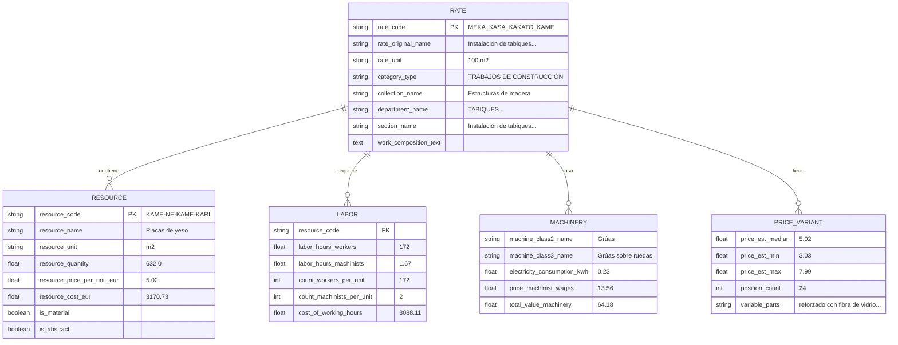
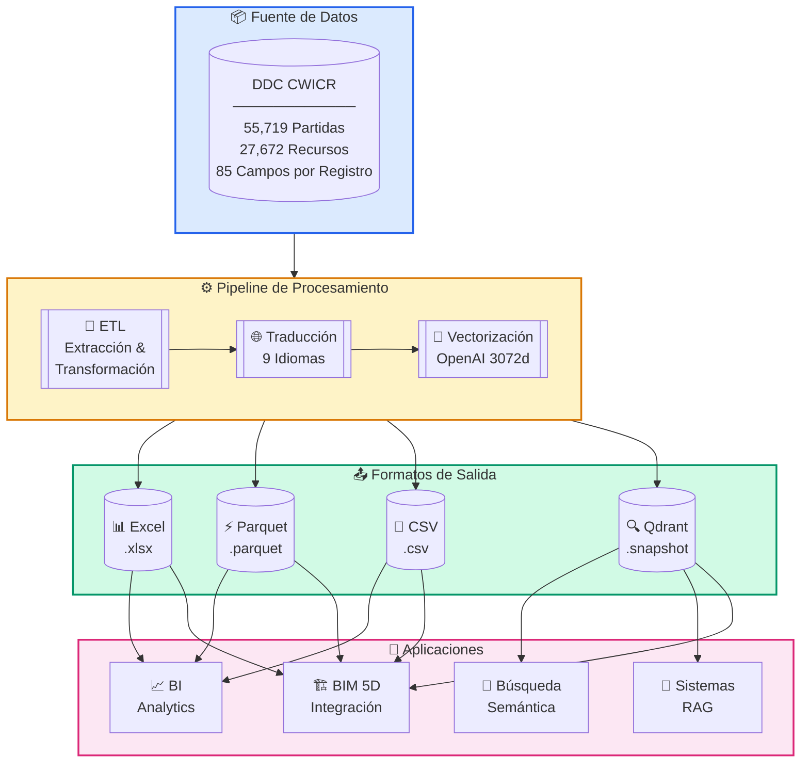
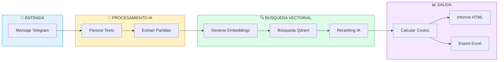
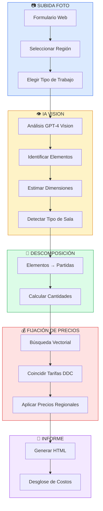
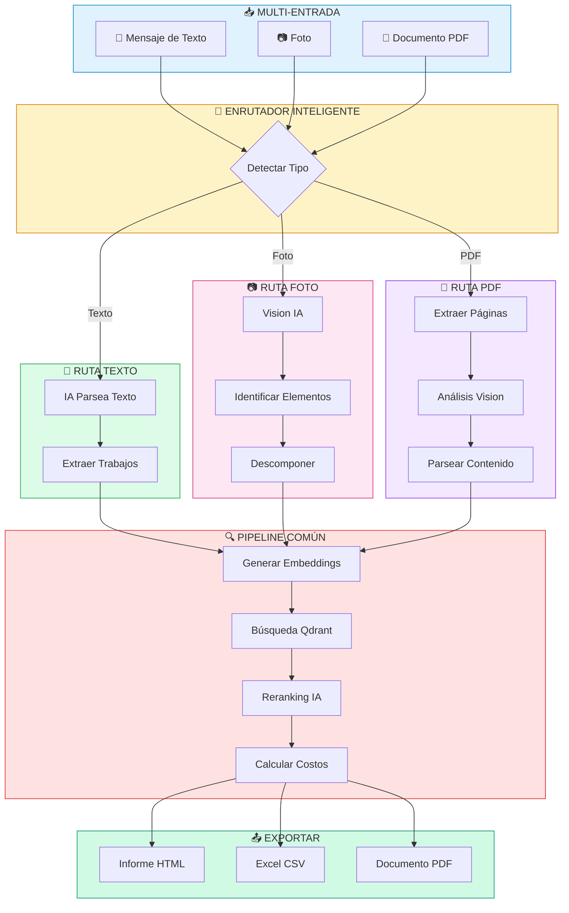
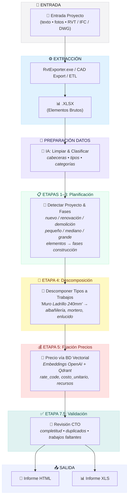

<h3 align="center">DDC CWICR - Construction Work Items, Components & Resources </br>
  + Pipelines n8n para calcular presupuestos basados en descripciones, fotos y CAD (BIM)</h3>

<p align="center">
  <a href="README.md">🇬🇧 English</a> •
  <a href="README.zh-CN.md">🇨🇳 中文</a> •
  <a href="README.es.md"><b>🇪🇸 Español</b></a> •
  <a href="README.pt-BR.md">🇧🇷 Português</a> •
  <a href="README.ru.md">🇷🇺 Русский</a> •
  <a href="README.ja.md">🇯🇵 日本語</a> •
  <a href="README.de.md">🇩🇪 Deutsch</a> •
  <a href="README.fr.md">🇫🇷 Français</a>
</p>

<p align="center">
  
</p>

<div align="center">
  
  
  
  
</div>

<div align="center">
  
  
  
  
  
</div>

<p align="center">
  
</p>

<h3 align="center">⚡ Flujos de Trabajo n8n</h3>
<p align="center"><code>Elige tu entrada → Obtén presupuesto</code></p>

<br>

<table width="100%">
<tr>

<td align="center" valign="top" width="33%">
<br>
<h3>📝 Texto</h3>
<p>Conversión rápida de alcance<br>desde una descripción breve</p>
<p><b>Entrada:</b> Telegram / mensaje de chat<br>
<b>Salida:</b> Partidas coincidentes + presupuesto</p>
<br>
<a href="#1️⃣-bot-estimador-de-texto">📖 Documentación</a>
<br><br>
<a href="./n8n_1_Telegram_Bot_Cost_Estimates_and_Rate_Finder_TEXT_DDC_CWICR.json">

</a>
<br><br>
</td>

<td align="center" valign="top" width="33%">
<br>
<h3>📷 Foto / PDF</h3>
<p>Fotos de obra, presupuestos escaneados,<br>PDFs de campo</p>
<p><b>Entrada:</b> Imagen o páginas PDF<br>
<b>Salida:</b> Alcance extraído → presupuesto</p>
<br>
<a href="#2️⃣-estimador-de-costos-por-foto">📖 Docs Foto</a> · <a href="#3️⃣-bot-universal-texto--foto--pdf">📖 Bot Universal</a>
<br><br>
<a href="./n8n_2_Photo_Cost_Estimate_DDC_CWICR.json">

</a>
&nbsp;
<a href="./n8n_3_Telegram_Bot_Cost_Estimates_and_Rate_Finder_TEXT_PHOTO_PDF_DDC_CWICR.json">

</a>
<br><br>
</td>

<td align="center" valign="top" width="33%">
<br>
<h3>🧊 CAD / BIM</h3>
<p>Medición y presupuesto basado<br>en Revit / IFC / DWG</p>
<p><b>Entrada:</b> Exportación de modelo <br>
<b>Salida:</b> Presupuesto 4D/5D + desglose</p>
<br>
<a href="#4️⃣-pipeline-cad-bim-de-estimación-de-costos">📖 Documentación</a>
<br><br>
<a href="./n8n_4_CAD_(BIM)_Cost_Estimation_Pipeline_4D_5D_with_DDC_CWICR.json">

</a>
<br><br>
</td>

</tr>
</table>

<br>
<p align="center">
  <a href="https://openconstructionestimate.com">
    
  </a>
</p>
<br>
<p align="center">
 Clientes y usuarios de DataDrivenConstruction
  <br>
  <a href="https://datadrivenconstruction.io/">
  
  </a>
  <br></br>
</p>


---

## 📑 Tabla de Contenidos

### 🤖 Integración IA
- [Combustible Perfecto para IA](#-combustible-perfecto-para-tus-productos-ia) — Por qué esta base de datos es ideal para IA
- [Claude Code & Google Antigravity](#-claude-code--google-antigravity--asistentes-de-programación-ia) — Asistentes de programación IA
- [n8n](#-n8n--automatización-visual-de-workflows) — Automatización de flujos de trabajo
- [Dify](#-dify--construir-aplicaciones-llm) — Desarrollo de apps LLM
- [Sim AI y Otros](#-sim-ai--plataformas-similares) — Plataformas compatibles
- [Casos de Uso Universales](#-casos-de-uso-universales) — Qué puedes construir

### 📊 Base de Datos y Datos
- [Descripción General](#descripción-general) — Qué es DDC CWICR
- [Formatos Disponibles](#formatos-disponibles) — Excel, Parquet, CSV, Qdrant
- [Esquema de Datos](#esquema-de-datos) — Estructura de 85 campos
- [Grupos de Campos](#grupos-de-campos) — Clasificación, Recursos, Mano de Obra, Maquinaria
- [Metodología](#metodología) — Principios de cálculo basado en recursos
- [Contexto Histórico](#contexto-histórico) — 100+ años de estándares

### ⚡ Flujos de Trabajo n8n
- [Resumen de Workflows n8n](#-flujos-de-trabajo-n8n) — Elige tu tipo de entrada
- [Pruébalo Ahora — Bots Demo en Vivo](#-pruébalo-ahora--bots-demo-en-vivo) — Prueba al instante en Telegram
- [Workflow 1: Bot Estimador de Texto](#1️⃣-bot-estimador-de-texto) — Bot Telegram para entrada de texto
- [Workflow 2: Estimador de Costos por Foto](#2️⃣-estimador-de-costos-por-foto) — Formulario web con IA Vision
- [Workflow 3: Bot Universal](#3️⃣-bot-universal-texto--foto--pdf) — Texto + Foto + PDF
- [Workflow 4: Pipeline CAD/BIM](#4️⃣-pipeline-cad-bim-de-estimación-de-costos) — Revit/IFC/DWG a presupuesto
- [Inicio Rápido de Workflows](#inicio-rápido-de-workflows) — Configuración en 4 pasos
- [Configuración n8n 2.0+](#️-configuración-n8n-20-requerida) — Habilitar nodo Execute Command

### 🏗️ Pipeline CAD/BIM
- [Prerrequisitos](#-prerrequisitos) — Componentes requeridos
- [Etapas del Pipeline](#-etapas-del-pipeline) — Procesamiento en 10 etapas
- [Selección de Modelo LLM](#️-selección-de-modelo-llm) — OpenAI, Claude, Gemini, Grok
- [Archivos de Salida](#-archivos-de-salida) — Informes HTML y Excel
- [Solución de Problemas](#️-solución-de-problemas) — Problemas comunes

### 🔍 Base de Datos Vectorial
- [Base de Datos Vectorial](#base-de-datos-vectorial) — Búsqueda semántica con Qdrant
- [Releases](#releases) — Descargar snapshots
- [Colecciones](#colecciones) — 9 colecciones por idioma
- [Despliegue Docker](#despliegue-docker) — Configuración auto-alojada

### 🚀 Primeros Pasos
- [Inicio Rápido - Python](#inicio-rápido) — Datos tabulares y búsqueda semántica
- [Casos de Uso de Integración](#integración) — Nivel básico a avanzado

### 👥 Comunidad
- [Recursos y Comunidad](#recursos--comunidad) — Enlaces y canales
- [Consultoría y Formación](#consultoría--formación) — Servicios profesionales
- [Contribuir](#contribuir) — Envía tus workflows
- [Licencia](#licencia) — CC BY 4.0 & MIT
- [Apoya el Proyecto](#apoya-el-proyecto) — Patrocinar y donar
- [🤖 AI Instructions](#ai-instructions) — Documentación para asistentes IA


---

## 🚀 Combustible Perfecto para tus Productos IA

<p align="center">
  <b>Solo clona el repositorio y describe lo que quieres — la IA hace el resto</b>
</p>

DDC CWICR no es solo una base de datos — es **combustible listo para usar en aplicaciones potenciadas por IA**. Ya sea que estés construyendo bots de estimación de costos, automatizando flujos de trabajo de construcción o creando asistentes inteligentes — estos datos funcionan de inmediato con herramientas modernas de IA.

### Por Qué Esta Base de Datos es Ideal para IA

| Característica | Beneficio |
|----------------|-----------|
| **Embeddings precalculados** | No necesitas generar vectores — la búsqueda semántica funciona al instante |
| **Esquema estructurado de 85 campos** | La IA puede razonar sobre relaciones de datos y dar respuestas precisas |
| **9 idiomas incluidos** | Construye aplicaciones multilingües sin esfuerzo de traducción |
| **55.000+ partidas de trabajo** | Cobertura completa para cualquier tarea de estimación de construcción |
| **Metodología basada en recursos** | Datos transparentes que la IA puede explicar y desglosar |

### 📋 Descripciones de Trabajo Listas para Cualquier Sistema

<p align="center">
  
</p>

DDC CWICR proporciona **descripciones de trabajo completas y estructuradas** que pueden mostrarse en cualquier sistema o formato. Cada partida contiene toda la información necesaria para diferentes participantes del proyecto:

| Participante | Lo que obtiene |
|--------------|----------------|
| 🏢 **Cliente / Inversor** | Transparencia total de costos, desglose de recursos, justificación de precios para decisiones de inversión |
| 📊 **Presupuestador** | Precios detallados, horas de trabajo, cantidades de materiales, costos de equipos — listo para generar presupuestos |
| 👷 **Jefe de Obra / Capataz** | Composición del trabajo, requisitos de recursos, normas laborales para planificación y ejecución diaria |
| 🔧 **Contratista / Ejecutor** | Especificaciones completas, precios unitarios, benchmarks de productividad para ofertas y programación precisas |

Exportación a **Excel, PDF, HTML, sistemas ERP, plataformas BIM** — el esquema estructurado de 85 campos garantiza la integridad de datos en todos los formatos de salida.

### 🛠️ Funciona Perfectamente Con

<table>
<tr>
<td align="center" width="20%">
<br/>
<b>Claude Code</b><br/>
<sub>CLI asistente de programación IA</sub>
</td>
<td align="center" width="20%">
<br/>
<b>Google Antigravity</b><br/>
<sub>Google Antigravity</sub>
</td>
<td align="center" width="20%">
<br/>
<b>n8n</b><br/>
<sub>Automatización de workflows</sub>
</td>
<td align="center" width="20%">
<br/>
<b>Dify</b><br/>
<sub>Desarrollo de apps LLM</sub>
</td>
<td align="center" width="20%">
<br/>
<b>Sim AI y Otros</b><br/>
<sub>Plataformas IA</sub>
</td>
</tr>
</table>

---

### 💻 Claude Code & Google Antigravity — Asistentes de Programación IA

La forma más rápida de trabajar con DDC CWICR. Solo abre el repositorio en Claude Code o Google Antigravity y haz preguntas en lenguaje natural.

**Primeros Pasos:**
```bash
# Clonar el repositorio
git clone https://github.com/datadrivenconstruction/OpenConstructionEstimate-DDC-CWICR.git

# Abrir con Claude Code
cd OpenConstructionEstimate-DDC-CWICR
claude
```

**Prompts de Ejemplo:**

| Tarea | Prompt |
|-------|--------|
| **Explorar datos** | "Muéstrame la estructura de esta base de datos de construcción y explica qué datos están disponibles" |
| **Encontrar partidas** | "Encuentra todas las partidas relacionadas con cimentaciones de hormigón y muestra sus costos" |
| **Crear consultas** | "Escribe un script Python para buscar trabajos de fontanería con horas de trabajo > 100" |
| **Crear informes** | "Genera un informe de desglose de costos para trabajos de renovación residencial" |
| **Analizar costos** | "Compara costos de materiales entre diferentes métodos de construcción de muros" |
| **Crear integraciones** | "Crea un script que conecte con la base de datos Qdrant y realice búsqueda semántica" |

**Consejos Pro:**
- Apunta a Claude a archivos específicos: *"Analiza el archivo Parquet y resume la distribución de costos"*
- Pide explicaciones: *"Explica cómo funciona la metodología de cálculo basada en recursos en esta base de datos"*
- Solicita modificaciones: *"Modifica el workflow de n8n para añadir notificaciones por email"*

---

### ⚡ n8n — Automatización Visual de Workflows

Construye pipelines de automatización potentes sin programar. Conecta DDC CWICR con más de 400 apps y servicios.

**Casos de Uso:**

| Workflow | Descripción |
|----------|-------------|
| **Bot Telegram** | Usuarios envían texto/foto → IA extrae partidas → Devuelve presupuesto |
| **Automatización Email** | Recibe presupuesto por email → Procesa con IA → Envía estimación formateada |
| **Integración CRM** | Nuevo proyecto en CRM → Auto-genera presupuesto preliminar → Actualiza valor del trato |
| **Pipeline BIM** | Exportar de Revit → Extraer cantidades → Coincidir con tarifas DDC → Generar informe 5D |
| **Bot Slack** | Equipo hace preguntas → IA busca en base de datos → Devuelve partidas relevantes |

**Inicio Rápido:**
1. Descarga el JSON del workflow de este repositorio
2. Importa en n8n: `Workflows → Import → From File`
3. Configura credenciales (OpenAI, Qdrant, Telegram)
4. Activa y prueba

Ver sección [Workflows n8n](#workflows-n8n--descripción-detallada) para configuración detallada.

---

### 🤖 Dify — Construir Aplicaciones LLM

Crea aplicaciones IA personalizadas con DDC CWICR como base de conocimiento.

**Configuración:**
1. Crear nueva aplicación Dify
2. Añadir Base de Conocimiento → Subir archivos Parquet/CSV o conectar con Qdrant
3. Configurar pipeline RAG con embeddings
4. Construir interfaz de chat o API

**Ideas de Aplicaciones:**

| Tipo de App | Descripción |
|-------------|-------------|
| **Chatbot Estimador de Construcción** | Interfaz conversacional para consultas de costos |
| **Búsqueda de Partidas** | Búsqueda en lenguaje natural sobre 55.000+ partidas |
| **Asesor de Costos** | IA que explica desgloses de costos y sugiere optimizaciones |
| **Asistente Multilingüe** | Auto-detecta idioma y responde en el idioma del usuario |
| **Endpoint API** | API REST para integración con otros sistemas |

**Plantilla de Prompt Dify de Ejemplo:**
```
Eres un asistente de estimación de costos de construcción con acceso a la base de datos DDC CWICR.

Contexto: {{context}}

Pregunta del usuario: {{query}}

Proporciona información precisa de costos basada en la base de datos. Incluye:
- Partidas relevantes con códigos
- Costos unitarios y cantidades
- Desglose de recursos (mano de obra, materiales, equipo)
- Cálculo de costo total
```

---

### 🔮 Sim AI & Plataformas Similares

DDC CWICR se integra con cualquier plataforma IA que soporte:
- **Bases de datos vectoriales** (Qdrant, Pinecone, Weaviate, Milvus)
- **Datos estructurados** (CSV, Parquet, Excel)
- **Embeddings OpenAI** (text-embedding-3-large, 3072 dimensiones)

**Plataformas Compatibles:**
- **Sim AI** — Simulación y modelado IA
- **LangChain / LlamaIndex** — Frameworks de aplicaciones LLM
- **Flowise** — Constructor de apps LLM low-code
- **Botpress** — Plataforma de IA conversacional
- **Voiceflow** — Diseño de voz y chat
- **Stack AI** — Workflows IA no-code
- **Relevance AI** — Plataforma de fuerza laboral IA

**Patrón de Integración Universal:**

```python
# Funciona con cualquier plataforma que soporte Qdrant
from qdrant_client import QdrantClient

# Conectar con DDC CWICR
client = QdrantClient("tu-instancia-qdrant", port=6333)

# Búsqueda semántica
results = client.search(
    collection_name="ddc_cwicr_es",  # o en, de, ru, zh, etc.
    query_vector=tu_embedding,
    limit=10
)

# Usar resultados en tu aplicación IA
for item in results:
    print(f"{item.payload['rate_code']}: {item.payload['rate_original_name']}")
```

---

### 📋 Casos de Uso Universales

Sin importar qué herramienta IA elijas, DDC CWICR permite:

| Caso de Uso | Descripción |
|-------------|-------------|
| **Estimación Instantánea de Costos** | Obtener costos de construcción desde descripciones de texto o fotos |
| **Generación de Presupuestos** | Auto-generar presupuestos desde descripciones de proyectos |
| **Benchmarking de Precios** | Comparar costos entre regiones e idiomas |
| **Planificación de Recursos** | Calcular horas de trabajo, materiales y necesidades de equipo |
| **Análisis de Inversión** | Auditorías profundas de costos con transparencia total de recursos |
| **Soporte Multilingüe** | Servir usuarios en 9 idiomas con precios localizados |
| **Integración BIM** | Conectar con Revit/IFC para estimación 4D/5D automatizada |
| **Entrenar Modelos IA** | Usar datos estructurados para fine-tuning de IA de construcción |

---

## Descripción General

**DDC CWICR** (Construction Work Items, Components & Resources) es una base de datos abierta para estimación de costos de construcción, cubriendo el espectro completo de actividades de construcción - desde movimiento de tierras y colocación de hormigón hasta trabajos de instalación especializados.

La base de datos se basa en fuentes que describen prácticas modernas de construcción en Eurasia y la región Asia-Pacífico, donde un ecosistema unificado de estandarización técnica sirve como lenguaje común de ingeniería para más de diez economías en desarrollo dinámico. DDC CWICR representa un esfuerzo por armonizar estándares abiertos estableciendo un marco regulatorio único para gestión de proyectos de capital en múltiples idiomas.

<p align="center">
  <br>
  
  <br></br>
</p>

Los datos estructurados pueden accederse a través de formatos tabulares (XLSX, CSV, Parquet) o consultarse conversacionalmente vía LLM, permitiendo a los especialistas integrar descripciones de trabajos de construcción (base de datos vectorial QDRANT) en pipelines y workflows automatizados usando lenguaje natural o consultas concisas.

### Formatos Disponibles

| Formato     | Extensión   | Tamaño       | Ideal Para                            | Características                      |
|-------------|-------------|--------------|---------------------------------------|--------------------------------------|
| **Excel**   | `.xlsx`     | ~150–400 MB  | Análisis manual, filtros, pivotes     | Legible por humanos, formato completo|
| **Parquet** | `.parquet`  | ~55 MB       | Pipelines ETL, entrenamiento ML, Big Data | Columnar, excelente compresión    |
| **CSV**     | `.csv`      | ~1.3 GB      | Importación a bases de datos, sistemas legacy | Compatibilidad universal        |
| **Qdrant**  | `.snapshot` | ~1 GB        | Búsqueda semántica, RAG, asistentes IA | Embeddings OpenAI precalculados     |


Una demo en vivo está disponible en [openconstructionestimate.com](https://openconstructionestimate.com/), donde puedes explorar los datos y ver la base de datos vectorial en acción para búsqueda semántica.

<p align="center">
  
</p>

---

## Esquema de Datos

La base de datos contiene **85 campos** organizados en grupos lógicos. Cada registro representa una partida de trabajo (tarifa) o un recurso con desglose completo de costos.



### Grupos de Campos
Los 85 campos de la base de datos están organizados en grupos lógicos que reflejan la metodología de estimación de costos basada en recursos. Cada grupo cumple una función específica en la estructura de desglose de costos: desde clasificación jerárquica e identificación de partidas hasta consumo detallado de recursos, requisitos de mano de obra, costos de maquinaria y totales agregados. Esta estructura modular permite a los usuarios consultar solo los campos relevantes para su tarea - ya sea generando una lista de materiales, analizando productividad laboral o construyendo un presupuesto completo.

<p align="center">
  <br>
  
  <br></br>
</p>

**Clasificación** - `category_type`, `collection_code`, `collection_name`, `department_code`, `department_name`, `department_type`, `section_name`, `section_type`, `subsection_code`, `subsection_name`

**Partida de Trabajo (Tarifa)** - `rate_code`, `rate_original_name`, `rate_final_name`, `rate_unit`, `row_type`, `is_scope`, `is_abstract`, `is_machine`, `is_labor`, `is_material`, `work_composition_text`

**Recursos** - `resource_code`, `resource_name`, `resource_unit`, `resource_quantity`, `parameter_resource_quantity`, `resource_price_per_unit_eur_current`, `resource_cost_eur`

**Mano de Obra** - `count_workers_per_unit`, `count_engineers_per_unit`, `count_machinists_per_unit`, `count_total_people_per_unit`, `labor_hours_construction_workers`, `labor_hours_machinists`, `labor_hours_engineers`, `total_labor_hours_workers_machinists`, `total_labor_hours_all_personnel`, `cost_of_working_hours`, `count_people_per_day`

**Maquinaria** - `machine_class2_name`, `machine_class3_name`, `personnel_machinist_code`, `personnel_machinist_grade`, `price_machinist_wages`, `price_relocation_included`, `price_cost_without_wages`, `electricity_consumption_kwh_per_machine_hour`, `electricity_cost_per_unit`, `electricity_cost_total_sum`, `cost_machinist_sum`, `total_value_machinery_equipment`

**Variantes de Precio** - `price_code_prefix`, `price_abstract_resource_common_start`, `price_abstract_resource_variable_parts`, `price_abstract_resource_position_count`, `price_abstract_resource_est_price_min`, `price_abstract_resource_est_price_max`, `price_abstract_resource_est_price_mean`, `price_abstract_resource_est_price_median`, `price_abstract_resource_unit`, `abstract_resource_tech_group`

**Agregados** - `total_cost_per_position`, `total_material_cost_per_position`, `total_resource_cost_per_position`, `total_value_abstract_resources`, `materials_resource_cost_eur`

**Masa y Servicios** - `mass_name`, `mass_value`, `mass_unit`, `service_category`, `service_type`, `parameter_service_code`, `parameter_service_unit`, `parameter_service_name`, `parameter_service_quantity`, `service_cost_sum`

### Fórmula de Cálculo de Costos

| Componente        | Norma Tecnológica | ×   | Precio Regional  | =   | Costo                    |
|-------------------|-------------------|-----|------------------|-----|--------------------------|
| 👷 **Mano de Obra**| 172 hrs/100m²    | ×   | €17.95/hr        | =   | €3,088.11                |
| 🧱 **Materiales** | 632 m²/100m²     | ×   | €5.02/m²         | =   | €3,170.73                |
| 🚜 **Equipo**     | 1.67 hrs/100m²   | ×   | €38.42/hr        | =   | €64.18                   |
|                   |                  |     | **Total**        | =   | **€7,725.91 por 100m²**  |

---

## Metodología

El valor clave del **Cálculo Basado en Recursos** es la separación de la tecnología de producción inmutable del componente financiero volátil. Se basa en los "primeros principios" físicos de la construcción:
- Horas de trabajo requeridas para trabajos específicos
- Cantidades de materiales por unidad de trabajo
- Tiempo de equipo necesario

**Por qué importa:**

- **Transparencia** - Precios sin márgenes ocultos, desglose completo de recursos
- **Auditabilidad** - Capacidad de análisis profundo para verificación e inversión
- **Portabilidad** - Normas independientes de región aplicables en diferentes mercados
- **Probado** - Metodología estándar de la industria establecida durante 100+ años




### Contexto Histórico

Las descripciones de trabajos de construcción en esta base de datos están fundamentadas en una metodología de estandarización basada en recursos con raíces que se extienden desde las normas de producción de principios del siglo XX hasta los sistemas de referencia digitales actuales. Desarrollado y refinado continuamente desde la década de 1920, este enfoque ha experimentado una evolución especialmente robusta en la región euroasiática.

A lo largo de cien años de desarrollo, el sistema ha pasado de cálculos manuales a formatos legibles por máquina - pero su principio fundamental permanece intacto: la medición precisa de los recursos físicos requeridos por unidad de producción de construcción. Las implementaciones modernas conectan datos normativos históricos con precios de mercado en tiempo real.

Las adaptaciones regionales de esta metodología operan bajo varias denominaciones nacionales: ENIR, GESN, FER, NRR, ESN, AzDTN, ShNQK, MKS ChT, SNT, BNbD, Dinh Muc, Ding'e.

<p align="center">
  
</p>

⭐ <b>Si quieres ver nuevas actualizaciones y versiones de la base de datos y encuentras nuestras herramientas útiles, por favor dale una estrella a nuestros repositorios para ver más aplicaciones similares para la industria de la construcción.</b>
Dale estrella al workflow DDC en GitHub y recibe notificaciones instantáneas de nuevos releases.
<p align="center">
  <br>
  
  <br></br>
</p>


---


## Integración

### Casos de Uso

- **Nivel Básico** - Benchmarking de costos, indexación de precios, estimación para licitaciones

- **Intermedio** - Localización, pipelines ETL/BI, cálculo de CO₂

- **Avanzado** - Entrenamiento IA/ML, CAD (BIM) 5D, auditoría profunda de inversiones

---

## Workflows n8n — Descripción Detallada

Cuatro workflows listos para producción para estimación automatizada de costos de construcción. Cada workflow se conecta a la base de datos vectorial DDC CWICR vía Qdrant y usa modelos IA para parsing y coincidencia inteligente.

| #   | Workflow                                                         | Entrada      | Ideal Para                        | Descargar                                                                                           |
|-----|------------------------------------------------------------------|--------------|-----------------------------------|-----------------------------------------------------------------------------------------------------|
| 1   | [Bot Estimador de Texto](#1️⃣-bot-estimador-de-texto)            | 💬 Texto     | Estimaciones rápidas desde texto  | [JSON](./n8n_1_Telegram_Bot_Cost_Estimates_and_Rate_Finder_TEXT_DDC_CWICR.json)                      |
| 2   | [Estimador por Foto](#2️⃣-estimador-de-costos-por-foto)          | 📷 Foto      | Visitas a obra, inspecciones      | [JSON](./n8n_2_Photo_Cost_Estimate_DDC_CWICR.json)                                                  |
| 3   | [Bot Universal](#3️⃣-bot-universal-texto--foto--pdf)             | 💬📷📄 Todo  | Uso completo en producción        | [JSON](./n8n_3_Telegram_Bot_Cost_Estimates_and_Rate_Finder_TEXT_PHOTO_PDF_DDC_CWICR.json)            |
| 4   | [Pipeline CAD/BIM](#4️⃣-pipeline-cad-bim-de-estimación-de-costos)| 🏗️ Revit    | Estimación 4D/5D basada en BIM    | [JSON](./n8n_4_CAD_(BIM)_Cost_Estimation_Pipeline_4D_5D_with_DDC_CWICR.json)                         |

---

### 1️⃣ Bot Estimador de Texto

**Archivo:** `n8n_1_Telegram_Bot_Cost_Estimates_and_Rate_Finder_TEXT_DDC_CWICR.json`

Bot de Telegram para estimación de costos basada en texto. Describe trabajos de construcción en lenguaje natural — el bot parsea la entrada, busca en la base de datos vectorial y devuelve desgloses de costos detallados.

<p align="center">
  <br>
  
  <br></br>
</p>

<h3 align="left">🤖 Pruébalo Ahora — Bots Demo en Vivo</h3>
<p align="left"><i>Prueba los workflows de estimación al instante en Telegram</i></p>
<p><b>@TextOpenConstructionEstimate_bot</b></p>
<p>Crea presupuestos completos<br>desde descripciones de texto</p>
<a href="https://t.me/TextOpenConstructionEstimate_bot">

</a>




**Cómo funciona:**

| Paso  | Acción                                  | Tecnología                             |
|-------|----------------------------------------|----------------------------------------|
| 1     | Usuario envía descripción de texto     | Telegram Bot API                       |
| 2     | IA parsea y extrae partidas de trabajo | OpenAI / Claude / Gemini               |
| 3     | Genera embeddings para cada partida    | OpenAI `text-embedding-3-large`        |
| 4     | Busca tarifas coincidentes en base de datos | Búsqueda vectorial Qdrant         |
| 5     | IA reordena resultados para precisión  | Puntuación LLM                         |
| 6     | Calcula costos y genera informe        | HTML / Excel / PDF                     |

**Características:**

| Característica           | Descripción                                                          |
|--------------------------|----------------------------------------------------------------------|
| 💬 Entrada lenguaje natural | Acepta cualquier formato de texto — listas, oraciones, descripciones estructuradas |
| 🤖 Soporte multi-LLM     | Funciona con OpenAI, Claude o Gemini (intercambiable)                |
| 🔍 Búsqueda semántica    | Encuentra mejores coincidencias incluso con diferente redacción      |
| 🌍 9 idiomas             | DE, EN, RU, ES, FR, PT, ZH, AR, HI                                   |
| 📊 Múltiples exportaciones | Informe HTML, hoja Excel, documento PDF                             |
| ✏️ Edición interactiva   | Modifica cantidades antes del cálculo final                          |

**Credenciales requeridas:**
- Token Bot Telegram (de @BotFather)
- API Key OpenAI (para embeddings + LLM opcional)
- URL Qdrant + API Key

---

### 2️⃣ Estimador de Costos por Foto

**Archivo:** `n8n_2_Photo_Cost_Estimate_DDC_CWICR.json`

Interfaz de formulario web para estimación basada en fotos. Sube una foto de construcción — IA Vision identifica elementos, estima dimensiones y calcula costos automáticamente.

<p align="center">
  <br>
  
  <br></br>
</p>




**Cómo funciona:**

| Paso  | Acción                                        | Tecnología                           |
|-------|-----------------------------------------------|--------------------------------------|
| 1     | Usuario sube foto vía formulario web          | n8n Form Trigger                     |
| 2     | IA Vision analiza la imagen                   | GPT-4 Vision                         |
| 3     | Identifica tipo de sala, elementos, materiales| Extracción JSON estructurada         |
| 4     | Estima dimensiones desde objetos de referencia| Razonamiento IA (puertas, azulejos)  |
| 5     | Descompone elementos en partidas de trabajo   | Procesamiento LLM                    |
| 6     | Precios de cada trabajo vía búsqueda vectorial| Qdrant + Embeddings OpenAI           |
| 7     | Genera informe HTML profesional               | Salida estilizada                    |

**Características:**

| Característica         | Descripción                                             |
|------------------------|---------------------------------------------------------|
| 📷 Análisis de fotos   | GPT-4 Vision identifica elementos de construcción       |
| 📐 Auto-dimensionamiento| Estima tamaños usando objetos de referencia (puertas, azulejos) |
| 🏠 Detección de sala   | Baño, cocina, dormitorio, exterior, etc.                |
| 🔨 Soporte tipo trabajo| Construcción nueva / Renovación / Reparación            |
| 🌍 9 bases de datos regionales| Precios localizados para Berlín, Toronto, París, etc.|
| 📄 Informes profesionales| Salida HTML limpia lista para clientes                |

**Credenciales requeridas:**
- API Key OpenAI (GPT-4 Vision + Embeddings)
- URL Qdrant + API Key

---

### 3️⃣ Bot Universal (Texto + Foto + PDF)

**Archivo:** `n8n_3_Telegram_Bot_Cost_Estimates_and_Rate_Finder_TEXT_PHOTO_PDF_DDC_CWICR.json`

Bot de Telegram completo que soporta todos los tipos de entrada: descripciones de texto, fotos de construcción y planos PDF. El workflow más completo para uso en producción.


<p align="center">
  <br>
  
  <br></br>
</p>

<h3 align="left">🤖 Pruébalo Ahora — Bots Demo en Vivo</h3>
<p align="left"><i>Prueba los workflows de estimación al instante en Telegram</i></p>
<h3>📷 Bot Universal</h3>
<p><b>@OpenConstructionEstimate_bot</b></p>
<p>Bot completo para texto, fotos y PDF</p>
<a href="https://t.me/OpenConstructionEstimate_bot">

</a>
<br><br>





**Cómo funciona:**

| Paso  | Acción                                    | Tecnología                     |
|-------|-------------------------------------------|--------------------------------|
| 1     | Usuario envía texto, foto o PDF           | Telegram Bot API               |
| 2     | Enrutador detecta tipo de entrada         | Análisis content-type          |
| 3a    | **Texto:** IA parsea partidas de trabajo  | OpenAI / Gemini                |
| 3b    | **Foto:** Vision IA extrae elementos      | GPT-4 Vision / Gemini 2.0      |
| 3c    | **PDF:** Extraer y analizar páginas       | Procesamiento PDF + Vision     |
| 4     | Búsqueda semántica en DDC CWICR           | Base de datos vectorial Qdrant |
| 5     | Reranking IA para mejores coincidencias   | Puntuación LLM                 |
| 6     | Edición interactiva vía menú del bot      | Teclados inline Telegram       |
| 7     | Exportar resultados                       | HTML / Excel / PDF             |

**17 Acciones del Bot:**

| Acción           | Descripción                         |
|------------------|-------------------------------------|
| `/start`         | Menú selección de idioma            |
| Subir foto       | Iniciar análisis IA vision          |
| Mensaje texto    | Parsear y extraer partidas          |
| Subir PDF        | Procesar planos                     |
| Editar cantidades| Modificar antes de calcular         |
| Añadir trabajo   | Entrada manual de partidas          |
| Calcular         | Ejecutar estimación completa        |
| Ver detalles     | Mostrar recursos de cada partida    |
| Exportar Excel   | Descargar hoja CSV                  |
| Exportar PDF     | Generar informe PDF                 |
| Ayuda            | Mostrar instrucciones de uso        |
| Refinar          | Re-analizar con correcciones        |

**Características:**

| Característica        | Descripción                                        |
|-----------------------|----------------------------------------------------|
| 📷 Dual Vision IA     | Gemini 2.0 Flash o GPT-4 Vision (configurable)     |
| 📄 Procesamiento PDF  | Planos, presupuestos escaneados, documentos        |
| 💬 Parseo inteligente | Maneja listas, tablas, texto libre                 |
| 🔍 Reranking IA       | Mejora precisión de coincidencias                  |
| ✏️ Edición completa   | Añadir, eliminar, modificar partidas               |
| 📊 Export multi-formato| HTML, Excel, PDF                                  |
| 🌍 9 idiomas          | Localización completa                              |

**Credenciales requeridas:**
- Token Bot Telegram
- API Key OpenAI (Embeddings)
- API Key Gemini (Vision) o OpenAI GPT-4 Vision
- URL Qdrant + API Key

---

### 4️⃣ Pipeline CAD (BIM) de Estimación de Costos

**Archivo:** `n8n_4_CAD_(BIM)_Cost_Estimation_Pipeline_4D_5D_with_DDC_CWICR.json`

Estimación de costos automatizada desde modelos Revit/IFC/DWG. Extrae datos BIM, clasifica elementos, descompone en partidas de trabajo y genera estimaciones 4D/5D con desglose completo de recursos.

<p align="left">
  <a href="https://datadrivenconstruction.io">
    
  </a>
</p>




**n8n proporciona más de 400 integraciones nativas** con plataformas como Google Sheets, Notion, Slack, Airtable, bases de datos (PostgreSQL, MongoDB), almacenamiento en la nube y más. Cada nodo en este workflow es modular — puedes:

- 🔄 **Intercambiar proveedores LLM** (OpenAI ↔ Claude ↔ Gemini ↔ Grok)
- 📊 **Conectar con tu ERP o sistema de gestión de proyectos**
- 📁 **Exportar resultados a cualquier destino** (almacenamiento nube, email, dashboards)
- 🔧 **Modificar cualquier etapa** para adaptarla a tu metodología de estimación

El workflow es tuyo para adaptar. Sin restricciones. Sin tarifas de licencia. Control total.

---

## 📋 Prerrequisitos

| Componente                                         | Requisito                              | Descripción                                                           |
|----------------------------------------------------|----------------------------------------|-----------------------------------------------------------------------|
| **[n8n](https://n8n.io/)**                         | v1.0+ (v2.0+ requiere [configuración](#️-configuración-n8n-20-requerida)) | Plataforma de automatización de workflows para orquestar el pipeline de estimación|
| **[Qdrant](https://qdrant.tech/)**                 | Instancia cloud o auto-alojada         | Base de datos vectorial para búsqueda semántica en partidas de construcción|
| **[OpenAI API](https://platform.openai.com/)**     | Para embeddings (`text-embedding-3-large`)| Genera embeddings vectoriales para elementos BIM y coincidencia con base de datos de costos|
| **API LLM**                                        | OpenAI / Claude / Gemini / xAI Grok    | Modelos IA para clasificación de partidas y generación de estimaciones|
| **[DDC Converter](https://github.com/datadrivenconstruction/cad2data-Revit-IFC-DWG-DGN-pipeline-with-conversion-validation-qto)** | `RvtExporter.exe` | Extrae datos BIM de modelos Revit a Excel/JSON para procesamiento |

---

## Inicio Rápido de Workflows

### Paso 1: Importar Workflow

```
n8n → Nuevo workflow → Import from File → Seleccionar JSON
```

### Paso 2: Configurar Credenciales

En el nodo **🔑 TOKEN**, establece tus API keys:

```json
{
  "bot_token": "TU_TOKEN_BOT_TELEGRAM",
  "OPENAI_API_KEY": "TU_KEY_OPENAI",
  "GEMINI_API_KEY": "TU_KEY_GEMINI",
  "QDRANT_URL": "http://localhost:6333",
  "QDRANT_API_KEY": ""
}
```

### Paso 3: Cargar DDC CWICR en Qdrant

Descarga snapshot de [Releases](#releases) e importa:

```bash
curl -X POST "http://localhost:6333/collections/ddc_cwicr_es/snapshots/upload" \
  -H "Content-Type: multipart/form-data" \
  -F "snapshot=@ES_BARCELONA_workitems_EMBEDDINGS_3072_DDC.snapshot"
```

### Paso 4: Activar y Probar

- Habilitar el workflow en n8n
- Para bots Telegram: envía `/start` a tu bot
- Para formularios web: abre la URL del formulario proporcionada por n8n

---

## ⚠️ Configuración n8n 2.0+ Requerida

> **A partir de n8n versión 2.0, el nodo Execute Command está deshabilitado por defecto por razones de seguridad.**
>
> Sin la configuración de abajo, los workflows que usan Execute Command (especialmente Pipeline CAD/BIM) **no funcionarán** — los nodos mostrarán con signo de interrogación o no serán reconocidos.

### Solución Rápida

**Windows (CMD) — ejecutar cada vez:**
```cmd
set NODES_EXCLUDE=[] && npx n8n
```

**Solución permanente — crear una vez:**

Crear archivo `C:\Users\TU_USUARIO\.n8n\.env` con:
```
NODES_EXCLUDE=[]
```
Luego simplemente ejecuta `npx n8n` como siempre.

**Docker:**
```yaml
environment:
  - NODES_EXCLUDE=[]
```

### Verificar Configuración

1. Iniciar n8n
2. Click **+** → buscar **"Execute Command"**
3. Si el nodo aparece → ✅ ¡listo!

> 📚 Más detalles: [n8n 2.0 Breaking Changes](https://docs.n8n.io/2-0-breaking-changes/)

---

## 🌍 Idiomas y Niveles de Precios Soportados

| Código | Idioma      | Nivel Precios   | Moneda  | Colección Qdrant    |
|--------|-------------|-----------------|---------|---------------------|
| `AR`   | Árabe       | Dubai           | AED     | `ddc_cwicr_ar`      |
| `DE`   | Alemán      | Berlín          | EUR     | `ddc_cwicr_de`      |
| `EN`   | Inglés      | Toronto         | CAD     | `ddc_cwicr_en`      |
| `ES`   | Español     | Barcelona       | EUR     | `ddc_cwicr_es`      |
| `FR`   | Francés     | París           | EUR     | `ddc_cwicr_fr`      |
| `HI`   | Hindi       | Mumbai          | INR     | `ddc_cwicr_hi`      |
| `PT`   | Portugués   | São Paulo       | BRL     | `ddc_cwicr_pt`      |
| `RU`   | Ruso        | San Petersburgo | RUB     | `ddc_cwicr_ru`      |
| `ZH`   | Chino       | Shanghai        | CNY     | `ddc_cwicr_zh`      |

---

## 📊 Etapas del Pipeline

El workflow CAD/BIM procesa datos a través de 10 etapas:

| Etapa   | Nombre                 | Descripción                                                       |
|---------|------------------------|-------------------------------------------------------------------|
| **0**   | Recopilar Datos BIM    | Extraer elementos de Revit vía DDC Converter                      |
| **1**   | Detección Proyecto     | IA identifica tipo de proyecto (Residencial, Comercial, etc.)     |
| **2**   | Generación Fases       | IA crea fases de construcción                                     |
| **3**   | Asignación Elementos   | IA mapea tipos BIM a fases                                        |
| **4**   | Descomposición Trabajo | IA descompone tipos en partidas ("Muro Ladrillo" → albañilería, mortero)|
| **5**   | Búsqueda Vectorial     | Encontrar tarifas coincidentes en DDC CWICR vía Qdrant            |
| **6**   | Mapeo Unidades         | Convertir unidades BIM a unidades de tarifa                       |
| **7**   | Cálculo Costos         | Cantidad × Precio Unitario para cada partida                      |
| **7.5** | Validación             | Revisión CTO para completitud y duplicados                        |
| **8**   | Agregación             | Suma por fases y categorías                                       |
| **9**   | Generación Informe     | Crear salidas HTML y Excel                                        |

---

## ⚙️ Selección de Modelo LLM

El workflow soporta múltiples proveedores IA. Habilita tu modelo preferido en la sección **LLM Models**:

| Modelo           | Nombre Nodo                  | Estado       |
|------------------|------------------------------|--------------|
| OpenAI GPT-4o    | `OpenAI LLM`                 | ✅ Por defecto|
| Claude Opus 4    | `Anthropic Chat Model2`      | Deshabilitado|
| Gemini 2.5 Pro   | `Google Gemini Chat Model`   | Deshabilitado|
| xAI Grok         | `xAI Grok Chat Model1`       | Deshabilitado|
| DeepSeek         | `DeepSeek Chat Model`        | Deshabilitado|

Para cambiar modelos: **Habilita** el nodo del modelo deseado y **Deshabilita** los otros.

---

## 📁 Archivos de Salida

Los informes se guardan en la carpeta del proyecto:
```
proyecto_AAAA-MM-DD.html   ← Informe interactivo (abre en navegador)
proyecto_AAAA-MM-DD.xls    ← Hoja compatible con Excel
```
<p align="center">
  <br>
  
  <br></br>
</p>

---

## 🔗 Colecciones Qdrant

El workflow selecciona automáticamente la colección correcta basada en `language_code`:

```
{LANG}_{CIUDAD}_workitems_costs_resources_EMBEDDINGS_3072_DDC_CWICR
```

Ejemplo: `ES_BARCELONA_workitems_costs_resources_EMBEDDINGS_3072_DDC_CWICR`

---

## ⚠️ Solución de Problemas

| Problema                       | Solución                                                            |
|--------------------------------|---------------------------------------------------------------------|
| "Execute Command falta" (n8n 2.0+) | Establecer variable de entorno `NODES_EXCLUDE=[]`. Ver [Configuración n8n 2.0+](#️-configuración-n8n-20-requerida) |
| "No se encontró archivo Excel" | Verificar rutas `path_to_converter` y `project_file`                |
| "Conexión Qdrant fallida"      | Verificar URL Qdrant y API key en credenciales                      |
| "Límite de rate excedido"      | Reducir tamaño de lote o añadir delays entre llamadas API           |
| "No se encontraron precios"    | Verificar si existe la colección correcta de idioma en Qdrant       |
| "Error webhook Telegram"       | Asegurar que workflow está activo y URL webhook es accesible        |
| "API Vision falló"             | Verificar que API key Gemini u OpenAI Vision es válida              |

---

## Base de Datos Vectorial

Colecciones Qdrant listas para usar con embeddings OpenAI `text-embedding-3-large` para búsqueda semántica en partidas de trabajo de construcción.

Las bases de datos vectoriales te permiten "hablar" con tus datos en lenguaje natural – usando oraciones simples o frases cortas en lugar de código o filtros complejos. Esto acelera dramáticamente encontrar la partida de trabajo o línea de costo correcta, incluso en conjuntos de datos muy grandes.

Estas colecciones Qdrant pueden conectarse a aplicaciones a través de workflows modernos de automatización e integración (por ejemplo, herramientas low-code/no-code de Workflow y Pipeline). Puedes construir asistentes que busquen, filtren y expliquen partidas de trabajo de construcción, o integrar búsqueda semántica directamente en tus herramientas de estimación existentes.

---

### Releases

Descarga conjuntos de datos QDRANT y CSV (archivos mayores de 1 gigabyte) de [GitHub Releases](https://github.com/datadrivenconstruction/OpenConstructionEstimate-DDC-CWICR/releases).

| Idioma          | Región         | Archivos CSV          | Snapshot Qdrant                            |
|-----------------|----------------|-----------------------|--------------------------------------------|
| 🇸🇦 Árabe       | Dubai          | `AR_DUBAI_*.csv`      | `AR_DUBAI_*_EMBEDDINGS_3072_DDC.snapshot`   |
| 🇨🇳 Chino       | Shanghai       | `ZH_SHANGHAI_*.csv`   | `ZH_SHANGHAI_*_EMBEDDINGS_3072_DDC.snapshot`|
| 🇩🇪 Alemán      | Berlín         | `DE_BERLIN_*.csv`     | `DE_BERLIN_*_EMBEDDINGS_3072_DDC.snapshot`  |
| 🇬🇧 Inglés      | Toronto        | `EN_TORONTO_*.csv`    | `EN_TORONTO_*_EMBEDDINGS_3072_DDC.snapshot` |
| 🇪🇸 Español     | Barcelona      | `ES_BARCELONA_*.csv`  | `ES_BARCELONA_*_EMBEDDINGS_3072_DDC.snapshot`|
| 🇫🇷 Francés     | París          | `FR_PARIS_*.csv`      | `FR_PARIS_*_EMBEDDINGS_3072_DDC.snapshot`   |
| 🇮🇳 Hindi       | Mumbai         | `HI_MUMBAI_*.csv`     | `HI_MUMBAI_*_EMBEDDINGS_3072_DDC.snapshot`  |
| 🇧🇷 Portugués   | São Paulo      | `PT_SAOPAULO_*.csv`   | `PT_SAOPAULO_*_EMBEDDINGS_3072_DDC.snapshot`|
| 🇷🇺 Ruso        | San Petersburgo| `RU_SPB_*.csv`        | `RU_SPB_*_EMBEDDINGS_3072_DDC.snapshot`     |

<a href="https://github.com/datadrivenconstruction/OpenConstructionEstimate-DDC-CWICR/releases/tag/v0.1.0">
  
</a>

### Colecciones

🇸🇦 `ddc_cwicr_ar` (Árabe) · 🇨🇳 `ddc_cwicr_zh` (Chino) · 🇩🇪 `ddc_cwicr_de` (Alemán) · 🇬🇧 `ddc_cwicr_en` (Inglés) · 🇪🇸 `ddc_cwicr_es` (Español) · 🇫🇷 `ddc_cwicr_fr` (Francés) · 🇮🇳 `ddc_cwicr_hi` (Hindi) · 🇧🇷 `ddc_cwicr_pt` (Portugués) · 🇷🇺 `ddc_cwicr_ru` (Ruso)

Cada colección contiene **55,719 vectores** con metadatos de payload completos.

### Despliegue Docker

```yaml
# docker-compose.yml
services:
  qdrant:
    image: qdrant/qdrant:latest
    container_name: ddc-cwicr-qdrant
    ports:
      - "6333:6333"
      - "6334:6334"
    volumes:
      - qdrant_storage:/qdrant/storage
      - ./snapshots:/qdrant/snapshots
    environment:
      - QDRANT__LOG_LEVEL=INFO
    restart: unless-stopped

volumes:
  qdrant_storage:
```

```bash
# Iniciar
docker-compose up -d

# Importar snapshot
curl -X POST "http://localhost:6333/collections/ddc_cwicr_es/snapshots/upload" \
  -H "Content-Type: multipart/form-data" \
  -F "snapshot=@ddc_cwicr_es.snapshot"

# Dashboard: http://localhost:6333/dashboard
```
---

## Inicio Rápido

### Python - Datos Tabulares

```python
import pandas as pd

# Parquet (recomendado)
df = pd.read_parquet("DDC_CWICR_ES.parquet")

# Excel
df = pd.read_excel("DDC_CWICR_ES.xlsx")

print(f"Registros: {len(df):,} | Campos: {len(df.columns)}")
print(df[['rate_code', 'rate_original_name', 'rate_unit', 'total_cost_per_position']].head())
```

### Python - Búsqueda Semántica

```python
from qdrant_client import QdrantClient
from openai import OpenAI

client = QdrantClient("localhost", port=6333)
openai = OpenAI()

# Buscar en lenguaje natural
query = "vertido de cimentación de hormigón armado"
embedding = openai.embeddings.create(
    input=query,
    model="text-embedding-3-large"
).data[0].embedding

results = client.search(
    collection_name="ddc_cwicr_es",
    query_vector=embedding,
    limit=5
)

for r in results:
    print(f"[{r.score:.3f}] {r.payload['rate_code']}: {r.payload['rate_original_name']}")
```

### Búsqueda Filtrada

```python
from qdrant_client.models import Filter, FieldCondition, MatchValue, Range

# Por departamento
results = client.search(
    collection_name="ddc_cwicr_es",
    query_vector=embedding,
    query_filter=Filter(must=[
        FieldCondition(key="department_name", match=MatchValue(value="Hormigón y Hormigón Armado"))
    ]),
    limit=10
)

# Por rango de precio
results = client.search(
    collection_name="ddc_cwicr_es",
    query_vector=embedding,
    query_filter=Filter(must=[
        FieldCondition(key="price_est_median", range=Range(gte=1000, lte=50000))
    ]),
    limit=10
)
```


---

## Recursos & Comunidad

[](https://datadrivenconstruction.io)
[](https://openconstructionestimate.com)
[](https://github.com/datadrivenconstruction)
[](https://youtube.com/@datadrivenconstruction)
[](https://linkedin.com/company/datadrivenconstruction)
[](https://t.me/datadrivenconstruction)

### Consultoría & Formación

Trabajamos con empresas líderes de construcción, ingeniería, consultoría y tecnología de todo el mundo para ayudarles a implementar principios de datos abiertos, automatizar el procesamiento CAD/BIM y construir pipelines ETL robustos. Apoyamos activamente a organizaciones que buscan soluciones prácticas para la transformación digital e interoperabilidad, enfocándonos en la calidad de datos y desafíos de clasificación mientras impulsamos la adopción de workflows abiertos y automatizados.

Si quieres probar esta solución con tus propios datos o estás interesado en adaptar el workflow a tareas reales de proyecto, no dudes en contactarnos. Nuestro equipo ofrece talleres prácticos, consultoría estratégica y desarrolla prototipos adaptados a procesos reales de proyecto.

<a href="mailto:info@datadrivenconstruction.io">
  
</a>

### Contribuir

DDC CWICR es un proyecto libre y abierto dedicado a hacer la industria de la construcción más eficiente, transparente y tecnológicamente avanzada. Estamos buscando activamente entusiastas con ideas afines que compartan esta misión. Si creas soluciones útiles y estás listo para compartirlas con la comunidad, estamos aquí para ayudarte a ser escuchado.

Te invitamos a enviar tus workflows, pipelines e integraciones de código abierto basados en herramientas DDC CWICR, herramientas que cualquiera puede usar libremente en su trabajo. Las mejores soluciones serán publicadas con atribución completa del autor en GitHub y anunciadas a través de nuestro newsletter y canales de redes sociales, alcanzando decenas de miles de suscriptores profesionales. Esto coloca tu nombre directamente frente a una comunidad internacional de estimadores, especialistas BIM y gerentes de proyecto.

Juntos estamos cambiando la industria. Puedes enviar tu solución a info@datadrivenconstruction.io con el asunto "DDC Open Workflow" o enviar un Pull Request directamente a nuestros repositorios de GitHub.

Automatiza el procesamiento de datos de construcción con workflows CAD-BIM n8n listos para usar:

<a href="https://github.com/datadrivenconstruction/cad2data-Revit-IFC-DWG-DGN-pipeline-with-conversion-validation-qto">
  
</a>

---

## 🤖 AI Instructions

La carpeta `AI_INSTRUCTIONS/` contiene documentación completa para asistentes de programación IA para trabajar eficazmente con esta base de datos de costos de construcción.

### ¿Qué es DDC CWICR?

**DDC CWICR** (Construction Work Items, Components & Resources) es una base de datos de costos de construcción de código abierto que contiene:
- **55,719 partidas de trabajo** — operaciones de construcción detalladas con desglose completo de costos
- **27,672 recursos** — materiales, mano de obra y equipo con precios regionales
- **85 campos de datos** — esquema estructurado para cálculos precisos de costos
- **9 idiomas** — con precios específicos por región (EUR, USD, CAD, RUB, CNY, etc.)
- **Embeddings precalculados** — vectores OpenAI de 3072 dimensiones para búsqueda semántica

### Metodología Basada en Recursos

La base de datos usa un **enfoque de cálculo basado en recursos** que separa:
- **Normas tecnológicas** (inmutables) — horas de trabajo, cantidades de materiales, tiempo de equipo
- **Precios regionales** (volátiles) — tarifas por hora, costos de materiales, precios de combustible

```
Costo Real = Norma Tecnológica × Precio Regional
```

Esto permite estimaciones precisas para diferentes regiones y períodos de tiempo.

### Archivos AI Instructions

| Archivo | Propósito |
|---------|-----------|
| `INSTRUCTIONS.md` | Resumen principal, inicio rápido, formatos de datos |
| `CLAUDE.md` | Patrones y ejemplos específicos de Claude Code |
| `OPENCODE.md` | Instrucciones concisas para Opencode |
| `ANTIGRAVITY.md` | Integración GCP (BigQuery, Vertex AI, Qdrant) |
| `DATABASE_SCHEMA.md` | Referencia completa del esquema de 85 campos |

### n8n Workflows — Ejemplos y Plantillas

Los workflows n8n incluidos son **ejemplos y plantillas** que demuestran la lógica de estimación de costos. Pueden ser:
- ✅ Usados tal cual para despliegue rápido
- ✅ Parcialmente adaptados para requisitos de negocio específicos
- ✅ Estudiados para entender la metodología de cálculo
- ✅ Usados como referencia al crear integraciones personalizadas en cualquier plataforma

Los workflows demuestran: consultas a base de datos, coincidencia de partidas, lógica de precios regionales y generación de informes. La IA puede analizarlos para entender el proceso completo de estimación.

### Por Qué Esto Importa

Los asistentes IA pueden ayudarte a:
- Consultar la base de datos usando lenguaje natural
- Encontrar partidas de trabajo mediante búsqueda semántica
- Calcular costos con precios regionales
- Generar informes y exportar datos
- Construir integraciones con servicios en la nube
- Entender la metodología de cálculo desde los ejemplos de workflow

### Inicio Rápido con IA

1. Abre el proyecto en tu IDE habilitado para IA
2. Pregunta: *"Muéstrame todas las partidas de hormigón con sus costos"*
3. La IA usará las instrucciones para consultar los datos correctamente

**Libro**: Para detalles de metodología, ver [Libro Data-Driven Construction](https://datadrivenconstruction.io/book)

---

## Licencia

**Base de Datos** (DDC CWICR) - [CC BY 4.0](https://creativecommons.org/licenses/by/4.0/). Libre para usar, compartir y adaptar comercialmente. Atribución: "DDC CWICR por DataDrivenConstruction"

**Código** (workflows, scripts) - [MIT](https://opensource.org/licenses/MIT). Libre para usar, modificar y distribuir sin restricciones.

## Apoya el Proyecto

Si encuentras esto útil, por favor considera apoyar:

[](https://github.com/sponsors/datadrivenconstruction)
[](https://buymeacoffee.com/boikoartem)


<p align="left">
  <br/>
  <b>Libera el Poder de los Datos en la Construcción</b><br/>
  <sub>Avanza hacia la gestión de datos de ciclo completo donde solo permanecen datos estructurados unificados y procesos</sub>
</p>

<p align="left">
  <a href="https://datadrivenconstruction.io">
    
  </a>
</p>

<p align="left">
  <sub>© 2025 Artem Boiko · <a href="https://datadrivenconstruction.io">datadrivenconstruction.io</a></sub>
</p>
