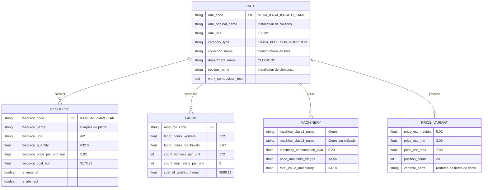
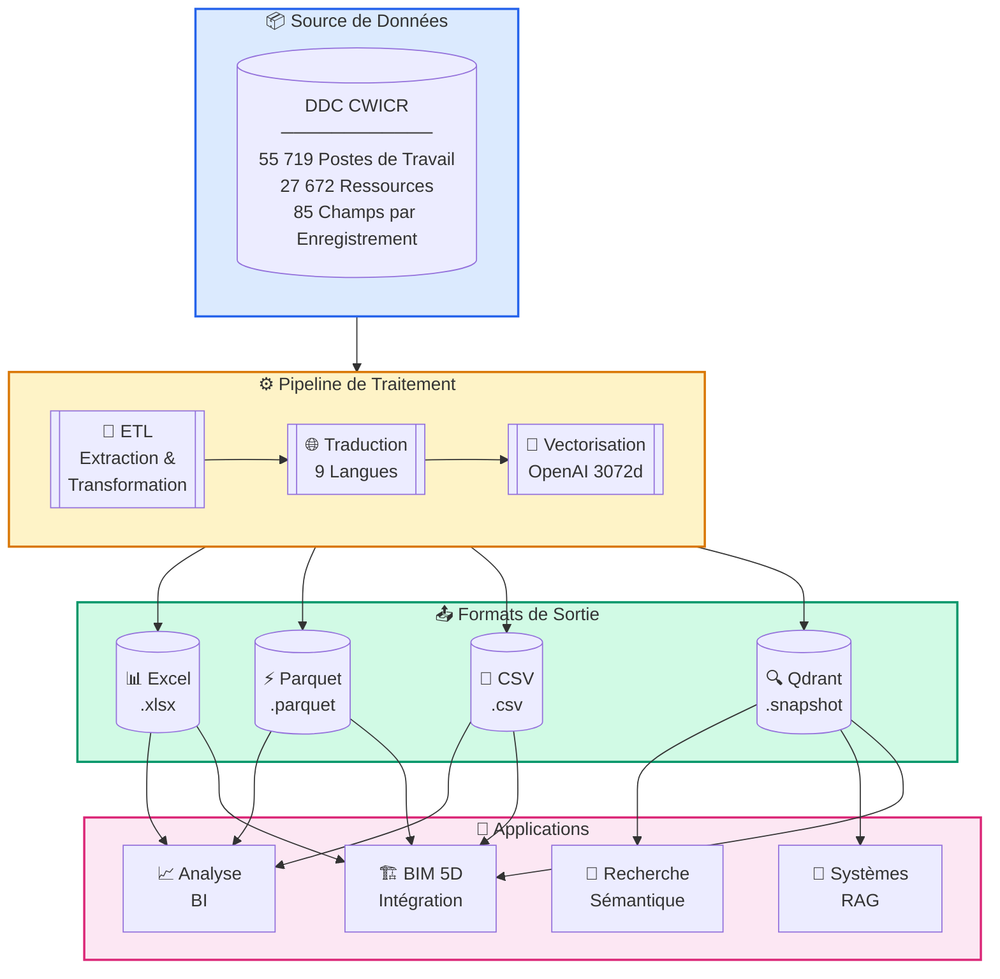
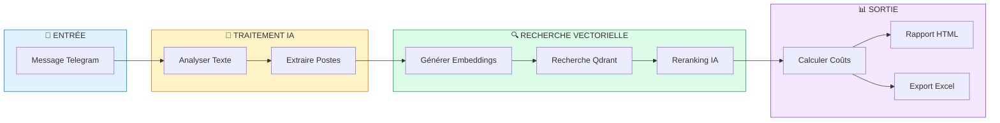
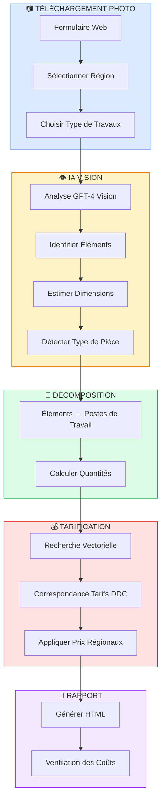
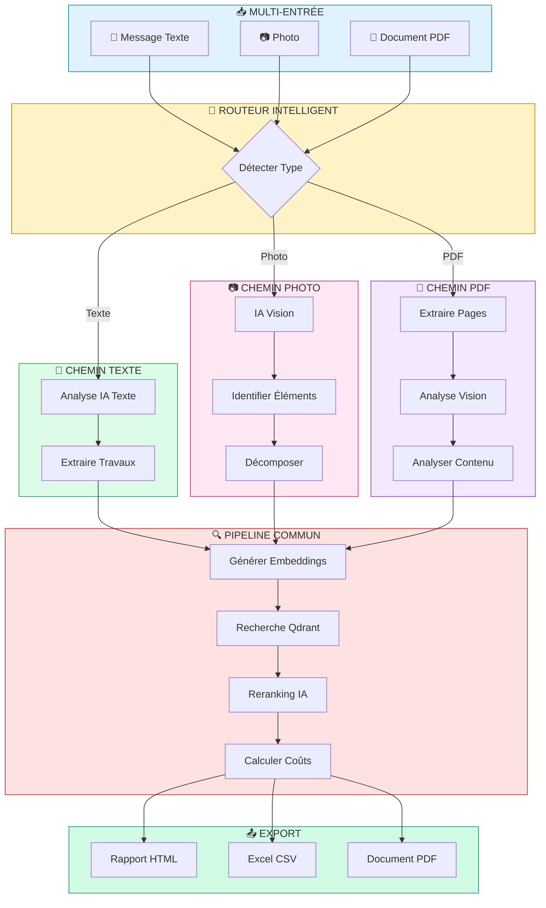
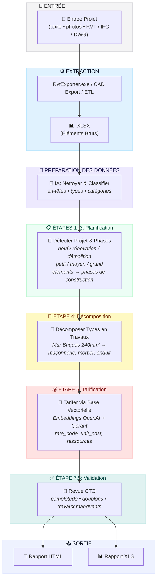

<h3 align="center">DDC CWICR - Construction Work Items, Components & Resources </br>
  + Pipelines n8n pour le calcul d'estimations basées sur des descriptions, photos et CAD (BIM)</h3>

<p align="center">
  <a href="README.md">🇬🇧 English</a> •
  <a href="README.zh-CN.md">🇨🇳 中文</a> •
  <a href="README.es.md">🇪🇸 Español</a> •
  <a href="README.pt-BR.md">🇧🇷 Português</a> •
  <a href="README.ru.md">🇷🇺 Русский</a> •
  <a href="README.ja.md">🇯🇵 日本語</a> •
  <a href="README.de.md">🇩🇪 Deutsch</a> •
  <a href="README.fr.md"><b>🇫🇷 Français</b></a>
</p>

<p align="center">
  
</p>

<div align="center">
  
  
  
  
</div>

<div align="center">
  
  
  
  
  
</div>

<p align="center">
  
</p>

<h3 align="center">⚡ Workflows n8n</h3>
<p align="center"><code>Choisissez votre entrée → Obtenez l'estimation des coûts</code></p>

<br>

<table width="100%">
<tr>

<td align="center" valign="top" width="33%">
<br>
<h3>📝 Texte</h3>
<p>Conversion rapide du périmètre<br>en devis à partir d'une description</p>
<p><b>Entrée:</b> Message Telegram / chat<br>
<b>Sortie:</b> Postes correspondants + estimation</p>
<br>
<a href="#1️⃣-bot-estimateur-de-texte">📖 Documentation</a>
<br><br>
<a href="./n8n_1_Telegram_Bot_Cost_Estimates_and_Rate_Finder_TEXT_DDC_CWICR.json">

</a>
<br><br>
</td>

<td align="center" valign="top" width="33%">
<br>
<h3>📷 Photo / PDF</h3>
<p>Photos de chantier, devis scannés,<br>photo-PDF du terrain</p>
<p><b>Entrée:</b> Image ou pages PDF<br>
<b>Sortie:</b> Périmètre extrait → estimation</p>
<br>
<a href="#2️⃣-estimateur-de-coûts-par-photo">📖 Docs Photo</a> · <a href="#3️⃣-bot-universel-texte--photo--pdf">📖 Bot Universel</a>
<br><br>
<a href="./n8n_2_Photo_Cost_Estimate_DDC_CWICR.json">

</a>
&nbsp;
<a href="./n8n_3_Telegram_Bot_Cost_Estimates_and_Rate_Finder_TEXT_PHOTO_PDF_DDC_CWICR.json">

</a>
<br><br>
</td>

<td align="center" valign="top" width="33%">
<br>
<h3>🧊 CAD / BIM</h3>
<p>Quantification et estimation<br>basées sur Revit / IFC / DWG</p>
<p><b>Entrée:</b> Export de modèle <br>
<b>Sortie:</b> Estimation 4D/5D + ventilation</p>
<br>
<a href="#4️⃣-pipeline-destimation-cad-bim">📖 Documentation</a>
<br><br>
<a href="./n8n_4_CAD_(BIM)_Cost_Estimation_Pipeline_4D_5D_with_DDC_CWICR.json">

</a>
<br><br>
</td>

</tr>
</table>

<br>
<p align="center">
  <a href="https://openconstructionestimate.com">
    
  </a>
</p>
<br>
<p align="center">
 Clients et utilisateurs de DataDrivenConstruction
  <br>
  <a href="https://datadrivenconstruction.io/">
  
  </a>
  <br></br>
</p>


---

## 📑 Table des Matières

### 🤖 Intégration IA
- [Carburant Parfait pour l'IA](#-carburant-parfait-pour-vos-produits-ia) — Pourquoi cette base de données est idéale pour l'IA
- [Claude Code & Google Antigravity](#-claude-code--google-antigravity--assistants-de-programmation-ia) — Assistants de programmation IA
- [n8n](#-n8n--automatisation-visuelle-des-workflows) — Automatisation des workflows
- [Dify](#-dify--développer-des-applications-llm) — Développement d'applications LLM
- [Sim AI & Autres](#-sim-ai--plateformes-similaires) — Plateformes compatibles
- [Cas d'Utilisation Universels](#-cas-dutilisation-universels) — Ce que vous pouvez construire

### 📊 Base de Données & Données
- [À Propos](#à-propos) — Qu'est-ce que DDC CWICR
- [Formats Disponibles](#formats-disponibles) — Excel, Parquet, CSV, Qdrant
- [Schéma de Données](#schéma-de-données) — Structure de 85 champs
- [Groupes de Champs](#groupes-de-champs) — Classification, Ressources, Main d'œuvre, Machines
- [Méthodologie](#méthodologie) — Principes de calcul basé sur les ressources
- [Contexte Historique](#contexte-historique) — 100+ ans de normes

### ⚡ Workflows n8n
- [Aperçu des Workflows n8n](#-workflows-n8n) — Choisissez votre type d'entrée
- [Essayez Maintenant — Bots de Démo en Direct](#-essayez-maintenant--bots-de-démo-en-direct) — Testez instantanément sur Telegram
- [Workflow 1: Bot Estimateur de Texte](#1️⃣-bot-estimateur-de-texte) — Bot Telegram pour entrée texte
- [Workflow 2: Estimateur de Coûts par Photo](#2️⃣-estimateur-de-coûts-par-photo) — Formulaire web avec IA Vision
- [Workflow 3: Bot Universel](#3️⃣-bot-universel-texte--photo--pdf) — Texte + Photo + PDF
- [Workflow 4: Pipeline CAD/BIM](#4️⃣-pipeline-destimation-cad-bim) — Revit/IFC/DWG vers estimation
- [Démarrage Rapide des Workflows](#démarrage-rapide-des-workflows) — Configuration en 4 étapes
- [Configuration n8n 2.0+](#️-configuration-n8n-20-requise) — Activer le nœud Execute Command

### 🏗️ Pipeline CAD/BIM
- [Prérequis](#-prérequis) — Composants requis
- [Étapes du Pipeline](#-étapes-du-pipeline) — Traitement en 10 étapes
- [Sélection du Modèle LLM](#️-sélection-du-modèle-llm) — OpenAI, Claude, Gemini, Grok
- [Fichiers de Sortie](#-fichiers-de-sortie) — Rapports HTML & Excel
- [Dépannage](#️-dépannage) — Problèmes courants

### 🔍 Base de Données Vectorielle
- [Base de Données Vectorielle](#base-de-données-vectorielle) — Recherche sémantique avec Qdrant
- [Releases](#releases) — Télécharger les snapshots
- [Collections](#collections) — 9 collections linguistiques
- [Déploiement Docker](#déploiement-docker) — Configuration auto-hébergée

### 🚀 Démarrage
- [Démarrage Rapide - Python](#démarrage-rapide) — Données tabulaires & recherche sémantique
- [Cas d'Utilisation d'Intégration](#intégration) — Niveau débutant à avancé

### 👥 Communauté
- [Ressources & Communauté](#ressources--communauté) — Liens & canaux
- [Conseil & Formation](#conseil--formation) — Services professionnels
- [Contribuer](#contribuer) — Soumettez vos workflows
- [Licence](#licence) — CC BY 4.0 & MIT
- [Soutenir le Projet](#soutenir-le-projet) — Sponsoriser & donner
- [🤖 Instructions IA](#instructions-ia) — Documentation pour les assistants IA


---

## 🚀 Carburant Parfait pour Vos Produits IA

<p align="center">
  <b>Clonez simplement le repo et décrivez ce que vous voulez — l'IA fait le reste</b>
</p>

DDC CWICR n'est pas qu'une base de données — c'est un **carburant prêt à l'emploi pour les applications alimentées par l'IA**. Que vous construisiez des bots d'estimation des coûts, automatisiez des workflows de construction, ou créiez des assistants intelligents — ces données fonctionnent immédiatement avec les outils IA modernes.

### Pourquoi Cette Base de Données est Idéale pour l'IA

| Caractéristique | Avantage |
|-----------------|----------|
| **Embeddings pré-calculés** | Pas besoin de générer des vecteurs — la recherche sémantique fonctionne instantanément |
| **Schéma structuré de 85 champs** | L'IA peut raisonner sur les relations de données et fournir des réponses précises |
| **9 langues incluses** | Construisez des applications multilingues sans surcharge de traduction |
| **55 000+ postes de travail** | Couverture complète pour toute tâche d'estimation de construction |
| **Méthodologie basée sur les ressources** | Données transparentes que l'IA peut expliquer et décomposer |

### 📋 Descriptions de Travaux Prêtes à l'Emploi pour Tout Système

<p align="center">
  
</p>

DDC CWICR fournit des **descriptions de travaux complètes et structurées** qui peuvent être affichées dans n'importe quel système ou format. Chaque poste de travail contient toutes les informations nécessaires aux différents intervenants du projet :

| Intervenant | Ce qu'il obtient |
|-------------|------------------|
| 🏢 **Maître d'ouvrage / Investisseur** | Transparence totale des coûts, décomposition des ressources, justification des prix pour les décisions d'investissement |
| 📊 **Métreur / Économiste** | Prix détaillés, heures de travail, quantités de matériaux, coûts d'équipement — prêt pour la génération de devis |
| 👷 **Chef de chantier / Conducteur de travaux** | Composition des travaux, besoins en ressources, normes de travail pour la planification et l'exécution quotidienne |
| 🔧 **Entrepreneur / Exécutant** | Spécifications complètes, prix unitaires, références de productivité pour des offres et une planification précises |

Export vers **Excel, PDF, HTML, systèmes ERP, plateformes BIM** — le schéma structuré de 85 champs garantit l'intégrité des données dans tous les formats de sortie.

### 🛠️ Fonctionne Parfaitement Avec

<table>
<tr>
<td align="center" width="20%">
<br/>
<b>Claude Code</b><br/>
<sub>Assistant de programmation IA CLI</sub>
</td>
<td align="center" width="20%">
<br/>
<b>Google Antigravity</b><br/>
<sub>Google Antigravity</sub>
</td>
<td align="center" width="20%">
<br/>
<b>n8n</b><br/>
<sub>Automatisation des workflows</sub>
</td>
<td align="center" width="20%">
<br/>
<b>Dify</b><br/>
<sub>Développement d'apps LLM</sub>
</td>
<td align="center" width="20%">
<br/>
<b>Sim AI & Autres</b><br/>
<sub>Plateformes IA</sub>
</td>
</tr>
</table>

---

### 💻 Claude Code & Google Antigravity — Assistants de Programmation IA

Le moyen le plus rapide de travailler avec DDC CWICR. Ouvrez simplement le repository dans Claude Code ou Google Antigravity et posez des questions en langage naturel.

**Démarrage:**
```bash
# Cloner le repository
git clone https://github.com/datadrivenconstruction/OpenConstructionEstimate-DDC-CWICR.git

# Ouvrir avec Claude Code
cd OpenConstructionEstimate-DDC-CWICR
claude
```

**Exemples de Prompts:**

| Tâche | Prompt |
|-------|--------|
| **Explorer les données** | "Montre-moi la structure de cette base de données de construction et explique quelles données sont disponibles" |
| **Trouver des postes** | "Trouve tous les postes de travail liés aux fondations en béton et montre leurs coûts" |
| **Construire des requêtes** | "Écris un script Python pour rechercher les postes de plomberie avec heures de main d'œuvre > 100" |
| **Créer des rapports** | "Génère un rapport de ventilation des coûts pour les travaux de rénovation résidentielle" |
| **Analyser les coûts** | "Compare les coûts des matériaux entre différentes méthodes de construction de murs" |
| **Construire des intégrations** | "Crée un script qui se connecte à la base Qdrant et effectue une recherche sémantique" |

**Conseils Pro:**
- Pointez Claude vers des fichiers spécifiques: *"Analyse le fichier Parquet et résume la distribution des coûts"*
- Demandez des explications: *"Explique comment la méthodologie de calcul basée sur les ressources fonctionne dans cette base de données"*
- Demandez des modifications: *"Modifie le workflow n8n pour ajouter des notifications par email"*

---

### ⚡ n8n — Automatisation Visuelle des Workflows

Construisez des pipelines d'automatisation puissants sans code. Connectez DDC CWICR à plus de 400 apps et services.

**Cas d'Utilisation:**

| Workflow | Description |
|----------|-------------|
| **Bot Telegram** | Les utilisateurs envoient texte/photo → L'IA extrait les postes → Retourne l'estimation des coûts |
| **Automatisation Email** | Recevoir un devis par email → Traiter avec l'IA → Envoyer une estimation formatée |
| **Intégration CRM** | Nouveau projet dans le CRM → Générer automatiquement une estimation préliminaire → Mettre à jour la valeur du deal |
| **Pipeline BIM** | Export depuis Revit → Extraire les quantités → Correspondre avec les tarifs DDC → Générer un rapport 5D |
| **Bot Slack** | L'équipe pose des questions → L'IA recherche dans la base de données → Retourne les postes pertinents |

**Démarrage Rapide:**
1. Télécharger le JSON du workflow depuis ce repo
2. Importer dans n8n: `Workflows → Importer → Depuis un fichier`
3. Configurer les credentials (OpenAI, Qdrant, Telegram)
4. Activer et tester

Voir la section [Workflows n8n](#workflows-n8n--description-détaillée) pour la configuration détaillée.

---

### 🤖 Dify — Développer des Applications LLM

Créez des applications IA personnalisées avec DDC CWICR comme base de connaissances.

**Configuration:**
1. Créer une nouvelle application Dify
2. Ajouter une Base de Connaissances → Télécharger des fichiers Parquet/CSV ou se connecter à Qdrant
3. Configurer le pipeline RAG avec les embeddings
4. Construire votre interface de chat ou API

**Idées d'Applications:**

| Type d'App | Description |
|------------|-------------|
| **Chatbot Estimateur de Construction** | Interface conversationnelle pour les requêtes de coûts |
| **Recherche de Postes de Travail** | Recherche en langage naturel parmi 55 000+ postes |
| **Conseiller en Coûts** | IA qui explique les ventilations de coûts et suggère des optimisations |
| **Assistant Multilingue** | Détecte automatiquement la langue et répond dans la langue de l'utilisateur |
| **Point d'Accès API** | API REST pour l'intégration avec d'autres systèmes |

**Exemple de Template de Prompt Dify:**
```
Vous êtes un assistant d'estimation des coûts de construction avec accès à la base de données DDC CWICR.

Contexte: {{context}}

Question de l'utilisateur: {{query}}

Fournissez des informations de coûts précises basées sur la base de données. Incluez:
- Postes de travail pertinents avec codes
- Coûts unitaires et quantités
- Ventilation des ressources (main d'œuvre, matériaux, équipement)
- Calcul du coût total
```

---

### 🔮 Sim AI & Plateformes Similaires

DDC CWICR s'intègre avec toute plateforme IA qui supporte:
- **Bases de données vectorielles** (Qdrant, Pinecone, Weaviate, Milvus)
- **Données structurées** (CSV, Parquet, Excel)
- **Embeddings OpenAI** (text-embedding-3-large, 3072 dimensions)

**Plateformes Compatibles:**
- **Sim AI** — Simulation et modélisation IA
- **LangChain / LlamaIndex** — Frameworks d'applications LLM
- **Flowise** — Constructeur d'apps LLM low-code
- **Botpress** — Plateforme d'IA conversationnelle
- **Voiceflow** — Conception vocale et chat
- **Stack AI** — Workflows IA no-code
- **Relevance AI** — Plateforme de workforce IA

**Pattern d'Intégration Universel:**

```python
# Fonctionne avec toute plateforme supportant Qdrant
from qdrant_client import QdrantClient

# Se connecter à DDC CWICR
client = QdrantClient("votre-instance-qdrant", port=6333)

# Recherche sémantique
results = client.search(
    collection_name="ddc_cwicr_fr",  # ou en, de, ru, zh, etc.
    query_vector=votre_embedding,
    limit=10
)

# Utiliser les résultats dans votre application IA
for item in results:
    print(f"{item.payload['rate_code']}: {item.payload['rate_original_name']}")
```

---

### 📋 Cas d'Utilisation Universels

Quel que soit l'outil IA que vous choisissez, DDC CWICR permet:

| Cas d'Utilisation | Description |
|-------------------|-------------|
| **Estimation Instantanée des Coûts** | Obtenez les coûts de construction à partir de descriptions textuelles ou de photos |
| **Génération de DQE** | Générez automatiquement des devis quantitatifs à partir de descriptions de projet |
| **Benchmarking des Prix** | Comparez les coûts entre régions et langues |
| **Planification des Ressources** | Calculez les heures de main d'œuvre, matériaux et besoins en équipement |
| **Analyse d'Investissement** | Audits de coûts approfondis avec transparence totale des ressources |
| **Support Multilingue** | Servez les utilisateurs dans 9 langues avec tarification localisée |
| **Intégration BIM** | Connectez à Revit/IFC pour l'estimation automatisée 4D/5D |
| **Entraînement de Modèles IA** | Utilisez des données structurées pour affiner l'IA de construction |

---

## À Propos

**DDC CWICR** (Construction Work Items, Components & Resources) est une base de données ouverte pour l'estimation des coûts de construction, couvrant tout le spectre des activités de construction - des terrassements et du coulage de béton aux travaux d'installation spécialisés.

La base de données s'appuie sur des sources décrivant les pratiques de construction modernes en Eurasie et dans la région Asie-Pacifique, où un écosystème de normalisation technique unifié sert de langage d'ingénierie commun pour plus de dix économies en développement dynamique. DDC CWICR représente un effort d'harmonisation des normes ouvertes en établissant un cadre réglementaire unique pour la gestion des projets d'investissement dans plusieurs langues.

<p align="center">
  <br>
  
  <br></br>
</p>

Les données structurées peuvent être accessibles via des formats tabulaires (XLSX, CSV, Parquet) ou interrogées de manière conversationnelle via LLM, permettant aux spécialistes d'intégrer les descriptions de travaux de construction (base de données vectorielle QDRANT) dans des pipelines automatisés et des workflows utilisant un langage simple ou des requêtes concises.

### Formats Disponibles

| Format      | Extension   | Taille       | Idéal Pour                            | Caractéristiques                     |
|-------------|-------------|--------------|---------------------------------------|--------------------------------------|
| **Excel**   | `.xlsx`     | ~150–400 Mo  | Analyse manuelle, filtrage, tableaux croisés | Lisible par l'homme, formatage complet |
| **Parquet** | `.parquet`  | ~55 Mo       | Pipelines ETL, entraînement ML, Big Data | Colonnes, excellente compression     |
| **CSV**     | `.csv`      | ~1,3 Go      | Import base de données, systèmes legacy | Compatibilité universelle            |
| **Qdrant**  | `.snapshot` | ~1 Go        | Recherche sémantique, RAG, assistants IA | Embeddings OpenAI pré-calculés       |


Une démo en direct est disponible sur [openconstructionestimate.com](https://openconstructionestimate.com/), où vous pouvez explorer les données et voir la base de données vectorielle en action pour la recherche sémantique.

<p align="center">
  
</p>

---

## Schéma de Données

La base de données contient **85 champs** organisés en groupes logiques. Chaque enregistrement représente soit un poste de travail (tarif) soit une ressource avec une ventilation complète des coûts.



### Groupes de Champs
Les 85 champs de la base de données sont organisés en groupes logiques qui reflètent la méthodologie d'estimation des coûts basée sur les ressources. Chaque groupe sert une fonction spécifique dans la structure de ventilation des coûts: de la classification hiérarchique et l'identification des postes de travail à la consommation détaillée des ressources, aux besoins en main d'œuvre, aux coûts de machines et aux totaux agrégés. Cette structure modulaire permet aux utilisateurs de n'interroger que les champs pertinents pour leur tâche - qu'il s'agisse de générer une nomenclature de matériaux, d'analyser la productivité de la main d'œuvre ou de construire une estimation complète des coûts.

<p align="center">
  <br>
  
  <br></br>
</p>

**Classification** - `category_type`, `collection_code`, `collection_name`, `department_code`, `department_name`, `department_type`, `section_name`, `section_type`, `subsection_code`, `subsection_name`

**Poste de Travail (Tarif)** - `rate_code`, `rate_original_name`, `rate_final_name`, `rate_unit`, `row_type`, `is_scope`, `is_abstract`, `is_machine`, `is_labor`, `is_material`, `work_composition_text`

**Ressources** - `resource_code`, `resource_name`, `resource_unit`, `resource_quantity`, `parameter_resource_quantity`, `resource_price_per_unit_eur_current`, `resource_cost_eur`

**Main d'Œuvre** - `count_workers_per_unit`, `count_engineers_per_unit`, `count_machinists_per_unit`, `count_total_people_per_unit`, `labor_hours_construction_workers`, `labor_hours_machinists`, `labor_hours_engineers`, `total_labor_hours_workers_machinists`, `total_labor_hours_all_personnel`, `cost_of_working_hours`, `count_people_per_day`

**Machines** - `machine_class2_name`, `machine_class3_name`, `personnel_machinist_code`, `personnel_machinist_grade`, `price_machinist_wages`, `price_relocation_included`, `price_cost_without_wages`, `electricity_consumption_kwh_per_machine_hour`, `electricity_cost_per_unit`, `electricity_cost_total_sum`, `cost_machinist_sum`, `total_value_machinery_equipment`

**Variantes de Prix** - `price_code_prefix`, `price_abstract_resource_common_start`, `price_abstract_resource_variable_parts`, `price_abstract_resource_position_count`, `price_abstract_resource_est_price_min`, `price_abstract_resource_est_price_max`, `price_abstract_resource_est_price_mean`, `price_abstract_resource_est_price_median`, `price_abstract_resource_unit`, `abstract_resource_tech_group`

**Agrégats** - `total_cost_per_position`, `total_material_cost_per_position`, `total_resource_cost_per_position`, `total_value_abstract_resources`, `materials_resource_cost_eur`

**Masse & Services** - `mass_name`, `mass_value`, `mass_unit`, `service_category`, `service_type`, `parameter_service_code`, `parameter_service_unit`, `parameter_service_name`, `parameter_service_quantity`, `service_cost_sum`

### Formule de Calcul des Coûts

| Composant         | Norme Technologique | ×   | Prix Régional   | =   | Coût                    |
|-------------------|---------------------|-----|-----------------|-----|-------------------------|
| 👷 **Main d'Œuvre** | 172 h/100m²        | ×   | €17,95/h        | =   | €3 088,11               |
| 🧱 **Matériaux**   | 632 m²/100m²        | ×   | €5,02/m²        | =   | €3 170,73               |
| 🚜 **Équipement**  | 1,67 h/100m²        | ×   | €38,42/h        | =   | €64,18                  |
|                   |                     |     | **Total**       | =   | **€7 725,91 pour 100m²** |

---

## Méthodologie

La valeur clé du **Calcul Basé sur les Ressources** est la séparation de la technologie de production invariable de la composante financière volatile. Elle est basée sur les "principes premiers" physiques de la construction:
- Heures de main d'œuvre requises pour un travail spécifique
- Quantités de matériaux par unité de travail
- Temps d'équipement nécessaire

**Pourquoi c'est important:**

- **Transparence** - Tarification sans marges cachées, ventilation complète des ressources
- **Auditabilité** - Capacité d'analyse approfondie pour l'analyse d'investissement et la vérification
- **Portabilité** - Normes indépendantes de la région applicables sur différents marchés
- **Éprouvé** - Méthodologie standard de l'industrie établie depuis plus de 100 ans




### Contexte Historique

Les descriptions de travaux de construction dans cette base de données sont fondées sur une méthodologie de normalisation basée sur les ressources dont les racines remontent des normes de production du début du XXe siècle aux systèmes de référence numériques d'aujourd'hui. Développée et affinée en continu depuis les années 1920, cette approche a connu une évolution particulièrement robuste dans la région eurasienne.

Au cours de cent ans de développement, le système est passé des calculs manuels aux formats lisibles par machine - mais son principe fondamental reste intact: la mesure précise des ressources physiques nécessaires par unité de production de construction. Les implémentations modernes font le lien entre les données normatives historiques et les prix du marché en temps réel.

Les adaptations régionales de cette méthodologie fonctionnent sous diverses désignations nationales: ENIR, GESN, FER, NRR, ESN, AzDTN, ShNQK, MKS ChT, SNT, BNbD, Dinh Muc, Ding'e.

<p align="center">
  
</p>

⭐ <b>Si vous voulez voir de nouvelles mises à jour et versions de la base de données et si vous trouvez nos outils utiles, merci de donner une étoile à nos repositories pour voir plus d'applications similaires pour l'industrie de la construction.</b>
Mettez une étoile au workflow DDC sur GitHub et soyez instantanément notifié des nouvelles releases.
<p align="center">
  <br>
  
  <br></br>
</p>


---


## Intégration

### Cas d'Utilisation

- **Niveau Débutant** - Benchmarking des Coûts, Indexation des Prix, Estimation des Appels d'Offres

- **Intermédiaire** - Localisation, Pipelines ETL/BI, Calcul CO₂

- **Avancé** - Entraînement IA/ML, CAD (BIM) 5D, Audit d'Investissement Approfondi

---

## Workflows n8n — Description Détaillée

Quatre workflows prêts pour la production pour l'estimation automatisée des coûts de construction. Chaque workflow se connecte à la base de données vectorielle DDC CWICR via Qdrant et utilise des modèles IA pour le parsing intelligent et la correspondance.

| #   | Workflow                                                        | Entrée      | Idéal Pour                      | Télécharger                                                                                         |
|-----|-----------------------------------------------------------------|-------------|---------------------------------|-----------------------------------------------------------------------------------------------------|
| 1   | [Bot Estimateur de Texte](#1️⃣-bot-estimateur-de-texte)         | 💬 Texte    | Estimations rapides depuis texte | [JSON](./n8n_1_Telegram_Bot_Cost_Estimates_and_Rate_Finder_TEXT_DDC_CWICR.json)                     |
| 2   | [Estimateur Photo](#2️⃣-estimateur-de-coûts-par-photo)          | 📷 Photo    | Visites de chantier, inspections | [JSON](./n8n_2_Photo_Cost_Estimate_DDC_CWICR.json)                                                  |
| 3   | [Bot Universel](#3️⃣-bot-universel-texte--photo--pdf)           | 💬📷📄 Tout | Usage production complet        | [JSON](./n8n_3_Telegram_Bot_Cost_Estimates_and_Rate_Finder_TEXT_PHOTO_PDF_DDC_CWICR.json)           |
| 4   | [Pipeline CAD/BIM](#4️⃣-pipeline-destimation-cad-bim)           | 🏗️ Revit   | Estimation 4D/5D basée sur BIM  | [JSON](./n8n_4_CAD_(BIM)_Cost_Estimation_Pipeline_4D_5D_with_DDC_CWICR.json)                        |

---

### 1️⃣ Bot Estimateur de Texte

**Fichier:** `n8n_1_Telegram_Bot_Cost_Estimates_and_Rate_Finder_TEXT_DDC_CWICR.json`

Bot Telegram pour l'estimation des coûts basée sur le texte. Décrivez les travaux de construction en langage naturel — le bot analyse l'entrée, recherche dans la base de données vectorielle et retourne des ventilations de coûts détaillées.

<p align="center">
  <br>
  
  <br></br>
</p>

<h3 align="left">🤖 Essayez Maintenant — Bots de Démo en Direct</h3>
<p align="left"><i>Testez les workflows d'estimation instantanément sur Telegram</i></p>
<p><b>@TextOpenConstructionEstimate_bot</b></p>
<p>Créez des estimations de coûts complètes<br>à partir de descriptions textuelles</p>
<a href="https://t.me/TextOpenConstructionEstimate_bot">

</a>




**Comment ça marche:**

| Étape | Action                                 | Technologie                            |
|-------|----------------------------------------|----------------------------------------|
| 1     | L'utilisateur envoie une description texte | API Bot Telegram                    |
| 2     | L'IA analyse et extrait les postes de travail | OpenAI / Claude / Gemini          |
| 3     | Génère des embeddings pour chaque poste | OpenAI `text-embedding-3-large`       |
| 4     | Recherche les tarifs correspondants dans la base | Recherche vectorielle Qdrant     |
| 5     | L'IA reranke les résultats pour la précision | Scoring LLM                        |
| 6     | Calcule les coûts et génère le rapport | HTML / Excel / PDF                    |

**Fonctionnalités:**

| Fonctionnalité               | Description                                                          |
|------------------------------|----------------------------------------------------------------------|
| 💬 Entrée en langage naturel | Accepte tout format texte — listes, phrases, descriptions structurées |
| 🤖 Support multi-LLM         | Fonctionne avec OpenAI, Claude ou Gemini (commutable)                |
| 🔍 Recherche sémantique      | Trouve les meilleures correspondances même avec une formulation différente |
| 🌍 9 langues                 | DE, EN, RU, ES, FR, PT, ZH, AR, HI                                   |
| 📊 Exports multiples         | Rapport HTML, feuille de calcul Excel, document PDF                  |
| ✏️ Édition interactive       | Modifiez les quantités avant le calcul final                         |

**Credentials requis:**
- Token Bot Telegram (depuis @BotFather)
- Clé API OpenAI (pour embeddings + LLM optionnel)
- URL Qdrant + Clé API

---

### 2️⃣ Estimateur de Coûts par Photo

**Fichier:** `n8n_2_Photo_Cost_Estimate_DDC_CWICR.json`

Interface formulaire web pour l'estimation basée sur les photos. Téléchargez une photo de construction — l'IA Vision identifie les éléments, estime les dimensions et calcule automatiquement les coûts.

<p align="center">
  <br>
  
  <br></br>
</p>




**Comment ça marche:**

| Étape | Action                                        | Technologie                          |
|-------|-----------------------------------------------|--------------------------------------|
| 1     | L'utilisateur télécharge une photo via formulaire web | n8n Form Trigger                 |
| 2     | L'IA Vision analyse l'image                   | GPT-4 Vision                         |
| 3     | Identifie le type de pièce, éléments, matériaux | Extraction JSON structurée          |
| 4     | Estime les dimensions depuis objets de référence | Raisonnement IA (portes, carreaux, etc.) |
| 5     | Décompose les éléments en postes de travail   | Traitement LLM                       |
| 6     | Tarife chaque travail via recherche vectorielle | Qdrant + embeddings OpenAI          |
| 7     | Génère un rapport HTML professionnel          | Sortie stylisée                      |

**Fonctionnalités:**

| Fonctionnalité         | Description                                             |
|------------------------|---------------------------------------------------------|
| 📷 Analyse photo       | GPT-4 Vision identifie les éléments de construction     |
| 📐 Dimensionnement auto | Estime les tailles en utilisant des objets de référence (portes, carreaux) |
| 🏠 Détection de pièce  | Salle de bain, cuisine, chambre, extérieur, etc.        |
| 🔨 Support type travaux | Construction neuve / Rénovation / Réparation           |
| 🌍 9 bases régionales  | Prix localisés pour Berlin, Toronto, Paris, etc.        |
| 📄 Rapports professionnels | Sortie HTML propre prête pour les clients            |

**Credentials requis:**
- Clé API OpenAI (GPT-4 Vision + embeddings)
- URL Qdrant + Clé API

---

### 3️⃣ Bot Universel (Texte + Photo + PDF)

**Fichier:** `n8n_3_Telegram_Bot_Cost_Estimates_and_Rate_Finder_TEXT_PHOTO_PDF_DDC_CWICR.json`

Bot Telegram complet supportant tous les types d'entrée: descriptions textuelles, photos de construction et plans PDF. Le workflow le plus complet pour une utilisation en production.


<p align="center">
  <br>
  
  <br></br>
</p>

<h3 align="left">🤖 Essayez Maintenant — Bots de Démo en Direct</h3>
<p align="left"><i>Testez les workflows d'estimation instantanément sur Telegram</i></p>
<h3>📷 Bot Universel</h3>
<p><b>@OpenConstructionEstimate_bot</b></p>
<p>Bot complet pour texte, photos et PDF</p>
<a href="https://t.me/OpenConstructionEstimate_bot">

</a>
<br><br>





**Comment ça marche:**

| Étape | Action                                    | Technologie                    |
|-------|-------------------------------------------|--------------------------------|
| 1     | L'utilisateur envoie texte, photo ou PDF  | API Bot Telegram               |
| 2     | Le routeur détecte le type d'entrée       | Analyse content-type           |
| 3a    | **Texte:** L'IA analyse les postes de travail | OpenAI / Gemini             |
| 3b    | **Photo:** L'IA Vision extrait les éléments | GPT-4 Vision / Gemini 2.0   |
| 3c    | **PDF:** Extrait et analyse les pages     | Traitement PDF + Vision        |
| 4     | Recherche sémantique dans DDC CWICR       | Base de données vectorielle Qdrant |
| 5     | Reranking IA pour meilleures correspondances | Scoring LLM                  |
| 6     | Édition interactive via menu du bot       | Claviers inline Telegram       |
| 7     | Exporter les résultats                    | HTML / Excel / PDF             |

**17 Actions du Bot:**

| Action           | Description                         |
|------------------|-------------------------------------|
| `/start`         | Menu de sélection de langue         |
| Téléchargement photo | Déclenche l'analyse IA vision    |
| Message texte    | Analyse et extrait les postes       |
| Téléchargement PDF | Traite les plans                  |
| Éditer quantités | Modifier avant calcul               |
| Ajouter travail  | Entrée manuelle de poste            |
| Calculer         | Exécuter l'estimation complète      |
| Voir détails     | Afficher ressources pour chaque poste |
| Export Excel     | Télécharger feuille de calcul CSV   |
| Export PDF       | Générer rapport PDF                 |
| Aide             | Afficher instructions d'utilisation |
| Affiner          | Ré-analyser avec corrections        |

**Fonctionnalités:**

| Fonctionnalité        | Description                                        |
|-----------------------|----------------------------------------------------|
| 📷 Double IA Vision   | Gemini 2.0 Flash ou GPT-4 Vision (configurable)    |
| 📄 Traitement PDF     | Plans, DQE scannés, documents                      |
| 💬 Analyse texte intelligente | Gère listes, tableaux, texte libre          |
| 🔍 Reranking IA       | Améliore la précision des correspondances          |
| ✏️ Édition complète   | Ajouter, supprimer, modifier les postes de travail |
| 📊 Export multi-format | HTML, Excel, PDF                                  |
| 🌍 9 langues          | Localisation complète                              |

**Credentials requis:**
- Token Bot Telegram
- Clé API OpenAI (embeddings)
- Clé API Gemini (Vision) ou OpenAI GPT-4 Vision
- URL Qdrant + Clé API

---

### 4️⃣ Pipeline d'Estimation CAD (BIM)

**Fichier:** `n8n_4_CAD_(BIM)_Cost_Estimation_Pipeline_4D_5D_with_DDC_CWICR.json`

Estimation automatisée des coûts à partir de modèles Revit/IFC/DWG. Extrait les données BIM, classifie les éléments, décompose en postes de travail et génère des estimations 4D/5D avec ventilation complète des ressources.

<p align="left">
  <a href="https://datadrivenconstruction.io">
    
  </a>
</p>




**n8n fournit plus de 400 intégrations natives** avec des plateformes comme Google Sheets, Notion, Slack, Airtable, bases de données (PostgreSQL, MongoDB), stockage cloud, et plus. Chaque nœud dans ce workflow est modulaire — vous pouvez:

- 🔄 **Changer de fournisseur LLM** (OpenAI ↔ Claude ↔ Gemini ↔ Grok)
- 📊 **Connecter à votre ERP ou système de gestion de projet**
- 📁 **Exporter les résultats vers n'importe quelle destination** (stockage cloud, email, tableaux de bord)
- 🔧 **Modifier n'importe quelle étape** pour correspondre à votre méthodologie d'estimation

Le workflow vous appartient pour l'adapter. Pas de restrictions. Pas de frais de licence. Contrôle total.

---

## 📋 Prérequis

| Composant                                          | Requis                                 | Description                                                           |
|----------------------------------------------------|----------------------------------------|-----------------------------------------------------------------------|
| **[n8n](https://n8n.io/)**                         | v1.0+ (v2.0+ nécessite [configuration](#️-configuration-n8n-20-requise)) | Plateforme d'automatisation de workflow pour orchestrer le pipeline d'estimation |
| **[Qdrant](https://qdrant.tech/)**                 | Instance Cloud ou auto-hébergée        | Base de données vectorielle pour recherche sémantique parmi les postes de travail |
| **[API OpenAI](https://platform.openai.com/)**     | Pour embeddings (`text-embedding-3-large`) | Génère des embeddings vectoriels pour les éléments BIM et la correspondance avec la base de coûts |
| **API LLM**                                        | OpenAI / Claude / Gemini / xAI Grok    | Modèles IA pour la classification des postes et la génération d'estimations |
| **[Convertisseur DDC](https://github.com/datadrivenconstruction/cad2data-Revit-IFC-DWG-DGN-pipeline-with-conversion-validation-qto)** | `RvtExporter.exe` | Extrait les données BIM des modèles Revit vers Excel/JSON pour traitement |

---

## Démarrage Rapide des Workflows

### Étape 1: Importer le Workflow

```
n8n → Nouveau workflow → Importer depuis fichier → Sélectionner JSON
```

### Étape 2: Configurer les Credentials

Dans le nœud **🔑 TOKEN**, définissez vos clés API:

```json
{
  "bot_token": "VOTRE_TOKEN_BOT_TELEGRAM",
  "OPENAI_API_KEY": "VOTRE_CLE_OPENAI",
  "GEMINI_API_KEY": "VOTRE_CLE_GEMINI",
  "QDRANT_URL": "http://localhost:6333",
  "QDRANT_API_KEY": ""
}
```

### Étape 3: Charger DDC CWICR dans Qdrant

Téléchargez le snapshot depuis [Releases](#releases) et importez:

```bash
curl -X POST "http://localhost:6333/collections/ddc_cwicr_fr/snapshots/upload" \
  -H "Content-Type: multipart/form-data" \
  -F "snapshot=@FR_PARIS_workitems_EMBEDDINGS_3072_DDC.snapshot"
```

### Étape 4: Activer & Tester

- Activez le workflow dans n8n
- Pour les bots Telegram: envoyez `/start` à votre bot
- Pour les formulaires web: ouvrez l'URL du formulaire fournie par n8n

---

## ⚠️ Configuration n8n 2.0+ Requise

> **À partir de la version 2.0 de n8n, le nœud Execute Command est désactivé par défaut pour des raisons de sécurité.**
>
> Sans la configuration ci-dessous, les workflows utilisant Execute Command (notamment le Pipeline CAD/BIM) **ne fonctionneront pas** — les nœuds s'afficheront avec un point d'interrogation ou ne seront pas reconnus.

### Solution Rapide

**Windows (CMD) — exécuter à chaque fois:**
```cmd
set NODES_EXCLUDE=[] && npx n8n
```

**Solution permanente — créer une fois:**

Créez le fichier `C:\Users\VOTRE_UTILISATEUR\.n8n\.env` avec:
```
NODES_EXCLUDE=[]
```
Puis lancez simplement `npx n8n` comme d'habitude.

**Docker:**
```yaml
environment:
  - NODES_EXCLUDE=[]
```

### Vérifier la Configuration

1. Démarrez n8n
2. Cliquez sur **+** → recherchez **"Execute Command"**
3. Si le nœud apparaît → ✅ vous êtes prêt!

> 📚 Plus de détails: [n8n 2.0 Breaking Changes](https://docs.n8n.io/2-0-breaking-changes/)

---

## 🌍 Langues & Niveaux de Prix Supportés

| Code  | Langue      | Niveau de Prix  | Devise | Collection Qdrant   |
|-------|-------------|-----------------|--------|---------------------|
| `AR`  | Arabe       | Dubaï           | AED    | `ddc_cwicr_ar`      |
| `DE`  | Allemand    | Berlin          | EUR    | `ddc_cwicr_de`      |
| `EN`  | Anglais     | Toronto         | CAD    | `ddc_cwicr_en`      |
| `ES`  | Espagnol    | Barcelone       | EUR    | `ddc_cwicr_es`      |
| `FR`  | Français    | Paris           | EUR    | `ddc_cwicr_fr`      |
| `HI`  | Hindi       | Mumbai          | INR    | `ddc_cwicr_hi`      |
| `PT`  | Portugais   | São Paulo       | BRL    | `ddc_cwicr_pt`      |
| `RU`  | Russe       | Saint-Pétersbourg | RUB  | `ddc_cwicr_ru`      |
| `ZH`  | Chinois     | Shanghai        | CNY    | `ddc_cwicr_zh`      |

---

## 📊 Étapes du Pipeline

Le workflow CAD/BIM traite les données à travers 10 étapes:

| Étape   | Nom                  | Description                                                       |
|---------|----------------------|-------------------------------------------------------------------|
| **0**   | Collecter Données BIM | Extraire les éléments de Revit via Convertisseur DDC             |
| **1**   | Détection Projet     | L'IA identifie le type de projet (Résidentiel, Commercial, etc.) |
| **2**   | Génération Phases    | L'IA crée les phases de construction                              |
| **3**   | Affectation Éléments | L'IA mappe les types BIM aux phases                              |
| **4**   | Décomposition Travaux | L'IA décompose les types en postes de travail ("Mur Briques" → maçonnerie, mortier) |
| **5**   | Recherche Vectorielle | Trouver les tarifs correspondants dans DDC CWICR via Qdrant      |
| **6**   | Mapping Unités       | Convertir les unités BIM en unités de tarif                      |
| **7**   | Calcul Coûts         | Qté × Prix Unitaire pour chaque poste                            |
| **7.5** | Validation           | Revue CTO pour complétude et doublons                            |
| **8**   | Agrégation           | Somme par phases et catégories                                   |
| **9**   | Génération Rapport   | Créer les sorties HTML et Excel                                  |

---

## ⚙️ Sélection du Modèle LLM

Le workflow supporte plusieurs fournisseurs IA. Activez votre modèle préféré dans la section **Modèles LLM**:

| Modèle           | Nom du Nœud                  | Statut       |
|------------------|------------------------------|--------------|
| OpenAI GPT-4o    | `OpenAI LLM`                 | ✅ Par défaut |
| Claude Opus 4    | `Anthropic Chat Model2`      | Désactivé    |
| Gemini 2.5 Pro   | `Google Gemini Chat Model`   | Désactivé    |
| xAI Grok         | `xAI Grok Chat Model1`       | Désactivé    |
| DeepSeek         | `DeepSeek Chat Model`        | Désactivé    |

Pour changer de modèle: **Activez** le nœud du modèle souhaité et **Désactivez** les autres.

---

## 📁 Fichiers de Sortie

Les rapports sont sauvegardés dans le dossier du projet:
```
projet_YYYY-MM-DD.html   ← Rapport interactif (s'ouvre dans le navigateur)
projet_YYYY-MM-DD.xls    ← Feuille de calcul compatible Excel
```
<p align="center">
  <br>
  
  <br></br>
</p>

---

## 🔗 Collections Qdrant

Le workflow sélectionne automatiquement la collection correcte basée sur `language_code`:

```
{LANG}_{CITY}_workitems_costs_resources_EMBEDDINGS_3072_DDC_CWICR
```

Exemple: `FR_PARIS_workitems_costs_resources_EMBEDDINGS_3072_DDC_CWICR`

---

## ⚠️ Dépannage

| Problème                     | Solution                                                    |
|------------------------------|-------------------------------------------------------------|
| "Execute Command manquant" (n8n 2.0+) | Définissez la variable d'environnement `NODES_EXCLUDE=[]`. Voir [Configuration n8n 2.0+](#️-configuration-n8n-20-requise) |
| "Fichier Excel non trouvé"   | Vérifiez les chemins `path_to_converter` et `project_file`  |
| "Connexion Qdrant échouée"   | Vérifiez l'URL Qdrant et la clé API dans les credentials    |
| "Limite de taux dépassée"    | Réduisez la taille des lots ou ajoutez des délais entre appels API |
| "Prix non trouvé"            | Vérifiez si la collection de langue correcte existe dans Qdrant |
| "Erreur webhook Telegram"    | Assurez-vous que le workflow est actif et l'URL webhook accessible |
| "API Vision échouée"         | Vérifiez que la clé API Gemini ou OpenAI Vision est valide  |

---

## Base de Données Vectorielle

Collections Qdrant prêtes à l'emploi avec embeddings OpenAI `text-embedding-3-large` pour la recherche sémantique parmi les postes de travail de construction.

Les bases de données vectorielles vous permettent de "parler" à vos données en langage naturel – en utilisant des phrases simples ou de courtes expressions au lieu de code ou de filtres complexes. Cela accélère considérablement la recherche du bon poste de travail ou ligne de coût, même dans de très grands ensembles de données.

Ces collections Qdrant peuvent être connectées à des applications via des workflows d'automatisation et d'intégration modernes (par exemple, des outils Workflow et Pipeline low-code/no-code). Vous pouvez construire des assistants qui recherchent, filtrent et expliquent les postes de travail de construction, ou intégrer la recherche sémantique directement dans vos outils existants d'estimation et de contrôle de projet.

---

### Releases

Téléchargez les ensembles de données QDRANT et CSV (fichiers de plus de 1 gigaoctet) depuis [GitHub Releases](https://github.com/datadrivenconstruction/OpenConstructionEstimate-DDC-CWICR/releases).

| Langue          | Région         | Fichiers CSV          | Snapshot Qdrant                            |
|-----------------|----------------|-----------------------|--------------------------------------------|
| 🇸🇦 Arabe       | Dubaï          | `AR_DUBAI_*.csv`      | `AR_DUBAI_*_EMBEDDINGS_3072_DDC.snapshot`   |
| 🇨🇳 Chinois     | Shanghai       | `ZH_SHANGHAI_*.csv`   | `ZH_SHANGHAI_*_EMBEDDINGS_3072_DDC.snapshot`|
| 🇩🇪 Allemand    | Berlin         | `DE_BERLIN_*.csv`     | `DE_BERLIN_*_EMBEDDINGS_3072_DDC.snapshot`  |
| 🇬🇧 Anglais     | Toronto        | `EN_TORONTO_*.csv`    | `EN_TORONTO_*_EMBEDDINGS_3072_DDC.snapshot` |
| 🇪🇸 Espagnol    | Barcelone      | `ES_BARCELONA_*.csv`  | `ES_BARCELONA_*_EMBEDDINGS_3072_DDC.snapshot`|
| 🇫🇷 Français    | Paris          | `FR_PARIS_*.csv`      | `FR_PARIS_*_EMBEDDINGS_3072_DDC.snapshot`   |
| 🇮🇳 Hindi       | Mumbai         | `HI_MUMBAI_*.csv`     | `HI_MUMBAI_*_EMBEDDINGS_3072_DDC.snapshot`  |
| 🇧🇷 Portugais   | São Paulo      | `PT_SAOPAULO_*.csv`   | `PT_SAOPAULO_*_EMBEDDINGS_3072_DDC.snapshot`|
| 🇷🇺 Russe       | Saint-Pétersbourg | `RU_SPB_*.csv`     | `RU_SPB_*_EMBEDDINGS_3072_DDC.snapshot`     |

<a href="https://github.com/datadrivenconstruction/OpenConstructionEstimate-DDC-CWICR/releases/tag/v0.1.0">
  
</a>

### Collections

🇸🇦 `ddc_cwicr_ar` (Arabe) · 🇨🇳 `ddc_cwicr_zh` (Chinois) · 🇩🇪 `ddc_cwicr_de` (Allemand) · 🇬🇧 `ddc_cwicr_en` (Anglais) · 🇪🇸 `ddc_cwicr_es` (Espagnol) · 🇫🇷 `ddc_cwicr_fr` (Français) · 🇮🇳 `ddc_cwicr_hi` (Hindi) · 🇧🇷 `ddc_cwicr_pt` (Portugais) · 🇷🇺 `ddc_cwicr_ru` (Russe)

Chaque collection contient **55 719 vecteurs** avec métadonnées payload complètes.

### Déploiement Docker

```yaml
# docker-compose.yml
services:
  qdrant:
    image: qdrant/qdrant:latest
    container_name: ddc-cwicr-qdrant
    ports:
      - "6333:6333"
      - "6334:6334"
    volumes:
      - qdrant_storage:/qdrant/storage
      - ./snapshots:/qdrant/snapshots
    environment:
      - QDRANT__LOG_LEVEL=INFO
    restart: unless-stopped

volumes:
  qdrant_storage:
```

```bash
# Démarrer
docker-compose up -d

# Importer snapshot
curl -X POST "http://localhost:6333/collections/ddc_cwicr_fr/snapshots/upload" \
  -H "Content-Type: multipart/form-data" \
  -F "snapshot=@ddc_cwicr_fr.snapshot"

# Tableau de bord: http://localhost:6333/dashboard
```
---

## Démarrage Rapide

### Python - Données Tabulaires

```python
import pandas as pd

# Parquet (recommandé)
df = pd.read_parquet("DDC_CWICR_FR.parquet")

# Excel
df = pd.read_excel("DDC_CWICR_FR.xlsx")

print(f"Enregistrements: {len(df):,} | Champs: {len(df.columns)}")
print(df[['rate_code', 'rate_original_name', 'rate_unit', 'total_cost_per_position']].head())
```

### Python - Recherche Sémantique

```python
from qdrant_client import QdrantClient
from openai import OpenAI

client = QdrantClient("localhost", port=6333)
openai = OpenAI()

# Recherche en langage naturel
query = "coulage de fondation en béton armé"
embedding = openai.embeddings.create(
    input=query,
    model="text-embedding-3-large"
).data[0].embedding

results = client.search(
    collection_name="ddc_cwicr_fr",
    query_vector=embedding,
    limit=5
)

for r in results:
    print(f"[{r.score:.3f}] {r.payload['rate_code']}: {r.payload['rate_original_name']}")
```

### Recherche Filtrée

```python
from qdrant_client.models import Filter, FieldCondition, MatchValue, Range

# Par département
results = client.search(
    collection_name="ddc_cwicr_fr",
    query_vector=embedding,
    query_filter=Filter(must=[
        FieldCondition(key="department_name", match=MatchValue(value="Béton et Béton Armé"))
    ]),
    limit=10
)

# Par fourchette de prix
results = client.search(
    collection_name="ddc_cwicr_fr",
    query_vector=embedding,
    query_filter=Filter(must=[
        FieldCondition(key="price_est_median", range=Range(gte=1000, lte=50000))
    ]),
    limit=10
)
```


---

## Ressources & Communauté

[](https://datadrivenconstruction.io)
[](https://openconstructionestimate.com)
[](https://github.com/datadrivenconstruction)
[](https://youtube.com/@datadrivenconstruction)
[](https://linkedin.com/company/datadrivenconstruction)
[](https://t.me/datadrivenconstruction)

### Conseil & Formation

Nous travaillons avec des entreprises leaders de construction, d'ingénierie, des agences de conseil et des entreprises technologiques du monde entier pour les aider à implémenter les principes de données ouvertes, automatiser le traitement CAD/BIM et construire des pipelines ETL robustes. Nous soutenons activement les organisations recherchant des solutions pratiques pour la transformation digitale et l'interopérabilité, en nous concentrant sur les défis de qualité des données et de classification tout en favorisant l'adoption de workflows ouverts et automatisés.

Si vous souhaitez tester cette solution avec vos propres données ou si vous êtes intéressé par l'adaptation du workflow à des tâches de projet réelles, n'hésitez pas à nous contacter. Notre équipe organise des ateliers pratiques, fournit du conseil stratégique et développe des prototypes adaptés aux processus de projet réels.

<a href="mailto:info@datadrivenconstruction.io">
  
</a>

### Contribuer

DDC CWICR est un projet gratuit et open source dédié à rendre l'industrie de la construction plus efficace, transparente et technologiquement avancée. Nous recherchons activement des enthousiastes partageant cette mission. Si vous créez des solutions utiles et êtes prêt à les partager avec la communauté, nous sommes là pour vous aider à être entendu.

Nous vous invitons à soumettre vos workflows open source, pipelines et intégrations basés sur DDC CWICR — des outils que tout le monde peut utiliser librement dans son travail. Les meilleures solutions seront publiées avec attribution complète de l'auteur sur GitHub et annoncées via notre newsletter et nos réseaux sociaux, atteignant des dizaines de milliers d'abonnés professionnels. Cela place votre nom directement devant une communauté internationale de métreurs, spécialistes BIM et chefs de projet.

Ensemble, nous changeons l'industrie. Vous pouvez envoyer votre solution à info@datadrivenconstruction.io avec le sujet "DDC Open Workflow" ou soumettre une Pull Request directement sur nos repositories GitHub.

Automatisez le traitement des données de construction avec des workflows n8n CAD-BIM prêts à l'emploi:

<a href="https://github.com/datadrivenconstruction/cad2data-Revit-IFC-DWG-DGN-pipeline-with-conversion-validation-qto">
  
</a>

---

## 🤖 Instructions IA

Le dossier `AI_INSTRUCTIONS/` contient une documentation complète pour les assistants de programmation IA afin de travailler efficacement avec cette base de données de coûts de construction.

### Qu'est-ce que DDC CWICR?

**DDC CWICR** (Construction Work Items, Components & Resources) est une base de données open-source de coûts de construction contenant:
- **55 719 postes de travaux** — opérations de construction détaillées avec ventilation complète des coûts
- **27 672 ressources** — matériaux, main d'œuvre et équipements avec prix régionaux
- **85 champs de données** — schéma structuré pour des calculs précis
- **9 langues** — avec prix régionaux (EUR, USD, CAD, RUB, CNY, etc.)
- **Embeddings pré-calculés** — vecteurs OpenAI 3072 dimensions pour recherche sémantique

### Méthodologie Basée sur les Ressources

La base de données utilise une **approche de calcul basée sur les ressources** qui sépare:
- **Normes technologiques** (invariables) — heures de travail, quantités de matériaux, temps d'équipement
- **Prix régionaux** (variables) — taux horaires, coûts des matériaux, prix du carburant

```
Coût Réel = Norme Technologique × Prix Régional
```

Cela permet une estimation précise pour différentes régions et périodes.

### Fichiers d'Instructions IA

| Fichier | Objectif |
|---------|----------|
| `INSTRUCTIONS.md` | Aperçu principal, démarrage rapide, formats |
| `CLAUDE.md` | Patterns et exemples pour Claude Code |
| `OPENCODE.md` | Instructions concises pour Opencode |
| `ANTIGRAVITY.md` | Intégration GCP (BigQuery, Vertex AI, Qdrant) |
| `DATABASE_SCHEMA.md` | Schéma complet de 85 champs |

### Workflows n8n — Exemples & Templates

Les workflows n8n inclus sont des **exemples et templates** démontrant la logique d'estimation des coûts. Ils peuvent être:
- ✅ Utilisés tels quels pour un déploiement rapide
- ✅ Partiellement adaptés aux exigences métier spécifiques
- ✅ Étudiés pour comprendre la méthodologie de calcul
- ✅ Utilisés comme référence pour créer des intégrations sur n'importe quelle plateforme

Les workflows démontrent: requêtes de base de données, correspondance des postes, logique de tarification régionale et génération de rapports. L'IA peut les analyser pour comprendre le processus complet d'estimation.

### Pourquoi C'est Important

Les assistants IA peuvent vous aider à:
- Interroger la base de données en langage naturel
- Trouver des travaux par recherche sémantique
- Calculer les coûts avec les prix régionaux
- Générer des rapports et exporter des données
- Créer des intégrations avec les services cloud
- Comprendre la méthodologie de calcul à partir des exemples de workflows

### Démarrage Rapide avec l'IA

1. Ouvrez le projet dans votre IDE compatible IA
2. Demandez: *"Montre-moi tous les travaux de béton avec leurs coûts"*
3. L'IA utilisera les instructions pour interroger correctement les données

**Livre**: Pour les détails méthodologiques, voir [Livre Data-Driven Construction](https://datadrivenconstruction.io/book)

---

## Licence

**Base de Données** (DDC CWICR) - [CC BY 4.0](https://creativecommons.org/licenses/by/4.0/). Libre d'utilisation, de partage et d'adaptation commerciale. Attribution: "DDC CWICR par DataDrivenConstruction"

**Code** (workflows, scripts) - [MIT](https://opensource.org/licenses/MIT). Libre d'utilisation, de modification et de distribution sans restrictions.

## Soutenir le Projet

Si vous trouvez cela utile, merci de considérer nous soutenir:

[](https://github.com/sponsors/datadrivenconstruction)
[](https://buymeacoffee.com/boikoartem)


<p align="left">
  <br/>
  <b>Libérez la Puissance des Données dans la Construction</b><br/>
  <sub>Passez à une gestion complète des données où seules les données et processus structurés unifiés demeurent</sub>
</p>

<p align="left">
  <a href="https://datadrivenconstruction.io">
    
  </a>
</p>

<p align="left">
  <sub>© 2025 Artem Boiko · <a href="https://datadrivenconstruction.io">datadrivenconstruction.io</a></sub>
</p>
