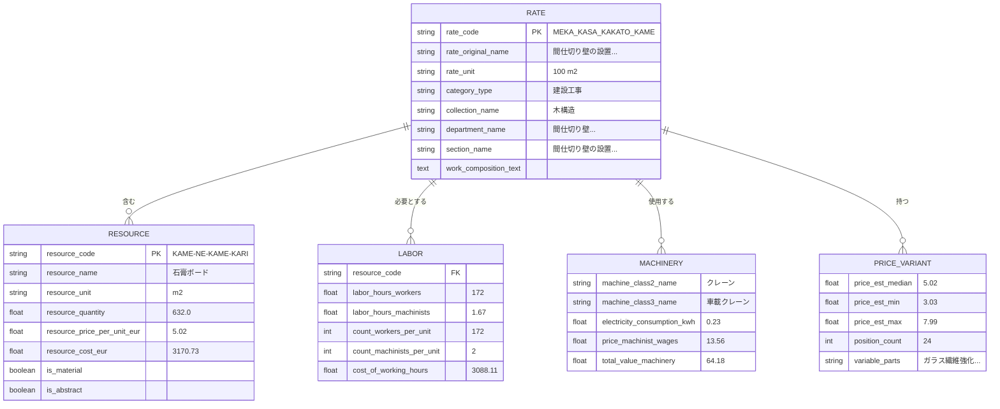

<h3 align="center">DDC CWICR - 建設作業項目、コンポーネント＆リソース </br>
  + 説明、写真、CAD (BIM) に基づく見積計算のための n8n パイプライン</h3>

<p align="center">
  <a href="README.md">🇬🇧 English</a> •
  <a href="README.zh-CN.md">🇨🇳 中文</a> •
  <a href="README.es.md">🇪🇸 Español</a> •
  <a href="README.pt-BR.md">🇧🇷 Português</a> •
  <a href="README.ru.md">🇷🇺 Русский</a> •
  <a href="README.ja.md"><b>🇯🇵 日本語</b></a> •
  <a href="README.de.md">🇩🇪 Deutsch</a> •
  <a href="README.fr.md">🇫🇷 Français</a>
</p>

<p align="center">
  
</p>

<div align="center">
  
  
  
  
</div>

<div align="center">
  
  
  
  
  
</div>

<p align="center">
  
</p>

<h3 align="center">n8n ワークフロー</h3>
<p align="center"><code>入力を選択 → コスト見積を取得</code></p>

<br>

<table width="100%">
<tr>

<td align="center" valign="top" width="33%">
<br>
<h3>テキスト</h3>
<p>短い説明から<br>素早くスコープから見積へ</p>
<p><b>入力:</b> Telegram / チャットメッセージ<br>
<b>出力:</b> マッチした作業項目 + 見積</p>
<br>
<a href="#1%EF%B8%8F%E2%83%A3-%E3%83%86%E3%82%AD%E3%82%B9%E3%83%88%E8%A6%8B%E7%A9%8D%E3%83%9C%E3%83%83%E3%83%88">ドキュメント</a>
<br><br>
<a href="./n8n_1_Telegram_Bot_Cost_Estimates_and_Rate_Finder_TEXT_DDC_CWICR.json">

</a>
<br><br>
</td>

<td align="center" valign="top" width="33%">
<br>
<h3>写真 / PDF</h3>
<p>現場写真、スキャンしたBOQ、<br>現場からのフォトPDF</p>
<p><b>入力:</b> 画像またはPDFページ<br>
<b>出力:</b> 抽出されたスコープ → 見積</p>
<br>
<a href="#2%EF%B8%8F%E2%83%A3-%E5%86%99%E7%9C%9F%E3%82%B3%E3%82%B9%E3%83%88%E8%A6%8B%E7%A9%8D%E3%83%84%E3%83%BC%E3%83%AB">写真ドキュメント</a> · <a href="#3%EF%B8%8F%E2%83%A3-%E3%83%A6%E3%83%8B%E3%83%90%E3%83%BC%E3%82%B5%E3%83%AB%E8%A6%8B%E7%A9%8D%E3%83%9C%E3%83%83%E3%83%88%E3%83%86%E3%82%AD%E3%82%B9%E3%83%88--%E5%86%99%E7%9C%9F--pdf">ユニバーサルボット</a>
<br><br>
<a href="./n8n_2_Photo_Cost_Estimate_DDC_CWICR.json">

</a>
&nbsp;
<a href="./n8n_3_Telegram_Bot_Cost_Estimates_and_Rate_Finder_TEXT_PHOTO_PDF_DDC_CWICR.json">

</a>
<br><br>
</td>

<td align="center" valign="top" width="33%">
<br>
<h3>CAD / BIM</h3>
<p>Revit / IFC / DWGベースの<br>数量積算＆見積</p>
<p><b>入力:</b> モデルエクスポート <br>
<b>出力:</b> 4D/5D 見積 + 内訳</p>
<br>
<a href="#4%EF%B8%8F%E2%83%A3-cad-bim-%E3%82%B3%E3%82%B9%E3%83%88%E8%A6%8B%E7%A9%8D%E3%83%91%E3%82%A4%E3%83%97%E3%83%A9%E3%82%A4%E3%83%B3">ドキュメント</a>
<br><br>
<a href="./n8n_4_CAD_(BIM)_Cost_Estimation_Pipeline_4D_5D_with_DDC_CWICR.json">

</a>
<br><br>
</td>

</tr>
</table>

<br>
<p align="center">
  <a href="https://openconstructionestimate.com">
    
  </a>
</p>
<br>
<p align="center">
 DataDrivenConstruction のクライアントとユーザー
  <br>
  <a href="https://datadrivenconstruction.io/">
  
  </a>
  <br></br>
</p>


---

## 目次

### AI統合
- [AIプロダクトに最適な燃料](#-aiプロダクトに最適な燃料) — このデータベースがAIに最適な理由
- [Claude Code](#-claude-code--aiコーディングアシスタント) — AIコーディングアシスタントの使用方法
- [n8n](#-n8n--ビジュアルワークフロー自動化) — ワークフロー自動化
- [Dify](#-dify--llmアプリケーションを構築) — LLMアプリ開発
- [Sim AI & その他](#-sim-ai--類似プラットフォーム) — 互換性のあるプラットフォーム
- [ユニバーサルユースケース](#-ユニバーサルユースケース) — 構築できるもの

### データベース＆データ
- [概要](#概要) — DDC CWICRとは
- [利用可能なフォーマット](#利用可能なフォーマット) — Excel、Parquet、CSV、Qdrant
- [データスキーマ](#データスキーマ) — 85フィールド構造
- [フィールドグループ](#フィールドグループ) — 分類、リソース、労務、機械
- [方法論](#方法論) — リソースベースの原価計算原則
- [歴史的背景](#歴史的背景) — 100年以上の標準規格

### n8n ワークフロー
- [n8n ワークフロー概要](#-n8n-ワークフロー) — 入力タイプを選択
- [今すぐ試す — ライブデモボット](#-今すぐ試す--ライブデモボット) — Telegramで即座にテスト
- [ワークフロー1: テキスト見積ボット](#1%EF%B8%8F%E2%83%A3-%E3%83%86%E3%82%AD%E3%82%B9%E3%83%88%E8%A6%8B%E7%A9%8D%E3%83%9C%E3%83%83%E3%83%88) — テキスト入力用Telegramボット
- [ワークフロー2: 写真コスト見積ツール](#2%EF%B8%8F%E2%83%A3-%E5%86%99%E7%9C%9F%E3%82%B3%E3%82%B9%E3%83%88%E8%A6%8B%E7%A9%8D%E3%83%84%E3%83%BC%E3%83%AB) — AIビジョン搭載Webフォーム
- [ワークフロー3: ユニバーサルボット](#3%EF%B8%8F%E2%83%A3-%E3%83%A6%E3%83%8B%E3%83%90%E3%83%BC%E3%82%B5%E3%83%AB%E8%A6%8B%E7%A9%8D%E3%83%9C%E3%83%83%E3%83%88%E3%83%86%E3%82%AD%E3%82%B9%E3%83%88--%E5%86%99%E7%9C%9F--pdf) — テキスト + 写真 + PDF
- [ワークフロー4: CAD/BIMパイプライン](#4%EF%B8%8F%E2%83%A3-cad-bim-%E3%82%B3%E3%82%B9%E3%83%88%E8%A6%8B%E7%A9%8D%E3%83%91%E3%82%A4%E3%83%97%E3%83%A9%E3%82%A4%E3%83%B3) — Revit/IFC/DWGから見積へ
- [ワークフロー クイックスタート](#ワークフロー-クイックスタート) — 4ステップでセットアップ
- [n8n 2.0+ セットアップ](#%EF%B8%8F-n8n-20-セットアップ必須) — Execute Commandノードを有効化

### CAD/BIM パイプライン詳細
- [前提条件](#-前提条件) — 必要なコンポーネント
- [パイプラインステージ](#-パイプラインステージ) — 10段階の処理
- [LLMモデル選択](#%EF%B8%8F-llmモデル選択) — OpenAI、Claude、Gemini、Grok
- [出力ファイル](#-出力ファイル) — HTML＆Excelレポート
- [トラブルシューティング](#%EF%B8%8F-トラブルシューティング) — 一般的な問題

### ベクトルデータベース
- [ベクトルデータベース](#ベクトルデータベース) — Qdrantによるセマンティック検索
- [リリース](#リリース) — スナップショットをダウンロード
- [コレクション](#コレクション) — 9言語のコレクション
- [Dockerデプロイメント](#dockerデプロイメント) — セルフホステッドセットアップ

### はじめに
- [クイックスタート - Python](#クイックスタート) — 表形式データ＆セマンティック検索
- [統合ユースケース](#統合) — 入門から上級レベルまで

### コミュニティ
- [リソース＆コミュニティ](#リソース--コミュニティ) — リンク＆チャンネル
- [コンサルティング＆トレーニング](#コンサルティング--トレーニング) — プロフェッショナルサービス
- [コントリビューション](#コントリビューション) — ワークフローを提出
- [ライセンス](#ライセンス) — CC BY 4.0 & MIT
- [プロジェクトを支援する](#プロジェクトを支援する) — スポンサー＆寄付


---

## AIプロダクトに最適な燃料

<p align="center">
  <b>リポジトリをクローンして、やりたいことを説明するだけ — AIが残りを処理します</b>
</p>

DDC CWICRは単なるデータベースではありません — **AIパワードアプリケーションのためのすぐに使える燃料**です。コスト見積ボットの構築、建設ワークフローの自動化、インテリジェントアシスタントの作成など、このデータは最新のAIツールでそのまま動作します。

### このデータベースがAIに最適な理由

| 特徴 | メリット |
|---------|---------|
| **事前計算済み埋め込み** | ベクトル生成不要 — セマンティック検索が即座に動作 |
| **構造化された85フィールドスキーマ** | AIがデータの関係性を理解し、正確な回答を提供可能 |
| **9言語対応** | 翻訳オーバーヘッドなしで多言語アプリケーションを構築 |
| **55,000以上の作業項目** | あらゆる建設見積タスクに対応する包括的なカバレッジ |
| **リソースベース方法論** | AIが説明・分解できる透明性のあるデータ |

### 完璧に動作するツール

<table>
<tr>
<td align="center" width="20%">
<br/>
<b>Claude Code</b><br/>
<sub>AIコーディングアシスタントCLI</sub>
</td>
<td align="center" width="20%">
<br/>
<b>Google Antigravity</b><br/>
<sub>Google Antigravity</sub>
</td>
<td align="center" width="20%">
<br/>
<b>n8n</b><br/>
<sub>ワークフロー自動化</sub>
</td>
<td align="center" width="20%">
<br/>
<b>Dify</b><br/>
<sub>LLMアプリ開発</sub>
</td>
<td align="center" width="20%">
<br/>
<b>Sim AI & その他</b><br/>
<sub>AIプラットフォーム</sub>
</td>
</tr>
</table>

---

## 🎯 DDC Skills — 196のすぐに使えるAI自動化

> **新機能！** [建設業向けAIエージェントのDDC Skills](https://github.com/datadrivenconstruction/DDC_Skills_for_AI_Agents_in_Construction) — 建設会社向けの完全な自動化ツールキット。

<p align="center">
  <a href="https://github.com/datadrivenconstruction/DDC_Skills_for_AI_Agents_in_Construction">
    
  </a>
</p>

### 仕組み

```
1. Skillsリポジトリをクローン
2. Claude Code、Cursor、またはGitHub Copilotで開く
3. 自動化したいことを説明 — AIがステップバイステップでガイド
```

### 時間節約

| プロセス | 前 | 後 | 削減率 |
|----------|-----|------|--------|
| 価格検索 | 15分 | 10秒 | 99% |
| 日報 | 手動 | 自動 | 92% |
| コスト見積もり | 数時間 | 数分 | 87% |
| 予算追跡 | スプレッドシート | リアルタイム | 87% |

### 含まれるコンテンツ

| フォルダ | Skills | 説明 |
|----------|--------|------|
| **DDC Toolkit** | 85 | CWICRデータベース統合を含む本番ツール |
| **DDC Book** | 50 | Data-Driven Construction方法論に基づくスキル |
| **DDC Insights** | 5 | n8nワークフローテンプレート |
| **DDC Curated** | 5 | 外部統合スキル |
| **DDC Innovative** | 22 | 高度なAI/ML機能 |

Skillsリポジトリは、**このCWICRデータベースとの直接統合**を提供 — セマンティック検索、自動コスト計算、日報、欠陥検出など。

**→ [DDC Skillsを始める](https://github.com/datadrivenconstruction/DDC_Skills_for_AI_Agents_in_Construction)**

---

### 💻 Claude Code & Google Antigravity — AIコーディングアシスタント

DDC CWICRを操作する最も速い方法です。Claude CodeまたはGoogle Antigravityでリポジトリを開き、自然言語で質問するだけです。

**はじめに:**
```bash
# リポジトリをクローン
git clone https://github.com/datadrivenconstruction/OpenConstructionEstimate-DDC-CWICR.git

# Claude Codeで開く
cd OpenConstructionEstimate-DDC-CWICR
claude
```

**プロンプト例:**

| タスク | プロンプト |
|------|--------|
| **データを探索** | 「この建設データベースの構造を見せて、どんなデータがあるか説明して」 |
| **作業項目を検索** | 「コンクリート基礎に関連するすべての作業項目を見つけて、コストを表示して」 |
| **クエリを作成** | 「労働時間が100時間を超える配管作業項目を検索するPythonスクリプトを書いて」 |
| **レポートを作成** | 「住宅リノベーション工事のコスト内訳レポートを生成して」 |
| **コストを分析** | 「異なる壁構造方法間で材料コストを比較して」 |
| **統合を構築** | 「Qdrantデータベースに接続してセマンティック検索を実行するスクリプトを作成して」 |

**プロのヒント:**
- Claudeに特定のファイルを指定: *「Parquetファイルを分析してコスト分布を要約して」*
- 説明を求める: *「このデータベースのリソースベース原価計算方法論がどのように機能するか説明して」*
- 変更をリクエスト: *「n8nワークフローにメール通知を追加するように変更して」*

---

### n8n — ビジュアルワークフロー自動化

コーディングなしで強力な自動化パイプラインを構築。DDC CWICRを400以上のアプリやサービスに接続。

**ユースケース:**

| ワークフロー | 説明 |
|----------|-------------|
| **Telegramボット** | ユーザーがテキスト/写真を送信 → AIが作業項目を抽出 → コスト見積を返信 |
| **メール自動化** | メールでBOQを受信 → AIで処理 → フォーマット済み見積を送信 |
| **CRM統合** | CRMで新規プロジェクト → 予備見積を自動生成 → 取引額を更新 |
| **BIMパイプライン** | Revitからエクスポート → 数量を抽出 → DDCレートとマッチング → 5Dレポートを生成 |
| **Slackボット** | チームが質問 → AIがデータベースを検索 → 関連する作業項目を返信 |

**クイックスタート:**
1. このリポジトリからワークフローJSONをダウンロード
2. n8nにインポート: `ワークフロー → インポート → ファイルから`
3. 認証情報を設定 (OpenAI、Qdrant、Telegram)
4. アクティブ化してテスト

詳細なセットアップについては[n8nワークフロー](#n8n-ワークフロー--詳細説明)セクションを参照してください。

---

### Dify — LLMアプリケーションを構築

DDC CWICRをナレッジベースとしてカスタムAIアプリケーションを作成。

**セットアップ:**
1. 新しいDifyアプリケーションを作成
2. ナレッジベースを追加 → Parquet/CSVファイルをアップロードするか、Qdrantに接続
3. 埋め込みでRAGパイプラインを設定
4. チャットインターフェースまたはAPIを構築

**アプリケーションアイデア:**

| アプリタイプ | 説明 |
|----------|-------------|
| **建設見積チャットボット** | コストクエリのための会話型インターフェース |
| **作業項目検索** | 55,000以上の項目にわたる自然言語検索 |
| **コストアドバイザー** | コスト内訳を説明し最適化を提案するAI |
| **多言語アシスタント** | 言語を自動検出しユーザーの言語で応答 |
| **APIエンドポイント** | 他システムとの統合用REST API |

**Difyプロンプトテンプレート例:**
```
あなたはDDC CWICRデータベースにアクセスできる建設コスト見積アシスタントです。

コンテキスト: {{context}}

ユーザーの質問: {{query}}

データベースに基づいて正確なコスト情報を提供してください。以下を含めてください:
- コード付きの関連作業項目
- 単価と数量
- リソース内訳（労務、材料、機器）
- 合計コスト計算
```

---

### Sim AI & 類似プラットフォーム

DDC CWICRは以下をサポートするあらゆるAIプラットフォームと統合可能:
- **ベクトルデータベース** (Qdrant、Pinecone、Weaviate、Milvus)
- **構造化データ** (CSV、Parquet、Excel)
- **OpenAI埋め込み** (text-embedding-3-large、3072次元)

**互換性のあるプラットフォーム:**
- **Sim AI** — AIシミュレーションとモデリング
- **LangChain / LlamaIndex** — LLMアプリケーションフレームワーク
- **Flowise** — ローコードLLMアプリビルダー
- **Botpress** — 会話型AIプラットフォーム
- **Voiceflow** — 音声とチャットの設計
- **Stack AI** — ノーコードAIワークフロー
- **Relevance AI** — AIワークフォースプラットフォーム

**ユニバーサル統合パターン:**

```python
# Qdrantをサポートするあらゆるプラットフォームで動作
from qdrant_client import QdrantClient

# DDC CWICRに接続
client = QdrantClient("your-qdrant-instance", port=6333)

# セマンティック検索
results = client.search(
    collection_name="ddc_cwicr_en",  # または de, ru, zh など
    query_vector=your_embedding,
    limit=10
)

# AIアプリケーションで結果を使用
for item in results:
    print(f"{item.payload['rate_code']}: {item.payload['rate_original_name']}")
```

---

### ユニバーサルユースケース

どのAIツールを選んでも、DDC CWICRは以下を可能にします:

| ユースケース | 説明 |
|----------|-------------|
| **即時コスト見積** | テキスト説明や写真から建設コストを取得 |
| **BOQ生成** | プロジェクト説明から数量明細書を自動生成 |
| **価格ベンチマーキング** | 地域と言語間でコストを比較 |
| **リソース計画** | 労働時間、材料、機器需要を計算 |
| **投資分析** | 完全なリソース透明性による詳細なコスト監査 |
| **多言語サポート** | 9言語でローカライズされた価格でユーザーにサービス提供 |
| **BIM統合** | Revit/IFCに接続して自動4D/5D見積 |
| **AIモデルトレーニング** | 構造化データを使用した建設AIのファインチューニング |

---

## 概要

**DDC CWICR**（建設作業項目、コンポーネント＆リソース）は、建設コスト見積のためのオープンデータベースであり、土工事やコンクリート打設から専門的な設備工事まで、建設活動の全範囲をカバーしています。

このデータベースは、ユーラシアおよびアジア太平洋地域全体の現代建設慣行を記述するソースに基づいています。ここでは、統一された技術標準化エコシステムが、10以上の動的に発展する経済圏の共通エンジニアリング言語として機能しています。DDC CWICRは、複数の言語で資本プロジェクト管理のための単一の規制フレームワークを確立することにより、オープン標準を調和させる取り組みを表しています。

<p align="center">
  <br>
  
  <br></br>
</p>

構造化データは、表形式フォーマット（XLSX、CSV、Parquet）を通じてアクセスするか、LLMを介して会話的にクエリできます。これにより、専門家は建設作業記述（QDRANTベクトルデータベース）を、平易な言語や簡潔なクエリを使用して自動化パイプラインやワークフローに統合できます。

### 利用可能なフォーマット

| フォーマット      | 拡張子   | サイズ         | 最適な用途                              | 特徴                             |
|-------------|-------------|--------------|---------------------------------------|--------------------------------------|
| **Excel**   | `.xlsx`     | ~150–400 MB  | 手動分析、フィルタリング、ピボット    | 人間が読みやすい、完全なフォーマット      |
| **Parquet** | `.parquet`  | ~55 MB       | ETLパイプライン、MLトレーニング、ビッグデータ  | カラム型、優れた圧縮率      |
| **CSV**     | `.csv`      | ~1.3 GB      | データベースインポート、レガシーシステム       | 普遍的な互換性              |
| **Qdrant**  | `.snapshot` | ~1 GB        | セマンティック検索、RAG、AIアシスタント   | 事前計算済みOpenAI埋め込み       |


ライブデモは[openconstructionestimate.com](https://openconstructionestimate.com/)で利用可能です。ここでデータを探索し、セマンティック検索のためのベクトルデータベースの動作を確認できます。

<p align="center">
  
</p>

---

## データスキーマ

データベースには、論理グループに整理された**85フィールド**が含まれています。各レコードは、完全なコスト内訳を持つ作業項目（レート）またはリソースを表します。



### フィールドグループ
85のデータベースフィールドは、リソースベースのコスト見積方法論を反映する論理グループに整理されています。各グループは、コスト内訳構造において特定の機能を果たします：階層的分類と作業項目識別から、詳細なリソース消費、労働要件、機械コスト、集計合計まで。このモジュラー構造により、ユーザーはタスクに関連するフィールドのみをクエリできます — 材料明細書の生成、労働生産性の分析、完全なコスト見積の作成など。

<p align="center">
  <br>
  
  <br></br>
</p>

**分類** - `category_type`, `collection_code`, `collection_name`, `department_code`, `department_name`, `department_type`, `section_name`, `section_type`, `subsection_code`, `subsection_name`

**作業項目（レート）** - `rate_code`, `rate_original_name`, `rate_final_name`, `rate_unit`, `row_type`, `is_scope`, `is_abstract`, `is_machine`, `is_labor`, `is_material`, `work_composition_text`

**リソース** - `resource_code`, `resource_name`, `resource_unit`, `resource_quantity`, `parameter_resource_quantity`, `resource_price_per_unit_eur_current`, `resource_cost_eur`

**労務** - `count_workers_per_unit`, `count_engineers_per_unit`, `count_machinists_per_unit`, `count_total_people_per_unit`, `labor_hours_construction_workers`, `labor_hours_machinists`, `labor_hours_engineers`, `total_labor_hours_workers_machinists`, `total_labor_hours_all_personnel`, `cost_of_working_hours`, `count_people_per_day`

**機械** - `machine_class2_name`, `machine_class3_name`, `personnel_machinist_code`, `personnel_machinist_grade`, `price_machinist_wages`, `price_relocation_included`, `price_cost_without_wages`, `electricity_consumption_kwh_per_machine_hour`, `electricity_cost_per_unit`, `electricity_cost_total_sum`, `cost_machinist_sum`, `total_value_machinery_equipment`

**価格バリアント** - `price_code_prefix`, `price_abstract_resource_common_start`, `price_abstract_resource_variable_parts`, `price_abstract_resource_position_count`, `price_abstract_resource_est_price_min`, `price_abstract_resource_est_price_max`, `price_abstract_resource_est_price_mean`, `price_abstract_resource_est_price_median`, `price_abstract_resource_unit`, `abstract_resource_tech_group`

**集計** - `total_cost_per_position`, `total_material_cost_per_position`, `total_resource_cost_per_position`, `total_value_abstract_resources`, `materials_resource_cost_eur`

**質量＆サービス** - `mass_name`, `mass_value`, `mass_unit`, `service_category`, `service_type`, `parameter_service_code`, `parameter_service_unit`, `parameter_service_name`, `parameter_service_quantity`, `service_cost_sum`

### コスト計算式

| コンポーネント         | 技術規格  | ×   | 地域価格  | =   | コスト                    |
|-------------------|------------------|-----|-----------------|-----|-------------------------|
| **労務**      | 172 時間/100m²    | ×   | €17.95/時       | =   | €3,088.11               |
| **材料**  | 632 m²/100m²     | ×   | €5.02/m²        | =   | €3,170.73               |
| **機器**  | 1.67 時間/100m²   | ×   | €38.42/時       | =   | €64.18                  |
|                   |                  |     | **合計**       | =   | **€7,725.91 / 100m²** |

---

## 方法論

**リソースベースの原価計算**の主な価値は、不変の生産技術を変動する財務コンポーネントから分離することです。これは建設の物理的な「第一原理」に基づいています:
- 特定の作業に必要な労働時間
- 作業単位あたりの材料数量
- 必要な機器時間

**なぜ重要か:**

- **透明性** - 隠れたマージンなしの価格設定、完全なリソース内訳
- **監査可能性** - 投資分析と検証のための詳細な調査能力
- **移植性** - 市場を超えて適用可能な地域非依存の規格
- **実績** - 100年以上にわたって確立された業界標準の方法論


### 歴史的背景

このデータベースの建設作業記述は、20世紀初頭の生産規格から今日のデジタル参照システムまでを網羅する、リソースベースの標準化方法論に基づいています。1920年代から継続的に開発・改良されてきたこのアプローチは、特にユーラシア地域全体で堅固な進化を遂げてきました。

100年にわたる開発の中で、システムは手計算から機械可読形式へと移行しましたが、その基本原則は変わりません：建設出力単位あたりに必要な物理リソースの正確な測定です。現代の実装は、歴史的な規範データとリアルタイムの市場価格を橋渡しします。

この方法論の地域的適応は、様々な国家名称の下で運用されています：ENIR、GESN、FER、NRR、ESN、AzDTN、ShNQK、MKS ChT、SNT、BNbD、Dinh Muc、Ding'e。

<p align="center">
  
</p>

<b>新しい更新やデータベースバージョンを見たい場合、そして私たちのツールが役立つと思った場合は、リポジトリにスターを付けてください。建設業界向けの類似アプリケーションをもっと見ることができます。</b>
GitHubでDDCワークフローにスターを付けると、新しいリリースの通知が即座に届きます。
<p align="center">
  <br>
  
  <br></br>
</p>


---


## 統合

### ユースケース

- **入門レベル** - コストベンチマーキング、価格指数化、入札見積

- **中級** - ローカライゼーション、ETL/BIパイプライン、CO2計算

- **上級** - AI/MLトレーニング、CAD (BIM) 5D、詳細投資監査

---

## n8n ワークフロー — 詳細説明

自動化された建設コスト見積のための4つの本番対応ワークフロー。各ワークフローは、Qdrant経由でDDC CWICRベクトルデータベースに接続し、インテリジェントな解析とマッチングにAIモデルを使用します。

| #   | ワークフロー                                                        | 入力       | 最適な用途                        | ダウンロード                                                                                            |
|-----|-----------------------------------------------------------------|-------------|---------------------------------|-----------------------------------------------------------------------------------------------------|
| 1   | [テキスト見積ボット](#1%EF%B8%8F%E2%83%A3-%E3%83%86%E3%82%AD%E3%82%B9%E3%83%88%E8%A6%8B%E7%A9%8D%E3%83%9C%E3%83%83%E3%83%88)                    | テキスト     | テキストからの素早い見積       | [JSON](./n8n_1_Telegram_Bot_Cost_Estimates_and_Rate_Finder_TEXT_DDC_CWICR.json)                      |
| 2   | [写真見積ツール](#2%EF%B8%8F%E2%83%A3-%E5%86%99%E7%9C%9F%E3%82%B3%E3%82%B9%E3%83%88%E8%A6%8B%E7%A9%8D%E3%83%84%E3%83%BC%E3%83%AB)                     | 写真    | 現場訪問、目視検査 | [JSON](./n8n_2_Photo_Cost_Estimate_DDC_CWICR.json)                                                  |
| 3   | [ユニバーサルボット](#3%EF%B8%8F%E2%83%A3-%E3%83%A6%E3%83%8B%E3%83%90%E3%83%BC%E3%82%B5%E3%83%AB%E8%A6%8B%E7%A9%8D%E3%83%9C%E3%83%83%E3%83%88%E3%83%86%E3%82%AD%E3%82%B9%E3%83%88--%E5%86%99%E7%9C%9F--pdf)   | すべて  | フル機能の本番使用    | [JSON](./n8n_3_Telegram_Bot_Cost_Estimates_and_Rate_Finder_TEXT_PHOTO_PDF_DDC_CWICR.json)            |
| 4   | [CAD/BIMパイプライン](#4%EF%B8%8F%E2%83%A3-cad-bim-%E3%82%B3%E3%82%B9%E3%83%88%E8%A6%8B%E7%A9%8D%E3%83%91%E3%82%A4%E3%83%97%E3%83%A9%E3%82%A4%E3%83%B3)        | Revit   | BIMベースの4D/5D見積      | [JSON](./n8n_4_CAD_(BIM)_Cost_Estimation_Pipeline_4D_5D_with_DDC_CWICR.json)                         |

---

### 1️⃣ テキスト見積ボット

**ファイル:** `n8n_1_Telegram_Bot_Cost_Estimates_and_Rate_Finder_TEXT_DDC_CWICR.json`

テキストベースのコスト見積用Telegramボット。自然言語で建設作業を記述すると、ボットが入力を解析し、ベクトルデータベースを検索し、詳細なコスト内訳を返します。

<p align="center">
  <br>
  
  <br></br>
</p>

<h3 align="left">今すぐ試す — ライブデモボット</h3>
<p align="left"><i>Telegramで見積ワークフローを即座にテスト</i></p>
<p><b>@TextOpenConstructionEstimate_bot</b></p>
<p>テキスト説明から完全なコスト見積を作成</p>
<a href="https://t.me/TextOpenConstructionEstimate_bot">

</a>


**動作の仕組み:**

| ステップ  | アクション                                 | テクノロジー                             |
|-------|----------------------------------------|----------------------------------------|
| 1     | ユーザーがテキスト説明を送信            | Telegram Bot API                       |
| 2     | AIが作業項目を解析・抽出      | OpenAI / Claude / Gemini               |
| 3     | 各項目の埋め込みを生成      | OpenAI `text-embedding-3-large`        |
| 4     | データベースでマッチするレートを検索      | Qdrantベクトル検索                   |
| 5     | AIが精度向上のため結果をリランク        | LLMスコアリング                            |
| 6     | コストを計算しレポートを生成    | HTML / Excel / PDF                     |

**機能:**

| 機能                    | 説明                                                          |
|----------------------------|----------------------------------------------------------------------|
| 自然言語入力  | リスト、文、構造化された説明など任意のテキスト形式を受け付け |
| マルチLLMサポート       | OpenAI、Claude、Geminiで動作（切り替え可能）                    |
| セマンティック検索         | 異なる表現でも最適なマッチを発見                       |
| 9言語対応             | DE、EN、RU、ES、FR、PT、ZH、AR、HI                                   |
| 複数エクスポート        | HTMLレポート、Excelスプレッドシート、PDFドキュメント                         |
| インタラクティブ編集     | 最終計算前に数量を変更                           |

**必要な認証情報:**
- Telegram Bot Token (@BotFatherから)
- OpenAI API Key (埋め込み + オプションのLLM用)
- Qdrant URL + API Key

---

### 2️⃣ 写真コスト見積ツール

**ファイル:** `n8n_2_Photo_Cost_Estimate_DDC_CWICR.json`

写真ベースの見積用Webフォームインターフェース。建設写真をアップロードすると、AI Visionが要素を識別し、寸法を推定し、コストを自動計算します。

<p align="center">
  <br>
  
  <br></br>
</p>


**動作の仕組み:**

| ステップ  | アクション                                        | テクノロジー                           |
|-------|-----------------------------------------------|--------------------------------------|
| 1     | ユーザーがWebフォーム経由で写真をアップロード               | n8n Form Trigger                     |
| 2     | AI Visionが画像を分析                  | GPT-4 Vision                         |
| 3     | 部屋タイプ、要素、材料を識別       | 構造化JSON抽出           |
| 4     | 参照オブジェクトから寸法を推定    | AI推論（ドア、タイルなど）    |
| 5     | 要素を作業項目に分解            | LLM処理                       |
| 6     | ベクトル検索で各作業に価格設定           | Qdrant + OpenAI埋め込み           |
| 7     | プロフェッショナルなHTMLレポートを生成             | スタイル付き出力                        |

**機能:**

| 機能                | 説明                                             |
|------------------------|---------------------------------------------------------|
| 写真分析      | GPT-4 Visionが建設要素を識別           |
| 自動寸法測定   | 参照オブジェクト（ドア、タイル）を使用してサイズを推定  |
| 部屋検出      | バスルーム、キッチン、寝室、外部など              |
| 作業タイプサポート   | 新築 / リノベーション / 修繕                  |
| 9つの地域データベース| ベルリン、トロント、パリなどにローカライズされた価格        |
| プロフェッショナルレポート| クライアント向けのクリーンなHTML出力                     |

**必要な認証情報:**
- OpenAI API Key (GPT-4 Vision + 埋め込み)
- Qdrant URL + API Key

---

### 3️⃣ ユニバーサル見積ボット（テキスト + 写真 + PDF）

**ファイル:** `n8n_3_Telegram_Bot_Cost_Estimates_and_Rate_Finder_TEXT_PHOTO_PDF_DDC_CWICR.json`

すべての入力タイプをサポートするフル機能のTelegramボット：テキスト説明、建設写真、PDF図面。本番使用のための最も包括的なワークフロー。


<p align="center">
  <br>
  
  <br></br>
</p>

<h3 align="left">今すぐ試す — ライブデモボット</h3>
<p align="left"><i>Telegramで見積ワークフローを即座にテスト</i></p>
<h3>ユニバーサルボット</h3>
<p><b>@OpenConstructionEstimate_bot</b></p>
<p>テキスト、写真、PDF対応のフル機能ボット</p>
<a href="https://t.me/OpenConstructionEstimate_bot">

</a>
<br><br>


**動作の仕組み:**

| ステップ  | アクション                                    | テクノロジー                     |
|-------|-------------------------------------------|--------------------------------|
| 1     | ユーザーがテキスト、写真、またはPDFを送信            | Telegram Bot API               |
| 2     | ルーターが入力タイプを検出                 | コンテンツタイプ分析          |
| 3a    | **テキスト:** AIが作業項目を解析            | OpenAI / Gemini                |
| 3b    | **写真:** Vision AIが要素を抽出    | GPT-4 Vision / Gemini 2.0      |
| 3c    | **PDF:** ページを抽出して分析        | PDF処理 + Vision        |
| 4     | DDC CWICRでセマンティック検索              | Qdrantベクトルデータベース         |
| 5     | 最適なマッチのためのAIリランキング             | LLMスコアリング                    |
| 6     | ボットメニューでインタラクティブ編集          | Telegramインラインキーボード      |
| 7     | 結果をエクスポート                            | HTML / Excel / PDF             |

**17のボットアクション:**

| アクション           | 説明                         |
|------------------|-------------------------------------|
| `/start`         | 言語選択メニュー             |
| 写真アップロード     | AI Vision分析をトリガー          |
| テキストメッセージ     | 作業項目を解析・抽出        |
| PDFアップロード       | 図面を処理                 |
| 数量編集  | 計算前に変更           |
| 作業追加         | 手動で作業項目を入力              |
| 計算        | フルコスト見積を実行            |
| 詳細表示     | 各項目のリソースを表示        |
| Excelエクスポート     | CSVスプレッドシートをダウンロード            |
| PDFエクスポート       | PDFレポートを生成                 |
| ヘルプ             | 使用方法を表示             |
| 修正           | 修正を加えて再分析         |

**機能:**

| 機能               | 説明                                        |
|-----------------------|----------------------------------------------------|
| デュアルVision AI     | Gemini 2.0 FlashまたはGPT-4 Vision（設定可能）    |
| PDF処理     | 図面、スキャンしたBOQ、ドキュメント                |
| スマートテキスト解析 | リスト、テーブル、自由形式テキストを処理              |
| AIリランキング       | マッチ精度を向上                            |
| 完全な編集       | 作業項目の追加、削除、変更                     |
| マルチフォーマットエクスポート| HTML、Excel、PDF                                   |
| 9言語対応        | 完全なローカライゼーション                              |

**必要な認証情報:**
- Telegram Bot Token
- OpenAI API Key (埋め込み)
- Gemini API Key (Vision) または OpenAI GPT-4 Vision
- Qdrant URL + API Key

---

### 4️⃣ CAD (BIM) コスト見積パイプライン

**ファイル:** `n8n_4_CAD_(BIM)_Cost_Estimation_Pipeline_4D_5D_with_DDC_CWICR.json`

Revit/IFC/DWGモデルからの自動コスト見積。BIMデータを抽出し、要素を分類し、作業項目に分解し、完全なリソース内訳付きの4D/5D見積を生成します。

<p align="left">
  <a href="https://datadrivenconstruction.io">
    
  </a>
</p>


**n8nは400以上のネイティブ統合を提供**しています。Google Sheets、Notion、Slack、Airtable、データベース（PostgreSQL、MongoDB）、クラウドストレージなど。このワークフローのすべてのノードはモジュラーです — 以下が可能です:

- **LLMプロバイダーの交換** (OpenAI ↔ Claude ↔ Gemini ↔ Grok)
- **ERPやプロジェクト管理システムに接続**
- **結果を任意の宛先にエクスポート** (クラウドストレージ、メール、ダッシュボード)
- **任意のステージを変更** して見積方法論に合わせる

ワークフローはあなたのものです。制限なし。ライセンス料なし。完全なコントロール。

---

## 前提条件

| コンポーネント                                          | 要件                            | 説明                                                           |
|----------------------------------------------------|----------------------------------------|-----------------------------------------------------------------------|
| **[n8n](https://n8n.io/)**                         | v1.0+ (v2.0+は[セットアップ](#%EF%B8%8F-n8n-20-セットアップ必須)が必要)                    | 見積パイプラインをオーケストレーションするワークフロー自動化プラットフォーム|
| **[Qdrant](https://qdrant.tech/)**                 | クラウドまたはセルフホストインスタンス          | 建設作業項目全体のセマンティック検索用ベクトルデータベース    |
| **[OpenAI API](https://platform.openai.com/)**     | 埋め込み用 (`text-embedding-3-large`)| BIM要素とコストデータベースマッチング用のベクトル埋め込みを生成|
| **LLM API**                                        | OpenAI / Claude / Gemini / xAI Grok    | 作業項目分類と見積生成用AIモデル        |
| **[DDC Converter](https://github.com/datadrivenconstruction/cad2data-Revit-IFC-DWG-DGN-pipeline-with-conversion-validation-qto)** | `RvtExporter.exe` | RevitモデルからBIMデータをExcel/JSONに抽出して処理 |

---

## ワークフロー クイックスタート

### ステップ 1: ワークフローをインポート

```
n8n → 新規ワークフロー → ファイルからインポート → JSONを選択
```

### ステップ 2: 認証情報を設定

**TOKEN**ノードでAPIキーを設定:

```json
{
  "bot_token": "YOUR_TELEGRAM_BOT_TOKEN",
  "OPENAI_API_KEY": "YOUR_OPENAI_KEY",
  "GEMINI_API_KEY": "YOUR_GEMINI_KEY",
  "QDRANT_URL": "http://localhost:6333",
  "QDRANT_API_KEY": ""
}
```

### ステップ 3: DDC CWICRをQdrantにロード

[リリース](#リリース)からスナップショットをダウンロードしてインポート:

```bash
curl -X POST "http://localhost:6333/collections/ddc_cwicr_en/snapshots/upload" \
  -H "Content-Type: multipart/form-data" \
  -F "snapshot=@EN_TORONTO_workitems_EMBEDDINGS_3072_DDC.snapshot"
```

### ステップ 4: アクティブ化＆テスト

- n8nでワークフローを有効化
- Telegramボットの場合: ボットに`/start`を送信
- Webフォームの場合: n8nが提供するフォームURLを開く

---

## n8n 2.0+ セットアップ（必須）

> **n8nバージョン2.0以降、セキュリティ上の理由からExecute Commandノードはデフォルトで無効になっています。**
>
> 以下の設定がないと、Execute Commandを使用するワークフロー（特にCAD/BIMパイプライン）は**動作しません** — ノードがクエスチョンマーク付きで表示されるか、認識されません。

### クイックフィックス

**Windows (CMD) — 毎回実行:**
```cmd
set NODES_EXCLUDE=[] && npx n8n
```

**恒久的な解決策 — 一度だけ作成:**

ファイル `C:\Users\YOUR_USER\.n8n\.env` を以下の内容で作成:
```
NODES_EXCLUDE=[]
```
その後は通常通り `npx n8n` を実行するだけ。

**Docker:**
```yaml
environment:
  - NODES_EXCLUDE=[]
```

### セットアップの確認

1. n8nを起動
2. **+** をクリック → **"Execute Command"** を検索
3. ノードが表示されれば → 完了です！

> 詳細: [n8n 2.0 破壊的変更](https://docs.n8n.io/2-0-breaking-changes/)

---

## サポートされている言語＆価格レベル

| コード  | 言語    | 価格レベル     | 通貨 | Qdrantコレクション   |
|-------|-------------|-----------------|----------|---------------------|
| `AR`  | アラビア語      | ドバイ           | AED      | `ddc_cwicr_ar`      |
| `DE`  | ドイツ語      | ベルリン          | EUR      | `ddc_cwicr_de`      |
| `EN`  | 英語     | トロント         | CAD      | `ddc_cwicr_en`      |
| `ES`  | スペイン語     | バルセロナ       | EUR      | `ddc_cwicr_es`      |
| `FR`  | フランス語      | パリ           | EUR      | `ddc_cwicr_fr`      |
| `HI`  | ヒンディー語       | ムンバイ          | INR      | `ddc_cwicr_hi`      |
| `PT`  | ポルトガル語  | サンパウロ       | BRL      | `ddc_cwicr_pt`      |
| `RU`  | ロシア語     | サンクトペテルブルク  | RUB      | `ddc_cwicr_ru`      |
| `ZH`  | 中国語     | 上海        | CNY      | `ddc_cwicr_zh`      |

---

## パイプラインステージ

CAD/BIMワークフローは10段階でデータを処理します:

| ステージ   | 名前                 | 説明                                                       |
|---------|----------------------|-------------------------------------------------------------------|
| **0**   | BIMデータ収集     | DDC ConverterでRevitから要素を抽出                     |
| **1**   | プロジェクト検出    | AIがプロジェクトタイプを識別（住宅、商業など）        |
| **2**   | フェーズ生成     | AIが建設フェーズを作成                                    |
| **3**   | 要素割り当て   | AIがBIMタイプをフェーズにマッピング                                       |
| **4**   | 作業分解   | AIがタイプを作業項目に分解（"レンガ壁" → 煉瓦積み、モルタル）  |
| **5**   | ベクトル検索        | Qdrant経由でDDC CWICRのマッチングレートを検索                       |
| **6**   | 単位マッピング         | BIM単位をレート単位に変換                                   |
| **7**   | コスト計算     | 各作業項目の数量 × 単価                               |
| **7.5** | 検証           | 完全性と重複のCTOレビュー                        |
| **8**   | 集計          | フェーズとカテゴリー別に合計                                      |
| **9**   | レポート生成    | HTMLとExcel出力を作成                                     |

---

## LLMモデル選択

ワークフローは複数のAIプロバイダーをサポートしています。**LLM Models**セクションで希望のモデルを有効化:

| モデル            | ノード名                    | ステータス       |
|------------------|------------------------------|--------------|
| OpenAI GPT-4o    | `OpenAI LLM`                 | デフォルト   |
| Claude Opus 4    | `Anthropic Chat Model2`      | 無効     |
| Gemini 2.5 Pro   | `Google Gemini Chat Model`   | 無効     |
| xAI Grok         | `xAI Grok Chat Model1`       | 無効     |
| DeepSeek         | `DeepSeek Chat Model`        | 無効     |

モデルを切り替えるには: 希望のモデルノードを**有効化**し、他を**無効化**。

---

## 出力ファイル

レポートはプロジェクトフォルダに保存されます:
```
project_YYYY-MM-DD.html   ← インタラクティブレポート（ブラウザで開く）
project_YYYY-MM-DD.xls    ← Excel互換スプレッドシート
```
<p align="center">
  <br>
  
  <br></br>
</p>

---

## Qdrantコレクション

ワークフローは`language_code`に基づいて正しいコレクションを自動選択:

```
{LANG}_{CITY}_workitems_costs_resources_EMBEDDINGS_3072_DDC_CWICR
```

例: `DE_BERLIN_workitems_costs_resources_EMBEDDINGS_3072_DDC_CWICR`

---

## トラブルシューティング

| 問題                        | 解決策                                                    |
|------------------------------|-------------------------------------------------------------|
| "Execute Commandがない" (n8n 2.0+) | `NODES_EXCLUDE=[]`環境変数を設定。[n8n 2.0+セットアップ](#%EF%B8%8F-n8n-20-セットアップ必須)を参照 |
| "Excelファイルが見つからない"        | `path_to_converter`と`project_file`のパスを確認          |
| "Qdrant接続失敗"   | 認証情報でQdrant URLとAPIキーを確認                |
| "レート制限超過"        | バッチサイズを減らすかAPI呼び出し間に遅延を追加           |
| "価格が見つからない"           | Qdrantに正しい言語コレクションが存在するか確認   |
| "Telegram Webhookエラー"     | ワークフローがアクティブでWebhook URLがアクセス可能か確認     |
| "Vision API失敗"          | GeminiまたはOpenAI Vision APIキーが有効か確認             |

---

## ベクトルデータベース

建設作業項目全体のセマンティック検索用OpenAI `text-embedding-3-large`埋め込みを持つ、すぐに使えるQdrantコレクション。

ベクトルデータベースにより、コードや複雑なフィルターの代わりに、シンプルな文や短いフレーズを使用して自然言語でデータと「会話」できます。これにより、非常に大きなデータセットでも適切な作業項目やコストラインを見つけることが劇的に高速化されます。

これらのQdrantコレクションは、最新の自動化および統合ワークフロー（例えば、ローコード/ノーコードワークフロー＆パイプラインツール）を介してアプリケーションに接続できます。建設作業項目を検索、フィルタリング、説明するアシスタントを構築したり、セマンティック検索を既存の見積およびプロジェクト管理ツールに直接統合したりできます。

---

### リリース

QDRANTおよびCSVデータセット（1ギガバイトを超えるファイル）は[GitHubリリース](https://github.com/datadrivenconstruction/OpenConstructionEstimate-DDC-CWICR/releases)からダウンロードできます。

| 言語        | 地域         | CSVファイル             | Qdrantスナップショット                            |
|-----------------|----------------|-----------------------|--------------------------------------------|
| アラビア語      | ドバイ          | `AR_DUBAI_*.csv`      | `AR_DUBAI_*_EMBEDDINGS_3072_DDC.snapshot`   |
| 中国語     | 上海       | `ZH_SHANGHAI_*.csv`   | `ZH_SHANGHAI_*_EMBEDDINGS_3072_DDC.snapshot`|
| ドイツ語      | ベルリン         | `DE_BERLIN_*.csv`     | `DE_BERLIN_*_EMBEDDINGS_3072_DDC.snapshot`  |
| 英語     | トロント        | `EN_TORONTO_*.csv`    | `EN_TORONTO_*_EMBEDDINGS_3072_DDC.snapshot` |
| スペイン語     | バルセロナ      | `ES_BARCELONA_*.csv`  | `ES_BARCELONA_*_EMBEDDINGS_3072_DDC.snapshot`|
| フランス語      | パリ          | `FR_PARIS_*.csv`      | `FR_PARIS_*_EMBEDDINGS_3072_DDC.snapshot`   |
| ヒンディー語       | ムンバイ         | `HI_MUMBAI_*.csv`     | `HI_MUMBAI_*_EMBEDDINGS_3072_DDC.snapshot`  |
| ポルトガル語  | サンパウロ | `PT_SAOPAULO_*.csv`   | `PT_SAOPAULO_*_EMBEDDINGS_3072_DDC.snapshot`|
| ロシア語     | サンクトペテルブルク | `RU_SPB_*.csv`        | `RU_SPB_*_EMBEDDINGS_3072_DDC.snapshot`     |

<a href="https://github.com/datadrivenconstruction/OpenConstructionEstimate-DDC-CWICR/releases/tag/v0.1.0">
  
</a>

### コレクション

`ddc_cwicr_ar` (アラビア語) · `ddc_cwicr_zh` (中国語) · `ddc_cwicr_de` (ドイツ語) · `ddc_cwicr_en` (英語) · `ddc_cwicr_es` (スペイン語) · `ddc_cwicr_fr` (フランス語) · `ddc_cwicr_hi` (ヒンディー語) · `ddc_cwicr_pt` (ポルトガル語) · `ddc_cwicr_ru` (ロシア語)

各コレクションには完全なペイロードメタデータを持つ**55,719ベクトル**が含まれています。

### Dockerデプロイメント

```yaml
# docker-compose.yml
services:
  qdrant:
    image: qdrant/qdrant:latest
    container_name: ddc-cwicr-qdrant
    ports:
      - "6333:6333"
      - "6334:6334"
    volumes:
      - qdrant_storage:/qdrant/storage
      - ./snapshots:/qdrant/snapshots
    environment:
      - QDRANT__LOG_LEVEL=INFO
    restart: unless-stopped

volumes:
  qdrant_storage:
```

```bash
# 起動
docker-compose up -d

# スナップショットをインポート
curl -X POST "http://localhost:6333/collections/ddc_cwicr_en/snapshots/upload" \
  -H "Content-Type: multipart/form-data" \
  -F "snapshot=@ddc_cwicr_en.snapshot"

# ダッシュボード: http://localhost:6333/dashboard
```
---

## クイックスタート

### Python - 表形式データ

```python
import pandas as pd

# Parquet（推奨）
df = pd.read_parquet("DDC_CWICR_EN.parquet")

# Excel
df = pd.read_excel("DDC_CWICR_EN.xlsx")

print(f"レコード: {len(df):,} | フィールド: {len(df.columns)}")
print(df[['rate_code', 'rate_original_name', 'rate_unit', 'total_cost_per_position']].head())
```

### Python - セマンティック検索

```python
from qdrant_client import QdrantClient
from openai import OpenAI

client = QdrantClient("localhost", port=6333)
openai = OpenAI()

# 自然言語で検索
query = "鉄筋コンクリート基礎の打設"
embedding = openai.embeddings.create(
    input=query,
    model="text-embedding-3-large"
).data[0].embedding

results = client.search(
    collection_name="ddc_cwicr_en",
    query_vector=embedding,
    limit=5
)

for r in results:
    print(f"[{r.score:.3f}] {r.payload['rate_code']}: {r.payload['rate_original_name']}")
```

### フィルター付き検索

```python
from qdrant_client.models import Filter, FieldCondition, MatchValue, Range

# 部門別
results = client.search(
    collection_name="ddc_cwicr_en",
    query_vector=embedding,
    query_filter=Filter(must=[
        FieldCondition(key="department_name", match=MatchValue(value="Concrete and Reinforced Concrete"))
    ]),
    limit=10
)

# 価格範囲別
results = client.search(
    collection_name="ddc_cwicr_en",
    query_vector=embedding,
    query_filter=Filter(must=[
        FieldCondition(key="price_est_median", range=Range(gte=1000, lte=50000))
    ]),
    limit=10
)
```


---

## リソース＆コミュニティ

[](https://datadrivenconstruction.io)
[](https://openconstructionestimate.com)
[](https://github.com/datadrivenconstruction)
[](https://youtube.com/@datadrivenconstruction)
[](https://linkedin.com/company/datadrivenconstruction)
[](https://t.me/datadrivenconstruction)

### コンサルティング＆トレーニング

私たちは、世界中の大手建設、エンジニアリング、コンサルティング会社、テクノロジー企業と協力し、オープンデータ原則の実装、CAD/BIM処理の自動化、堅牢なETLパイプラインの構築を支援しています。デジタルトランスフォーメーションと相互運用性のための実践的なソリューションを積極的にサポートし、データ品質と分類の課題に焦点を当て、オープンで自動化されたワークフローの採用を推進しています。

ご自身のデータでこのソリューションをテストしたい場合、または実際のプロジェクトタスクにワークフローを適応させることに興味がある場合は、お気軽にお問い合わせください。私たちのチームは、実践的なワークショップ、戦略的コンサルティング、実際のプロジェクトプロセスに合わせたプロトタイプ開発を提供しています。

<a href="mailto:info@datadrivenconstruction.io">
  
</a>

### コントリビューション

DDC CWICRは、建設業界をより効率的、透明、技術的に先進的にすることに専念した無料でオープンなプロジェクトです。私たちは、このミッションを共有する同志を積極的に探しています。有用なソリューションを作成し、コミュニティと共有する準備ができている場合、私たちはあなたの声を届けるお手伝いをします。

DDC CWICRに基づくオープンソースのワークフロー、パイプライン、統合を提出していただくことをお待ちしています。これらは誰でも自由に作業で使用できるツールです。優れたソリューションは、完全な著者帰属付きでGitHubに公開され、数万人のプロフェッショナル購読者にリーチするニュースレターやソーシャルメディアチャンネルで発表されます。これにより、あなたの名前が見積士、BIM専門家、プロジェクトマネージャーの国際コミュニティに直接届きます。

一緒に業界を変えましょう。ソリューションは、件名「DDC Open Workflow」でinfo@datadrivenconstruction.ioに送信するか、GitHubリポジトリに直接プルリクエストを送信できます。

すぐに使えるCAD-BIM n8nワークフローで建設データ処理を自動化:

<a href="https://github.com/datadrivenconstruction/cad2data-Revit-IFC-DWG-DGN-pipeline-with-conversion-validation-qto">
  
</a>

---

## AI インストラクション

`AI_INSTRUCTIONS/` フォルダには、AIコーディングアシスタントがこの建設コストデータベースを効果的に使用するための包括的なドキュメントが含まれています。

### DDC CWICR とは？

**DDC CWICR**（Construction Work Items, Components & Resources）は、以下を含むオープンソースの建設コストデータベースです：
- **55,719 の作業項目** — 完全なコスト内訳を含む詳細な建設作業
- **27,672 のリソース** — 地域価格付きの資材、労働力、設備
- **85 のデータフィールド** — 正確な計算のための構造化スキーマ
- **9 言語** — 地域別価格（EUR、USD、CAD、RUB、CNY など）
- **事前計算済みエンベディング** — セマンティック検索用の 3072 次元 OpenAI ベクトル

### リソースベースの方法論

データベースは以下を分離する**リソースベースの原価計算アプローチ**を使用します：
- **技術規範**（不変）— 労働時間、資材数量、設備時間
- **地域価格**（可変）— 時間単価、資材コスト、燃料価格

```
実際のコスト = 技術規範 × 地域価格
```

これにより、異なる地域や期間での正確な見積もりが可能になります。

### AI インストラクションファイル

| ファイル | 目的 |
|----------|------|
| `INSTRUCTIONS.md` | 主要概要、クイックスタート、データ形式 |
| `CLAUDE.md` | Claude Code のパターンと例 |
| `OPENCODE.md` | Opencode の簡潔な説明 |
| `ANTIGRAVITY.md` | GCP統合（BigQuery、Vertex AI、Qdrant）|
| `DATABASE_SCHEMA.md` | 85フィールドの完全なスキーマ参照 |

### n8n ワークフロー — 例とテンプレート

含まれている n8n ワークフローは、コスト見積もりロジックを示す**例とテンプレート**です。以下のように使用できます：
- ✅ 迅速な展開のためにそのまま使用
- ✅ 特定のビジネス要件に部分的に適応
- ✅ コスト計算方法論を理解するために学習
- ✅ 任意のプラットフォームでカスタム統合を構築する際の参考

ワークフローは以下を示します：データベースクエリ、作業項目のマッチング、地域価格ロジック、レポート生成。AI はこれらを分析して完全な見積もりプロセスを理解できます。

### なぜ重要か

AIアシスタントは以下をサポートします：
- 自然言語でデータベースを照会
- セマンティック検索で作業項目を検索
- 地域価格でコストを計算
- レポートを生成しデータをエクスポート
- クラウドサービスとの統合を構築
- ワークフロー例からコスト計算方法論を理解

### AIクイックスタート

1. AI対応IDEでプロジェクトを開く
2. 質問する：*「コンクリート作業項目とそのコストを表示して」*
3. AIが指示を使用して正しくデータを照会します

**書籍**: 方法論の詳細は [Data-Driven Construction Book](https://datadrivenconstruction.io/book) をご覧ください

---

## ライセンス

**データベース** (DDC CWICR) - [CC BY 4.0](https://creativecommons.org/licenses/by/4.0/)。商用目的で自由に使用、共有、改変可能。帰属表示: "DDC CWICR by DataDrivenConstruction"

**コード** (ワークフロー、スクリプト) - [MIT](https://opensource.org/licenses/MIT)。制限なく自由に使用、変更、配布可能。

## プロジェクトを支援する

これが役立つと思われる場合は、サポートをご検討ください:

[](https://github.com/sponsors/datadrivenconstruction)
[](https://buymeacoffee.com/boikoartem)


<p align="left">
  <br/>
  <b>建設におけるデータの力を解き放つ</b>
  <br/>
  <sub>統一された構造化データとプロセスのみが残る完全なデータ管理サイクルへ移行</sub>
</p>

<p align="left">
  <a href="https://datadrivenconstruction.io">
    
  </a>
</p>

---

## 商標

Autodesk®、Revit®、AutoCAD®、およびDWG™は、Autodesk, Inc.の登録商標または商標です。OpenAI™はOpenAI, Inc.の商標です。QdrantはQdrant Solutions GmbHの商標です。その他のすべてのブランド名、製品名、または商標は、それぞれの所有者に帰属します。

このプロジェクトは、Autodesk、OpenAI、Qdrant、または上記のその他の商標所有者とは一切提携、承認、または後援されていません。

<p align="left">
  <sub>© 2025 Artem Boiko · <a href="https://datadrivenconstruction.io">datadrivenconstruction.io</a></sub>
</p>
