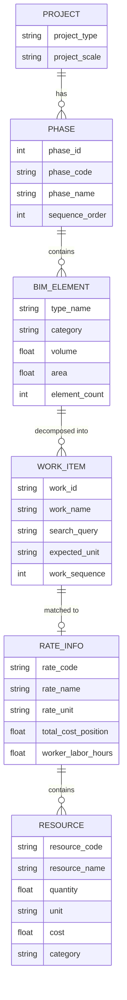

<p align="center">
  
</p>
<h3 align="center">DDC CWICR - Construction Work Items, Components & Resources</h3>

<p align="center">
  <a href="#about">About</a> •
  <a href="#data-schema">Schema</a> •
  <a href="#methodology">Methodology</a> •
  <a href="#releases">Releases</a> •
  <a href="#vector-database">Qdrant</a> •
  <a href="#quick-start">Quick Start</a> •
  <a href="#integration">Integration</a>
</p>

<div align="center">
  
  
  
  
</div>

<div align="center">
  
  
  
  
  
</div>

<p align="center">
  <a href="https://openconstructionestimate.com">
    
  </a>
</p>

## About

**DDC CWICR** (Construction Work Items, Components & Resources) is an open database for construction cost estimation, covering the full spectrum of construction work - from earthworks and concrete to specialized MEP operations. The modern construction industry in Eurasia and the Asia-Pacific region relies on a unified ecosystem of technical standardization that serves as a common engineering language for more than 10 dynamically developing economies.

The DDC CWICR database (Construction Work Items, Components & Resources) is an attempt to harmonize standards, creating a seamless regulatory space for capital project management across multiple languages. The database covers the full spectrum of construction work: from earthworks and concrete to specialized installation operations.

<p align="center">
  
</p>

⭐ <b>If you want to see new updates and database versions and if you find our tools useful please give our repositories a star to see more similar applications for the construction industry.</b>
Star DDC workflow on GitHub and be instantly notified of new releases.
<p align="center">
  <br>
  
  <br></br>
</p>


### Historical Context

The methodology of resource-based standardization of construction work has been continuously developing and improving since the 1920s - from the first production norms to modern digital reference books. Over a century, the system has evolved from manual calculations to machine-readable databases while preserving the fundamental principle: accurate recording of physical resources per unit of construction output.

The modern version integrates historical data with current market prices. In local markets, similar systems are adapted and known under national codes: ENIR, GESN, FER, NRR, ESN, AzDTN, ShNQK, MKS ChT, SNT, BNbD, Dinh Muc, Ding'e.

<p align="center">
  
</p>


## Data Schema

The database contains **85 fields** organized into logical groups. Each record represents either a work item (rate) or a resource with full cost breakdown.

```mermaid
erDiagram
    RATE ||--o{ RESOURCE : contains
    RATE ||--o{ LABOR : requires
    RATE ||--o{ MACHINERY : uses
    RATE ||--o{ PRICE_VARIANT : has

    RATE {
        string rate_code PK "MEKA_KASA_KAKATO_KAME"
        string rate_original_name "Einbau von Trennwänden..."
        string rate_unit "100 m2"
        string category_type "BAUARBEITEN"
        string collection_name "Holzkonstruktionen"
        string department_name "TRENNWÄNDE..."
        string section_name "Einbau von Trennwänden..."
        text work_composition_text
    }

    RESOURCE {
        string resource_code PK "KAME-NE-KAME-KARI"
        string resource_name "Gipskartonplatten"
        string resource_unit "m2"
        float resource_quantity "632.0"
        float resource_price_per_unit_eur "5.02"
        float resource_cost_eur "3170.73"
        boolean is_material
        boolean is_abstract
    }

    LABOR {
        string resource_code FK
        float labor_hours_workers "172"
        float labor_hours_machinists "1.67"
        int count_workers_per_unit "172"
        int count_machinists_per_unit "2"
        float cost_of_working_hours "3088.11"
    }

    MACHINERY {
        string machine_class2_name "Krane"
        string machine_class3_name "Krane auf Fahrgestellen"
        float electricity_consumption_kwh "0.23"
        float price_machinist_wages "13.56"
        float total_value_machinery "64.18"
    }

    PRICE_VARIANT {
        float price_est_median "5.02"
        float price_est_min "3.03"
        float price_est_max "7.99"
        int position_count "24"
        string variable_parts "glasfaserverstärkt..."
    }
```



### Field Groups

**Classification** - `category_type`, `collection_code`, `collection_name`, `department_code`, `department_name`, `department_type`, `section_name`, `section_type`, `subsection_code`, `subsection_name`

**Work Item (Rate)** - `rate_code`, `rate_original_name`, `rate_final_name`, `rate_unit`, `row_type`, `is_scope`, `is_abstract`, `is_machine`, `is_labor`, `is_material`, `work_composition_text`

**Resources** - `resource_code`, `resource_name`, `resource_unit`, `resource_quantity`, `parameter_resource_quantity`, `resource_price_per_unit_eur_current`, `resource_cost_eur`

**Labor** - `count_workers_per_unit`, `count_engineers_per_unit`, `count_machinists_per_unit`, `count_total_people_per_unit`, `labor_hours_construction_workers`, `labor_hours_machinists`, `labor_hours_engineers`, `total_labor_hours_workers_machinists`, `total_labor_hours_all_personnel`, `cost_of_working_hours`, `count_people_per_day`

**Machinery** - `machine_class2_name`, `machine_class3_name`, `personnel_machinist_code`, `personnel_machinist_grade`, `price_machinist_wages`, `price_relocation_included`, `price_cost_without_wages`, `electricity_consumption_kwh_per_machine_hour`, `electricity_cost_per_unit`, `electricity_cost_total_sum`, `cost_machinist_sum`, `total_value_machinery_equipment`

**Price Variants** - `price_code_prefix`, `price_abstract_resource_common_start`, `price_abstract_resource_variable_parts`, `price_abstract_resource_position_count`, `price_abstract_resource_est_price_min`, `price_abstract_resource_est_price_max`, `price_abstract_resource_est_price_mean`, `price_abstract_resource_est_price_median`, `price_abstract_resource_unit`, `abstract_resource_tech_group`

**Aggregates** - `total_cost_per_position`, `total_material_cost_per_position`, `total_resource_cost_per_position`, `total_value_abstract_resources`, `materials_resource_cost_eur`

**Mass & Services** - `mass_name`, `mass_value`, `mass_unit`, `service_category`, `service_type`, `parameter_service_code`, `parameter_service_unit`, `parameter_service_name`, `parameter_service_quantity`, `service_cost_sum`

```mermaid
flowchart TB
    subgraph Source["📦 Data Source"]
        CWICR[(DDC CWICR<br/>────────────<br/>55,719 Work Items<br/>27,672 Resources<br/>85 Fields per Record)]
    end

    subgraph Processing["⚙️ Processing Pipeline"]
        direction LR
        ETL[["🔄 ETL<br/>Extraction &<br/>Transformation"]]
        TRANS[["🌐 Translation<br/>9 Languages"]]
        EMBED[["🧠 Vectorization<br/>OpenAI 3072d"]]
        ETL --> TRANS --> EMBED
    end

    subgraph Outputs["📤 Output Formats"]
        XLSX[("📊 Excel<br/>.xlsx")]
        PARQUET[("⚡ Parquet<br/>.parquet")]
        CSV[("📄 CSV<br/>.csv")]
        QDRANT[("🔍 Qdrant<br/>.snapshot")]
    end

    subgraph Apps["🎯 Applications"]
        SEARCH["🔎 Semantic<br/>Search"]
        BIM["🏗️ BIM 5D<br/>Integration"]
        RAG["🤖 RAG<br/>Systems"]
        BI["📈 BI<br/>Analytics"]
    end

    Source --> Processing
    Processing --> XLSX & PARQUET & CSV & QDRANT
    XLSX & PARQUET & CSV --> BI & BIM
    QDRANT --> SEARCH & RAG & BIM

    style Source fill:#dbeafe,stroke:#2563eb,stroke-width:2px
    style Processing fill:#fef3c7,stroke:#d97706,stroke-width:2px
    style Outputs fill:#d1fae5,stroke:#059669,stroke-width:2px
    style Apps fill:#fce7f3,stroke:#db2777,stroke-width:2px
```



## Methodology

The key value of **Resource-Based Costing** is the separation of unchanging production technology from the volatile financial component. It is based on the physical "first principles" of construction:


**Why it matters:**

- **Transparency** - Pricing without hidden markups, full resource breakdown
- **Auditability** - Deep-dive capability for investment analysis and verification
- **Portability** - Region-independent norms applicable across markets
- **Proven** - Industry standard methodology established over 100+ years

## Available Formats

| Format | Extension | Size | Best For | Features |
|--------|-----------|------|----------|----------|
| **Excel** | `.xlsx` | ~150–400 MB | Manual analysis, filtering, pivot tables | Human-readable, full formatting |
| **Parquet** | `.parquet` | ~55 MB | ETL pipelines, ML training, Big Data | Columnar, excellent compression |
| **CSV** | `.csv` | ~1.3 GB | Database import, legacy systems | Universal compatibility |
| **Qdrant** | `.snapshot` | ~1 GB | Semantic search, RAG, AI assistants | Pre-computed OpenAI embeddings (3072d) |

## Releases

Download QDRANT and CSV datasets (files larger than 1 gigabyte) from [GitHub Releases](https://github.com/datadrivenconstruction/OpenConstructionEstimate-DDC-CWICR/releases).

### v0.1.0 - First Public Release

| Language | Region | CSV Files | Qdrant Snapshot |
|----------|--------|-----------|-----------------|
| 🇸🇦 Arabic | Dubai | `AR_DUBAI_*.csv` | `AR_DUBAI_*_EMBEDDINGS_3072_DDC.snapshot` |
| 🇨🇳 Chinese | Shanghai | `ZH_SHANGHAI_*.csv` | `ZH_SHANGHAI_*_EMBEDDINGS_3072_DDC.snapshot` |
| 🇩🇪 German | Berlin | `DE_BERLIN_*.csv` | `DE_BERLIN_*_EMBEDDINGS_3072_DDC.snapshot` |
| 🇬🇧 English | Toronto | `EN_TORONTO_*.csv` | `EN_TORONTO_*_EMBEDDINGS_3072_DDC.snapshot` |
| 🇪🇸 Spanish | Barcelona | `ES_BARCELONA_*.csv` | `ES_BARCELONA_*_EMBEDDINGS_3072_DDC.snapshot` |
| 🇫🇷 French | Paris | `FR_PARIS_*.csv` | `FR_PARIS_*_EMBEDDINGS_3072_DDC.snapshot` |
| 🇮🇳 Hindi | Mumbai | `HI_MUMBAI_*.csv` | `HI_MUMBAI_*_EMBEDDINGS_3072_DDC.snapshot` |
| 🇧🇷 Portuguese | São Paulo | `PT_SAOPAULO_*.csv` | `PT_SAOPAULO_*_EMBEDDINGS_3072_DDC.snapshot` |
| 🇷🇺 Russian | St. Petersburg | `RU_SPB_*.csv` | `RU_SPB_*_EMBEDDINGS_3072_DDC.snapshot` |

<a href="https://github.com/datadrivenconstruction/OpenConstructionEstimate-DDC-CWICR/releases/tag/v0.1.0">
  
</a>

## Vector Database

Ready-to-use Qdrant collections with OpenAI `text-embedding-3-large` embeddings for semantic search across construction work items.

### Collections

🇸🇦 `ddc_cwicr_ar` (Arabic) · 🇨🇳 `ddc_cwicr_zh` (Chinese) · 🇩🇪 `ddc_cwicr_de` (German) · 🇬🇧 `ddc_cwicr_en` (English) · 🇪🇸 `ddc_cwicr_es` (Spanish) · 🇫🇷 `ddc_cwicr_fr` (French) · 🇮🇳 `ddc_cwicr_hi` (Hindi) · 🇧🇷 `ddc_cwicr_pt` (Portuguese) · 🇷🇺 `ddc_cwicr_ru` (Russian)

Each collection contains **55,719 vectors** with full payload metadata.

### Docker Deployment

```yaml
# docker-compose.yml
services:
  qdrant:
    image: qdrant/qdrant:latest
    container_name: ddc-cwicr-qdrant
    ports:
      - "6333:6333"
      - "6334:6334"
    volumes:
      - qdrant_storage:/qdrant/storage
      - ./snapshots:/qdrant/snapshots
    environment:
      - QDRANT__LOG_LEVEL=INFO
    restart: unless-stopped

volumes:
  qdrant_storage:
```

```bash
# Start
docker-compose up -d

# Import snapshot
curl -X POST "http://localhost:6333/collections/ddc_cwicr_en/snapshots/upload" \
  -H "Content-Type: multipart/form-data" \
  -F "snapshot=@ddc_cwicr_en.snapshot"

# Dashboard: http://localhost:6333/dashboard
```

## Quick Start

### Python - Tabular Data

```python
import pandas as pd

# Parquet (recommended)
df = pd.read_parquet("DDC_CWICR_EN.parquet")

# Excel
df = pd.read_excel("DDC_CWICR_EN.xlsx")

print(f"Records: {len(df):,} | Fields: {len(df.columns)}")
print(df[['rate_code', 'rate_original_name', 'rate_unit', 'total_cost_per_position']].head())
```

### Python - Semantic Search

```python
from qdrant_client import QdrantClient
from openai import OpenAI

client = QdrantClient("localhost", port=6333)
openai = OpenAI()

# Search by natural language
query = "reinforced concrete foundation pouring"
embedding = openai.embeddings.create(
    input=query, 
    model="text-embedding-3-large"
).data[0].embedding

results = client.search(
    collection_name="ddc_cwicr_en",
    query_vector=embedding, 
    limit=5
)

for r in results:
    print(f"[{r.score:.3f}] {r.payload['rate_code']}: {r.payload['rate_original_name']}")
```

### Filtered Search

```python
from qdrant_client.models import Filter, FieldCondition, MatchValue, Range

# By department
results = client.search(
    collection_name="ddc_cwicr_en",
    query_vector=embedding,
    query_filter=Filter(must=[
        FieldCondition(key="department_name", match=MatchValue(value="Concrete and Reinforced Concrete"))
    ]),
    limit=10
)

# By price range
results = client.search(
    collection_name="ddc_cwicr_en",
    query_vector=embedding,
    query_filter=Filter(must=[
        FieldCondition(key="price_est_median", range=Range(gte=1000, lte=50000))
    ]),
    limit=10
)
```

## Integration

```mermaid
flowchart LR
    subgraph BIM["🏗️ BIM/CAD"]
        REVIT[Revit] & IFC[IFC] & DWG[DWG]
    end

    subgraph Pipeline["📊 cad2data"]
        QTO[Quantity Takeoff] --> MATCH[DDC CWICR Match]
    end

    subgraph Output["📋 Results"]
        EST[Cost Estimate] & CO2[CO₂] & REPORT[Reports]
    end

    BIM --> Pipeline --> Output

    style BIM fill:#e0e7ff,stroke:#4f46e5
    style Pipeline fill:#fef3c7,stroke:#d97706
    style Output fill:#d1fae5,stroke:#059669
```



### Use Cases

**Entry Level** - Cost Benchmarking, Price Indexation, Tender Estimation

**Intermediate** - Localization, ETL/BI Pipelines, CO₂ Calculation

**Advanced** - AI/ML Training, CAD (BIM) 5D, Deep-Dive Investment Audit

### n8n Workflows

CAD-BIM-to-Cost Estimation Pipeline
Automated cost estimation from Revit/BIM models using AI-driven work decomposition and vector search against DDC CWICR pricing database.
## Pipeline Flow

```mermaid
flowchart TB
    subgraph INPUT["📥 INPUT"]
        RVT[".RVT File"]
    end

    subgraph CONVERT["⚙️ CONVERSION"]
        CONV["RvtExporter.exe"]
        XLSX[".XLSX Elements"]
    end

    subgraph PREP["🔧 PHASE 1: DATA PREPARATION"]
        HEADERS["Extract Headers"]
        AI_HEADERS["🤖 AI: Analyze Headers"]
        GROUP["Group by Type Name"]
        AI_CLASSIFY["🤖 AI: Classify Categories"]
        FILTER["Filter Building Elements"]
    end

    subgraph ANALYSIS["🏗️ PHASE 2: PROJECT ANALYSIS"]
        STAGE1["🤖 STAGE 1<br/>Detect Project Type"]
        STAGE2["🤖 STAGE 2<br/>Generate Construction Phases"]
        STAGE3["🤖 STAGE 3<br/>Assign Types to Phases"]
    end

    subgraph DECOMP["🔨 PHASE 3: WORK DECOMPOSITION"]
        LOOP1["Loop: Each Type"]
        STAGE4["🤖 STAGE 4<br/>Decompose Type to Works"]
    end

    subgraph PRICING["💰 PHASE 4: PRICING"]
        LOOP2["Loop: Each Work Item"]
        STAGE51["STAGE 5.1<br/>OpenAI Embeddings"]
        QDRANT["🔍 Qdrant Vector Search<br/>DDC CWICR Database"]
        STAGE52["STAGE 5.2<br/>Parse Results & Costs"]
    end

    subgraph VALIDATE["✅ PHASE 5: VALIDATION"]
        STAGE75["🤖 STAGE 7.5<br/>Validate Type Works"]
    end

    subgraph OUTPUT["📤 OUTPUT"]
        HTML["HTML Report"]
        XLS["XLS Report"]
    end

    RVT --> CONV --> XLSX
    XLSX --> HEADERS --> AI_HEADERS --> GROUP
    GROUP --> AI_CLASSIFY --> FILTER
    FILTER --> STAGE1 --> STAGE2 --> STAGE3
    STAGE3 --> LOOP1 --> STAGE4
    STAGE4 --> LOOP2 --> STAGE51 --> QDRANT --> STAGE52
    STAGE52 --> STAGE75
    STAGE75 --> HTML
    STAGE75 --> XLS
```



---

## AI Nodes Relationship



---

## AI Processing Stages

```mermaid
flowchart LR
    subgraph STAGE1["STAGE 1"]
        S1_IN["Grouped Elements"]
        S1_AI["🤖 Detect Project Type"]
        S1_OUT["project_type<br/>project_scale"]
        S1_IN --> S1_AI --> S1_OUT
    end
    
    subgraph STAGE2["STAGE 2"]
        S2_IN["Project Type"]
        S2_AI["🤖 Generate Phases"]
        S2_OUT["construction_phases[]"]
        S2_IN --> S2_AI --> S2_OUT
    end
    
    subgraph STAGE3["STAGE 3"]
        S3_IN["Phases + Types"]
        S3_AI["🤖 Assign to Phases"]
        S3_OUT["types_with_phases[]"]
        S3_IN --> S3_AI --> S3_OUT
    end
    
    subgraph STAGE4["STAGE 4"]
        S4_IN["Single Type"]
        S4_AI["🤖 Decompose to Works"]
        S4_OUT["work_items[]"]
        S4_IN --> S4_AI --> S4_OUT
    end
    
    subgraph STAGE5["STAGE 5"]
        S5_IN["Work search_query"]
        S5_EMB["OpenAI Embeddings"]
        S5_VEC["Qdrant Search"]
        S5_OUT["rateInfo + resources"]
        S5_IN --> S5_EMB --> S5_VEC --> S5_OUT
    end
    
    subgraph STAGE75["STAGE 7.5"]
        S75_IN["All Works"]
        S75_AI["🤖 CTO Validation"]
        S75_OUT["Validated Estimate"]
        S75_IN --> S75_AI --> S75_OUT
    end
    
    STAGE1 --> STAGE2 --> STAGE3 --> STAGE4 --> STAGE5 --> STAGE75
```



    
<p align="left">
  <a href="https://datadrivenconstruction.io">
    
  </a>
</p>

We are gradually expanding a library of ready-to-use n8n workflows for automated construction cost estimation:

1. **Phase 1 – Image-based cost calculation**  
   Upload drawings, details or site photos, and the workflow will automatically extract structured data and match it with work items and resources from the DDC database.

2. **Phase 2 – Text-to-estimate (project description → cost breakdown)**  
   Provide a short natural-language description of the project, and the workflow will generate a structured cost estimate with work items, quantities and resource groups.

3. **Phase 3 – Anything related to data-driven construction workflows**  
   From file conversion and validation to syncing estimates with other systems, notifications, dashboards and custom integrations – any repetitive task in your cost and project data pipeline can become an n8n workflow.

If you want to see more workflows, follow our official channels, star this repository, and feel free to share your ideas or your own n8n solutions with the community.


Automate construction data processing with ready-made CAD-BIM n8n workflows:

<a href="https://github.com/datadrivenconstruction/cad2data-Revit-IFC-DWG-DGN-pipeline-with-conversion-validation-qto">
  
</a>

## Resources & Community

[](https://datadrivenconstruction.io)
[](https://openconstructionestimate.com)
[](https://github.com/datadrivenconstruction)
[](https://youtube.com/@datadrivenconstruction)
[](https://linkedin.com/company/datadrivenconstruction)
[](https://t.me/datadrivenconstruction)

### Consulting & Training

We work with leading construction, engineering, consulting agencies, and technology firms around the world to help them implement open data principles, automate CAD/BIM processing, and build robust ETL pipelines. We actively support organizations seeking practical solutions for digital transformation and interoperability, focusing on data quality and classification challenges while driving the adoption of open and automated workflows.

If you would like to test this solution with your own data or are interested in adapting the workflow to real project tasks, feel free to contact us. Our team delivers hands-on workshops, provides strategic consulting, and develops prototypes tailored to real project processes.

<a href="mailto:info@datadrivenconstruction.io">
  
</a>

### Contributing

DDC CWICR is a free and open project dedicated to making the construction industry more efficient, transparent, and technologically advanced. We are actively looking for like-minded enthusiasts who share this mission. If you create useful solutions and are ready to share them with the community, we are here to help you be heard.

We invite you to submit your open source workflows, pipelines, and integrations based on DDC CWICR-tools that anyone can freely use in their work. The top solutions will be published with full author attribution on GitHub and announced through our newsletter and social media channels, reaching tens of thousands of professional subscribers. This places your name directly in front of an international community of estimators, BIM specialists, and project managers.

Together we are changing the industry. You can send your solution to info@datadrivenconstruction.io with the subject "DDC Open Workflow" or submit a Pull Request directly to our GitHub repositories.


## License

**Database** (DDC CWICR) - [CC BY 4.0](https://creativecommons.org/licenses/by/4.0/). Free to use, share, and adapt commercially. Attribution: "DDC CWICR by DataDrivenConstruction"

**Code** (workflows, scripts) - [MIT](https://opensource.org/licenses/MIT). Free to use, modify, and distribute without restrictions.

<p align="left">
  <br/>
  <b>Unlock the Power of Data in Construction</b><br/>
  <sub>Move to full-cycle data management where only unified structured data & processes remain</sub>
</p>

<p align="left">
  <a href="https://datadrivenconstruction.io">
    
  </a>
</p>

<p align="left">
  <sub>© 2025 Artem Boiko · <a href="https://datadrivenconstruction.io">datadrivenconstruction.io</a></sub>
</p>
