```mermaid
flowchart LR
    subgraph Input["💬 INPUT"]
        A[Telegram Message]
    end
    
    subgraph AI["🤖 AI PROCESSING"]
        B[Parse Text]
        C[Extract Work Items]
    end
    
    subgraph Search["🔍 VECTOR SEARCH"]
        D[Generate Embeddings]
        E[Qdrant Search]
        F[AI Rerank]
    end
    
    subgraph Output["📊 OUTPUT"]
        G[Calculate Costs]
        H[HTML Report]
        I[Excel Export]
    end
    
    A --> B --> C --> D --> E --> F --> G --> H
    G --> I
    
    style Input fill:#e0f2fe,stroke:#0284c7
    style AI fill:#fef3c7,stroke:#d97706
    style Search fill:#dcfce7,stroke:#16a34a
    style Output fill:#f3e8ff,stroke:#9333ea
```

```mermaid
flowchart TB
    subgraph Upload["📷 PHOTO UPLOAD"]
        A[Web Form]
        B[Select Region]
        C[Choose Work Type]
    end
    
    subgraph Vision["👁️ AI VISION"]
        D[GPT-4 Vision Analysis]
        E[Identify Elements]
        F[Estimate Dimensions]
        G[Detect Room Type]
    end
    
    subgraph Decompose["🔧 DECOMPOSITION"]
        H[Elements → Work Items]
        I[Calculate Quantities]
    end
    
    subgraph Price["💰 PRICING"]
        J[Vector Search]
        K[Match DDC Rates]
        L[Apply Regional Prices]
    end
    
    subgraph Report["📄 REPORT"]
        M[Generate HTML]
        N[Cost Breakdown]
    end
    
    A --> B --> C --> D
    D --> E --> F --> G
    G --> H --> I
    I --> J --> K --> L
    L --> M --> N
    
    style Upload fill:#dbeafe,stroke:#2563eb
    style Vision fill:#fef3c7,stroke:#d97706
    style Decompose fill:#dcfce7,stroke:#16a34a
    style Price fill:#fee2e2,stroke:#dc2626
    style Report fill:#f3e8ff,stroke:#9333ea
```

```mermaid
flowchart TB
    subgraph Input["📥 MULTI-INPUT"]
        A[💬 Text Message]
        B[📷 Photo]
        C[📄 PDF Document]
    end
    
    subgraph Router["🔀 SMART ROUTER"]
        D{Detect Type}
    end
    
    subgraph TextPath["💬 TEXT PATH"]
        E[AI Parse Text]
        F[Extract Works]
    end
    
    subgraph PhotoPath["📷 PHOTO PATH"]
        G[Vision AI]
        H[Identify Elements]
        I[Decompose]
    end
    
    subgraph PDFPath["📄 PDF PATH"]
        J[Extract Pages]
        K[Vision Analysis]
        L[Parse Content]
    end
    
    subgraph Common["🔍 COMMON PIPELINE"]
        M[Generate Embeddings]
        N[Qdrant Search]
        O[AI Rerank]
        P[Calculate Costs]
    end
    
    subgraph Export["📤 EXPORT"]
        Q[HTML Report]
        R[Excel CSV]
        S[PDF Document]
    end
    
    A --> D
    B --> D
    C --> D
    D -->|Text| E --> F --> M
    D -->|Photo| G --> H --> I --> M
    D -->|PDF| J --> K --> L --> M
    M --> N --> O --> P
    P --> Q
    P --> R
    P --> S
    
    style Input fill:#e0f2fe,stroke:#0284c7
    style Router fill:#fef3c7,stroke:#d97706
    style TextPath fill:#dcfce7,stroke:#16a34a
    style PhotoPath fill:#fce7f3,stroke:#db2777
    style PDFPath fill:#f3e8ff,stroke:#9333ea
    style Common fill:#fee2e2,stroke:#dc2626
    style Export fill:#d1fae5,stroke:#059669
```

<h3 align="center">DDC CWICR - Construction Work Items, Components & Resources </br>
  + Pipelines n8n for calculating estimates based on descriptions, photos, and CAD (BIM)</h3>

<p align="center">
  <a href="README.md"><b>🇬🇧 English</b></a> •
  <a href="README.zh-CN.md">🇨🇳 中文</a> •
  <a href="README.es.md">🇪🇸 Español</a> •
  <a href="README.pt-BR.md">🇧🇷 Português</a> •
  <a href="README.ru.md">🇷🇺 Русский</a> •
  <a href="README.ja.md">🇯🇵 日本語</a> •
  <a href="README.de.md">🇩🇪 Deutsch</a> •
  <a href="README.fr.md">🇫🇷 Français</a>
</p>

<p align="center">
  
</p>

<div align="center">
  
  
  
  
</div>

<div align="center">
  
  
  
  
  
</div>

<p align="center">
  
</p>

<h3 align="center">⚡ n8n Workflows</h3>
<p align="center"><code>Choose your input → Get cost estimate</code></p>

<br>

<table width="100%">
<tr>

<td align="center" valign="top" width="33%">
<br>
<h3>📝 Text</h3>
<p>Quick scope-to-estimate<br>from a short description</p>
<p><b>Input:</b> Telegram / chat message<br>
<b>Output:</b> Matched work items + estimate</p>
<br>
<a href="#1️⃣-text-estimator-bot">📖 Documentation</a>
<br><br>
<a href="./n8n_1_Telegram_Bot_Cost_Estimates_and_Rate_Finder_TEXT_DDC_CWICR.json">

</a>
<br><br>
</td>

<td align="center" valign="top" width="33%">
<br>
<h3>📷 Photo / PDF</h3>
<p>Site photos, scanned BOQ,<br>photo-PDF from the field</p>
<p><b>Input:</b> Image or PDF pages<br>
<b>Output:</b> Extracted scope → estimate</p>
<br>
<a href="#2️⃣-photo-cost-estimator">📖 Photo Docs</a> · <a href="#3️⃣-universal-estimator-bot-text--photo--pdf">📖 Universal Bot</a>
<br><br>
<a href="./n8n_2_Photo_Cost_Estimate_DDC_CWICR.json">

</a>
&nbsp;
<a href="./n8n_3_Telegram_Bot_Cost_Estimates_and_Rate_Finder_TEXT_PHOTO_PDF_DDC_CWICR.json">

</a>
<br><br>
</td>

<td align="center" valign="top" width="33%">
<br>
<h3>🧊 CAD / BIM</h3>
<p>Revit / IFC / DWG-based<br>quantification & estimating</p>
<p><b>Input:</b> Model export <br>
<b>Output:</b> 4D/5D estimate + breakdown</p>
<br>
<a href="#4️⃣-cad-bim-cost-estimation-pipeline">📖 Documentation</a>
<br><br>
<a href="./n8n_4_CAD_(BIM)_Cost_Estimation_Pipeline_4D_5D_with_DDC_CWICR.json">

</a>
<br><br>
</td>

</tr>
</table>

<br>
<p align="center">
  <a href="https://openconstructionestimate.com">
    
  </a>
</p>
<br>
<p align="center">
 DataDrivenConstruction clients and users
  <br>
  <a href="https://datadrivenconstruction.io/">
  
  </a>   
  <br></br>
</p>


---

## 📑 Table of Contents

### 🤖 AI Integration
- [Perfect Fuel for AI](#-perfect-fuel-for-your-ai-products) — Why this database is ideal for AI
- [Claude Code & Google Antigravity](#-claude-code--google-antigravity--ai-coding-assistants) — AI coding assistants
- [n8n](#-n8n--visual-workflow-automation) — Workflow automation
- [Dify](#-dify--build-llm-applications) — LLM app development
- [Sim AI & Others](#-sim-ai--similar-platforms) — Compatible platforms
- [Universal Use Cases](#-universal-use-cases) — What you can build

### 📊 Database & Data
- [About](#about) — What is DDC CWICR
- [Available Formats](#available-formats) — Excel, Parquet, CSV, Qdrant
- [Data Schema](#data-schema) — 85 fields structure
- [Field Groups](#field-groups) — Classification, Resources, Labor, Machinery
- [Methodology](#methodology) — Resource-based costing principles
- [Historical Context](#historical-context) — 100+ years of standards

### ⚡ n8n Workflows
- [n8n Workflows Overview](#-n8n-workflows) — Choose your input type
- [Try It Now — Live Demo Bots](#-try-it-now--live-demo-bots) — Test instantly in Telegram
- [Workflow 1: Text Estimator Bot](#1️⃣-text-estimator-bot) — Telegram bot for text input
- [Workflow 2: Photo Cost Estimator](#2️⃣-photo-cost-estimator) — Web form with AI Vision
- [Workflow 3: Universal Bot](#3️⃣-universal-estimator-bot-text--photo--pdf) — Text + Photo + PDF
- [Workflow 4: CAD/BIM Pipeline](#4️⃣-cad-bim-cost-estimation-pipeline) — Revit/IFC/DWG to estimate
- [Workflows Quick Start](#workflows-quick-start) — Setup in 4 steps
- [n8n 2.0+ Setup](#️-n8n-20-setup-required) — Enable Execute Command node

### 🏗️ CAD/BIM Pipeline
- [Prerequisites](#-prerequisites) — Required components
- [Pipeline Stages](#-pipeline-stages) — 10-stage processing
- [LLM Model Selection](#️-llm-model-selection) — OpenAI, Claude, Gemini, Grok
- [Output Files](#-output-files) — HTML & Excel reports
- [Troubleshooting](#️-troubleshooting) — Common issues

### 🔍 Vector Database
- [Vector Database](#vector-database) — Semantic search with Qdrant
- [Releases](#releases) — Download snapshots
- [Collections](#collections) — 9 language collections
- [Docker Deployment](#docker-deployment) — Self-hosted setup

### 🚀 Getting Started
- [Quick Start - Python](#quick-start) — Tabular data & semantic search
- [Integration Use Cases](#integration) — Entry to Advanced level

### 👥 Community
- [Resources & Community](#resources--community) — Links & channels
- [Consulting & Training](#consulting--training) — Professional services
- [Contributing](#contributing) — Submit your workflows
- [License](#license) — CC BY 4.0 & MIT
- [Support the Project](#support-the-project) — Sponsor & donate
- [🤖 AI Instructions](#ai-instructions) — Documentation for AI assistants


---

## 🚀 Perfect Fuel for Your AI Products

<p align="center">
  <b>Just clone the repo and describe what you want — AI does the rest</b>
</p>

DDC CWICR is not just a database — it's **ready-to-use fuel for AI-powered applications**. Whether you're building cost estimation bots, automating construction workflows, or creating intelligent assistants — this data works out of the box with modern AI tools.

### Why This Database is Ideal for AI

| Feature | Benefit |
|---------|---------|
| **Pre-computed embeddings** | No need to generate vectors — semantic search works instantly |
| **Structured 85-field schema** | AI can reason about data relationships and provide accurate answers |
| **9 languages included** | Build multilingual applications without translation overhead |
| **55,000+ work items** | Comprehensive coverage for any construction estimation task |
| **Resource-based methodology** | Transparent data that AI can explain and break down |

### 🛠️ Works Perfectly With

<table>
<tr>
<td align="center" width="20%">
<br/>
<b>Claude Code</b><br/>
<sub>AI coding assistant CLI</sub>
</td>
<td align="center" width="20%">
<br/>
<b>Google Antigravity</b><br/>
<sub>Google Antigravity</sub>
</td>
<td align="center" width="20%">
<br/>
<b>n8n</b><br/>
<sub>Workflow automation</sub>
</td>
<td align="center" width="20%">
<br/>
<b>Dify</b><br/>
<sub>LLM app development</sub>
</td>
<td align="center" width="20%">
<br/>
<b>Sim AI & Others</b><br/>
<sub>AI platforms</sub>
</td>
</tr>
</table>


---

### 💻 Claude Code & Google Antigravity — AI Coding Assistants

The fastest way to work with DDC CWICR. Just open the repository in Claude Code or Google Antigravity and ask questions in natural language.

**Getting Started:**
```bash
# Clone the repository
git clone https://github.com/datadrivenconstruction/OpenConstructionEstimate-DDC-CWICR.git

# Open with Claude Code
cd OpenConstructionEstimate-DDC-CWICR
claude
```

**Example Prompts:**

| Task | Prompt |
|------|--------|
| **Explore data** | "Show me the structure of this construction database and explain what data is available" |
| **Find work items** | "Find all work items related to concrete foundations and show their costs" |
| **Build queries** | "Write a Python script to search for plumbing work items with labor hours > 100" |
| **Create reports** | "Generate a cost breakdown report for residential renovation works" |
| **Analyze costs** | "Compare material costs between different wall construction methods" |
| **Build integrations** | "Create a script that connects to the Qdrant database and performs semantic search" |

**Pro Tips:**
- Point Claude to specific files: *"Analyze the Parquet file and summarize the cost distribution"*
- Ask for explanations: *"Explain how the resource-based costing methodology works in this database"*
- Request modifications: *"Modify the n8n workflow to add email notifications"*

---

### ⚡ n8n — Visual Workflow Automation

Build powerful automation pipelines without coding. Connect DDC CWICR to 400+ apps and services.

**Use Cases:**

| Workflow | Description |
|----------|-------------|
| **Telegram Bot** | Users send text/photo → AI extracts work items → Returns cost estimate |
| **Email Automation** | Receive BOQ via email → Process with AI → Send formatted estimate |
| **CRM Integration** | New project in CRM → Auto-generate preliminary estimate → Update deal value |
| **BIM Pipeline** | Export from Revit → Extract quantities → Match with DDC rates → Generate 5D report |
| **Slack Bot** | Team asks questions → AI searches database → Returns relevant work items |

**Quick Start:**
1. Download workflow JSON from this repo
2. Import into n8n: `Workflows → Import → From File`
3. Configure credentials (OpenAI, Qdrant, Telegram)
4. Activate and test

See [n8n Workflows](#n8n-workflows--detailed-description) section for detailed setup.

---

### 🤖 Dify — Build LLM Applications

Create custom AI applications with DDC CWICR as the knowledge base.

**Setup:**
1. Create new Dify application
2. Add Knowledge Base → Upload Parquet/CSV files or connect to Qdrant
3. Configure RAG pipeline with embeddings
4. Build your chat interface or API

**Application Ideas:**

| App Type | Description |
|----------|-------------|
| **Construction Estimator Chatbot** | Conversational interface for cost queries |
| **Work Item Search** | Natural language search across 55,000+ items |
| **Cost Advisor** | AI that explains cost breakdowns and suggests optimizations |
| **Multilingual Assistant** | Auto-detect language and respond in user's language |
| **API Endpoint** | REST API for integration with other systems |

**Example Dify Prompt Template:**
```
You are a construction cost estimation assistant with access to DDC CWICR database.

Context: {{context}}

User question: {{query}}

Provide accurate cost information based on the database. Include:
- Relevant work items with codes
- Unit costs and quantities
- Resource breakdown (labor, materials, equipment)
- Total cost calculation
```

---

### 🔮 Sim AI & Similar Platforms

DDC CWICR integrates with any AI platform that supports:
- **Vector databases** (Qdrant, Pinecone, Weaviate, Milvus)
- **Structured data** (CSV, Parquet, Excel)
- **OpenAI embeddings** (text-embedding-3-large, 3072 dimensions)

**Compatible Platforms:**
- **Sim AI** — AI simulation and modeling
- **LangChain / LlamaIndex** — LLM application frameworks
- **Flowise** — Low-code LLM app builder
- **Botpress** — Conversational AI platform
- **Voiceflow** — Voice and chat design
- **Stack AI** — No-code AI workflows
- **Relevance AI** — AI workforce platform

**Universal Integration Pattern:**

```python
# Works with any platform that supports Qdrant
from qdrant_client import QdrantClient

# Connect to DDC CWICR
client = QdrantClient("your-qdrant-instance", port=6333)

# Semantic search
results = client.search(
    collection_name="ddc_cwicr_en",  # or de, ru, zh, etc.
    query_vector=your_embedding,
    limit=10
)

# Use results in your AI application
for item in results:
    print(f"{item.payload['rate_code']}: {item.payload['rate_original_name']}")
```

---

### 📋 Universal Use Cases

No matter which AI tool you choose, DDC CWICR enables:

| Use Case | Description |
|----------|-------------|
| **Instant Cost Estimation** | Get construction costs from text descriptions or photos |
| **BOQ Generation** | Auto-generate bill of quantities from project descriptions |
| **Price Benchmarking** | Compare costs across regions and languages |
| **Resource Planning** | Calculate labor hours, materials, and equipment needs |
| **Investment Analysis** | Deep-dive cost audits with full resource transparency |
| **Multilingual Support** | Serve users in 9 languages with localized pricing |
| **BIM Integration** | Connect to Revit/IFC for automated 4D/5D estimation |
| **Training AI Models** | Use structured data for fine-tuning construction AI |

---

⭐ <b>If you want to see new updates and database versions and if you find our tools useful please give our repositories a star to see more similar applications for the construction industry.</b>
Star DDC workflow on GitHub and be instantly notified of new releases.
<p align="center">
  <br>
  
  <br></br>
</p>

---


## About

**DDC CWICR** (Construction Work Items, Components & Resources) is an open database for construction cost estimation, covering the full spectrum of construction activities - from earthworks and concrete placement to specialized installation work.

The database draws on sources describing modern construction practices across Eurasia and the Asia-Pacific region, where a unified technical standardization ecosystem serves as a common engineering language for more than ten dynamically developing economies. DDC CWICR represents an effort to harmonize open standards by establishing a single regulatory framework for capital project management in multiple languages.

<p align="center">
  <br>
  
  <br></br>
</p>

The structured data can be accessed through tabular formats (XLSX, CSV, Parquet) or queried conversationally via LLM, enabling specialists to integrate construction work descriptions (QDRANT vector database) into automated pipelines and workflows using plain language or concise queries.

### Available Formats

| Format      | Extension   | Size         | Best For                              | Features                             |
|-------------|-------------|--------------|---------------------------------------|--------------------------------------|
| **Excel**   | `.xlsx`     | ~150–400 MB  | Manual analysis, filtering, pivots    | Human-readable, full formatting      |
| **Parquet** | `.parquet`  | ~55 MB       | ETL pipelines, ML training, Big Data  | Columnar, excellent compression      |
| **CSV**     | `.csv`      | ~1.3 GB      | Database import, legacy systems       | Universal compatibility              |
| **Qdrant**  | `.snapshot` | ~1 GB        | Semantic search, RAG, AI assistants   | Pre-computed OpenAI embeddings       |


A live demo is available at [openconstructionestimate.com](https://openconstructionestimate.com/), where you can explore the data and see the vector database in action for semantic search.

<p align="center">
  
</p>

---

## Data Schema

The database contains **85 fields** organized into logical groups. Each record represents either a work item (rate) or a resource with full cost breakdown.


### Field Groups
The 85 database fields are organized into logical groups that reflect the resource-based cost estimation methodology. Each group serves a specific function in the cost breakdown structure: from hierarchical classification and work item identification to detailed resource consumption, labor requirements, machinery costs, and aggregated totals. This modular structure allows users to query only the relevant fields for their task - whether generating a bill of materials, analyzing labor productivity, or building a complete cost estimate.

<p align="center">
  <br>
  
  <br></br>
</p>

**Classification** - `category_type`, `collection_code`, `collection_name`, `department_code`, `department_name`, `department_type`, `section_name`, `section_type`, `subsection_code`, `subsection_name`

**Work Item (Rate)** - `rate_code`, `rate_original_name`, `rate_final_name`, `rate_unit`, `row_type`, `is_scope`, `is_abstract`, `is_machine`, `is_labor`, `is_material`, `work_composition_text`

**Resources** - `resource_code`, `resource_name`, `resource_unit`, `resource_quantity`, `parameter_resource_quantity`, `resource_price_per_unit_eur_current`, `resource_cost_eur`

**Labor** - `count_workers_per_unit`, `count_engineers_per_unit`, `count_machinists_per_unit`, `count_total_people_per_unit`, `labor_hours_construction_workers`, `labor_hours_machinists`, `labor_hours_engineers`, `total_labor_hours_workers_machinists`, `total_labor_hours_all_personnel`, `cost_of_working_hours`, `count_people_per_day`

**Machinery** - `machine_class2_name`, `machine_class3_name`, `personnel_machinist_code`, `personnel_machinist_grade`, `price_machinist_wages`, `price_relocation_included`, `price_cost_without_wages`, `electricity_consumption_kwh_per_machine_hour`, `electricity_cost_per_unit`, `electricity_cost_total_sum`, `cost_machinist_sum`, `total_value_machinery_equipment`

**Price Variants** - `price_code_prefix`, `price_abstract_resource_common_start`, `price_abstract_resource_variable_parts`, `price_abstract_resource_position_count`, `price_abstract_resource_est_price_min`, `price_abstract_resource_est_price_max`, `price_abstract_resource_est_price_mean`, `price_abstract_resource_est_price_median`, `price_abstract_resource_unit`, `abstract_resource_tech_group`

**Aggregates** - `total_cost_per_position`, `total_material_cost_per_position`, `total_resource_cost_per_position`, `total_value_abstract_resources`, `materials_resource_cost_eur`

**Mass & Services** - `mass_name`, `mass_value`, `mass_unit`, `service_category`, `service_type`, `parameter_service_code`, `parameter_service_unit`, `parameter_service_name`, `parameter_service_quantity`, `service_cost_sum`

```mermaid
flowchart TB
    subgraph Source["📦 Data Source"]
        CWICR[(DDC CWICR<br/>────────────<br/>55,719 Work Items<br/>27,672 Resources<br/>85 Fields per Record)]
    end

    subgraph Processing["⚙️ Processing Pipeline"]
        direction LR
        ETL[["🔄 ETL<br/>Extraction &<br/>Transformation"]]
        TRANS[["🌐 Translation<br/>9 Languages"]]
        EMBED[["🧠 Vectorization<br/>OpenAI 3072d"]]
        ETL --> TRANS --> EMBED
    end

    subgraph Outputs["📤 Output Formats"]
        XLSX[("📊 Excel<br/>.xlsx")]
        PARQUET[("⚡ Parquet<br/>.parquet")]
        CSV[("📄 CSV<br/>.csv")]
        QDRANT[("🔍 Qdrant<br/>.snapshot")]
    end

    subgraph Apps["🎯 Applications"]
        SEARCH["🔎 Semantic<br/>Search"]
        BIM["🏗️ BIM 5D<br/>Integration"]
        RAG["🤖 RAG<br/>Systems"]
        BI["📈 BI<br/>Analytics"]
    end

    Source --> Processing
    Processing --> XLSX & PARQUET & CSV & QDRANT
    XLSX & PARQUET & CSV --> BI & BIM
    QDRANT --> SEARCH & RAG & BIM

    style Source fill:#dbeafe,stroke:#2563eb,stroke-width:2px
    style Processing fill:#fef3c7,stroke:#d97706,stroke-width:2px
    style Outputs fill:#d1fae5,stroke:#059669,stroke-width:2px
    style Apps fill:#fce7f3,stroke:#db2777,stroke-width:2px
```

### Cost Calculation Formula

| Component         | Technology Norm  | ×   | Regional Price  | =   | Cost                    |
|-------------------|------------------|-----|-----------------|-----|-------------------------|
| 👷 **Labor**      | 172 hrs/100m²    | ×   | €17.95/hr       | =   | €3,088.11               |
| 🧱 **Materials**  | 632 m²/100m²     | ×   | €5.02/m²        | =   | €3,170.73               |
| 🚜 **Equipment**  | 1.67 hrs/100m²   | ×   | €38.42/hr       | =   | €64.18                  |
|                   |                  |     | **Total**       | =   | **€7,725.91 per 100m²** |

---

## Methodology

The key value of **Resource-Based Costing** is the separation of unchanging production technology from the volatile financial component. It is based on the physical "first principles" of construction:
- Labor hours required for specific work
- Material quantities per unit of work  
- Equipment time needed
  
**Why it matters:**

- **Transparency** - Pricing without hidden markups, full resource breakdown
- **Auditability** - Deep-dive capability for investment analysis and verification
- **Portability** - Region-independent norms applicable across markets
- **Proven** - Industry standard methodology established over 100+ years




### Historical Context

The construction work descriptions in this database are grounded in a resource-based standardization methodology with roots stretching from early 20th-century production norms to today's digital reference systems. Developed and refined continuously since the 1920s, this approach has seen especially robust evolution across the Eurasian region.

Throughout a hundred years of development, the system has transitioned from manual computations to machine-readable formats - yet its foundational principle remains intact: the precise measurement of physical resources required per unit of construction output. Modern implementations bridge historical normative data with real-time market pricing.

Regional adaptations of this methodology operate under various national designations: ENIR, GESN, FER, NRR, ESN, AzDTN, ShNQK, MKS ChT, SNT, BNbD, Dinh Muc, Ding'e.

<p align="center">
  
</p>


---


## Integration

### Use Cases

- **Entry Level** - Cost Benchmarking, Price Indexation, Tender Estimation
  
- **Intermediate** - Localization, ETL/BI Pipelines, CO₂ Calculation
  
- **Advanced** - AI/ML Training, CAD (BIM) 5D, Deep-Dive Investment Audit

---

## n8n Workflows — Detailed Description

Four production-ready workflows for automated construction cost estimation. Each workflow connects to the DDC CWICR vector database via Qdrant and uses AI models for intelligent parsing and matching.

| #   | Workflow                                                        | Input       | Best For                        | Download                                                                                            |
|-----|-----------------------------------------------------------------|-------------|---------------------------------|-----------------------------------------------------------------------------------------------------|
| 1   | [Text Estimator Bot](#1️⃣-text-estimator-bot)                    | 💬 Text     | Quick estimates from text       | [JSON](./n8n_1_Telegram_Bot_Cost_Estimates_and_Rate_Finder_TEXT_DDC_CWICR.json)                      |
| 2   | [Photo Estimator](#2️⃣-photo-cost-estimator)                     | 📷 Photo    | Site visits, visual inspections | [JSON](./n8n_2_Photo_Cost_Estimate_DDC_CWICR.json)                                                  |
| 3   | [Universal Bot](#3️⃣-universal-estimator-bot-text--photo--pdf)   | 💬📷📄 All  | Full-featured production use    | [JSON](./n8n_3_Telegram_Bot_Cost_Estimates_and_Rate_Finder_TEXT_PHOTO_PDF_DDC_CWICR.json)            |
| 4   | [CAD/BIM Pipeline](#4️⃣-cad-bim-cost-estimation-pipeline)        | 🏗️ Revit   | BIM-based 4D/5D estimation      | [JSON](./n8n_4_CAD_(BIM)_Cost_Estimation_Pipeline_4D_5D_with_DDC_CWICR.json)                         |

---

### 1️⃣ Text Estimator Bot

**File:** `n8n_1_Telegram_Bot_Cost_Estimates_and_Rate_Finder_TEXT_DDC_CWICR.json`

Telegram bot for text-based cost estimation. Describe construction works in natural language — the bot parses input, searches the vector database, and returns detailed cost breakdowns.

<p align="center">
  <br>
  
  <br></br>
</p>

<h3 align="left">🤖 Try It Now — Live Demo Bots</h3>
<p align="left"><i>Test the estimation workflows instantly in Telegram</i></p>
<p><b>@TextOpenConstructionEstimate_bot</b></p>
<p>Create complete cost estimates<br>from text descriptions</p>
<a href="https://t.me/TextOpenConstructionEstimate_bot">

</a>




**How it works:**

| Step  | Action                                 | Technology                             |
|-------|----------------------------------------|----------------------------------------|
| 1     | User sends text description            | Telegram Bot API                       |
| 2     | AI parses and extracts work items      | OpenAI / Claude / Gemini               |
| 3     | Generate embeddings for each item      | OpenAI `text-embedding-3-large`        |
| 4     | Search matching rates in database      | Qdrant vector search                   |
| 5     | AI reranks results for accuracy        | LLM scoring                            |
| 6     | Calculate costs and generate report    | HTML / Excel / PDF                     |

**Features:**

| Feature                    | Description                                                          |
|----------------------------|----------------------------------------------------------------------|
| 💬 Natural language input  | Accepts any text format — lists, sentences, structured descriptions |
| 🤖 Multi-LLM support       | Works with OpenAI, Claude, or Gemini (switchable)                    |
| 🔍 Semantic search         | Finds best matches even with different wording                       |
| 🌍 9 languages             | DE, EN, RU, ES, FR, PT, ZH, AR, HI                                   |
| 📊 Multiple exports        | HTML report, Excel spreadsheet, PDF document                         |
| ✏️ Interactive editing     | Modify quantities before final calculation                           |

**Required credentials:**
- Telegram Bot Token (from @BotFather)
- OpenAI API Key (for embeddings + optional LLM)
- Qdrant URL + API Key

---

### 2️⃣ Photo Cost Estimator

**File:** `n8n_2_Photo_Cost_Estimate_DDC_CWICR.json`

Web form interface for photo-based estimation. Upload a construction photo — AI Vision identifies elements, estimates dimensions, and calculates costs automatically.

<p align="center">
  <br>
  
  <br></br>
</p>




**How it works:**

| Step  | Action                                        | Technology                           |
|-------|-----------------------------------------------|--------------------------------------|
| 1     | User uploads photo via web form               | n8n Form Trigger                     |
| 2     | AI Vision analyzes the image                  | GPT-4 Vision                         |
| 3     | Identify room type, elements, materials       | Structured JSON extraction           |
| 4     | Estimate dimensions from reference objects    | AI reasoning (doors, tiles, etc.)    |
| 5     | Decompose elements into work items            | LLM processing                       |
| 6     | Price each work via vector search             | Qdrant + OpenAI embeddings           |
| 7     | Generate professional HTML report             | Styled output                        |

**Features:**

| Feature                | Description                                             |
|------------------------|---------------------------------------------------------|
| 📷 Photo analysis      | GPT-4 Vision identifies construction elements           |
| 📐 Auto-dimensioning   | Estimates sizes using reference objects (doors, tiles)  |
| 🏠 Room detection      | Bathroom, kitchen, bedroom, exterior, etc.              |
| 🔨 Work type support   | New construction / Renovation / Repair                  |
| 🌍 9 regional databases| Prices localized to Berlin, Toronto, Paris, etc.        |
| 📄 Professional reports| Clean HTML output ready for clients                     |

**Required credentials:**
- OpenAI API Key (GPT-4 Vision + embeddings)
- Qdrant URL + API Key

---

### 3️⃣ Universal Estimator Bot (Text + Photo + PDF)

**File:** `n8n_3_Telegram_Bot_Cost_Estimates_and_Rate_Finder_TEXT_PHOTO_PDF_DDC_CWICR.json`

Full-featured Telegram bot supporting all input types: text descriptions, construction photos, and PDF floor plans. The most comprehensive workflow for production use.


<p align="center">
  <br>
  
  <br></br>
</p>

<h3 align="left">🤖 Try It Now — Live Demo Bots</h3>
<p align="left"><i>Test the estimation workflows instantly in Telegram</i></p>
<h3>📷 Universal Bot</h3>
<p><b>@OpenConstructionEstimate_bot</b></p>
<p>Full-featured bot for text, photos, and PDF</p>
<a href="https://t.me/OpenConstructionEstimate_bot">

</a>
<br><br>





**How it works:**

| Step  | Action                                    | Technology                     |
|-------|-------------------------------------------|--------------------------------|
| 1     | User sends text, photo, or PDF            | Telegram Bot API               |
| 2     | Router detects input type                 | Content-type analysis          |
| 3a    | **Text:** AI parses work items            | OpenAI / Gemini                |
| 3b    | **Photo:** Vision AI extracts elements    | GPT-4 Vision / Gemini 2.0      |
| 3c    | **PDF:** Extract and analyze pages        | PDF processing + Vision        |
| 4     | Semantic search in DDC CWICR              | Qdrant vector database         |
| 5     | AI reranking for best matches             | LLM scoring                    |
| 6     | Interactive editing via bot menu          | Telegram inline keyboards      |
| 7     | Export results                            | HTML / Excel / PDF             |

**17 Bot Actions:**

| Action           | Description                         |
|------------------|-------------------------------------|
| `/start`         | Language selection menu             |
| Photo upload     | Trigger AI vision analysis          |
| Text message     | Parse and extract work items        |
| PDF upload       | Process floor plans                 |
| Edit quantities  | Modify before calculation           |
| Add work         | Manual work item entry              |
| Calculate        | Run full cost estimation            |
| View details     | Show resources for each item        |
| Export Excel     | Download CSV spreadsheet            |
| Export PDF       | Generate PDF report                 |
| Help             | Show usage instructions             |
| Refine           | Re-analyze with corrections         |

**Features:**

| Feature               | Description                                        |
|-----------------------|----------------------------------------------------|
| 📷 Dual Vision AI     | Gemini 2.0 Flash or GPT-4 Vision (configurable)    |
| 📄 PDF processing     | Floor plans, scanned BOQ, documents                |
| 💬 Smart text parsing | Handles lists, tables, free-form text              |
| 🔍 AI reranking       | Improves match accuracy                            |
| ✏️ Full editing       | Add, remove, modify work items                     |
| 📊 Multi-format export| HTML, Excel, PDF                                   |
| 🌍 9 languages        | Complete localization                              |

**Required credentials:**
- Telegram Bot Token
- OpenAI API Key (embeddings)
- Gemini API Key (Vision) or OpenAI GPT-4 Vision
- Qdrant URL + API Key

---

### 4️⃣ CAD (BIM) Cost Estimation Pipeline

**File:** `n8n_4_CAD_(BIM)_Cost_Estimation_Pipeline_4D_5D_with_DDC_CWICR.json`

Automated cost estimation from Revit/IFC/DWG models. Extracts BIM data, classifies elements, decomposes into work items, and generates 4D/5D estimates with full resource breakdown.

<p align="left">
  <a href="https://datadrivenconstruction.io">
    
  </a>
</p>




```mermaid
flowchart TB
    subgraph INPUT["📁 INPUT<br/><i>CAD • photos • text description</i>"]
        CAD["📐 Project Input<br/>(text • photos • RVT / IFC / DWG)"]
    end

    subgraph EXTRACT["⚙️ EXTRACTION"]
        CONV["RvtExporter.exe / CAD Export  / ETL"]
        XLSX["📊 .XLSX<br/>(Raw Elements)"]
    end

    subgraph PREP["🔧 DATA PREPARATION"]
        PREP_AI["🤖 AI: Clean & Classify<br/><i>headers • types • categories</i>"]
    end

    subgraph STAGE_PLAN["📋 STAGES 1–3: Planning"]
        PLAN["🤖 Detect Project & Phases<br/><i>new / renovation / demolition</i><br/><i>small / medium / large</i><br/><i>elements → construction phases</i>"]
    end

    subgraph STAGE4["🔨 STAGE 4: Decomposition"]
        S4["🤖 Decompose Types to Works<br/><i>'Brick Wall 240mm' → masonry, mortar, plaster</i>"]
    end

    subgraph STAGE5["💰 STAGE 5: Pricing"]
        S5["🤖 Price via Vector DB<br/><i>OpenAI embeddings + Qdrant</i><br/><i>rate_code, unit_cost, resources</i>"]
    end

    subgraph STAGE75["✅ STAGE 7.5: Validation"]
        S75["🤖 CTO Review<br/><i>completeness • duplicates • missing works</i>"]
    end

    subgraph OUTPUT["📤 OUTPUT"]
        HTML["📄 HTML Report"]
        XLS["📊 XLS Report"]
    end

    CAD --> CONV --> XLSX
    XLSX --> PREP_AI --> PLAN --> S4 --> S5 --> S75
    S75 --> HTML & XLS

    style INPUT fill:#f4f4f5,stroke:#d4d4d8,color:#18181b
    style EXTRACT fill:#e0f2fe,stroke:#bae6fd,color:#0f172a
    style PREP fill:#ede9fe,stroke:#ddd6fe,color:#1e1b4b
    style STAGE_PLAN fill:#ecfdf5,stroke:#bbf7d0,color:#064e3b
    style STAGE4 fill:#fef9c3,stroke:#fef3c7,color:#78350f
    style STAGE5 fill:#fee2e2,stroke:#fecaca,color:#7f1d1d
    style STAGE75 fill:#e0f2f1,stroke:#bae5e1,color:#134e4a
    style OUTPUT fill:#eef2ff,stroke:#e0e7ff,color:#111827
```

**n8n provides 400+ native integrations** with platforms like Google Sheets, Notion, Slack, Airtable, databases (PostgreSQL, MongoDB), cloud storage, and more. Every node in this workflow is modular — you can:

- 🔄 **Swap LLM providers** (OpenAI ↔ Claude ↔ Gemini ↔ Grok)
- 📊 **Connect to your ERP or project management system**
- 📁 **Export results to any destination** (cloud storage, email, dashboards)
- 🔧 **Modify any stage** to match your estimation methodology

The workflow is yours to adapt. No restrictions. No licensing fees. Full control.

---

## 📋 Prerequisites

| Component                                          | Requirement                            | Description                                                           |
|----------------------------------------------------|----------------------------------------|-----------------------------------------------------------------------|
| **[n8n](https://n8n.io/)**                         | v1.0+ (v2.0+ requires [setup](#️-n8n-20-setup-required))                    | Workflow automation platform for orchestrating the estimation pipeline|
| **[Qdrant](https://qdrant.tech/)**                 | Cloud or self-hosted instance          | Vector database for semantic search across construction work items    |
| **[OpenAI API](https://platform.openai.com/)**     | For embeddings (`text-embedding-3-large`)| Generates vector embeddings for BIM elements and cost database matching|
| **LLM API**                                        | OpenAI / Claude / Gemini / xAI Grok    | AI models for work item classification and estimate generation        |
| **[DDC Converter](https://github.com/datadrivenconstruction/cad2data-Revit-IFC-DWG-DGN-pipeline-with-conversion-validation-qto)** | `RvtExporter.exe` | Extracts BIM data from Revit models to Excel/JSON for processing |

---

## Workflows Quick Start

### Step 1: Import Workflow

```
n8n → New workflow → Import from File → Select JSON
```

### Step 2: Configure Credentials

In the **🔑 TOKEN** node, set your API keys:

```json
{
  "bot_token": "YOUR_TELEGRAM_BOT_TOKEN",
  "OPENAI_API_KEY": "YOUR_OPENAI_KEY",
  "GEMINI_API_KEY": "YOUR_GEMINI_KEY",
  "QDRANT_URL": "http://localhost:6333",
  "QDRANT_API_KEY": ""
}
```

### Step 3: Load DDC CWICR to Qdrant

Download snapshot from [Releases](#releases) and import:

```bash
curl -X POST "http://localhost:6333/collections/ddc_cwicr_en/snapshots/upload" \
  -H "Content-Type: multipart/form-data" \
  -F "snapshot=@EN_TORONTO_workitems_EMBEDDINGS_3072_DDC.snapshot"
```

### Step 4: Activate & Test

- Enable the workflow in n8n
- For Telegram bots: send `/start` to your bot
- For web forms: open the form URL provided by n8n

---

## ⚠️ n8n 2.0+ Setup Required

> **Starting from n8n version 2.0, the Execute Command node is disabled by default for security reasons.**
> 
> Without the configuration below, workflows using Execute Command (especially CAD/BIM Pipeline) **will not work** — nodes will show with a question mark or won't be recognized.

### Quick Fix

**Windows (CMD) — run each time:**
```cmd
set NODES_EXCLUDE=[] && npx n8n
```

**Permanent solution — create once:**

Create file `C:\Users\YOUR_USER\.n8n\.env` with:
```
NODES_EXCLUDE=[]
```
Then just run `npx n8n` as usual.

**Docker:**
```yaml
environment:
  - NODES_EXCLUDE=[]
```

### Verify Setup

1. Start n8n
2. Click **+** → search for **"Execute Command"**
3. If the node appears → ✅ you're all set!

> 📚 More details: [n8n 2.0 Breaking Changes](https://docs.n8n.io/2-0-breaking-changes/)

---

## 🌍 Supported Languages & Price Levels

| Code  | Language    | Price Level     | Currency | Qdrant Collection   |
|-------|-------------|-----------------|----------|---------------------|
| `AR`  | Arabic      | Dubai           | AED      | `ddc_cwicr_ar`      |
| `DE`  | German      | Berlin          | EUR      | `ddc_cwicr_de`      |
| `EN`  | English     | Toronto         | CAD      | `ddc_cwicr_en`      |
| `ES`  | Spanish     | Barcelona       | EUR      | `ddc_cwicr_es`      |
| `FR`  | French      | Paris           | EUR      | `ddc_cwicr_fr`      |
| `HI`  | Hindi       | Mumbai          | INR      | `ddc_cwicr_hi`      |
| `PT`  | Portuguese  | São Paulo       | BRL      | `ddc_cwicr_pt`      |
| `RU`  | Russian     | St. Petersburg  | RUB      | `ddc_cwicr_ru`      |
| `ZH`  | Chinese     | Shanghai        | CNY      | `ddc_cwicr_zh`      |

---

## 📊 Pipeline Stages

The CAD/BIM workflow processes data through 10 stages:

| Stage   | Name                 | Description                                                       |
|---------|----------------------|-------------------------------------------------------------------|
| **0**   | Collect BIM Data     | Extract elements from Revit via DDC Converter                     |
| **1**   | Project Detection    | AI identifies project type (Residential, Commercial, etc.)        |
| **2**   | Phase Generation     | AI creates construction phases                                    |
| **3**   | Element Assignment   | AI maps BIM types to phases                                       |
| **4**   | Work Decomposition   | AI breaks types into work items ("Brick Wall" → masonry, mortar)  |
| **5**   | Vector Search        | Find matching rates in DDC CWICR via Qdrant                       |
| **6**   | Unit Mapping         | Convert BIM units to rate units                                   |
| **7**   | Cost Calculation     | Qty × Unit Price for each work item                               |
| **7.5** | Validation           | CTO review for completeness and duplicates                        |
| **8**   | Aggregation          | Sum by phases and categories                                      |
| **9**   | Report Generation    | Create HTML and Excel outputs                                     |

---

## ⚙️ LLM Model Selection

The workflow supports multiple AI providers. Enable your preferred model in the **LLM Models** section:

| Model            | Node Name                    | Status       |
|------------------|------------------------------|--------------|
| OpenAI GPT-4o    | `OpenAI LLM`                 | ✅ Default   |
| Claude Opus 4    | `Anthropic Chat Model2`      | Disabled     |
| Gemini 2.5 Pro   | `Google Gemini Chat Model`   | Disabled     |
| xAI Grok         | `xAI Grok Chat Model1`       | Disabled     |
| DeepSeek         | `DeepSeek Chat Model`        | Disabled     |

To switch models: **Enable** the desired model node and **Disable** others.

---

## 📁 Output Files

Reports are saved to the project folder:
```
project_YYYY-MM-DD.html   ← Interactive report (opens in browser)
project_YYYY-MM-DD.xls    ← Excel-compatible spreadsheet
```
<p align="center">
  <br>
  
  <br></br>
</p>

---

## 🔗 Qdrant Collections

The workflow automatically selects the correct collection based on `language_code`:

```
{LANG}_{CITY}_workitems_costs_resources_EMBEDDINGS_3072_DDC_CWICR
```

Example: `DE_BERLIN_workitems_costs_resources_EMBEDDINGS_3072_DDC_CWICR`

---

## ⚠️ Troubleshooting

| Issue                        | Solution                                                    |
|------------------------------|-------------------------------------------------------------|
| "Execute Command missing" (n8n 2.0+) | Set `NODES_EXCLUDE=[]` environment variable. See [n8n 2.0+ Setup](#️-n8n-20-setup-required) |
| "No Excel file found"        | Check `path_to_converter` and `project_file` paths          |
| "Qdrant connection failed"   | Verify Qdrant URL and API key in credentials                |
| "Rate limit exceeded"        | Reduce batch size or add delays between API calls           |
| "No pricing found"           | Check if the correct language collection exists in Qdrant   |
| "Telegram webhook error"     | Ensure workflow is active and webhook URL is accessible     |
| "Vision API failed"          | Verify Gemini or OpenAI Vision API key is valid             |

---

## Vector Database

Ready-to-use Qdrant collections with OpenAI `text-embedding-3-large` embeddings for semantic search across construction work items.

Vector databases allow you to "talk" to your data in natural language – using simple sentences or short phrases instead of code or complex filters. This dramatically speeds up finding the right work item or cost line, even in very large datasets.

These Qdrant collections can be connected to application via modern automation and integration workflows (for example, low-code/no-code Workflow and Pipeline tools). You can build assistants that search, filter and explain construction work items, or integrate semantic search directly into your existing estimation and project-control tools.

---

### Releases

Download QDRANT and CSV datasets (files larger than 1 gigabyte) from [GitHub Releases](https://github.com/datadrivenconstruction/OpenConstructionEstimate-DDC-CWICR/releases).

| Language        | Region         | CSV Files             | Qdrant Snapshot                            |
|-----------------|----------------|-----------------------|--------------------------------------------|
| 🇸🇦 Arabic      | Dubai          | `AR_DUBAI_*.csv`      | `AR_DUBAI_*_EMBEDDINGS_3072_DDC.snapshot`   |
| 🇨🇳 Chinese     | Shanghai       | `ZH_SHANGHAI_*.csv`   | `ZH_SHANGHAI_*_EMBEDDINGS_3072_DDC.snapshot`|
| 🇩🇪 German      | Berlin         | `DE_BERLIN_*.csv`     | `DE_BERLIN_*_EMBEDDINGS_3072_DDC.snapshot`  |
| 🇬🇧 English     | Toronto        | `EN_TORONTO_*.csv`    | `EN_TORONTO_*_EMBEDDINGS_3072_DDC.snapshot` |
| 🇪🇸 Spanish     | Barcelona      | `ES_BARCELONA_*.csv`  | `ES_BARCELONA_*_EMBEDDINGS_3072_DDC.snapshot`|
| 🇫🇷 French      | Paris          | `FR_PARIS_*.csv`      | `FR_PARIS_*_EMBEDDINGS_3072_DDC.snapshot`   |
| 🇮🇳 Hindi       | Mumbai         | `HI_MUMBAI_*.csv`     | `HI_MUMBAI_*_EMBEDDINGS_3072_DDC.snapshot`  |
| 🇧🇷 Portuguese  | São Paulo      | `PT_SAOPAULO_*.csv`   | `PT_SAOPAULO_*_EMBEDDINGS_3072_DDC.snapshot`|
| 🇷🇺 Russian     | St. Petersburg | `RU_SPB_*.csv`        | `RU_SPB_*_EMBEDDINGS_3072_DDC.snapshot`     |

<a href="https://github.com/datadrivenconstruction/OpenConstructionEstimate-DDC-CWICR/releases/tag/v0.1.0">
  
</a>

### Collections

🇸🇦 `ddc_cwicr_ar` (Arabic) · 🇨🇳 `ddc_cwicr_zh` (Chinese) · 🇩🇪 `ddc_cwicr_de` (German) · 🇬🇧 `ddc_cwicr_en` (English) · 🇪🇸 `ddc_cwicr_es` (Spanish) · 🇫🇷 `ddc_cwicr_fr` (French) · 🇮🇳 `ddc_cwicr_hi` (Hindi) · 🇧🇷 `ddc_cwicr_pt` (Portuguese) · 🇷🇺 `ddc_cwicr_ru` (Russian)

Each collection contains **55,719 vectors** with full payload metadata.

### Docker Deployment

```yaml
# docker-compose.yml
services:
  qdrant:
    image: qdrant/qdrant:latest
    container_name: ddc-cwicr-qdrant
    ports:
      - "6333:6333"
      - "6334:6334"
    volumes:
      - qdrant_storage:/qdrant/storage
      - ./snapshots:/qdrant/snapshots
    environment:
      - QDRANT__LOG_LEVEL=INFO
    restart: unless-stopped

volumes:
  qdrant_storage:
```

```bash
# Start
docker-compose up -d

# Import snapshot
curl -X POST "http://localhost:6333/collections/ddc_cwicr_en/snapshots/upload" \
  -H "Content-Type: multipart/form-data" \
  -F "snapshot=@ddc_cwicr_en.snapshot"

# Dashboard: http://localhost:6333/dashboard
```
---

## Quick Start

### Python - Tabular Data

```python
import pandas as pd

# Parquet (recommended)
df = pd.read_parquet("DDC_CWICR_EN.parquet")

# Excel
df = pd.read_excel("DDC_CWICR_EN.xlsx")

print(f"Records: {len(df):,} | Fields: {len(df.columns)}")
print(df[['rate_code', 'rate_original_name', 'rate_unit', 'total_cost_per_position']].head())
```

### Python - Semantic Search

```python
from qdrant_client import QdrantClient
from openai import OpenAI

client = QdrantClient("localhost", port=6333)
openai = OpenAI()

# Search by natural language
query = "reinforced concrete foundation pouring"
embedding = openai.embeddings.create(
    input=query, 
    model="text-embedding-3-large"
).data[0].embedding

results = client.search(
    collection_name="ddc_cwicr_en",
    query_vector=embedding, 
    limit=5
)

for r in results:
    print(f"[{r.score:.3f}] {r.payload['rate_code']}: {r.payload['rate_original_name']}")
```

### Filtered Search

```python
from qdrant_client.models import Filter, FieldCondition, MatchValue, Range

# By department
results = client.search(
    collection_name="ddc_cwicr_en",
    query_vector=embedding,
    query_filter=Filter(must=[
        FieldCondition(key="department_name", match=MatchValue(value="Concrete and Reinforced Concrete"))
    ]),
    limit=10
)

# By price range
results = client.search(
    collection_name="ddc_cwicr_en",
    query_vector=embedding,
    query_filter=Filter(must=[
        FieldCondition(key="price_est_median", range=Range(gte=1000, lte=50000))
    ]),
    limit=10
)
```


---

## Resources & Community

[](https://datadrivenconstruction.io)
[](https://openconstructionestimate.com)
[](https://github.com/datadrivenconstruction)
[](https://youtube.com/@datadrivenconstruction)
[](https://linkedin.com/company/datadrivenconstruction)
[](https://t.me/datadrivenconstruction)

### Consulting & Training

We work with leading construction, engineering, consulting agencies, and technology firms around the world to help them implement open data principles, automate CAD/BIM processing, and build robust ETL pipelines. We actively support organizations seeking practical solutions for digital transformation and interoperability, focusing on data quality and classification challenges while driving the adoption of open and automated workflows.

If you would like to test this solution with your own data or are interested in adapting the workflow to real project tasks, feel free to contact us. Our team delivers hands-on workshops, provides strategic consulting, and develops prototypes tailored to real project processes.

<a href="mailto:info@datadrivenconstruction.io">
  
</a>

### Contributing

DDC CWICR is a free and open project dedicated to making the construction industry more efficient, transparent, and technologically advanced. We are actively looking for like-minded enthusiasts who share this mission. If you create useful solutions and are ready to share them with the community, we are here to help you be heard.

We invite you to submit your open source workflows, pipelines, and integrations based on DDC CWICR-tools that anyone can freely use in their work. The top solutions will be published with full author attribution on GitHub and announced through our newsletter and social media channels, reaching tens of thousands of professional subscribers. This places your name directly in front of an international community of estimators, BIM specialists, and project managers.

Together we are changing the industry. You can send your solution to info@datadrivenconstruction.io with the subject "DDC Open Workflow" or submit a Pull Request directly to our GitHub repositories.

Automate construction data processing with ready-made CAD-BIM n8n workflows:

<a href="https://github.com/datadrivenconstruction/cad2data-Revit-IFC-DWG-DGN-pipeline-with-conversion-validation-qto">
  
</a>

---

## 🤖 AI Instructions

The `AI_INSTRUCTIONS/` folder contains comprehensive documentation for AI coding assistants to work effectively with this construction cost database.

### What is DDC CWICR?

**DDC CWICR** (Construction Work Items, Components & Resources) is an open-source construction cost database containing:
- **55,719 work items** — detailed construction operations with full cost breakdowns
- **27,672 resources** — materials, labor, and equipment with regional pricing
- **85 data fields** — structured schema for accurate cost calculations
- **9 languages** — with region-specific pricing (EUR, USD, CAD, RUB, CNY, etc.)
- **Pre-computed embeddings** — 3072-dimensional OpenAI vectors for semantic search

### Resource-Based Methodology

The database uses a **resource-based costing approach** that separates:
- **Technology norms** (unchanging) — labor hours, material quantities, equipment time
- **Regional prices** (volatile) — hourly rates, material costs, fuel prices

```
Actual Cost = Technology Norm × Regional Price
```

This allows accurate estimation across different regions and time periods.

### AI Instructions Files

| File | Purpose |
|------|---------|
| `INSTRUCTIONS.md` | Main overview, quick start, data formats |
| `CLAUDE.md` | Claude Code specific patterns and examples |
| `OPENCODE.md` | Concise instructions for Opencode |
| `ANTIGRAVITY.md` | GCP integration (BigQuery, Vertex AI, Qdrant) |
| `DATABASE_SCHEMA.md` | Complete 85-field schema reference |

### n8n Workflows — Examples & Templates

The included n8n workflows are **examples and templates** demonstrating cost estimation logic. They can be:
- ✅ Used as-is for quick deployment
- ✅ Partially adapted for specific business requirements
- ✅ Studied to understand the cost calculation methodology
- ✅ Referenced when building custom integrations on any platform

The workflows demonstrate: database queries, work item matching, regional pricing logic, and report generation. AI can analyze these to understand the complete estimation process.

### Why This Matters

AI assistants can help you:
- Query the database using natural language
- Find work items by semantic search
- Calculate costs with regional pricing
- Generate reports and export data
- Build integrations with cloud services
- Understand cost calculation methodology from workflow examples

### Quick Start with AI

1. Open the project in your AI-enabled IDE
2. Ask: *"Show me all concrete work items with their costs"*
3. The AI will use the instructions to query the data correctly

**Book**: For methodology details, see [Data-Driven Construction Book](https://datadrivenconstruction.io/book)

---

## License

**Database** (DDC CWICR) - [CC BY 4.0](https://creativecommons.org/licenses/by/4.0/). Free to use, share, and adapt commercially. Attribution: "DDC CWICR by DataDrivenConstruction"

**Code** (workflows, scripts) - [MIT](https://opensource.org/licenses/MIT). Free to use, modify, and distribute without restrictions.

## Support the Project

If you find this useful, please consider supporting:

[](https://github.com/sponsors/datadrivenconstruction)
[](https://buymeacoffee.com/boikoartem)


<p align="left">
  <br/>
  <b>Unlock the Power of Data in Construction</b><br/>
  <sub>Move to full-cycle data management where only unified structured data & processes remain</sub>
</p>

<p align="left">
  <a href="https://datadrivenconstruction.io">
    
  </a>
</p>

<p align="left">
  <sub>© 2025 Artem Boiko · <a href="https://datadrivenconstruction.io">datadrivenconstruction.io</a></sub>
</p>
