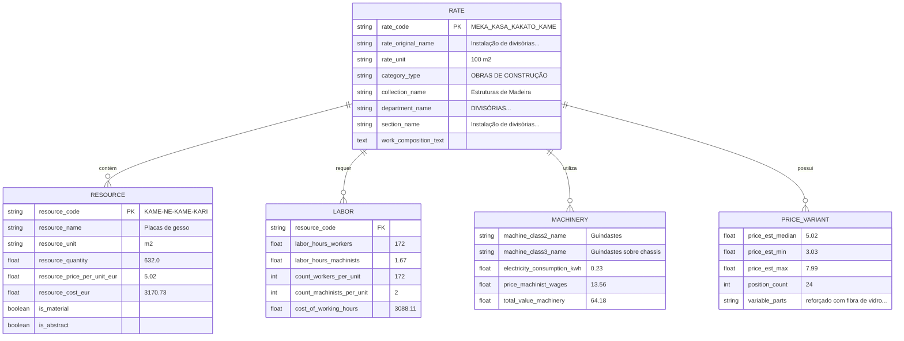
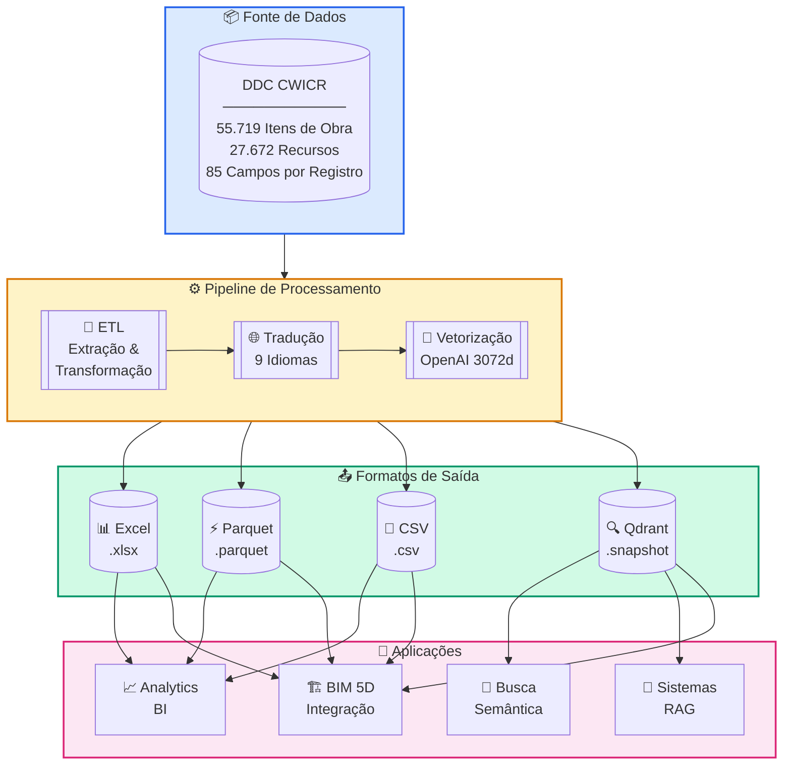
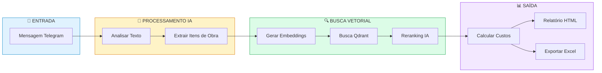
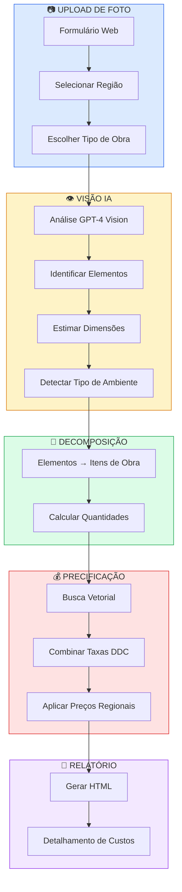
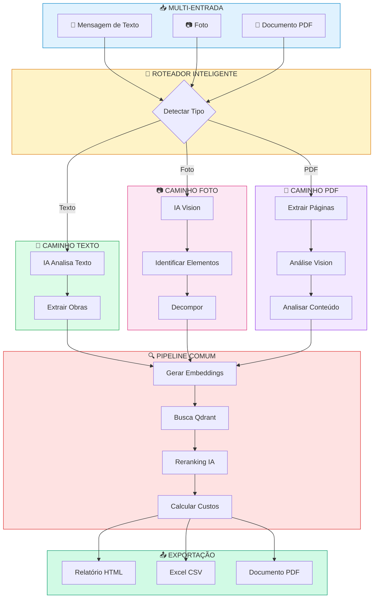
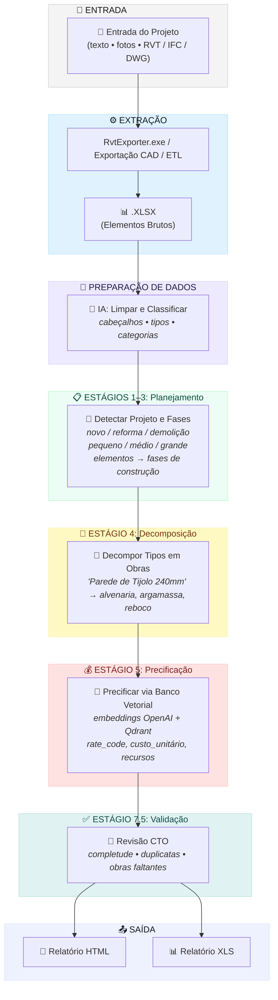

<h3 align="center">DDC CWICR - Itens de Obra, Componentes e Recursos da Construção </br>
  + Pipelines n8n para calcular orçamentos baseados em descrições, fotos e CAD (BIM)</h3>

<p align="center">
  <a href="README.md">🇬🇧 English</a> •
  <a href="README.zh-CN.md">🇨🇳 中文</a> •
  <a href="README.es.md">🇪🇸 Español</a> •
  <a href="README.pt-BR.md"><b>🇧🇷 Português</b></a> •
  <a href="README.ru.md">🇷🇺 Русский</a> •
  <a href="README.ja.md">🇯🇵 日本語</a> •
  <a href="README.de.md">🇩🇪 Deutsch</a> •
  <a href="README.fr.md">🇫🇷 Français</a>
</p>

<p align="center">
  
</p>

<div align="center">
  
  
  
  
</div>

<div align="center">
  
  
  
  
  
</div>

<p align="center">
  
</p>

<h3 align="center">⚡ Workflows n8n</h3>
<p align="center"><code>Escolha sua entrada → Obtenha orçamento</code></p>

<br>

<table width="100%">
<tr>

<td align="center" valign="top" width="33%">
<br>
<h3>📝 Texto</h3>
<p>Orçamento rápido<br>a partir de descrição curta</p>
<p><b>Entrada:</b> Mensagem Telegram / chat<br>
<b>Saída:</b> Itens de obra encontrados + orçamento</p>
<br>
<a href="#1️⃣-bot-estimador-de-texto">📖 Documentação</a>
<br><br>
<a href="./n8n_1_Telegram_Bot_Cost_Estimates_and_Rate_Finder_TEXT_DDC_CWICR.json">

</a>
<br><br>
</td>

<td align="center" valign="top" width="33%">
<br>
<h3>📷 Foto / PDF</h3>
<p>Fotos do canteiro, BOQ escaneado,<br>foto-PDF do campo</p>
<p><b>Entrada:</b> Imagem ou páginas PDF<br>
<b>Saída:</b> Escopo extraído → orçamento</p>
<br>
<a href="#2️⃣-estimador-de-custos-por-foto">📖 Docs Foto</a> · <a href="#3️⃣-bot-estimador-universal-texto--foto--pdf">📖 Bot Universal</a>
<br><br>
<a href="./n8n_2_Photo_Cost_Estimate_DDC_CWICR.json">

</a>
&nbsp;
<a href="./n8n_3_Telegram_Bot_Cost_Estimates_and_Rate_Finder_TEXT_PHOTO_PDF_DDC_CWICR.json">

</a>
<br><br>
</td>

<td align="center" valign="top" width="33%">
<br>
<h3>🧊 CAD / BIM</h3>
<p>Quantificação e orçamentação<br>baseada em Revit / IFC / DWG</p>
<p><b>Entrada:</b> Exportação do modelo <br>
<b>Saída:</b> Orçamento 4D/5D + detalhamento</p>
<br>
<a href="#4️⃣-pipeline-de-estimativa-de-custos-cad-bim">📖 Documentação</a>
<br><br>
<a href="./n8n_4_CAD_(BIM)_Cost_Estimation_Pipeline_4D_5D_with_DDC_CWICR.json">

</a>
<br><br>
</td>

</tr>
</table>

<br>
<p align="center">
  <a href="https://openconstructionestimate.com">
    
  </a>
</p>
<br>
<p align="center">
 Clientes e usuários DataDrivenConstruction
  <br>
  <a href="https://datadrivenconstruction.io/">
  
  </a>
  <br></br>
</p>


---

## 📑 Índice

### Integração com IA
- [Combustível Perfeito para IA](#-combustível-perfeito-para-seus-produtos-de-ia) — Por que este banco de dados é ideal para IA
- [Claude Code](#-claude-code--assistente-de-codificação-ia) — Uso do assistente de codificação IA
- [n8n](#-n8n--automação-visual-de-workflows) — Automação de workflows
- [Dify](#-dify--construa-aplicações-llm) — Desenvolvimento de aplicações LLM
- [Sim AI e Outros](#-sim-ai--plataformas-similares) — Plataformas compatíveis
- [Casos de Uso Universais](#-casos-de-uso-universais) — O que você pode construir

### Banco de Dados e Dados
- [Sobre](#sobre) — O que é DDC CWICR
- [Formatos Disponíveis](#formatos-disponíveis) — Excel, Parquet, CSV, Qdrant
- [Esquema de Dados](#esquema-de-dados) — Estrutura com 85 campos
- [Grupos de Campos](#grupos-de-campos) — Classificação, Recursos, Mão de Obra, Maquinário
- [Metodologia](#metodologia) — Princípios de custeio baseado em recursos
- [Contexto Histórico](#contexto-histórico) — 100+ anos de padrões

### Workflows n8n
- [Visão Geral dos Workflows n8n](#-workflows-n8n) — Escolha seu tipo de entrada
- [Experimente Agora — Bots Demo ao Vivo](#-experimente-agora--bots-demo-ao-vivo) — Teste instantaneamente no Telegram
- [Workflow 1: Bot Estimador de Texto](#1️⃣-bot-estimador-de-texto) — Bot Telegram para entrada de texto
- [Workflow 2: Estimador de Custos por Foto](#2️⃣-estimador-de-custos-por-foto) — Formulário web com IA Vision
- [Workflow 3: Bot Universal](#3️⃣-bot-estimador-universal-texto--foto--pdf) — Texto + Foto + PDF
- [Workflow 4: Pipeline CAD/BIM](#4️⃣-pipeline-de-estimativa-de-custos-cad-bim) — Revit/IFC/DWG para orçamento
- [Início Rápido dos Workflows](#início-rápido-dos-workflows) — Configuração em 4 passos
- [⚠️ Configuração n8n 2.0+](#️-configuração-n8n-20-necessária) — Habilitar nó Execute Command

### Detalhes do Pipeline CAD/BIM
- [Pré-requisitos](#-pré-requisitos) — Componentes necessários
- [Estágios do Pipeline](#-estágios-do-pipeline) — Processamento em 10 estágios
- [Seleção de Modelo LLM](#️-seleção-de-modelo-llm) — OpenAI, Claude, Gemini, Grok
- [Arquivos de Saída](#-arquivos-de-saída) — Relatórios HTML e Excel
- [Solução de Problemas](#️-solução-de-problemas) — Problemas comuns

### Banco de Dados Vetorial
- [Banco de Dados Vetorial](#banco-de-dados-vetorial) — Busca semântica com Qdrant
- [Releases](#releases) — Download de snapshots
- [Coleções](#coleções) — 9 coleções de idiomas
- [Deploy com Docker](#deploy-com-docker) — Configuração auto-hospedada

### Primeiros Passos
- [Início Rápido - Python](#início-rápido) — Dados tabulares e busca semântica
- [Casos de Uso de Integração](#integração) — Nível Iniciante ao Avançado

### Comunidade
- [Recursos e Comunidade](#recursos--comunidade) — Links e canais
- [Consultoria e Treinamento](#consultoria--treinamento) — Serviços profissionais
- [Contribuindo](#contribuindo) — Envie seus workflows
- [Licença](#licença) — CC BY 4.0 e MIT
- [Apoie o Projeto](#apoie-o-projeto) — Patrocine e doe


---

## 🚀 Combustível Perfeito para Seus Produtos de IA

<p align="center">
  <b>Basta clonar o repositório e descrever o que você quer — a IA faz o resto</b>
</p>

DDC CWICR não é apenas um banco de dados — é **combustível pronto para uso em aplicações alimentadas por IA**. Seja você construindo bots de estimativa de custos, automatizando workflows de construção ou criando assistentes inteligentes — estes dados funcionam imediatamente com ferramentas de IA modernas.

### Por Que Este Banco de Dados é Ideal para IA

| Característica | Benefício |
|----------------|-----------|
| **Embeddings pré-computados** | Não é necessário gerar vetores — a busca semântica funciona instantaneamente |
| **Esquema estruturado com 85 campos** | A IA pode raciocinar sobre relacionamentos de dados e fornecer respostas precisas |
| **9 idiomas incluídos** | Construa aplicações multilíngues sem sobrecarga de tradução |
| **55.000+ itens de obra** | Cobertura abrangente para qualquer tarefa de estimativa de construção |
| **Metodologia baseada em recursos** | Dados transparentes que a IA pode explicar e detalhar |

### 🛠️ Funciona Perfeitamente Com

<table>
<tr>
<td align="center" width="20%">
<br/>
<b>Claude Code</b><br/>
<sub>CLI de assistente de codificação IA</sub>
</td>
<td align="center" width="20%">
<br/>
<b>Google Antigravity</b><br/>
<sub>Google Antigravity</sub>
</td>
<td align="center" width="20%">
<br/>
<b>n8n</b><br/>
<sub>Automação de workflows</sub>
</td>
<td align="center" width="20%">
<br/>
<b>Dify</b><br/>
<sub>Desenvolvimento de aplicações LLM</sub>
</td>
<td align="center" width="20%">
<br/>
<b>Sim AI e Outros</b><br/>
<sub>Plataformas de IA</sub>
</td>
</tr>
</table>

---

## 🎯 DDC Skills — 196 Automatizações de IA Prontas para Usar

> **Novo!** [DDC Skills para Agentes de IA na Construção](https://github.com/datadrivenconstruction/DDC_Skills_for_AI_Agents_in_Construction) — um kit de ferramentas de automação completo para empresas de construção.

<p align="center">
  <a href="https://github.com/datadrivenconstruction/DDC_Skills_for_AI_Agents_in_Construction">
    
  </a>
</p>

### Como Funciona

```
1. Clone o repositório de Skills
2. Abra com Claude Code, Cursor ou GitHub Copilot
3. Descreva o que você quer automatizar — a IA guia você passo a passo
```

### Economia de Tempo

| Processo | Antes | Depois | Redução |
|----------|-------|--------|---------|
| Busca de preços | 15 min | 10 seg | 99% |
| Relatórios diários | Manual | Automatizado | 92% |
| Estimativas de custos | Horas | Minutos | 87% |
| Acompanhamento de orçamento | Planilhas | Tempo real | 87% |

### Conteúdo Incluído

| Pasta | Skills | Descrição |
|-------|--------|-----------|
| **DDC Toolkit** | 85 | Ferramentas de produção incluindo integração com banco de dados CWICR |
| **DDC Book** | 50 | Skills baseados na metodologia Data-Driven Construction |
| **DDC Insights** | 5 | Templates de workflow n8n |
| **DDC Curated** | 5 | Skills de integração externa |
| **DDC Innovative** | 22 | Capacidades avançadas de IA/ML |

O repositório de Skills fornece **integração direta com este banco de dados CWICR** — busca semântica, cálculos de custos automatizados, relatórios diários, detecção de defeitos e mais.

**→ [Começar com DDC Skills](https://github.com/datadrivenconstruction/DDC_Skills_for_AI_Agents_in_Construction)**

---

### 💻 Claude Code & Google Antigravity — Assistentes de Codificação IA

A maneira mais rápida de trabalhar com DDC CWICR. Basta abrir o repositório no Claude Code ou Google Antigravity e fazer perguntas em linguagem natural.

**Primeiros Passos:**
```bash
# Clone o repositório
git clone https://github.com/datadrivenconstruction/OpenConstructionEstimate-DDC-CWICR.git

# Abra com Claude Code
cd OpenConstructionEstimate-DDC-CWICR
claude
```

**Exemplos de Prompts:**

| Tarefa | Prompt |
|--------|--------|
| **Explorar dados** | "Mostre-me a estrutura deste banco de dados de construção e explique quais dados estão disponíveis" |
| **Encontrar itens de obra** | "Encontre todos os itens de obra relacionados a fundações de concreto e mostre seus custos" |
| **Construir consultas** | "Escreva um script Python para buscar itens de obra de encanamento com horas de trabalho > 100" |
| **Criar relatórios** | "Gere um relatório de detalhamento de custos para obras de reforma residencial" |
| **Analisar custos** | "Compare os custos de materiais entre diferentes métodos de construção de paredes" |
| **Construir integrações** | "Crie um script que conecta ao banco de dados Qdrant e realiza busca semântica" |

**Dicas Profissionais:**
- Aponte o Claude para arquivos específicos: *"Analise o arquivo Parquet e resuma a distribuição de custos"*
- Peça explicações: *"Explique como a metodologia de custeio baseado em recursos funciona neste banco de dados"*
- Solicite modificações: *"Modifique o workflow n8n para adicionar notificações por email"*

---

### ⚡ n8n — Automação Visual de Workflows

Construa pipelines de automação poderosos sem codificação. Conecte DDC CWICR a mais de 400 aplicativos e serviços.

**Casos de Uso:**

| Workflow | Descrição |
|----------|-----------|
| **Bot Telegram** | Usuários enviam texto/foto → IA extrai itens de obra → Retorna estimativa de custo |
| **Automação de Email** | Receber BOQ via email → Processar com IA → Enviar orçamento formatado |
| **Integração CRM** | Novo projeto no CRM → Auto-gerar orçamento preliminar → Atualizar valor do negócio |
| **Pipeline BIM** | Exportar do Revit → Extrair quantidades → Combinar com taxas DDC → Gerar relatório 5D |
| **Bot Slack** | Equipe faz perguntas → IA pesquisa banco de dados → Retorna itens de obra relevantes |

**Início Rápido:**
1. Baixe o JSON do workflow deste repositório
2. Importe no n8n: `Workflows → Importar → De Arquivo`
3. Configure as credenciais (OpenAI, Qdrant, Telegram)
4. Ative e teste

Veja a seção [Workflows n8n](#workflows-n8n--descrição-detalhada) para configuração detalhada.

---

### 🤖 Dify — Construa Aplicações LLM

Crie aplicações de IA personalizadas com DDC CWICR como base de conhecimento.

**Configuração:**
1. Crie uma nova aplicação Dify
2. Adicione Base de Conhecimento → Faça upload de arquivos Parquet/CSV ou conecte ao Qdrant
3. Configure o pipeline RAG com embeddings
4. Construa sua interface de chat ou API

**Ideias de Aplicações:**

| Tipo de Aplicação | Descrição |
|-------------------|-----------|
| **Chatbot Estimador de Construção** | Interface conversacional para consultas de custos |
| **Busca de Itens de Obra** | Busca em linguagem natural em mais de 55.000 itens |
| **Consultor de Custos** | IA que explica detalhamentos de custos e sugere otimizações |
| **Assistente Multilíngue** | Detecta idioma automaticamente e responde no idioma do usuário |
| **Endpoint API** | API REST para integração com outros sistemas |

**Exemplo de Template de Prompt Dify:**
```
Você é um assistente de estimativa de custos de construção com acesso ao banco de dados DDC CWICR.

Contexto: {{context}}

Pergunta do usuário: {{query}}

Forneça informações precisas de custos baseadas no banco de dados. Inclua:
- Itens de obra relevantes com códigos
- Custos unitários e quantidades
- Detalhamento de recursos (mão de obra, materiais, equipamentos)
- Cálculo do custo total
```

---

### 🔮 Sim AI e Plataformas Similares

DDC CWICR integra com qualquer plataforma de IA que suporte:
- **Bancos de dados vetoriais** (Qdrant, Pinecone, Weaviate, Milvus)
- **Dados estruturados** (CSV, Parquet, Excel)
- **Embeddings OpenAI** (text-embedding-3-large, 3072 dimensões)

**Plataformas Compatíveis:**
- **Sim AI** — Simulação e modelagem de IA
- **LangChain / LlamaIndex** — Frameworks de aplicações LLM
- **Flowise** — Construtor de aplicações LLM low-code
- **Botpress** — Plataforma de IA conversacional
- **Voiceflow** — Design de voz e chat
- **Stack AI** — Workflows de IA no-code
- **Relevance AI** — Plataforma de força de trabalho de IA

**Padrão de Integração Universal:**

```python
# Funciona com qualquer plataforma que suporte Qdrant
from qdrant_client import QdrantClient

# Conectar ao DDC CWICR
client = QdrantClient("your-qdrant-instance", port=6333)

# Busca semântica
results = client.search(
    collection_name="ddc_cwicr_en",  # ou de, ru, zh, etc.
    query_vector=your_embedding,
    limit=10
)

# Use os resultados em sua aplicação de IA
for item in results:
    print(f"{item.payload['rate_code']}: {item.payload['rate_original_name']}")
```

---

### 📋 Casos de Uso Universais

Não importa qual ferramenta de IA você escolha, DDC CWICR possibilita:

| Caso de Uso | Descrição |
|-------------|-----------|
| **Estimativa de Custo Instantânea** | Obtenha custos de construção a partir de descrições de texto ou fotos |
| **Geração de BOQ** | Auto-gerar lista de quantidades a partir de descrições de projetos |
| **Benchmarking de Preços** | Compare custos entre regiões e idiomas |
| **Planejamento de Recursos** | Calcule horas de trabalho, materiais e necessidades de equipamentos |
| **Análise de Investimento** | Auditorias de custos detalhadas com total transparência de recursos |
| **Suporte Multilíngue** | Atenda usuários em 9 idiomas com preços localizados |
| **Integração BIM** | Conecte ao Revit/IFC para estimativa 4D/5D automatizada |
| **Treinamento de Modelos de IA** | Use dados estruturados para fine-tuning de IA de construção |

---

## Sobre

**DDC CWICR** (Itens de Obra, Componentes e Recursos da Construção) é um banco de dados aberto para estimativa de custos de construção, cobrindo todo o espectro de atividades de construção - de terraplenagem e concretagem a trabalhos de instalação especializados.

O banco de dados baseia-se em fontes que descrevem práticas modernas de construção em toda a Eurásia e região Ásia-Pacífico, onde um ecossistema unificado de padronização técnica serve como linguagem comum de engenharia para mais de dez economias em desenvolvimento dinâmico. DDC CWICR representa um esforço para harmonizar padrões abertos ao estabelecer uma estrutura regulatória única para gestão de projetos de capital em múltiplos idiomas.

<p align="center">
  <br>
  
  <br></br>
</p>

Os dados estruturados podem ser acessados através de formatos tabulares (XLSX, CSV, Parquet) ou consultados conversacionalmente via LLM, permitindo que especialistas integrem descrições de trabalhos de construção (banco de dados vetorial QDRANT) em pipelines e workflows automatizados usando linguagem simples ou consultas concisas.

### Formatos Disponíveis

| Formato     | Extensão    | Tamanho      | Melhor Para                           | Características                      |
|-------------|-------------|--------------|---------------------------------------|--------------------------------------|
| **Excel**   | `.xlsx`     | ~150–400 MB  | Análise manual, filtros, tabelas dinâmicas | Legível por humanos, formatação completa |
| **Parquet** | `.parquet`  | ~55 MB       | Pipelines ETL, treinamento ML, Big Data | Colunar, excelente compressão        |
| **CSV**     | `.csv`      | ~1.3 GB      | Importação em banco de dados, sistemas legados | Compatibilidade universal           |
| **Qdrant**  | `.snapshot` | ~1 GB        | Busca semântica, RAG, assistentes IA  | Embeddings OpenAI pré-computados     |


Uma demonstração ao vivo está disponível em [openconstructionestimate.com](https://openconstructionestimate.com/), onde você pode explorar os dados e ver o banco de dados vetorial em ação para busca semântica.

<p align="center">
  
</p>

---

## Esquema de Dados

O banco de dados contém **85 campos** organizados em grupos lógicos. Cada registro representa um item de obra (taxa) ou um recurso com detalhamento completo de custos.



### Grupos de Campos
Os 85 campos do banco de dados são organizados em grupos lógicos que refletem a metodologia de estimativa de custos baseada em recursos. Cada grupo atende a uma função específica na estrutura de detalhamento de custos: desde classificação hierárquica e identificação de itens de obra até consumo detalhado de recursos, requisitos de mão de obra, custos de maquinário e totais agregados. Esta estrutura modular permite que usuários consultem apenas os campos relevantes para sua tarefa - seja gerando uma lista de materiais, analisando produtividade de mão de obra ou construindo uma estimativa de custo completa.

<p align="center">
  <br>
  
  <br></br>
</p>

**Classificação** - `category_type`, `collection_code`, `collection_name`, `department_code`, `department_name`, `department_type`, `section_name`, `section_type`, `subsection_code`, `subsection_name`

**Item de Obra (Taxa)** - `rate_code`, `rate_original_name`, `rate_final_name`, `rate_unit`, `row_type`, `is_scope`, `is_abstract`, `is_machine`, `is_labor`, `is_material`, `work_composition_text`

**Recursos** - `resource_code`, `resource_name`, `resource_unit`, `resource_quantity`, `parameter_resource_quantity`, `resource_price_per_unit_eur_current`, `resource_cost_eur`

**Mão de Obra** - `count_workers_per_unit`, `count_engineers_per_unit`, `count_machinists_per_unit`, `count_total_people_per_unit`, `labor_hours_construction_workers`, `labor_hours_machinists`, `labor_hours_engineers`, `total_labor_hours_workers_machinists`, `total_labor_hours_all_personnel`, `cost_of_working_hours`, `count_people_per_day`

**Maquinário** - `machine_class2_name`, `machine_class3_name`, `personnel_machinist_code`, `personnel_machinist_grade`, `price_machinist_wages`, `price_relocation_included`, `price_cost_without_wages`, `electricity_consumption_kwh_per_machine_hour`, `electricity_cost_per_unit`, `electricity_cost_total_sum`, `cost_machinist_sum`, `total_value_machinery_equipment`

**Variantes de Preço** - `price_code_prefix`, `price_abstract_resource_common_start`, `price_abstract_resource_variable_parts`, `price_abstract_resource_position_count`, `price_abstract_resource_est_price_min`, `price_abstract_resource_est_price_max`, `price_abstract_resource_est_price_mean`, `price_abstract_resource_est_price_median`, `price_abstract_resource_unit`, `abstract_resource_tech_group`

**Agregados** - `total_cost_per_position`, `total_material_cost_per_position`, `total_resource_cost_per_position`, `total_value_abstract_resources`, `materials_resource_cost_eur`

**Massa e Serviços** - `mass_name`, `mass_value`, `mass_unit`, `service_category`, `service_type`, `parameter_service_code`, `parameter_service_unit`, `parameter_service_name`, `parameter_service_quantity`, `service_cost_sum`

### Fórmula de Cálculo de Custo

| Componente         | Norma Tecnológica  | ×   | Preço Regional  | =   | Custo                   |
|--------------------|-------------------|-----|-----------------|-----|-------------------------|
| 👷 **Mão de Obra** | 172 hrs/100m²     | ×   | €17,95/hr       | =   | €3.088,11               |
| 🧱 **Materiais**   | 632 m²/100m²      | ×   | €5,02/m²        | =   | €3.170,73               |
| 🚜 **Equipamentos**| 1,67 hrs/100m²    | ×   | €38,42/hr       | =   | €64,18                  |
|                    |                   |     | **Total**       | =   | **€7.725,91 por 100m²** |

---

## Metodologia

O valor chave do **Custeio Baseado em Recursos** é a separação da tecnologia de produção imutável do componente financeiro volátil. É baseado nos "princípios fundamentais" físicos da construção:
- Horas de trabalho necessárias para trabalho específico
- Quantidades de materiais por unidade de trabalho
- Tempo de equipamento necessário

**Por que isso importa:**

- **Transparência** - Precificação sem margens ocultas, detalhamento completo de recursos
- **Auditabilidade** - Capacidade de análise profunda para análise de investimento e verificação
- **Portabilidade** - Normas independentes de região aplicáveis em diferentes mercados
- **Comprovado** - Metodologia padrão da indústria estabelecida há mais de 100 anos




### Contexto Histórico

As descrições de trabalhos de construção neste banco de dados são fundamentadas em uma metodologia de padronização baseada em recursos com raízes que se estendem desde as normas de produção do início do século XX até os sistemas de referência digitais de hoje. Desenvolvida e refinada continuamente desde a década de 1920, esta abordagem teve evolução especialmente robusta em toda a região da Eurásia.

Ao longo de cem anos de desenvolvimento, o sistema passou de cálculos manuais para formatos legíveis por máquina - ainda assim seu princípio fundamental permanece intacto: a medição precisa de recursos físicos necessários por unidade de produção de construção. Implementações modernas conectam dados normativos históricos com preços de mercado em tempo real.

Adaptações regionais desta metodologia operam sob várias designações nacionais: ENIR, GESN, FER, NRR, ESN, AzDTN, ShNQK, MKS ChT, SNT, BNbD, Dinh Muc, Ding'e.

<p align="center">
  
</p>

⭐ <b>Se você quer ver novas atualizações e versões do banco de dados e se você acha nossas ferramentas úteis, por favor dê uma estrela aos nossos repositórios para ver mais aplicações similares para a indústria da construção.</b>
Dê uma estrela no workflow DDC no GitHub e seja notificado instantaneamente sobre novos lançamentos.
<p align="center">
  <br>
  
  <br></br>
</p>


---


## Integração

### Casos de Uso

- **Nível Iniciante** - Benchmarking de Custos, Indexação de Preços, Estimativa para Licitação

- **Nível Intermediário** - Localização, Pipelines ETL/BI, Cálculo de CO₂

- **Nível Avançado** - Treinamento IA/ML, CAD (BIM) 5D, Auditoria de Investimento Detalhada

---

## Workflows n8n — Descrição Detalhada

Quatro workflows prontos para produção para estimativa automatizada de custos de construção. Cada workflow conecta ao banco de dados vetorial DDC CWICR via Qdrant e usa modelos de IA para parsing e correspondência inteligentes.

| #   | Workflow                                                        | Entrada     | Melhor Para                     | Download                                                                                            |
|-----|-----------------------------------------------------------------|-------------|---------------------------------|-----------------------------------------------------------------------------------------------------|
| 1   | [Bot Estimador de Texto](#1️⃣-bot-estimador-de-texto)            | 💬 Texto    | Estimativas rápidas de texto    | [JSON](./n8n_1_Telegram_Bot_Cost_Estimates_and_Rate_Finder_TEXT_DDC_CWICR.json)                      |
| 2   | [Estimador por Foto](#2️⃣-estimador-de-custos-por-foto)          | 📷 Foto     | Visitas ao canteiro, inspeções visuais | [JSON](./n8n_2_Photo_Cost_Estimate_DDC_CWICR.json)                                                  |
| 3   | [Bot Universal](#3️⃣-bot-estimador-universal-texto--foto--pdf)   | 💬📷📄 Todos| Uso em produção completo        | [JSON](./n8n_3_Telegram_Bot_Cost_Estimates_and_Rate_Finder_TEXT_PHOTO_PDF_DDC_CWICR.json)            |
| 4   | [Pipeline CAD/BIM](#4️⃣-pipeline-de-estimativa-de-custos-cad-bim)| 🏗️ Revit   | Estimativa BIM 4D/5D            | [JSON](./n8n_4_CAD_(BIM)_Cost_Estimation_Pipeline_4D_5D_with_DDC_CWICR.json)                         |

---

### 1️⃣ Bot Estimador de Texto

**Arquivo:** `n8n_1_Telegram_Bot_Cost_Estimates_and_Rate_Finder_TEXT_DDC_CWICR.json`

Bot Telegram para estimativa de custos baseada em texto. Descreva trabalhos de construção em linguagem natural — o bot analisa a entrada, pesquisa o banco de dados vetorial e retorna detalhamentos de custos completos.

<p align="center">
  <br>
  
  <br></br>
</p>

<h3 align="left">🤖 Experimente Agora — Bots Demo ao Vivo</h3>
<p align="left"><i>Teste os workflows de estimativa instantaneamente no Telegram</i></p>
<p><b>@TextOpenConstructionEstimate_bot</b></p>
<p>Crie estimativas de custos completas<br>a partir de descrições de texto</p>
<a href="https://t.me/TextOpenConstructionEstimate_bot">

</a>




**Como funciona:**

| Passo | Ação                                   | Tecnologia                             |
|-------|----------------------------------------|----------------------------------------|
| 1     | Usuário envia descrição de texto       | API Bot Telegram                       |
| 2     | IA analisa e extrai itens de obra      | OpenAI / Claude / Gemini               |
| 3     | Gerar embeddings para cada item        | OpenAI `text-embedding-3-large`        |
| 4     | Buscar taxas correspondentes no banco  | Busca vetorial Qdrant                  |
| 5     | IA reordena resultados para precisão   | Pontuação LLM                          |
| 6     | Calcular custos e gerar relatório      | HTML / Excel / PDF                     |

**Funcionalidades:**

| Funcionalidade               | Descrição                                                            |
|------------------------------|----------------------------------------------------------------------|
| 💬 Entrada em linguagem natural | Aceita qualquer formato de texto — listas, frases, descrições estruturadas |
| 🤖 Suporte multi-LLM         | Funciona com OpenAI, Claude ou Gemini (alternável)                   |
| 🔍 Busca semântica           | Encontra melhores correspondências mesmo com palavras diferentes     |
| 🌍 9 idiomas                 | DE, EN, RU, ES, FR, PT, ZH, AR, HI                                   |
| 📊 Múltiplas exportações     | Relatório HTML, planilha Excel, documento PDF                        |
| ✏️ Edição interativa         | Modifique quantidades antes do cálculo final                         |

**Credenciais necessárias:**
- Token do Bot Telegram (do @BotFather)
- Chave API OpenAI (para embeddings + LLM opcional)
- URL Qdrant + Chave API

---

### 2️⃣ Estimador de Custos por Foto

**Arquivo:** `n8n_2_Photo_Cost_Estimate_DDC_CWICR.json`

Interface de formulário web para estimativa baseada em foto. Faça upload de uma foto de construção — AI Vision identifica elementos, estima dimensões e calcula custos automaticamente.

<p align="center">
  <br>
  
  <br></br>
</p>




**Como funciona:**

| Passo | Ação                                          | Tecnologia                           |
|-------|-----------------------------------------------|--------------------------------------|
| 1     | Usuário faz upload de foto via formulário web | Gatilho de Formulário n8n            |
| 2     | AI Vision analisa a imagem                    | GPT-4 Vision                         |
| 3     | Identificar tipo de ambiente, elementos, materiais | Extração JSON estruturada       |
| 4     | Estimar dimensões de objetos de referência    | Raciocínio IA (portas, azulejos, etc.) |
| 5     | Decompor elementos em itens de obra           | Processamento LLM                    |
| 6     | Precificar cada obra via busca vetorial       | Qdrant + embeddings OpenAI           |
| 7     | Gerar relatório HTML profissional             | Saída estilizada                     |

**Funcionalidades:**

| Funcionalidade         | Descrição                                               |
|------------------------|---------------------------------------------------------|
| 📷 Análise de foto     | GPT-4 Vision identifica elementos de construção         |
| 📐 Dimensionamento automático | Estima tamanhos usando objetos de referência (portas, azulejos) |
| 🏠 Detecção de ambiente | Banheiro, cozinha, quarto, exterior, etc.              |
| 🔨 Suporte a tipos de obra | Construção nova / Reforma / Reparo                   |
| 🌍 9 bancos regionais  | Preços localizados para Berlim, Toronto, Paris, etc.    |
| 📄 Relatórios profissionais | Saída HTML limpa pronta para clientes              |

**Credenciais necessárias:**
- Chave API OpenAI (GPT-4 Vision + embeddings)
- URL Qdrant + Chave API

---

### 3️⃣ Bot Estimador Universal (Texto + Foto + PDF)

**Arquivo:** `n8n_3_Telegram_Bot_Cost_Estimates_and_Rate_Finder_TEXT_PHOTO_PDF_DDC_CWICR.json`

Bot Telegram completo suportando todos os tipos de entrada: descrições de texto, fotos de construção e plantas em PDF. O workflow mais abrangente para uso em produção.


<p align="center">
  <br>
  
  <br></br>
</p>

<h3 align="left">🤖 Experimente Agora — Bots Demo ao Vivo</h3>
<p align="left"><i>Teste os workflows de estimativa instantaneamente no Telegram</i></p>
<h3>📷 Bot Universal</h3>
<p><b>@OpenConstructionEstimate_bot</b></p>
<p>Bot completo para texto, fotos e PDF</p>
<a href="https://t.me/OpenConstructionEstimate_bot">

</a>
<br><br>





**Como funciona:**

| Passo | Ação                                      | Tecnologia                     |
|-------|-------------------------------------------|--------------------------------|
| 1     | Usuário envia texto, foto ou PDF          | API Bot Telegram               |
| 2     | Roteador detecta tipo de entrada          | Análise de tipo de conteúdo    |
| 3a    | **Texto:** IA analisa itens de obra       | OpenAI / Gemini                |
| 3b    | **Foto:** IA Vision extrai elementos      | GPT-4 Vision / Gemini 2.0      |
| 3c    | **PDF:** Extrair e analisar páginas       | Processamento PDF + Vision     |
| 4     | Busca semântica no DDC CWICR              | Banco de dados vetorial Qdrant |
| 5     | Reranking IA para melhores correspondências| Pontuação LLM                  |
| 6     | Edição interativa via menu do bot         | Teclados inline Telegram       |
| 7     | Exportar resultados                       | HTML / Excel / PDF             |

**17 Ações do Bot:**

| Ação             | Descrição                           |
|------------------|-------------------------------------|
| `/start`         | Menu de seleção de idioma           |
| Upload de foto   | Acionar análise de visão IA         |
| Mensagem de texto| Analisar e extrair itens de obra    |
| Upload de PDF    | Processar plantas                   |
| Editar quantidades| Modificar antes do cálculo         |
| Adicionar obra   | Entrada manual de item de obra      |
| Calcular         | Executar estimativa de custo completa|
| Ver detalhes     | Mostrar recursos para cada item     |
| Exportar Excel   | Baixar planilha CSV                 |
| Exportar PDF     | Gerar relatório PDF                 |
| Ajuda            | Mostrar instruções de uso           |
| Refinar          | Re-analisar com correções           |

**Funcionalidades:**

| Funcionalidade        | Descrição                                          |
|-----------------------|----------------------------------------------------|
| 📷 Dupla IA Vision    | Gemini 2.0 Flash ou GPT-4 Vision (configurável)    |
| 📄 Processamento PDF  | Plantas baixas, BOQ escaneado, documentos          |
| 💬 Parsing inteligente de texto | Lida com listas, tabelas, texto livre     |
| 🔍 Reranking IA       | Melhora precisão de correspondência                |
| ✏️ Edição completa    | Adicionar, remover, modificar itens de obra        |
| 📊 Exportação multi-formato | HTML, Excel, PDF                              |
| 🌍 9 idiomas          | Localização completa                               |

**Credenciais necessárias:**
- Token do Bot Telegram
- Chave API OpenAI (embeddings)
- Chave API Gemini (Vision) ou OpenAI GPT-4 Vision
- URL Qdrant + Chave API

---

### 4️⃣ Pipeline de Estimativa de Custos CAD (BIM)

**Arquivo:** `n8n_4_CAD_(BIM)_Cost_Estimation_Pipeline_4D_5D_with_DDC_CWICR.json`

Estimativa automatizada de custos a partir de modelos Revit/IFC/DWG. Extrai dados BIM, classifica elementos, decompõe em itens de obra e gera estimativas 4D/5D com detalhamento completo de recursos.

<p align="left">
  <a href="https://datadrivenconstruction.io">
    
  </a>
</p>




**n8n fornece mais de 400 integrações nativas** com plataformas como Google Sheets, Notion, Slack, Airtable, bancos de dados (PostgreSQL, MongoDB), armazenamento em nuvem e mais. Cada nó neste workflow é modular — você pode:

- 🔄 **Trocar provedores de LLM** (OpenAI ↔ Claude ↔ Gemini ↔ Grok)
- 📊 **Conectar ao seu ERP ou sistema de gerenciamento de projetos**
- 📁 **Exportar resultados para qualquer destino** (armazenamento em nuvem, email, dashboards)
- 🔧 **Modificar qualquer estágio** para corresponder à sua metodologia de estimativa

O workflow é seu para adaptar. Sem restrições. Sem taxas de licenciamento. Controle total.

---

## 📋 Pré-requisitos

| Componente                                         | Requisito                              | Descrição                                                             |
|----------------------------------------------------|----------------------------------------|-----------------------------------------------------------------------|
| **[n8n](https://n8n.io/)**                         | v1.0+ (v2.0+ requer [configuração](#️-configuração-n8n-20-necessária))                    | Plataforma de automação de workflows para orquestrar o pipeline de estimativa|
| **[Qdrant](https://qdrant.tech/)**                 | Instância em nuvem ou auto-hospedada   | Banco de dados vetorial para busca semântica em itens de obra de construção    |
| **[API OpenAI](https://platform.openai.com/)**     | Para embeddings (`text-embedding-3-large`)| Gera embeddings vetoriais para elementos BIM e correspondência com banco de custos|
| **API LLM**                                        | OpenAI / Claude / Gemini / xAI Grok    | Modelos de IA para classificação de itens de obra e geração de estimativas        |
| **[Conversor DDC](https://github.com/datadrivenconstruction/cad2data-Revit-IFC-DWG-DGN-pipeline-with-conversion-validation-qto)** | `RvtExporter.exe` | Extrai dados BIM de modelos Revit para Excel/JSON para processamento |

---

## Início Rápido dos Workflows

### Passo 1: Importar Workflow

```
n8n → Novo workflow → Importar de Arquivo → Selecionar JSON
```

### Passo 2: Configurar Credenciais

No nó **🔑 TOKEN**, configure suas chaves API:

```json
{
  "bot_token": "SEU_TOKEN_BOT_TELEGRAM",
  "OPENAI_API_KEY": "SUA_CHAVE_OPENAI",
  "GEMINI_API_KEY": "SUA_CHAVE_GEMINI",
  "QDRANT_URL": "http://localhost:6333",
  "QDRANT_API_KEY": ""
}
```

### Passo 3: Carregar DDC CWICR no Qdrant

Baixe o snapshot dos [Releases](#releases) e importe:

```bash
curl -X POST "http://localhost:6333/collections/ddc_cwicr_en/snapshots/upload" \
  -H "Content-Type: multipart/form-data" \
  -F "snapshot=@EN_TORONTO_workitems_EMBEDDINGS_3072_DDC.snapshot"
```

### Passo 4: Ativar e Testar

- Habilite o workflow no n8n
- Para bots Telegram: envie `/start` para seu bot
- Para formulários web: abra a URL do formulário fornecida pelo n8n

---

## ⚠️ Configuração n8n 2.0+ Necessária

> **A partir da versão 2.0 do n8n, o nó Execute Command está desabilitado por padrão por razões de segurança.**
>
> Sem a configuração abaixo, workflows usando Execute Command (especialmente o Pipeline CAD/BIM) **não funcionarão** — os nós aparecerão com um ponto de interrogação ou não serão reconhecidos.

### Correção Rápida

**Windows (CMD) — executar cada vez:**
```cmd
set NODES_EXCLUDE=[] && npx n8n
```

**Solução permanente — criar uma vez:**

Crie o arquivo `C:\Users\SEU_USUARIO\.n8n\.env` com:
```
NODES_EXCLUDE=[]
```
Depois execute `npx n8n` normalmente.

**Docker:**
```yaml
environment:
  - NODES_EXCLUDE=[]
```

### Verificar Configuração

1. Inicie o n8n
2. Clique em **+** → procure por **"Execute Command"**
3. Se o nó aparecer → ✅ você está pronto!

> 📚 Mais detalhes: [n8n 2.0 Breaking Changes](https://docs.n8n.io/2-0-breaking-changes/)

---

## 🌍 Idiomas e Níveis de Preço Suportados

| Código | Idioma      | Nível de Preço  | Moeda | Coleção Qdrant      |
|--------|-------------|-----------------|-------|---------------------|
| `AR`   | Árabe       | Dubai           | AED   | `ddc_cwicr_ar`      |
| `DE`   | Alemão      | Berlim          | EUR   | `ddc_cwicr_de`      |
| `EN`   | Inglês      | Toronto         | CAD   | `ddc_cwicr_en`      |
| `ES`   | Espanhol    | Barcelona       | EUR   | `ddc_cwicr_es`      |
| `FR`   | Francês     | Paris           | EUR   | `ddc_cwicr_fr`      |
| `HI`   | Hindi       | Mumbai          | INR   | `ddc_cwicr_hi`      |
| `PT`   | Português   | São Paulo       | BRL   | `ddc_cwicr_pt`      |
| `RU`   | Russo       | São Petersburgo | RUB   | `ddc_cwicr_ru`      |
| `ZH`   | Chinês      | Xangai          | CNY   | `ddc_cwicr_zh`      |

---

## 📊 Estágios do Pipeline

O workflow CAD/BIM processa dados através de 10 estágios:

| Estágio | Nome                 | Descrição                                                         |
|---------|----------------------|-------------------------------------------------------------------|
| **0**   | Coletar Dados BIM    | Extrair elementos do Revit via Conversor DDC                      |
| **1**   | Detecção de Projeto  | IA identifica tipo de projeto (Residencial, Comercial, etc.)      |
| **2**   | Geração de Fases     | IA cria fases de construção                                       |
| **3**   | Atribuição de Elementos | IA mapeia tipos BIM para fases                                 |
| **4**   | Decomposição de Obra | IA divide tipos em itens de obra ("Parede de Tijolo" → alvenaria, argamassa)  |
| **5**   | Busca Vetorial       | Encontrar taxas correspondentes no DDC CWICR via Qdrant           |
| **6**   | Mapeamento de Unidades| Converter unidades BIM para unidades de taxa                     |
| **7**   | Cálculo de Custo     | Qtd × Preço Unitário para cada item de obra                       |
| **7.5** | Validação            | Revisão CTO para completude e duplicatas                          |
| **8**   | Agregação            | Somar por fases e categorias                                      |
| **9**   | Geração de Relatório | Criar saídas HTML e Excel                                         |

---

## ⚙️ Seleção de Modelo LLM

O workflow suporta múltiplos provedores de IA. Habilite seu modelo preferido na seção **Modelos LLM**:

| Modelo           | Nome do Nó                   | Status       |
|------------------|------------------------------|--------------|
| OpenAI GPT-4o    | `OpenAI LLM`                 | ✅ Padrão    |
| Claude Opus 4    | `Anthropic Chat Model2`      | Desabilitado |
| Gemini 2.5 Pro   | `Google Gemini Chat Model`   | Desabilitado |
| xAI Grok         | `xAI Grok Chat Model1`       | Desabilitado |
| DeepSeek         | `DeepSeek Chat Model`        | Desabilitado |

Para trocar modelos: **Habilite** o nó de modelo desejado e **Desabilite** os outros.

---

## 📁 Arquivos de Saída

Os relatórios são salvos na pasta do projeto:
```
projeto_AAAA-MM-DD.html   ← Relatório interativo (abre no navegador)
projeto_AAAA-MM-DD.xls    ← Planilha compatível com Excel
```
<p align="center">
  <br>
  
  <br></br>
</p>

---

## 🔗 Coleções Qdrant

O workflow seleciona automaticamente a coleção correta baseada no `language_code`:

```
{LANG}_{CITY}_workitems_costs_resources_EMBEDDINGS_3072_DDC_CWICR
```

Exemplo: `DE_BERLIN_workitems_costs_resources_EMBEDDINGS_3072_DDC_CWICR`

---

## ⚠️ Solução de Problemas

| Problema                     | Solução                                                     |
|------------------------------|-------------------------------------------------------------|
| "Execute Command faltando" (n8n 2.0+) | Defina a variável de ambiente `NODES_EXCLUDE=[]`. Veja [Configuração n8n 2.0+](#️-configuração-n8n-20-necessária) |
| "Arquivo Excel não encontrado"        | Verifique os caminhos `path_to_converter` e `project_file`          |
| "Conexão Qdrant falhou"   | Verifique URL Qdrant e chave API nas credenciais                |
| "Limite de taxa excedido"        | Reduza tamanho do lote ou adicione atrasos entre chamadas API           |
| "Precificação não encontrada"           | Verifique se a coleção de idioma correta existe no Qdrant   |
| "Erro de webhook Telegram"     | Certifique-se de que o workflow está ativo e URL do webhook é acessível     |
| "API Vision falhou"          | Verifique se a chave API Gemini ou OpenAI Vision é válida             |

---

## Banco de Dados Vetorial

Coleções Qdrant prontas para uso com embeddings OpenAI `text-embedding-3-large` para busca semântica em itens de obra de construção.

Bancos de dados vetoriais permitem que você "converse" com seus dados em linguagem natural – usando frases simples ou expressões curtas em vez de código ou filtros complexos. Isso acelera dramaticamente encontrar o item de obra ou linha de custo correta, mesmo em conjuntos de dados muito grandes.

Estas coleções Qdrant podem ser conectadas a aplicações via workflows modernos de automação e integração (por exemplo, ferramentas de Workflow e Pipeline low-code/no-code). Você pode construir assistentes que pesquisam, filtram e explicam itens de obra de construção, ou integrar busca semântica diretamente em suas ferramentas existentes de estimativa e controle de projetos.

---

### Releases

Baixe conjuntos de dados QDRANT e CSV (arquivos maiores que 1 gigabyte) dos [Releases do GitHub](https://github.com/datadrivenconstruction/OpenConstructionEstimate-DDC-CWICR/releases).

| Idioma          | Região         | Arquivos CSV          | Snapshot Qdrant                            |
|-----------------|----------------|-----------------------|--------------------------------------------|
| 🇸🇦 Árabe       | Dubai          | `AR_DUBAI_*.csv`      | `AR_DUBAI_*_EMBEDDINGS_3072_DDC.snapshot`   |
| 🇨🇳 Chinês      | Xangai         | `ZH_SHANGHAI_*.csv`   | `ZH_SHANGHAI_*_EMBEDDINGS_3072_DDC.snapshot`|
| 🇩🇪 Alemão      | Berlim         | `DE_BERLIN_*.csv`     | `DE_BERLIN_*_EMBEDDINGS_3072_DDC.snapshot`  |
| 🇬🇧 Inglês      | Toronto        | `EN_TORONTO_*.csv`    | `EN_TORONTO_*_EMBEDDINGS_3072_DDC.snapshot` |
| 🇪🇸 Espanhol    | Barcelona      | `ES_BARCELONA_*.csv`  | `ES_BARCELONA_*_EMBEDDINGS_3072_DDC.snapshot`|
| 🇫🇷 Francês     | Paris          | `FR_PARIS_*.csv`      | `FR_PARIS_*_EMBEDDINGS_3072_DDC.snapshot`   |
| 🇮🇳 Hindi       | Mumbai         | `HI_MUMBAI_*.csv`     | `HI_MUMBAI_*_EMBEDDINGS_3072_DDC.snapshot`  |
| 🇧🇷 Português   | São Paulo      | `PT_SAOPAULO_*.csv`   | `PT_SAOPAULO_*_EMBEDDINGS_3072_DDC.snapshot`|
| 🇷🇺 Russo       | São Petersburgo| `RU_SPB_*.csv`        | `RU_SPB_*_EMBEDDINGS_3072_DDC.snapshot`     |

<a href="https://github.com/datadrivenconstruction/OpenConstructionEstimate-DDC-CWICR/releases/tag/v0.1.0">
  
</a>

### Coleções

🇸🇦 `ddc_cwicr_ar` (Árabe) · 🇨🇳 `ddc_cwicr_zh` (Chinês) · 🇩🇪 `ddc_cwicr_de` (Alemão) · 🇬🇧 `ddc_cwicr_en` (Inglês) · 🇪🇸 `ddc_cwicr_es` (Espanhol) · 🇫🇷 `ddc_cwicr_fr` (Francês) · 🇮🇳 `ddc_cwicr_hi` (Hindi) · 🇧🇷 `ddc_cwicr_pt` (Português) · 🇷🇺 `ddc_cwicr_ru` (Russo)

Cada coleção contém **55.719 vetores** com metadados de payload completos.

### Deploy com Docker

```yaml
# docker-compose.yml
services:
  qdrant:
    image: qdrant/qdrant:latest
    container_name: ddc-cwicr-qdrant
    ports:
      - "6333:6333"
      - "6334:6334"
    volumes:
      - qdrant_storage:/qdrant/storage
      - ./snapshots:/qdrant/snapshots
    environment:
      - QDRANT__LOG_LEVEL=INFO
    restart: unless-stopped

volumes:
  qdrant_storage:
```

```bash
# Iniciar
docker-compose up -d

# Importar snapshot
curl -X POST "http://localhost:6333/collections/ddc_cwicr_en/snapshots/upload" \
  -H "Content-Type: multipart/form-data" \
  -F "snapshot=@ddc_cwicr_en.snapshot"

# Dashboard: http://localhost:6333/dashboard
```
---

## Início Rápido

### Python - Dados Tabulares

```python
import pandas as pd

# Parquet (recomendado)
df = pd.read_parquet("DDC_CWICR_EN.parquet")

# Excel
df = pd.read_excel("DDC_CWICR_EN.xlsx")

print(f"Registros: {len(df):,} | Campos: {len(df.columns)}")
print(df[['rate_code', 'rate_original_name', 'rate_unit', 'total_cost_per_position']].head())
```

### Python - Busca Semântica

```python
from qdrant_client import QdrantClient
from openai import OpenAI

client = QdrantClient("localhost", port=6333)
openai = OpenAI()

# Buscar por linguagem natural
query = "concretagem de fundação de concreto armado"
embedding = openai.embeddings.create(
    input=query,
    model="text-embedding-3-large"
).data[0].embedding

results = client.search(
    collection_name="ddc_cwicr_en",
    query_vector=embedding,
    limit=5
)

for r in results:
    print(f"[{r.score:.3f}] {r.payload['rate_code']}: {r.payload['rate_original_name']}")
```

### Busca Filtrada

```python
from qdrant_client.models import Filter, FieldCondition, MatchValue, Range

# Por departamento
results = client.search(
    collection_name="ddc_cwicr_en",
    query_vector=embedding,
    query_filter=Filter(must=[
        FieldCondition(key="department_name", match=MatchValue(value="Concreto e Concreto Armado"))
    ]),
    limit=10
)

# Por faixa de preço
results = client.search(
    collection_name="ddc_cwicr_en",
    query_vector=embedding,
    query_filter=Filter(must=[
        FieldCondition(key="price_est_median", range=Range(gte=1000, lte=50000))
    ]),
    limit=10
)
```


---

## Recursos e Comunidade

[](https://datadrivenconstruction.io)
[](https://openconstructionestimate.com)
[](https://github.com/datadrivenconstruction)
[](https://youtube.com/@datadrivenconstruction)
[](https://linkedin.com/company/datadrivenconstruction)
[](https://t.me/datadrivenconstruction)

### Consultoria e Treinamento

Trabalhamos com empresas líderes de construção, engenharia, agências de consultoria e empresas de tecnologia ao redor do mundo para ajudá-las a implementar princípios de dados abertos, automatizar processamento CAD/BIM e construir pipelines ETL robustos. Apoiamos ativamente organizações que buscam soluções práticas para transformação digital e interoperabilidade, focando em desafios de qualidade de dados e classificação enquanto impulsionamos a adoção de workflows abertos e automatizados.

Se você gostaria de testar esta solução com seus próprios dados ou está interessado em adaptar o workflow para tarefas reais de projetos, sinta-se à vontade para entrar em contato. Nossa equipe oferece workshops práticos, consultoria estratégica e desenvolve protótipos adaptados a processos reais de projetos.

<a href="mailto:info@datadrivenconstruction.io">
  
</a>

### Contribuindo

DDC CWICR é um projeto gratuito e aberto dedicado a tornar a indústria da construção mais eficiente, transparente e tecnologicamente avançada. Estamos ativamente buscando entusiastas que compartilham esta missão. Se você cria soluções úteis e está pronto para compartilhá-las com a comunidade, estamos aqui para ajudá-lo a ser ouvido.

Convidamos você a enviar seus workflows, pipelines e integrações de código aberto baseados em DDC CWICR - ferramentas que qualquer pessoa pode usar livremente em seu trabalho. As melhores soluções serão publicadas com atribuição completa do autor no GitHub e anunciadas através da nossa newsletter e canais de mídia social, alcançando dezenas de milhares de assinantes profissionais. Isso coloca seu nome diretamente na frente de uma comunidade internacional de orçamentistas, especialistas BIM e gerentes de projetos.

Juntos estamos mudando a indústria. Você pode enviar sua solução para info@datadrivenconstruction.io com o assunto "DDC Open Workflow" ou enviar um Pull Request diretamente para nossos repositórios GitHub.

Automatize o processamento de dados de construção com workflows n8n prontos para CAD-BIM:

<a href="https://github.com/datadrivenconstruction/cad2data-Revit-IFC-DWG-DGN-pipeline-with-conversion-validation-qto">
  
</a>

---

## Instruções AI

A pasta `AI_INSTRUCTIONS/` contém documentação completa para assistentes de programação AI trabalharem efetivamente com este banco de dados de custos de construção.

### O que é DDC CWICR?

**DDC CWICR** (Construction Work Items, Components & Resources) é um banco de dados de custos de construção de código aberto contendo:
- **55.719 itens de trabalho** — operações de construção detalhadas com decomposição completa de custos
- **27.672 recursos** — materiais, mão de obra e equipamentos com preços regionais
- **85 campos de dados** — esquema estruturado para cálculos precisos
- **9 idiomas** — com preços específicos por região (EUR, USD, CAD, RUB, CNY, etc.)
- **Embeddings pré-calculados** — vetores OpenAI de 3072 dimensões para busca semântica

### Metodologia baseada em recursos

O banco de dados usa uma **abordagem de cálculo baseada em recursos** que separa:
- **Normas tecnológicas** (invariáveis) — horas de trabalho, quantidades de materiais, tempo de equipamentos
- **Preços regionais** (variáveis) — taxas horárias, custos de materiais, preços de combustível

```
Custo real = Norma tecnológica × Preço regional
```

Isso permite estimativas precisas para diferentes regiões e períodos de tempo.

### Arquivos de instruções AI

| Arquivo | Propósito |
|---------|-----------|
| `INSTRUCTIONS.md` | Visão geral principal, início rápido, formatos |
| `CLAUDE.md` | Padrões e exemplos para Claude Code |
| `OPENCODE.md` | Instruções concisas para Opencode |
| `ANTIGRAVITY.md` | Integração GCP (BigQuery, Vertex AI, Qdrant) |
| `DATABASE_SCHEMA.md` | Referência completa do esquema de 85 campos |

### n8n Workflows — Exemplos e Templates

Os workflows n8n incluídos são **exemplos e templates** que demonstram a lógica de estimativa de custos. Eles podem ser:
- ✅ Usados como estão para implantação rápida
- ✅ Parcialmente adaptados para requisitos de negócio específicos
- ✅ Estudados para entender a metodologia de cálculo
- ✅ Usados como referência ao criar integrações em qualquer plataforma

Os workflows demonstram: consultas ao banco de dados, correspondência de itens de trabalho, lógica de preços regionais e geração de relatórios. AI pode analisá-los para entender o processo completo de estimativa.

### Por que isso é importante

Assistentes AI podem ajudá-lo a:
- Consultar o banco de dados usando linguagem natural
- Encontrar itens de trabalho por busca semântica
- Calcular custos com preços regionais
- Gerar relatórios e exportar dados
- Criar integrações com serviços de nuvem
- Entender a metodologia de cálculo a partir dos exemplos de workflows

### Início rápido com AI

1. Abra o projeto em seu IDE com suporte a AI
2. Pergunte: *"Mostre-me todos os itens de trabalho de concreto com seus custos"*
3. O AI usará as instruções para consultar os dados corretamente

**Livro**: Para detalhes de metodologia, veja [livro Data-Driven Construction](https://datadrivenconstruction.io/book)

---

## Licença

**Banco de Dados** (DDC CWICR) - [CC BY 4.0](https://creativecommons.org/licenses/by/4.0/). Livre para usar, compartilhar e adaptar comercialmente. Atribuição: "DDC CWICR por DataDrivenConstruction"

**Código** (workflows, scripts) - [MIT](https://opensource.org/licenses/MIT). Livre para usar, modificar e distribuir sem restrições.

## Apoie o Projeto

Se você achou isso útil, por favor considere apoiar:

[](https://github.com/sponsors/datadrivenconstruction)
[](https://buymeacoffee.com/boikoartem)


<p align="left">
  <br/>
  <b>Desbloqueie o Poder dos Dados na Construção</b><br/>
  <sub>Avance para gestão de dados em ciclo completo onde apenas dados e processos estruturados unificados permanecem</sub>
</p>

<p align="left">
  <a href="https://datadrivenconstruction.io">
    
  </a>
</p>

---

## Marcas Registradas

Autodesk®, Revit®, AutoCAD® e DWG™ são marcas registradas ou marcas comerciais da Autodesk, Inc. OpenAI™ é uma marca comercial da OpenAI, Inc. Qdrant é uma marca comercial da Qdrant Solutions GmbH. Todos os outros nomes de marcas, nomes de produtos ou marcas comerciais pertencem aos seus respectivos proprietários.

Este projeto não é afiliado, endossado ou patrocinado pela Autodesk, OpenAI, Qdrant ou quaisquer outros detentores de marcas comerciais mencionados acima.

<p align="left">
  <sub>© 2025 Artem Boiko · <a href="https://datadrivenconstruction.io">datadrivenconstruction.io</a></sub>
</p>
