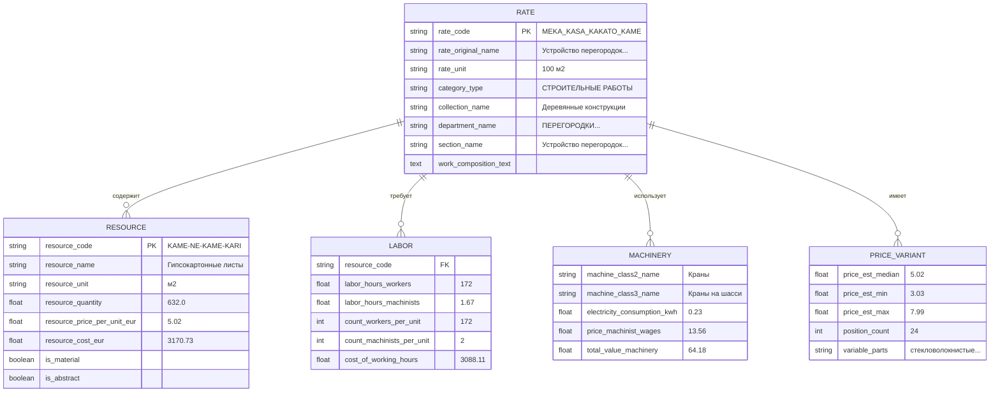
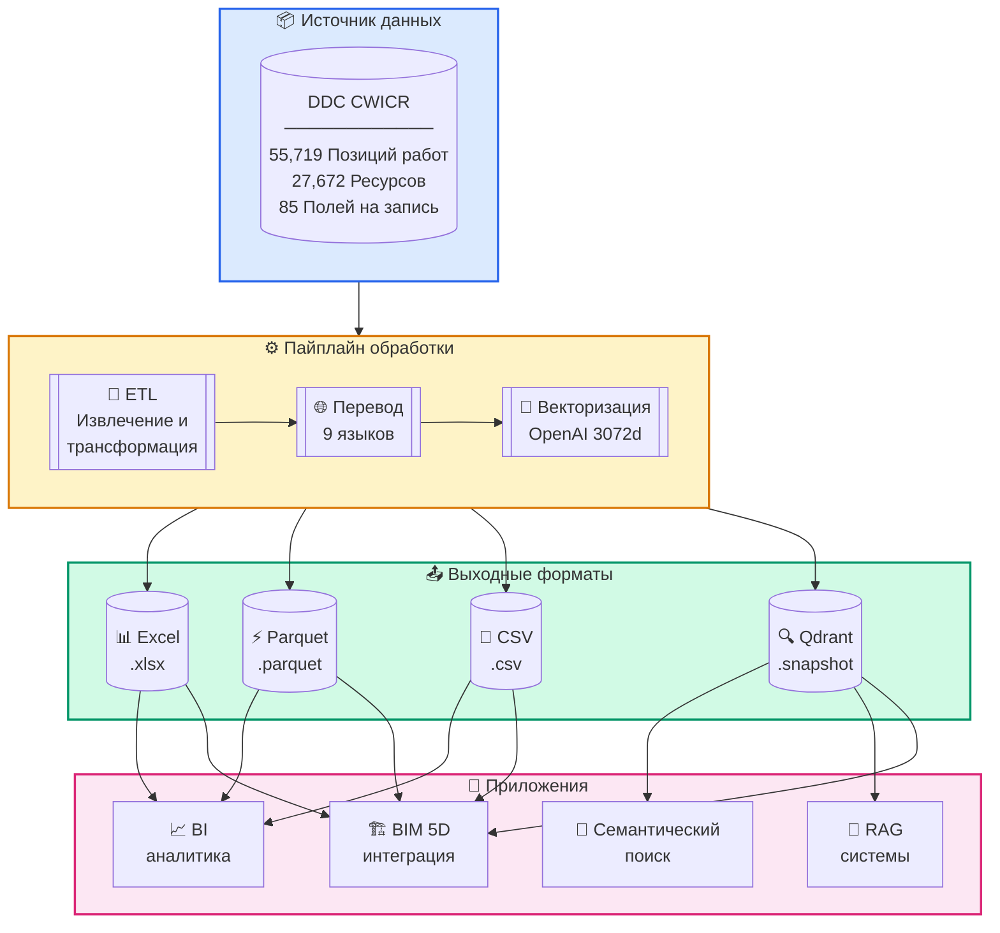
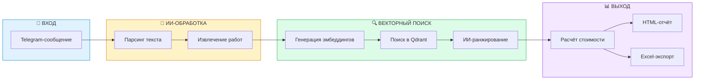
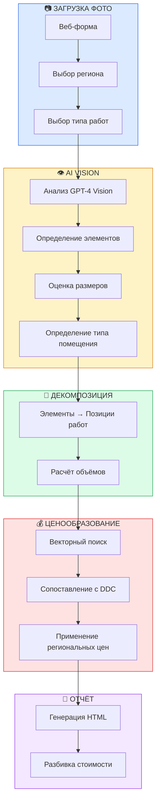
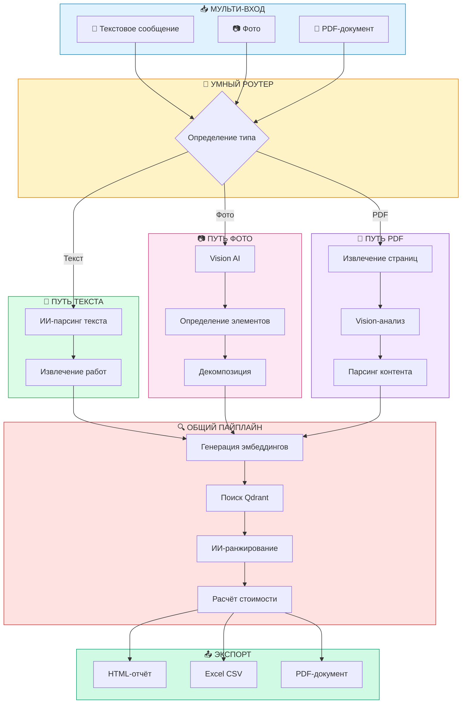
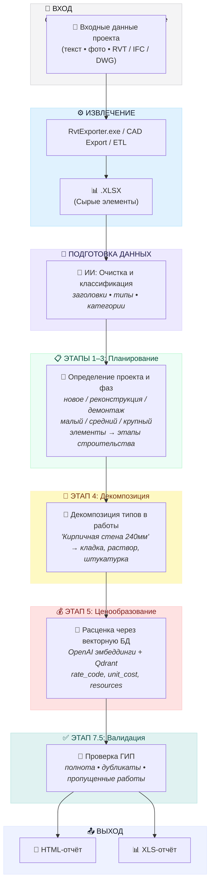

<h3 align="center">DDC CWICR - База данных строительных работ, компонентов и ресурсов</br>
  + Пайплайны n8n для расчёта смет по описаниям, фото и CAD (BIM)</h3>

<p align="center">
  <a href="README.md">English</a> •
  <a href="README.zh-CN.md">中文</a> •
  <a href="README.es.md">Español</a> •
  <a href="README.pt-BR.md">Português</a> •
  <a href="README.ru.md"><b>Русский</b></a> •
  <a href="README.ja.md">日本語</a> •
  <a href="README.de.md">Deutsch</a> •
  <a href="README.fr.md">Français</a>
</p>

<p align="center">
  
</p>

<div align="center">
  
  
  
  
</div>

<div align="center">
  
  
  
  
  
</div>

<p align="center">
  
</p>

<h3 align="center">⚡ Воркфлоу n8n</h3>
<p align="center"><code>Выберите тип ввода → Получите смету</code></p>

<br>

<table width="100%">
<tr>

<td align="center" valign="top" width="33%">
<br>
<h3>📝 Текст</h3>
<p>Быстрая смета<br>по короткому описанию</p>
<p><b>Вход:</b> Telegram / чат-сообщение<br>
<b>Выход:</b> Подобранные работы + смета</p>
<br>
<a href="#1️⃣-текстовый-бот-сметчик">📖 Документация</a>
<br><br>
<a href="./n8n_1_Telegram_Bot_Cost_Estimates_and_Rate_Finder_TEXT_DDC_CWICR.json">

</a>
<br><br>
</td>

<td align="center" valign="top" width="33%">
<br>
<h3>📷 Фото / PDF</h3>
<p>Фото со стройки, сканы ВОР,<br>PDF-документы</p>
<p><b>Вход:</b> Изображение или PDF<br>
<b>Выход:</b> Извлечённые работы → смета</p>
<br>
<a href="#2️⃣-фото-сметчик">📖 Фото</a> · <a href="#3️⃣-универсальный-бот-текст--фото--pdf">📖 Универсальный бот</a>
<br><br>
<a href="./n8n_2_Photo_Cost_Estimate_DDC_CWICR.json">

</a>
&nbsp;
<a href="./n8n_3_Telegram_Bot_Cost_Estimates_and_Rate_Finder_TEXT_PHOTO_PDF_DDC_CWICR.json">

</a>
<br><br>
</td>

<td align="center" valign="top" width="33%">
<br>
<h3>🧊 CAD / BIM</h3>
<p>Сметы на основе Revit / IFC / DWG<br>с расчётом объёмов</p>
<p><b>Вход:</b> Экспорт модели<br>
<b>Выход:</b> 4D/5D смета + разбивка</p>
<br>
<a href="#4️⃣-пайплайн-сметы-cad-bim">📖 Документация</a>
<br><br>
<a href="./n8n_4_CAD_(BIM)_Cost_Estimation_Pipeline_4D_5D_with_DDC_CWICR.json">

</a>
<br><br>
</td>

</tr>
</table>

<br>
<p align="center">
  <a href="https://openconstructionestimate.com">
    
  </a>
</p>
<br>
<p align="center">
 Клиенты и пользователи DataDrivenConstruction
  <br>
  <a href="https://datadrivenconstruction.io/">
  
  </a>
  <br></br>
</p>


---

## 📑 Содержание

### Интеграция с ИИ
- [Идеальное топливо для ИИ](#-идеальное-топливо-для-ваших-ии-продуктов) — Почему эта база идеальна для ИИ
- [Claude Code](#-claude-code--ии-ассистент-программиста) — Работа с ИИ-ассистентом
- [n8n](#-n8n--визуальная-автоматизация-процессов) — Автоматизация воркфлоу
- [Dify](#-dify--создание-llm-приложений) — Разработка LLM-приложений
- [Sim AI и другие](#-sim-ai-и-аналогичные-платформы) — Совместимые платформы
- [Универсальные сценарии](#-универсальные-сценарии-использования) — Что можно создать

### База данных
- [О проекте](#о-проекте) — Что такое DDC CWICR
- [Доступные форматы](#доступные-форматы) — Excel, Parquet, CSV, Qdrant
- [Схема данных](#схема-данных) — Структура из 85 полей
- [Группы полей](#группы-полей) — Классификация, Ресурсы, Труд, Механизмы
- [Методология](#методология) — Принципы ресурсного расчёта
- [Исторический контекст](#исторический-контекст) — 100+ лет стандартов

### Воркфлоу n8n
- [Обзор воркфлоу n8n](#-воркфлоу-n8n) — Выбор типа ввода
- [Попробуйте сейчас — Демо-боты](#-попробуйте-сейчас--демо-боты) — Тестирование в Telegram
- [Воркфлоу 1: Текстовый бот](#1️⃣-текстовый-бот-сметчик) — Telegram-бот для текста
- [Воркфлоу 2: Фото-сметчик](#2️⃣-фото-сметчик) — Веб-форма с AI Vision
- [Воркфлоу 3: Универсальный бот](#3️⃣-универсальный-бот-текст--фото--pdf) — Текст + Фото + PDF
- [Воркфлоу 4: CAD/BIM пайплайн](#4️⃣-пайплайн-сметы-cad-bim) — Revit/IFC/DWG в смету
- [Быстрый старт воркфлоу](#быстрый-старт-воркфлоу) — Настройка за 4 шага
- [⚠️ Настройка n8n 2.0+](#️-настройка-n8n-20) — Включение Execute Command

### Детали CAD/BIM пайплайна
- [Требования](#-требования) — Необходимые компоненты
- [Этапы пайплайна](#-этапы-пайплайна) — 10-этапная обработка
- [Выбор LLM-модели](#️-выбор-llm-модели) — OpenAI, Claude, Gemini, Grok
- [Выходные файлы](#-выходные-файлы) — HTML и Excel отчёты
- [Устранение неполадок](#️-устранение-неполадок) — Частые проблемы

### Векторная база данных
- [Векторная база данных](#векторная-база-данных) — Семантический поиск с Qdrant
- [Релизы](#релизы) — Скачивание снапшотов
- [Коллекции](#коллекции) — 9 языковых коллекций
- [Развёртывание Docker](#развёртывание-docker) — Self-hosted установка

### Начало работы
- [Быстрый старт - Python](#быстрый-старт) — Табличные данные и семантический поиск
- [Сценарии интеграции](#интеграция) — От начального до продвинутого уровня

### Сообщество
- [Ресурсы и сообщество](#ресурсы-и-сообщество) — Ссылки и каналы
- [Консалтинг и обучение](#консалтинг-и-обучение) — Профессиональные услуги
- [Участие в проекте](#участие-в-проекте) — Отправка своих воркфлоу
- [Лицензия](#лицензия) — CC BY 4.0 и MIT
- [Поддержать проект](#поддержать-проект) — Спонсорство и донаты


---

## 🚀 Идеальное топливо для ваших ИИ-продуктов

<p align="center">
  <b>Просто клонируйте репозиторий и опишите, что хотите — ИИ сделает остальное</b>
</p>

DDC CWICR — это не просто база данных, это **готовое топливо для ИИ-приложений**. Создаёте ли вы бота для расчёта смет, автоматизируете строительные процессы или делаете интеллектуального помощника — эти данные работают из коробки с современными ИИ-инструментами.

### Почему эта база идеальна для ИИ

| Особенность | Преимущество |
|-------------|--------------|
| **Готовые эмбеддинги** | Не нужно генерировать векторы — семантический поиск работает сразу |
| **Структурированная схема из 85 полей** | ИИ может анализировать связи данных и давать точные ответы |
| **9 языков в комплекте** | Создавайте мультиязычные приложения без затрат на перевод |
| **55 000+ позиций работ** | Полное покрытие любых задач сметного расчёта |
| **Ресурсная методология** | Прозрачные данные, которые ИИ может объяснить и декомпозировать |

### 🛠️ Отлично работает с

<table>
<tr>
<td align="center" width="25%">
<br/>
<b>Claude Code</b><br/>
<sub>ИИ-ассистент программиста CLI</sub>
</td>
<td align="center" width="25%">
<br/>
<b>n8n</b><br/>
<sub>Автоматизация воркфлоу</sub>
</td>
<td align="center" width="25%">
<br/>
<b>Dify</b><br/>
<sub>Разработка LLM-приложений</sub>
</td>
<td align="center" width="25%">
<br/>
<b>Sim AI и другие</b><br/>
<sub>ИИ-платформы</sub>
</td>
</tr>
<tr>
<td align="center" width="25%">
<br/>
<b>Google Antigravity</b><br/>
<sub>Google Antigravity</sub>
</td>
</tr>
</table>

---

### 💻 Claude Code — ИИ-ассистент программиста

Самый быстрый способ работы с DDC CWICR. Просто откройте репозиторий в Claude Code и задавайте вопросы на естественном языке.

**Начало работы:**
```bash
# Клонировать репозиторий
git clone https://github.com/datadrivenconstruction/OpenConstructionEstimate-DDC-CWICR.git

# Открыть в Claude Code
cd OpenConstructionEstimate-DDC-CWICR
claude
```

**Примеры промптов:**

| Задача | Промпт |
|--------|--------|
| **Исследовать данные** | "Покажи структуру этой строительной базы данных и объясни, какие данные доступны" |
| **Найти позиции** | "Найди все позиции, связанные с бетонными фундаментами, и покажи их стоимость" |
| **Создать запросы** | "Напиши Python-скрипт для поиска сантехнических работ с трудозатратами > 100 часов" |
| **Создать отчёты** | "Сгенерируй отчёт по стоимости работ для ремонта жилого помещения" |
| **Анализ стоимости** | "Сравни стоимость материалов для разных методов возведения стен" |
| **Интеграции** | "Создай скрипт для подключения к Qdrant и семантического поиска" |

**Советы:**
- Указывайте Claude на конкретные файлы: *"Проанализируй Parquet-файл и суммируй распределение затрат"*
- Просите объяснения: *"Объясни, как работает ресурсная методология расчёта в этой базе данных"*
- Запрашивайте модификации: *"Модифицируй воркфлоу n8n, чтобы добавить email-уведомления"*

---

### ⚡ n8n — Визуальная автоматизация процессов

Создавайте мощные автоматизированные пайплайны без программирования. Подключайте DDC CWICR к 400+ приложениям и сервисам.

**Сценарии использования:**

| Воркфлоу | Описание |
|----------|----------|
| **Telegram-бот** | Пользователь отправляет текст/фото → ИИ извлекает работы → Возвращает смету |
| **Email-автоматизация** | Получение ВОР по email → Обработка ИИ → Отправка форматированной сметы |
| **Интеграция с CRM** | Новый проект в CRM → Автогенерация предварительной сметы → Обновление суммы сделки |
| **BIM-пайплайн** | Экспорт из Revit → Извлечение объёмов → Сопоставление с расценками DDC → Генерация 5D-отчёта |
| **Slack-бот** | Команда задаёт вопросы → ИИ ищет в базе → Возвращает релевантные позиции |

**Быстрый старт:**
1. Скачайте JSON воркфлоу из этого репозитория
2. Импортируйте в n8n: `Workflows → Import → From File`
3. Настройте учётные данные (OpenAI, Qdrant, Telegram)
4. Активируйте и тестируйте

Смотрите раздел [Воркфлоу n8n](#воркфлоу-n8n--подробное-описание) для детальной настройки.

---

### 🤖 Dify — Создание LLM-приложений

Создавайте кастомные ИИ-приложения с DDC CWICR в качестве базы знаний.

**Настройка:**
1. Создайте новое приложение Dify
2. Добавьте базу знаний → Загрузите Parquet/CSV файлы или подключите Qdrant
3. Настройте RAG-пайплайн с эмбеддингами
4. Создайте чат-интерфейс или API

**Идеи приложений:**

| Тип приложения | Описание |
|----------------|----------|
| **Чат-бот сметчика** | Диалоговый интерфейс для запросов о стоимости |
| **Поиск позиций** | Поиск на естественном языке среди 55 000+ позиций |
| **Консультант по стоимости** | ИИ, объясняющий структуру затрат и предлагающий оптимизации |
| **Мультиязычный помощник** | Автоопределение языка и ответ на языке пользователя |
| **API-эндпоинт** | REST API для интеграции с другими системами |

**Пример шаблона промпта для Dify:**
```
Вы — ассистент по расчёту строительных смет с доступом к базе данных DDC CWICR.

Контекст: {{context}}

Вопрос пользователя: {{query}}

Предоставьте точную информацию о стоимости на основе базы данных. Включите:
- Релевантные позиции работ с кодами
- Единичные расценки и объёмы
- Разбивку по ресурсам (труд, материалы, оборудование)
- Расчёт общей стоимости
```

---

### 🔮 Sim AI и аналогичные платформы

DDC CWICR интегрируется с любой ИИ-платформой, поддерживающей:
- **Векторные базы данных** (Qdrant, Pinecone, Weaviate, Milvus)
- **Структурированные данные** (CSV, Parquet, Excel)
- **OpenAI эмбеддинги** (text-embedding-3-large, 3072 измерения)

**Совместимые платформы:**
- **Sim AI** — ИИ-симуляция и моделирование
- **LangChain / LlamaIndex** — фреймворки для LLM-приложений
- **Flowise** — low-code конструктор LLM-приложений
- **Botpress** — платформа разговорного ИИ
- **Voiceflow** — дизайн голосовых и чат-интерфейсов
- **Stack AI** — no-code ИИ-воркфлоу
- **Relevance AI** — ИИ-платформа для рабочих процессов

**Универсальный паттерн интеграции:**

```python
# Работает с любой платформой, поддерживающей Qdrant
from qdrant_client import QdrantClient

# Подключение к DDC CWICR
client = QdrantClient("your-qdrant-instance", port=6333)

# Семантический поиск
results = client.search(
    collection_name="ddc_cwicr_ru",  # или en, de, zh и др.
    query_vector=your_embedding,
    limit=10
)

# Использование результатов в вашем ИИ-приложении
for item in results:
    print(f"{item.payload['rate_code']}: {item.payload['rate_original_name']}")
```

---

### 📋 Универсальные сценарии использования

Независимо от выбранного ИИ-инструмента, DDC CWICR позволяет:

| Сценарий | Описание |
|----------|----------|
| **Мгновенный расчёт сметы** | Получение стоимости строительства по текстовым описаниям или фото |
| **Генерация ВОР** | Автоматическое создание ведомости объёмов работ по описанию проекта |
| **Бенчмаркинг цен** | Сравнение стоимости по регионам и языкам |
| **Планирование ресурсов** | Расчёт трудозатрат, материалов и потребности в оборудовании |
| **Инвестиционный анализ** | Глубокий аудит затрат с полной прозрачностью ресурсов |
| **Мультиязычная поддержка** | Обслуживание пользователей на 9 языках с локализованными ценами |
| **BIM-интеграция** | Подключение к Revit/IFC для автоматизированного 4D/5D расчёта |
| **Обучение ИИ-моделей** | Использование структурированных данных для fine-tuning строительного ИИ |

---

## О проекте

**DDC CWICR** (Construction Work Items, Components & Resources) — открытая база данных для расчёта строительных смет, охватывающая полный спектр строительных работ — от земляных работ и бетонирования до специализированных монтажных работ.

База данных основана на источниках, описывающих современную строительную практику Евразии и Азиатско-Тихоокеанского региона, где единая система технической стандартизации служит общим инженерным языком для более чем десяти динамично развивающихся экономик. DDC CWICR представляет собой усилия по гармонизации открытых стандартов путём создания единой нормативной базы для управления капитальными проектами на нескольких языках.

<p align="center">
  <br>
  
  <br></br>
</p>

Структурированные данные доступны в табличных форматах (XLSX, CSV, Parquet) или могут запрашиваться в диалоговом режиме через LLM, позволяя специалистам интегрировать описания строительных работ (векторная база данных QDRANT) в автоматизированные пайплайны и воркфлоу с использованием естественного языка или коротких запросов.

### Доступные форматы

| Формат | Расширение | Размер | Лучше всего для | Особенности |
|--------|------------|--------|-----------------|-------------|
| **Excel** | `.xlsx` | ~150–400 МБ | Ручной анализ, фильтрация, сводные таблицы | Читаемый формат, полное форматирование |
| **Parquet** | `.parquet` | ~55 МБ | ETL-пайплайны, ML-обучение, Big Data | Колоночный формат, отличное сжатие |
| **CSV** | `.csv` | ~1.3 ГБ | Импорт в БД, legacy-системы | Универсальная совместимость |
| **Qdrant** | `.snapshot` | ~1 ГБ | Семантический поиск, RAG, ИИ-ассистенты | Готовые OpenAI эмбеддинги |


Демо доступно на [openconstructionestimate.com](https://openconstructionestimate.com/), где можно исследовать данные и увидеть векторную базу в действии для семантического поиска.

<p align="center">
  
</p>

---

## Схема данных

База данных содержит **85 полей**, организованных в логические группы. Каждая запись представляет собой позицию работ (расценку) или ресурс с полной разбивкой стоимости.



### Группы полей
85 полей базы данных организованы в логические группы, отражающие методологию ресурсного расчёта стоимости. Каждая группа выполняет определённую функцию в структуре разбивки затрат: от иерархической классификации и идентификации позиций работ до детального расхода ресурсов, требований к труду, затрат на механизмы и агрегированных итогов. Эта модульная структура позволяет пользователям запрашивать только релевантные поля для их задачи — будь то формирование ведомости материалов, анализ производительности труда или построение полной сметы.

<p align="center">
  <br>
  
  <br></br>
</p>

**Классификация** - `category_type`, `collection_code`, `collection_name`, `department_code`, `department_name`, `department_type`, `section_name`, `section_type`, `subsection_code`, `subsection_name`

**Позиция работ (Расценка)** - `rate_code`, `rate_original_name`, `rate_final_name`, `rate_unit`, `row_type`, `is_scope`, `is_abstract`, `is_machine`, `is_labor`, `is_material`, `work_composition_text`

**Ресурсы** - `resource_code`, `resource_name`, `resource_unit`, `resource_quantity`, `parameter_resource_quantity`, `resource_price_per_unit_eur_current`, `resource_cost_eur`

**Труд** - `count_workers_per_unit`, `count_engineers_per_unit`, `count_machinists_per_unit`, `count_total_people_per_unit`, `labor_hours_construction_workers`, `labor_hours_machinists`, `labor_hours_engineers`, `total_labor_hours_workers_machinists`, `total_labor_hours_all_personnel`, `cost_of_working_hours`, `count_people_per_day`

**Механизмы** - `machine_class2_name`, `machine_class3_name`, `personnel_machinist_code`, `personnel_machinist_grade`, `price_machinist_wages`, `price_relocation_included`, `price_cost_without_wages`, `electricity_consumption_kwh_per_machine_hour`, `electricity_cost_per_unit`, `electricity_cost_total_sum`, `cost_machinist_sum`, `total_value_machinery_equipment`

**Варианты цен** - `price_code_prefix`, `price_abstract_resource_common_start`, `price_abstract_resource_variable_parts`, `price_abstract_resource_position_count`, `price_abstract_resource_est_price_min`, `price_abstract_resource_est_price_max`, `price_abstract_resource_est_price_mean`, `price_abstract_resource_est_price_median`, `price_abstract_resource_unit`, `abstract_resource_tech_group`

**Агрегаты** - `total_cost_per_position`, `total_material_cost_per_position`, `total_resource_cost_per_position`, `total_value_abstract_resources`, `materials_resource_cost_eur`

**Масса и услуги** - `mass_name`, `mass_value`, `mass_unit`, `service_category`, `service_type`, `parameter_service_code`, `parameter_service_unit`, `parameter_service_name`, `parameter_service_quantity`, `service_cost_sum`

### Формула расчёта стоимости

| Компонент | Технологическая норма | × | Региональная цена | = | Стоимость |
|-----------|----------------------|---|-------------------|---|-----------|
| 👷 **Труд** | 172 ч/100м² | × | €17.95/ч | = | €3,088.11 |
| 🧱 **Материалы** | 632 м²/100м² | × | €5.02/м² | = | €3,170.73 |
| 🚜 **Оборудование** | 1.67 ч/100м² | × | €38.42/ч | = | €64.18 |
|  |  |  | **Итого** | = | **€7,725.91 на 100м²** |

---

## Методология

Ключевая ценность **Ресурсного метода расчёта** — отделение неизменной производственной технологии от волатильного финансового компонента. Он основан на физических "первых принципах" строительства:
- Трудозатраты, необходимые для конкретной работы
- Количество материалов на единицу работы
- Время работы оборудования

**Почему это важно:**

- **Прозрачность** — Ценообразование без скрытых наценок, полная разбивка по ресурсам
- **Проверяемость** — Возможность глубокого анализа для инвестиционной экспертизы и верификации
- **Переносимость** — Региональнонезависимые нормы, применимые на разных рынках
- **Проверенность** — Отраслевая стандартная методология, отработанная за 100+ лет




### Исторический контекст

Описания строительных работ в этой базе данных основаны на методологии ресурсной стандартизации, корни которой уходят от производственных норм начала XX века до современных цифровых справочных систем. Разработанный и непрерывно совершенствуемый с 1920-х годов, этот подход получил особенно активное развитие в Евразийском регионе.

За сто лет развития система перешла от ручных расчётов к машиночитаемым форматам — однако её основополагающий принцип остаётся неизменным: точное измерение физических ресурсов, требуемых на единицу строительной продукции. Современные реализации связывают исторические нормативные данные с актуальным рыночным ценообразованием.

Региональные адаптации этой методологии действуют под различными национальными наименованиями: ЕНИР, ГЭСН, ФЕР, НРР, ЭСН, AzДТН, ШНҚҚ, МКС ЧТ, СНТ, БНбД, Dinh Muc, Ding'e.

<p align="center">
  
</p>

⭐ <b>Если вы хотите видеть новые обновления и версии базы данных и если наши инструменты полезны для вас, поставьте звезду нашим репозиториям, чтобы увидеть больше подобных приложений для строительной отрасли.</b>
Поставьте звезду DDC workflow на GitHub и мгновенно получайте уведомления о новых релизах.
<p align="center">
  <br>
  
  <br></br>
</p>


---


## Интеграция

### Сценарии использования

- **Начальный уровень** — Бенчмаркинг стоимости, Индексация цен, Тендерный расчёт

- **Средний уровень** — Локализация, ETL/BI пайплайны, Расчёт CO₂

- **Продвинутый уровень** — Обучение ИИ/ML, CAD (BIM) 5D, Глубокий инвестиционный аудит

---

## Воркфлоу n8n — Подробное описание

Четыре готовых к продакшену воркфлоу для автоматизированного расчёта строительных смет. Каждый воркфлоу подключается к векторной базе данных DDC CWICR через Qdrant и использует ИИ-модели для интеллектуального парсинга и сопоставления.

| # | Воркфлоу | Вход | Лучше всего для | Скачать |
|---|----------|------|-----------------|---------|
| 1 | [Текстовый бот](#1️⃣-текстовый-бот-сметчик) | 💬 Текст | Быстрые сметы по тексту | [JSON](./n8n_1_Telegram_Bot_Cost_Estimates_and_Rate_Finder_TEXT_DDC_CWICR.json) |
| 2 | [Фото-сметчик](#2️⃣-фото-сметчик) | 📷 Фото | Осмотры на объекте, визуальные инспекции | [JSON](./n8n_2_Photo_Cost_Estimate_DDC_CWICR.json) |
| 3 | [Универсальный бот](#3️⃣-универсальный-бот-текст--фото--pdf) | 💬📷📄 Всё | Полнофункциональное продакшен использование | [JSON](./n8n_3_Telegram_Bot_Cost_Estimates_and_Rate_Finder_TEXT_PHOTO_PDF_DDC_CWICR.json) |
| 4 | [CAD/BIM пайплайн](#4️⃣-пайплайн-сметы-cad-bim) | 🏗️ Revit | Сметы на основе BIM 4D/5D | [JSON](./n8n_4_CAD_(BIM)_Cost_Estimation_Pipeline_4D_5D_with_DDC_CWICR.json) |

---

### 1️⃣ Текстовый бот-сметчик

**Файл:** `n8n_1_Telegram_Bot_Cost_Estimates_and_Rate_Finder_TEXT_DDC_CWICR.json`

Telegram-бот для расчёта смет по тексту. Опишите строительные работы на естественном языке — бот распарсит ввод, выполнит поиск в векторной базе и вернёт детальную разбивку стоимости.

<p align="center">
  <br>
  
  <br></br>
</p>

<h3 align="left">🤖 Попробуйте сейчас — Демо-боты</h3>
<p align="left"><i>Тестируйте воркфлоу сметного расчёта прямо в Telegram</i></p>
<p><b>@TextOpenConstructionEstimate_bot</b></p>
<p>Создавайте полные сметы<br>по текстовым описаниям</p>
<a href="https://t.me/TextOpenConstructionEstimate_bot">

</a>




**Как это работает:**

| Шаг | Действие | Технология |
|-----|----------|------------|
| 1 | Пользователь отправляет текстовое описание | Telegram Bot API |
| 2 | ИИ парсит и извлекает позиции работ | OpenAI / Claude / Gemini |
| 3 | Генерация эмбеддингов для каждой позиции | OpenAI `text-embedding-3-large` |
| 4 | Поиск подходящих расценок в базе | Векторный поиск Qdrant |
| 5 | ИИ ранжирует результаты для точности | LLM-скоринг |
| 6 | Расчёт стоимости и генерация отчёта | HTML / Excel / PDF |

**Возможности:**

| Функция | Описание |
|---------|----------|
| 💬 Ввод на естественном языке | Принимает любой формат текста — списки, предложения, структурированные описания |
| 🤖 Поддержка разных LLM | Работает с OpenAI, Claude или Gemini (переключаемые) |
| 🔍 Семантический поиск | Находит лучшие совпадения даже при другой формулировке |
| 🌍 9 языков | DE, EN, RU, ES, FR, PT, ZH, AR, HI |
| 📊 Множество экспортов | HTML-отчёт, Excel-таблица, PDF-документ |
| ✏️ Интерактивное редактирование | Изменение объёмов перед финальным расчётом |

**Необходимые учётные данные:**
- Telegram Bot Token (от @BotFather)
- OpenAI API Key (для эмбеддингов + опционально LLM)
- Qdrant URL + API Key

---

### 2️⃣ Фото-сметчик

**Файл:** `n8n_2_Photo_Cost_Estimate_DDC_CWICR.json`

Веб-форма для расчёта смет по фото. Загрузите фото со стройки — AI Vision определит элементы, оценит размеры и автоматически рассчитает стоимость.

<p align="center">
  <br>
  
  <br></br>
</p>




**Как это работает:**

| Шаг | Действие | Технология |
|-----|----------|------------|
| 1 | Пользователь загружает фото через веб-форму | n8n Form Trigger |
| 2 | AI Vision анализирует изображение | GPT-4 Vision |
| 3 | Определение типа помещения, элементов, материалов | Структурированное извлечение JSON |
| 4 | Оценка размеров по эталонным объектам | ИИ-рассуждения (двери, плитка и др.) |
| 5 | Декомпозиция элементов в позиции работ | LLM-обработка |
| 6 | Расценка каждой работы через векторный поиск | Qdrant + OpenAI эмбеддинги |
| 7 | Генерация профессионального HTML-отчёта | Стилизованный вывод |

**Возможности:**

| Функция | Описание |
|---------|----------|
| 📷 Анализ фото | GPT-4 Vision определяет строительные элементы |
| 📐 Автоопределение размеров | Оценивает габариты по эталонным объектам (двери, плитка) |
| 🏠 Определение помещения | Ванная, кухня, спальня, экстерьер и др. |
| 🔨 Поддержка типов работ | Новое строительство / Реконструкция / Ремонт |
| 🌍 9 региональных баз | Цены локализованы для Берлина, Торонто, Парижа и др. |
| 📄 Профессиональные отчёты | Чистый HTML-вывод, готовый для клиентов |

**Необходимые учётные данные:**
- OpenAI API Key (GPT-4 Vision + эмбеддинги)
- Qdrant URL + API Key

---

### 3️⃣ Универсальный бот (Текст + Фото + PDF)

**Файл:** `n8n_3_Telegram_Bot_Cost_Estimates_and_Rate_Finder_TEXT_PHOTO_PDF_DDC_CWICR.json`

Полнофункциональный Telegram-бот, поддерживающий все типы ввода: текстовые описания, фото со стройки и PDF-планы этажей. Наиболее полный воркфлоу для продакшен использования.


<p align="center">
  <br>
  
  <br></br>
</p>

<h3 align="left">🤖 Попробуйте сейчас — Демо-боты</h3>
<p align="left"><i>Тестируйте воркфлоу сметного расчёта прямо в Telegram</i></p>
<h3>📷 Универсальный бот</h3>
<p><b>@OpenConstructionEstimate_bot</b></p>
<p>Полнофункциональный бот для текста, фото и PDF</p>
<a href="https://t.me/OpenConstructionEstimate_bot">

</a>
<br><br>





**Как это работает:**

| Шаг | Действие | Технология |
|-----|----------|------------|
| 1 | Пользователь отправляет текст, фото или PDF | Telegram Bot API |
| 2 | Роутер определяет тип ввода | Анализ content-type |
| 3a | **Текст:** ИИ парсит позиции работ | OpenAI / Gemini |
| 3b | **Фото:** Vision AI извлекает элементы | GPT-4 Vision / Gemini 2.0 |
| 3c | **PDF:** Извлечение и анализ страниц | PDF-обработка + Vision |
| 4 | Семантический поиск в DDC CWICR | Векторная база Qdrant |
| 5 | ИИ-ранжирование для лучших совпадений | LLM-скоринг |
| 6 | Интерактивное редактирование через меню бота | Telegram inline-клавиатуры |
| 7 | Экспорт результатов | HTML / Excel / PDF |

**17 действий бота:**

| Действие | Описание |
|----------|----------|
| `/start` | Меню выбора языка |
| Загрузка фото | Запуск AI Vision анализа |
| Текстовое сообщение | Парсинг и извлечение работ |
| Загрузка PDF | Обработка планов этажей |
| Редактирование объёмов | Изменение перед расчётом |
| Добавить работу | Ручной ввод позиции |
| Рассчитать | Запуск полного сметного расчёта |
| Просмотр деталей | Показ ресурсов для каждой позиции |
| Экспорт Excel | Скачивание CSV-таблицы |
| Экспорт PDF | Генерация PDF-отчёта |
| Помощь | Показ инструкций по использованию |
| Уточнить | Повторный анализ с корректировками |

**Возможности:**

| Функция | Описание |
|---------|----------|
| 📷 Двойной Vision AI | Gemini 2.0 Flash или GPT-4 Vision (настраиваемый) |
| 📄 Обработка PDF | Планы этажей, сканы ВОР, документы |
| 💬 Умный парсинг текста | Обрабатывает списки, таблицы, свободный текст |
| 🔍 ИИ-ранжирование | Улучшает точность сопоставления |
| ✏️ Полное редактирование | Добавление, удаление, изменение позиций работ |
| 📊 Множество экспортов | HTML, Excel, PDF |
| 🌍 9 языков | Полная локализация |

**Необходимые учётные данные:**
- Telegram Bot Token
- OpenAI API Key (эмбеддинги)
- Gemini API Key (Vision) или OpenAI GPT-4 Vision
- Qdrant URL + API Key

---

### 4️⃣ Пайплайн сметы CAD (BIM)

**Файл:** `n8n_4_CAD_(BIM)_Cost_Estimation_Pipeline_4D_5D_with_DDC_CWICR.json`

Автоматизированный расчёт смет по моделям Revit/IFC/DWG. Извлекает BIM-данные, классифицирует элементы, декомпозирует в позиции работ и генерирует 4D/5D сметы с полной разбивкой по ресурсам.

<p align="left">
  <a href="https://datadrivenconstruction.io">
    
  </a>
</p>




**n8n предоставляет 400+ нативных интеграций** с платформами типа Google Sheets, Notion, Slack, Airtable, базами данных (PostgreSQL, MongoDB), облачными хранилищами и многим другим. Каждая нода в этом воркфлоу модульная — вы можете:

- 🔄 **Менять LLM-провайдеров** (OpenAI ↔ Claude ↔ Gemini ↔ Grok)
- 📊 **Подключаться к вашей ERP или системе управления проектами**
- 📁 **Экспортировать результаты куда угодно** (облачное хранилище, email, дашборды)
- 🔧 **Модифицировать любой этап** под вашу методологию расчёта

Воркфлоу полностью ваш для адаптации. Никаких ограничений. Никаких лицензионных платежей. Полный контроль.

---

## 📋 Требования

| Компонент | Требование | Описание |
|-----------|------------|----------|
| **[n8n](https://n8n.io/)** | v1.0+ (v2.0+ требует [настройки](#️-настройка-n8n-20)) | Платформа автоматизации воркфлоу для оркестрации пайплайна сметного расчёта |
| **[Qdrant](https://qdrant.tech/)** | Облачный или self-hosted инстанс | Векторная база данных для семантического поиска по позициям строительных работ |
| **[OpenAI API](https://platform.openai.com/)** | Для эмбеддингов (`text-embedding-3-large`) | Генерирует векторные эмбеддинги для BIM-элементов и сопоставления с базой расценок |
| **LLM API** | OpenAI / Claude / Gemini / xAI Grok | ИИ-модели для классификации позиций работ и генерации смет |
| **[DDC Converter](https://github.com/datadrivenconstruction/cad2data-Revit-IFC-DWG-DGN-pipeline-with-conversion-validation-qto)** | `RvtExporter.exe` | Извлекает BIM-данные из моделей Revit в Excel/JSON для обработки |

---

## Быстрый старт воркфлоу

### Шаг 1: Импорт воркфлоу

```
n8n → New workflow → Import from File → Выбрать JSON
```

### Шаг 2: Настройка учётных данных

В ноде **🔑 TOKEN** установите ваши API-ключи:

```json
{
  "bot_token": "ВАШ_TELEGRAM_BOT_TOKEN",
  "OPENAI_API_KEY": "ВАШ_OPENAI_KEY",
  "GEMINI_API_KEY": "ВАШ_GEMINI_KEY",
  "QDRANT_URL": "http://localhost:6333",
  "QDRANT_API_KEY": ""
}
```

### Шаг 3: Загрузка DDC CWICR в Qdrant

Скачайте снапшот из [Релизов](#релизы) и импортируйте:

```bash
curl -X POST "http://localhost:6333/collections/ddc_cwicr_ru/snapshots/upload" \
  -H "Content-Type: multipart/form-data" \
  -F "snapshot=@RU_SPB_workitems_EMBEDDINGS_3072_DDC.snapshot"
```

### Шаг 4: Активация и тест

- Активируйте воркфлоу в n8n
- Для Telegram-ботов: отправьте `/start` вашему боту
- Для веб-форм: откройте URL формы, предоставленный n8n

---

## ⚠️ Настройка n8n 2.0+

> **Начиная с версии n8n 2.0, нода Execute Command отключена по умолчанию по соображениям безопасности.**
>
> Без настройки ниже воркфлоу, использующие Execute Command (особенно CAD/BIM пайплайн) **не будут работать** — ноды будут показываться с вопросительным знаком или не распознаваться.

### Быстрое решение

**Windows (CMD) — запускать каждый раз:**
```cmd
set NODES_EXCLUDE=[] && npx n8n
```

**Постоянное решение — создать один раз:**

Создайте файл `C:\Users\ВАШ_ПОЛЬЗОВАТЕЛЬ\.n8n\.env` с содержимым:
```
NODES_EXCLUDE=[]
```
Затем просто запускайте `npx n8n` как обычно.

**Docker:**
```yaml
environment:
  - NODES_EXCLUDE=[]
```

### Проверка настройки

1. Запустите n8n
2. Нажмите **+** → поищите **"Execute Command"**
3. Если нода появилась → ✅ всё готово!

> 📚 Подробнее: [n8n 2.0 Breaking Changes](https://docs.n8n.io/2-0-breaking-changes/)

---

## 🌍 Поддерживаемые языки и уровни цен

| Код | Язык | Уровень цен | Валюта | Коллекция Qdrant |
|-----|------|-------------|--------|------------------|
| `AR` | Арабский | Дубай | AED | `ddc_cwicr_ar` |
| `DE` | Немецкий | Берлин | EUR | `ddc_cwicr_de` |
| `EN` | Английский | Торонто | CAD | `ddc_cwicr_en` |
| `ES` | Испанский | Барселона | EUR | `ddc_cwicr_es` |
| `FR` | Французский | Париж | EUR | `ddc_cwicr_fr` |
| `HI` | Хинди | Мумбаи | INR | `ddc_cwicr_hi` |
| `PT` | Португальский | Сан-Паулу | BRL | `ddc_cwicr_pt` |
| `RU` | Русский | Санкт-Петербург | RUB | `ddc_cwicr_ru` |
| `ZH` | Китайский | Шанхай | CNY | `ddc_cwicr_zh` |

---

## 📊 Этапы пайплайна

CAD/BIM воркфлоу обрабатывает данные через 10 этапов:

| Этап | Название | Описание |
|------|----------|----------|
| **0** | Сбор BIM-данных | Извлечение элементов из Revit через DDC Converter |
| **1** | Определение проекта | ИИ определяет тип проекта (Жилой, Коммерческий и др.) |
| **2** | Генерация фаз | ИИ создаёт этапы строительства |
| **3** | Назначение элементов | ИИ сопоставляет BIM-типы с фазами |
| **4** | Декомпозиция работ | ИИ разбивает типы на позиции работ ("Кирпичная стена" → кладка, раствор) |
| **5** | Векторный поиск | Поиск подходящих расценок в DDC CWICR через Qdrant |
| **6** | Сопоставление единиц | Конвертация единиц BIM в единицы расценок |
| **7** | Расчёт стоимости | Объём × Единичная цена для каждой позиции |
| **7.5** | Валидация | Проверка ГИП на полноту и дубликаты |
| **8** | Агрегация | Суммирование по фазам и категориям |
| **9** | Генерация отчёта | Создание HTML и Excel выходов |

---

## ⚙️ Выбор LLM-модели

Воркфлоу поддерживает несколько ИИ-провайдеров. Активируйте предпочтительную модель в секции **LLM Models**:

| Модель | Название ноды | Статус |
|--------|---------------|--------|
| OpenAI GPT-4o | `OpenAI LLM` | ✅ По умолчанию |
| Claude Opus 4 | `Anthropic Chat Model2` | Отключена |
| Gemini 2.5 Pro | `Google Gemini Chat Model` | Отключена |
| xAI Grok | `xAI Grok Chat Model1` | Отключена |
| DeepSeek | `DeepSeek Chat Model` | Отключена |

Для переключения моделей: **Включите** нужную ноду модели и **Отключите** остальные.

---

## 📁 Выходные файлы

Отчёты сохраняются в папку проекта:
```
project_YYYY-MM-DD.html   ← Интерактивный отчёт (открывается в браузере)
project_YYYY-MM-DD.xls    ← Excel-совместимая таблица
```
<p align="center">
  <br>
  
  <br></br>
</p>

---

## 🔗 Коллекции Qdrant

Воркфлоу автоматически выбирает правильную коллекцию на основе `language_code`:

```
{LANG}_{CITY}_workitems_costs_resources_EMBEDDINGS_3072_DDC_CWICR
```

Пример: `RU_SPB_workitems_costs_resources_EMBEDDINGS_3072_DDC_CWICR`

---

## ⚠️ Устранение неполадок

| Проблема | Решение |
|----------|---------|
| "Execute Command missing" (n8n 2.0+) | Установите переменную окружения `NODES_EXCLUDE=[]`. См. [Настройка n8n 2.0+](#️-настройка-n8n-20) |
| "No Excel file found" | Проверьте пути `path_to_converter` и `project_file` |
| "Qdrant connection failed" | Проверьте Qdrant URL и API key в учётных данных |
| "Rate limit exceeded" | Уменьшите размер батча или добавьте задержки между API-вызовами |
| "No pricing found" | Проверьте, существует ли нужная языковая коллекция в Qdrant |
| "Telegram webhook error" | Убедитесь, что воркфлоу активен и URL вебхука доступен |
| "Vision API failed" | Проверьте валидность Gemini или OpenAI Vision API key |

---

## Векторная база данных

Готовые к использованию коллекции Qdrant с эмбеддингами OpenAI `text-embedding-3-large` для семантического поиска по позициям строительных работ.

Векторные базы данных позволяют "общаться" с вашими данными на естественном языке — используя простые предложения или короткие фразы вместо кода или сложных фильтров. Это значительно ускоряет поиск нужной позиции работ или строки расценки даже в очень больших наборах данных.

Эти коллекции Qdrant можно подключить к приложению через современные автоматизации и интеграционные воркфлоу (например, low-code/no-code инструменты Workflow и Pipeline). Вы можете создавать ассистентов, которые ищут, фильтруют и объясняют позиции строительных работ, или интегрировать семантический поиск напрямую в ваши существующие инструменты сметного расчёта и управления проектами.

---

### Релизы

Скачайте QDRANT и CSV датасеты (файлы размером более 1 гигабайта) из [GitHub Releases](https://github.com/datadrivenconstruction/OpenConstructionEstimate-DDC-CWICR/releases).

| Язык | Регион | CSV-файлы | Qdrant Snapshot |
|------|--------|-----------|-----------------|
| 🇸🇦 Арабский | Дубай | `AR_DUBAI_*.csv` | `AR_DUBAI_*_EMBEDDINGS_3072_DDC.snapshot` |
| 🇨🇳 Китайский | Шанхай | `ZH_SHANGHAI_*.csv` | `ZH_SHANGHAI_*_EMBEDDINGS_3072_DDC.snapshot` |
| 🇩🇪 Немецкий | Берлин | `DE_BERLIN_*.csv` | `DE_BERLIN_*_EMBEDDINGS_3072_DDC.snapshot` |
| 🇬🇧 Английский | Торонто | `EN_TORONTO_*.csv` | `EN_TORONTO_*_EMBEDDINGS_3072_DDC.snapshot` |
| 🇪🇸 Испанский | Барселона | `ES_BARCELONA_*.csv` | `ES_BARCELONA_*_EMBEDDINGS_3072_DDC.snapshot` |
| 🇫🇷 Французский | Париж | `FR_PARIS_*.csv` | `FR_PARIS_*_EMBEDDINGS_3072_DDC.snapshot` |
| 🇮🇳 Хинди | Мумбаи | `HI_MUMBAI_*.csv` | `HI_MUMBAI_*_EMBEDDINGS_3072_DDC.snapshot` |
| 🇧🇷 Португальский | Сан-Паулу | `PT_SAOPAULO_*.csv` | `PT_SAOPAULO_*_EMBEDDINGS_3072_DDC.snapshot` |
| 🇷🇺 Русский | Санкт-Петербург | `RU_SPB_*.csv` | `RU_SPB_*_EMBEDDINGS_3072_DDC.snapshot` |

<a href="https://github.com/datadrivenconstruction/OpenConstructionEstimate-DDC-CWICR/releases/tag/v0.1.0">
  
</a>

### Коллекции

🇸🇦 `ddc_cwicr_ar` (Арабский) · 🇨🇳 `ddc_cwicr_zh` (Китайский) · 🇩🇪 `ddc_cwicr_de` (Немецкий) · 🇬🇧 `ddc_cwicr_en` (Английский) · 🇪🇸 `ddc_cwicr_es` (Испанский) · 🇫🇷 `ddc_cwicr_fr` (Французский) · 🇮🇳 `ddc_cwicr_hi` (Хинди) · 🇧🇷 `ddc_cwicr_pt` (Португальский) · 🇷🇺 `ddc_cwicr_ru` (Русский)

Каждая коллекция содержит **55,719 векторов** с полными метаданными в payload.

### Развёртывание Docker

```yaml
# docker-compose.yml
services:
  qdrant:
    image: qdrant/qdrant:latest
    container_name: ddc-cwicr-qdrant
    ports:
      - "6333:6333"
      - "6334:6334"
    volumes:
      - qdrant_storage:/qdrant/storage
      - ./snapshots:/qdrant/snapshots
    environment:
      - QDRANT__LOG_LEVEL=INFO
    restart: unless-stopped

volumes:
  qdrant_storage:
```

```bash
# Запуск
docker-compose up -d

# Импорт снапшота
curl -X POST "http://localhost:6333/collections/ddc_cwicr_ru/snapshots/upload" \
  -H "Content-Type: multipart/form-data" \
  -F "snapshot=@ddc_cwicr_ru.snapshot"

# Дашборд: http://localhost:6333/dashboard
```
---

## Быстрый старт

### Python - Табличные данные

```python
import pandas as pd

# Parquet (рекомендуется)
df = pd.read_parquet("DDC_CWICR_RU.parquet")

# Excel
df = pd.read_excel("DDC_CWICR_RU.xlsx")

print(f"Записей: {len(df):,} | Полей: {len(df.columns)}")
print(df[['rate_code', 'rate_original_name', 'rate_unit', 'total_cost_per_position']].head())
```

### Python - Семантический поиск

```python
from qdrant_client import QdrantClient
from openai import OpenAI

client = QdrantClient("localhost", port=6333)
openai = OpenAI()

# Поиск на естественном языке
query = "заливка железобетонного фундамента"
embedding = openai.embeddings.create(
    input=query,
    model="text-embedding-3-large"
).data[0].embedding

results = client.search(
    collection_name="ddc_cwicr_ru",
    query_vector=embedding,
    limit=5
)

for r in results:
    print(f"[{r.score:.3f}] {r.payload['rate_code']}: {r.payload['rate_original_name']}")
```

### Фильтрованный поиск

```python
from qdrant_client.models import Filter, FieldCondition, MatchValue, Range

# По разделу
results = client.search(
    collection_name="ddc_cwicr_ru",
    query_vector=embedding,
    query_filter=Filter(must=[
        FieldCondition(key="department_name", match=MatchValue(value="Бетонные и железобетонные конструкции"))
    ]),
    limit=10
)

# По диапазону цен
results = client.search(
    collection_name="ddc_cwicr_ru",
    query_vector=embedding,
    query_filter=Filter(must=[
        FieldCondition(key="price_est_median", range=Range(gte=1000, lte=50000))
    ]),
    limit=10
)
```


---

## Ресурсы и сообщество

[](https://datadrivenconstruction.io)
[](https://openconstructionestimate.com)
[](https://github.com/datadrivenconstruction)
[](https://youtube.com/@datadrivenconstruction)
[](https://linkedin.com/company/datadrivenconstruction)
[](https://t.me/datadrivenconstruction)

### Консалтинг и обучение

Мы работаем с ведущими строительными, инженерными, консалтинговыми агентствами и технологическими компаниями по всему миру, помогая им внедрять принципы открытых данных, автоматизировать обработку CAD/BIM и создавать надёжные ETL-пайплайны. Мы активно поддерживаем организации, ищущие практические решения для цифровой трансформации и интероперабельности, фокусируясь на проблемах качества данных и классификации, одновременно продвигая внедрение открытых и автоматизированных воркфлоу.

Если вы хотите протестировать это решение на своих данных или заинтересованы в адаптации воркфлоу под реальные проектные задачи, свяжитесь с нами. Наша команда проводит практические воркшопы, предоставляет стратегический консалтинг и разрабатывает прототипы под реальные проектные процессы.

<a href="mailto:info@datadrivenconstruction.io">
  
</a>

### Участие в проекте

DDC CWICR — это бесплатный и открытый проект, посвящённый повышению эффективности, прозрачности и технологичности строительной отрасли. Мы активно ищем единомышленников, разделяющих эту миссию. Если вы создаёте полезные решения и готовы делиться ими с сообществом, мы здесь, чтобы помочь вам быть услышанными.

Мы приглашаем вас присылать ваши open source воркфлоу, пайплайны и интеграции на основе DDC CWICR — инструменты, которые каждый сможет свободно использовать в своей работе. Лучшие решения будут опубликованы с полным указанием авторства на GitHub и анонсированы через нашу рассылку и социальные сети, охватывающие десятки тысяч профессиональных подписчиков. Это поместит ваше имя непосредственно перед международным сообществом сметчиков, BIM-специалистов и проектных менеджеров.

Вместе мы меняем отрасль. Вы можете отправить своё решение на info@datadrivenconstruction.io с темой "DDC Open Workflow" или создать Pull Request напрямую в наши GitHub-репозитории.

Автоматизируйте обработку строительных данных с готовыми CAD-BIM n8n воркфлоу:

<a href="https://github.com/datadrivenconstruction/cad2data-Revit-IFC-DWG-DGN-pipeline-with-conversion-validation-qto">
  
</a>


## Лицензия

**База данных** (DDC CWICR) — [CC BY 4.0](https://creativecommons.org/licenses/by/4.0/). Свободное использование, распространение и коммерческая адаптация. Атрибуция: "DDC CWICR by DataDrivenConstruction"

**Код** (воркфлоу, скрипты) — [MIT](https://opensource.org/licenses/MIT). Свободное использование, модификация и распространение без ограничений.

## Поддержать проект

Если это полезно для вас, пожалуйста, рассмотрите поддержку:

[](https://github.com/sponsors/datadrivenconstruction)
[](https://buymeacoffee.com/boikoartem)


<p align="left">
  <br/>
  <b>Раскройте силу данных в строительстве</b><br/>
  <sub>Переходите к полноценному управлению данными, где остаются только унифицированные структурированные данные и процессы</sub>
</p>

<p align="left">
  <a href="https://datadrivenconstruction.io">
    
  </a>
</p>

---

<p align="center">
  <b>📖 Полная документация в <a href="README.md">английском README</a></b>
</p>

<p align="left">
  <sub>© 2025 Artem Boiko · <a href="https://datadrivenconstruction.io">datadrivenconstruction.io</a></sub>
</p>
