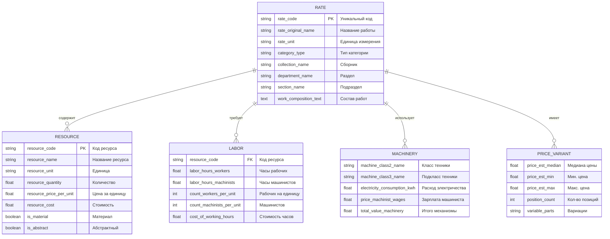
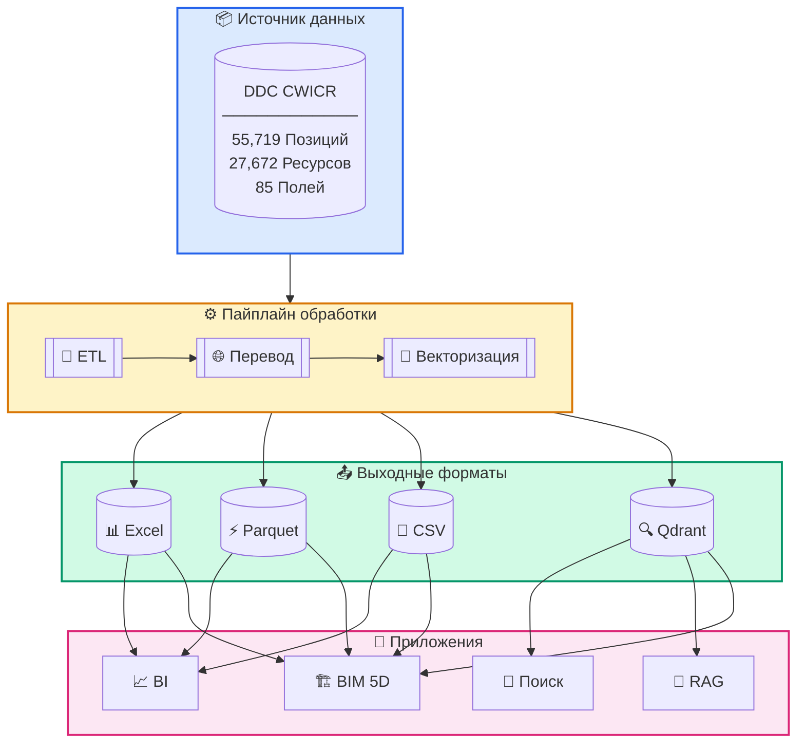

<h3 align="center">DDC CWICR - Construction Work Items, Components & Resources </br>
  + Пайплайны n8n для расчёта смет по описаниям, фотографиям и CAD (BIM)</h3>

<p align="center">
  <a href="README.md">🇬🇧 English</a> •
  <a href="README.zh-CN.md">🇨🇳 中文</a> •
  <a href="README.es.md">🇪🇸 Español</a> •
  <a href="README.pt-BR.md">🇧🇷 Português</a> •
  <a href="README.ru.md"><b>🇷🇺 Русский</b></a> •
  <a href="README.ja.md">🇯🇵 日本語</a> •
  <a href="README.de.md">🇩🇪 Deutsch</a> •
  <a href="README.fr.md">🇫🇷 Français</a>
</p>

<p align="center">
  
</p>

<div align="center">
  
  
  
  
</div>

<div align="center">
  
  
  
  
  
</div>

<p align="center">
  
</p>

<h3 align="center">⚡ n8n Воркфлоу</h3>
<p align="center"><code>Выберите тип ввода → Получите смету</code></p>

<br>

<table width="100%">
<tr>

<td align="center" valign="top" width="33%">
<br>
<h3>📝 Текст</h3>
<p>Быстрый расчёт сметы<br>по краткому описанию</p>
<p><b>Вход:</b> Telegram / сообщение в чате<br>
<b>Выход:</b> Подобранные работы + смета</p>
<br>
<a href="#1️⃣-текстовый-бот-оценщик">📖 Документация</a>
<br><br>
<a href="./n8n_1_Telegram_Bot_Cost_Estimates_and_Rate_Finder_TEXT_DDC_CWICR.json">

</a>
<br><br>
</td>

<td align="center" valign="top" width="33%">
<br>
<h3>📷 Фото / PDF</h3>
<p>Фото объекта, отсканированные<br>BOQ, PDF с объекта</p>
<p><b>Вход:</b> Изображение или PDF<br>
<b>Выход:</b> Извлечённый объём → смета</p>
<br>
<a href="#2️⃣-фото-оценщик-стоимости">📖 Фото</a> · <a href="#3️⃣-универсальный-бот-текст--фото--pdf">📖 Универсальный бот</a>
<br><br>
<a href="./n8n_2_Photo_Cost_Estimate_DDC_CWICR.json">

</a>
&nbsp;
<a href="./n8n_3_Telegram_Bot_Cost_Estimates_and_Rate_Finder_TEXT_PHOTO_PDF_DDC_CWICR.json">

</a>
<br><br>
</td>

<td align="center" valign="top" width="33%">
<br>
<h3>🧊 CAD / BIM</h3>
<p>Расчёт объёмов и смет<br>на основе Revit / IFC / DWG</p>
<p><b>Вход:</b> Экспорт модели<br>
<b>Выход:</b> 4D/5D смета + раскладка</p>
<br>
<a href="#4️⃣-cadbim-пайплайн-оценки-стоимости">📖 Документация</a>
<br><br>
<a href="./n8n_4_CAD_(BIM)_Cost_Estimation_Pipeline_4D_5D_with_DDC_CWICR.json">

</a>
<br><br>
</td>

</tr>
</table>

<br>
<p align="center">
  <a href="https://openconstructionestimate.com">
    
  </a>
</p>
<br>
<p align="center">
 Клиенты и пользователи DataDrivenConstruction
  <br>
  <a href="https://datadrivenconstruction.io/">
  
  </a>
  <br></br>
</p>


---

## 📑 Содержание

### 🤖 AI Интеграция
- [Идеальное топливо для AI](#-идеальное-топливо-для-ваших-ai-продуктов) — Почему эта БД идеальна для AI
- [Claude Code & Google Antigravity](#-claude-code--google-antigravity--ai-ассистенты-программирования) — AI ассистенты
- [n8n](#-n8n--визуальная-автоматизация-воркфлоу) — Автоматизация воркфлоу
- [Dify](#-dify--создание-llm-приложений) — Разработка LLM приложений
- [Sim AI и другие](#-sim-ai-и-похожие-платформы) — Совместимые платформы
- [Универсальные сценарии](#-универсальные-сценарии-использования) — Что можно создать

### 📊 База данных и данные
- [О проекте](#о-проекте) — Что такое DDC CWICR
- [Доступные форматы](#доступные-форматы) — Excel, Parquet, CSV, Qdrant
- [Схема данных](#схема-данных) — Структура из 85 полей
- [Группы полей](#группы-полей) — Классификация, Ресурсы, Труд, Механизмы
- [Методология](#методология) — Принципы ресурсного метода
- [Исторический контекст](#исторический-контекст) — 100+ лет стандартов

### ⚡ n8n Воркфлоу
- [Обзор n8n воркфлоу](#-n8n-воркфлоу) — Выберите тип ввода
- [Попробуйте сейчас — Демо боты](#-попробуйте-сейчас--демо-боты) — Тест в Telegram
- [Воркфлоу 1: Текстовый бот](#1️⃣-текстовый-бот-оценщик) — Telegram бот для текста
- [Воркфлоу 2: Фото оценщик](#2️⃣-фото-оценщик-стоимости) — Веб-форма с AI Vision
- [Воркфлоу 3: Универсальный бот](#3️⃣-универсальный-бот-текст--фото--pdf) — Текст + Фото + PDF
- [Воркфлоу 4: CAD/BIM пайплайн](#4️⃣-cadbim-пайплайн-оценки-стоимости) — Revit/IFC/DWG → смета
- [Быстрый старт воркфлоу](#быстрый-старт-воркфлоу) — Настройка за 4 шага
- [Настройка n8n 2.0+](#️-настройка-n8n-20) — Включение Execute Command

### 🏗️ CAD/BIM Пайплайн
- [Требования](#-требования) — Необходимые компоненты
- [Этапы пайплайна](#-этапы-пайплайна) — 10-этапная обработка
- [Выбор LLM модели](#️-выбор-llm-модели) — OpenAI, Claude, Gemini, Grok
- [Выходные файлы](#-выходные-файлы) — HTML и Excel отчёты
- [Устранение неполадок](#️-устранение-неполадок) — Частые проблемы

### 🔍 Векторная база данных
- [Векторная БД](#векторная-база-данных) — Семантический поиск с Qdrant
- [Релизы](#релизы) — Скачать снапшоты
- [Коллекции](#коллекции) — 9 языковых коллекций
- [Docker развёртывание](#docker-развёртывание) — Self-hosted установка

### 🚀 Начало работы
- [Быстрый старт - Python](#быстрый-старт) — Табличные данные и семантический поиск
- [Сценарии интеграции](#интеграция) — От начального до продвинутого уровня

### 👥 Сообщество
- [Ресурсы и сообщество](#ресурсы-и-сообщество) — Ссылки и каналы
- [Консалтинг и обучение](#консалтинг-и-обучение) — Профессиональные услуги
- [Участие в проекте](#участие-в-проекте) — Отправьте свои воркфлоу
- [Лицензия](#лицензия) — CC BY 4.0 и MIT
- [Поддержать проект](#поддержать-проект) — Спонсорство и донаты
- [🤖 AI Инструкции](#ai-инструкции) — Документация для AI ассистентов


---

## 🚀 Идеальное топливо для ваших AI продуктов

<p align="center">
  <b>Просто клонируйте репозиторий и опишите что нужно — AI сделает остальное</b>
</p>

DDC CWICR — это не просто база данных, это **готовое топливо для AI-приложений**. Создаёте ли вы ботов для оценки стоимости, автоматизируете строительные процессы или разрабатываете интеллектуальных ассистентов — эти данные работают "из коробки" с современными AI инструментами.

### Почему эта БД идеальна для AI

| Особенность | Преимущество |
|-------------|--------------|
| **Предрассчитанные эмбеддинги** | Не нужно генерировать векторы — семантический поиск работает сразу |
| **Структурированная схема из 85 полей** | AI может рассуждать о связях данных и давать точные ответы |
| **9 языков включено** | Создавайте многоязычные приложения без затрат на перевод |
| **55 000+ позиций работ** | Полное покрытие для любой задачи оценки стоимости |
| **Ресурсный метод** | Прозрачные данные, которые AI может объяснить и разложить |

### 📋 Готовые описания работ для любой системы

<p align="center">
  
</p>

DDC CWICR предоставляет **полные, структурированные описания работ**, которые можно отобразить в любой системе или формате. Каждая позиция содержит всю информацию, необходимую различным участникам проекта:

| Участник | Что он получает |
|----------|-----------------|
| 🏢 **Заказчик / Инвестор** | Полная прозрачность затрат, расшифровка ресурсов, обоснование цены для инвестиционных решений |
| 📊 **Сметчик** | Детальные расценки, трудозатраты, объёмы материалов, стоимость оборудования — готово для составления смет |
| 👷 **Прораб / Начальник участка** | Состав работ, потребность в ресурсах, нормы труда для ежедневного планирования и выполнения |
| 🔧 **Подрядчик / Исполнитель** | Полные спецификации, единичные расценки, нормативы производительности для точного ценообразования и планирования |

Экспорт в **Excel, PDF, HTML, ERP-системы, BIM-платформы** — структурированная схема из 85 полей обеспечивает целостность данных во всех форматах вывода.

### 🛠️ Отлично работает с

<table>
<tr>
<td align="center" width="20%">
<br/>
<b>Claude Code</b><br/>
<sub>AI ассистент CLI</sub>
</td>
<td align="center" width="20%">
<br/>
<b>Google Antigravity</b><br/>
<sub>Google Antigravity</sub>
</td>
<td align="center" width="20%">
<br/>
<b>n8n</b><br/>
<sub>Автоматизация</sub>
</td>
<td align="center" width="20%">
<br/>
<b>Dify</b><br/>
<sub>LLM разработка</sub>
</td>
<td align="center" width="20%">
<br/>
<b>Sim AI и другие</b><br/>
<sub>AI платформы</sub>
</td>
</tr>
</table>

---

### 💻 Claude Code & Google Antigravity — AI ассистенты программирования

Самый быстрый способ работы с DDC CWICR. Просто откройте репозиторий в Claude Code или Google Antigravity и задавайте вопросы на естественном языке.

**Начало работы:**
```bash
# Клонируйте репозиторий
git clone https://github.com/datadrivenconstruction/OpenConstructionEstimate-DDC-CWICR.git

# Откройте в Claude Code
cd OpenConstructionEstimate-DDC-CWICR
claude
```

**Примеры запросов:**

| Задача | Запрос |
|--------|--------|
| **Исследовать данные** | "Покажи структуру этой строительной БД и объясни какие данные доступны" |
| **Найти работы** | "Найди все работы связанные с бетонными фундаментами и покажи их стоимость" |
| **Создать запросы** | "Напиши Python скрипт для поиска сантехнических работ с трудозатратами > 100 часов" |
| **Сформировать отчёты** | "Сгенерируй отчёт о стоимости работ по ремонту жилых помещений" |
| **Анализ затрат** | "Сравни стоимость материалов для разных методов возведения стен" |
| **Создать интеграции** | "Создай скрипт подключения к Qdrant и семантического поиска" |

**Советы:**
- Указывайте Claude на конкретные файлы: *"Проанализируй Parquet файл и покажи распределение стоимости"*
- Просите объяснения: *"Объясни как работает ресурсный метод калькуляции в этой БД"*
- Запрашивайте модификации: *"Модифицируй n8n воркфлоу добавив email уведомления"*

---

### ⚡ n8n — Визуальная автоматизация воркфлоу

Создавайте мощные пайплайны автоматизации без кода. Подключайте DDC CWICR к 400+ приложениям и сервисам.

**Сценарии использования:**

| Воркфлоу | Описание |
|----------|----------|
| **Telegram Бот** | Пользователь отправляет текст/фото → AI извлекает работы → Возвращает смету |
| **Email автоматизация** | Получение BOQ по email → Обработка AI → Отправка форматированной сметы |
| **CRM Интеграция** | Новый проект в CRM → Авто-генерация предварительной сметы → Обновление суммы сделки |
| **BIM Пайплайн** | Экспорт из Revit → Извлечение объёмов → Сопоставление с DDC расценками → 5D отчёт |
| **Slack Бот** | Команда задаёт вопросы → AI ищет в БД → Возвращает релевантные работы |

**Быстрый старт:**
1. Скачайте JSON воркфлоу из репозитория
2. Импортируйте в n8n: `Workflows → Import → From File`
3. Настройте credentials (OpenAI, Qdrant, Telegram)
4. Активируйте и тестируйте

Подробности в разделе [n8n Воркфлоу](#n8n-воркфлоу--подробное-описание).

---

### 🤖 Dify — Создание LLM приложений

Создавайте кастомные AI приложения с DDC CWICR в качестве базы знаний.

**Настройка:**
1. Создайте новое Dify приложение
2. Добавьте Knowledge Base → Загрузите Parquet/CSV или подключитесь к Qdrant
3. Настройте RAG пайплайн с эмбеддингами
4. Создайте чат-интерфейс или API

**Идеи приложений:**

| Тип приложения | Описание |
|----------------|----------|
| **Чатбот-сметчик** | Разговорный интерфейс для запросов о стоимости |
| **Поиск работ** | Поиск на естественном языке по 55 000+ позициям |
| **Консультант по затратам** | AI объясняет раскладку затрат и предлагает оптимизации |
| **Многоязычный ассистент** | Авто-определение языка и ответ на языке пользователя |
| **API Endpoint** | REST API для интеграции с другими системами |

**Пример шаблона промпта Dify:**
```
Вы — ассистент по оценке строительной стоимости с доступом к базе данных DDC CWICR.

Контекст: {{context}}

Вопрос пользователя: {{query}}

Предоставьте точную информацию о стоимости на основе базы данных. Включите:
- Релевантные позиции работ с кодами
- Единичные расценки и объёмы
- Раскладку ресурсов (труд, материалы, оборудование)
- Расчёт итоговой стоимости
```

---

### 🔮 Sim AI и похожие платформы

DDC CWICR интегрируется с любой AI платформой, поддерживающей:
- **Векторные БД** (Qdrant, Pinecone, Weaviate, Milvus)
- **Структурированные данные** (CSV, Parquet, Excel)
- **OpenAI эмбеддинги** (text-embedding-3-large, 3072 измерения)

**Совместимые платформы:**
- **Sim AI** — AI моделирование и симуляция
- **LangChain / LlamaIndex** — Фреймворки LLM приложений
- **Flowise** — Low-code конструктор LLM приложений
- **Botpress** — Платформа разговорного AI
- **Voiceflow** — Дизайн голосовых и чат интерфейсов
- **Stack AI** — No-code AI воркфлоу
- **Relevance AI** — Платформа AI workforce

**Универсальный паттерн интеграции:**

```python
# Работает с любой платформой поддерживающей Qdrant
from qdrant_client import QdrantClient

# Подключение к DDC CWICR
client = QdrantClient("your-qdrant-instance", port=6333)

# Семантический поиск
results = client.search(
    collection_name="ddc_cwicr_ru",  # или en, de, zh и т.д.
    query_vector=your_embedding,
    limit=10
)

# Использование результатов в AI приложении
for item in results:
    print(f"{item.payload['rate_code']}: {item.payload['rate_original_name']}")
```

---

### 📋 Универсальные сценарии использования

Независимо от выбранного AI инструмента, DDC CWICR позволяет:

| Сценарий | Описание |
|----------|----------|
| **Мгновенная оценка стоимости** | Получите стоимость строительства из текстовых описаний или фото |
| **Генерация BOQ** | Авто-генерация ведомости объёмов из описания проекта |
| **Бенчмаркинг цен** | Сравнение затрат по регионам и языкам |
| **Планирование ресурсов** | Расчёт трудозатрат, материалов и оборудования |
| **Инвестиционный анализ** | Глубокий аудит затрат с полной прозрачностью ресурсов |
| **Многоязычная поддержка** | Обслуживание пользователей на 9 языках с локализованными ценами |
| **BIM Интеграция** | Подключение к Revit/IFC для автоматизированной 4D/5D оценки |
| **Обучение AI моделей** | Использование структурированных данных для fine-tuning AI |

---

## О проекте

**DDC CWICR** (Construction Work Items, Components & Resources) — это открытая база данных для сметного расчёта в строительстве, охватывающая полный спектр строительных работ — от земляных работ и бетонирования до специализированных монтажных работ.

База данных основана на источниках, описывающих современные строительные практики в Евразии и Азиатско-Тихоокеанском регионе, где единая система технической стандартизации служит общим инженерным языком для более чем десяти динамично развивающихся экономик. DDC CWICR представляет собой усилия по гармонизации открытых стандартов путём создания единой нормативной базы для управления капитальными проектами на нескольких языках.

<p align="center">
  <br>
  
  <br></br>
</p>

К структурированным данным можно получить доступ через табличные форматы (XLSX, CSV, Parquet) или запрашивать в режиме диалога через LLM, что позволяет специалистам интегрировать описания строительных работ (векторная БД QDRANT) в автоматизированные пайплайны и воркфлоу, используя естественный язык или краткие запросы.

### Доступные форматы

| Формат | Расширение | Размер | Лучше всего для | Особенности |
|--------|------------|--------|-----------------|-------------|
| **Excel** | `.xlsx` | ~150–400 МБ | Ручной анализ, фильтры, сводные | Человекочитаемый, полное форматирование |
| **Parquet** | `.parquet` | ~55 МБ | ETL пайплайны, ML обучение, Big Data | Колоночный, отличное сжатие |
| **CSV** | `.csv` | ~1.3 ГБ | Импорт в БД, legacy системы | Универсальная совместимость |
| **Qdrant** | `.snapshot` | ~1 ГБ | Семантический поиск, RAG, AI ассистенты | Предрассчитанные OpenAI эмбеддинги |


Живое демо доступно на [openconstructionestimate.com](https://openconstructionestimate.com/), где вы можете исследовать данные и увидеть работу векторной БД для семантического поиска.

<p align="center">
  
</p>

---

## Схема данных

База данных содержит **85 полей**, организованных в логические группы. Каждая запись представляет собой либо позицию работы (расценку), либо ресурс с полной разбивкой стоимости.



### Группы полей
85 полей базы данных организованы в логические группы, отражающие ресурсный метод оценки стоимости. Каждая группа выполняет конкретную функцию в структуре разбивки затрат: от иерархической классификации и идентификации работ до детального расхода ресурсов, трудозатрат, затрат на механизмы и агрегированных итогов.

<p align="center">
  <br>
  
  <br></br>
</p>

**Классификация** - `category_type`, `collection_code`, `collection_name`, `department_code`, `department_name`, `department_type`, `section_name`, `section_type`, `subsection_code`, `subsection_name`

**Позиция работы (Расценка)** - `rate_code`, `rate_original_name`, `rate_final_name`, `rate_unit`, `row_type`, `is_scope`, `is_abstract`, `is_machine`, `is_labor`, `is_material`, `work_composition_text`

**Ресурсы** - `resource_code`, `resource_name`, `resource_unit`, `resource_quantity`, `parameter_resource_quantity`, `resource_price_per_unit_eur_current`, `resource_cost_eur`

**Труд** - `count_workers_per_unit`, `count_engineers_per_unit`, `count_machinists_per_unit`, `count_total_people_per_unit`, `labor_hours_construction_workers`, `labor_hours_machinists`, `labor_hours_engineers`, `total_labor_hours_workers_machinists`, `total_labor_hours_all_personnel`, `cost_of_working_hours`, `count_people_per_day`

**Механизмы** - `machine_class2_name`, `machine_class3_name`, `personnel_machinist_code`, `personnel_machinist_grade`, `price_machinist_wages`, `price_relocation_included`, `price_cost_without_wages`, `electricity_consumption_kwh_per_machine_hour`, `electricity_cost_per_unit`, `electricity_cost_total_sum`, `cost_machinist_sum`, `total_value_machinery_equipment`

**Варианты цен** - `price_code_prefix`, `price_abstract_resource_common_start`, `price_abstract_resource_variable_parts`, `price_abstract_resource_position_count`, `price_abstract_resource_est_price_min`, `price_abstract_resource_est_price_max`, `price_abstract_resource_est_price_mean`, `price_abstract_resource_est_price_median`, `price_abstract_resource_unit`, `abstract_resource_tech_group`

**Агрегаты** - `total_cost_per_position`, `total_material_cost_per_position`, `total_resource_cost_per_position`, `total_value_abstract_resources`, `materials_resource_cost_eur`

**Масса и услуги** - `mass_name`, `mass_value`, `mass_unit`, `service_category`, `service_type`, `parameter_service_code`, `parameter_service_unit`, `parameter_service_name`, `parameter_service_quantity`, `service_cost_sum`

### Формула расчёта стоимости

| Компонент | Технологическая норма | × | Региональная цена | = | Стоимость |
|-----------|----------------------|---|-------------------|---|-----------|
| 👷 **Труд** | 172 час/100м² | × | €17.95/час | = | €3,088.11 |
| 🧱 **Материалы** | 632 м²/100м² | × | €5.02/м² | = | €3,170.73 |
| 🚜 **Механизмы** | 1.67 час/100м² | × | €38.42/час | = | €64.18 |
| | | | **Итого** | = | **€7,725.91 за 100м²** |

---

## Методология

Ключевая ценность **Ресурсного метода** — это разделение неизменной производственной технологии от волатильной финансовой составляющей. Он основан на физических "первых принципах" строительства:
- Трудозатраты, необходимые для конкретных работ
- Расход материалов на единицу работы
- Необходимое время работы оборудования

**Почему это важно:**

- **Прозрачность** — Ценообразование без скрытых наценок, полная ресурсная раскладка
- **Аудируемость** — Возможность глубокого анализа для инвестиционной экспертизы
- **Портативность** — Регион-независимые нормы применимы на разных рынках
- **Проверено временем** — Отраслевой стандарт с историей более 100 лет




### Исторический контекст

Описания строительных работ в этой базе данных основаны на ресурсной методологии стандартизации с корнями, уходящими от производственных норм начала 20-го века до современных цифровых справочных систем. Непрерывно развиваясь с 1920-х годов, этот подход получил особенно активное развитие в Евразийском регионе.

Региональные адаптации этой методологии работают под различными национальными обозначениями: ЕНиР, ГЭСН, ФЕР, НРР, ЕСН, AzDTN, ШНК, МКС ЧТ, СНТ, БНбД, Dinh Muc, Ding'e.

<p align="center">
  
</p>

⭐ <b>Если вы хотите видеть новые обновления и версии базы данных, поставьте звезду нашим репозиториям.</b>
<p align="center">
  <br>
  
  <br></br>
</p>


---


## Интеграция

### Сценарии использования

- **Начальный уровень** — Бенчмаркинг стоимости, Индексация цен, Тендерная оценка

- **Средний уровень** — Локализация, ETL/BI пайплайны, Расчёт CO₂

- **Продвинутый уровень** — AI/ML обучение, CAD (BIM) 5D, Глубокий инвестиционный аудит

---

## n8n Воркфлоу — Подробное описание

Четыре готовых к production воркфлоу для автоматизированной оценки строительной стоимости.

| # | Воркфлоу | Вход | Лучше всего для | Скачать |
|---|----------|------|-----------------|---------|
| 1 | [Текстовый бот](#1️⃣-текстовый-бот-оценщик) | 💬 Текст | Быстрые сметы из текста | [JSON](./n8n_1_Telegram_Bot_Cost_Estimates_and_Rate_Finder_TEXT_DDC_CWICR.json) |
| 2 | [Фото оценщик](#2️⃣-фото-оценщик-стоимости) | 📷 Фото | Осмотры объектов | [JSON](./n8n_2_Photo_Cost_Estimate_DDC_CWICR.json) |
| 3 | [Универсальный бот](#3️⃣-универсальный-бот-текст--фото--pdf) | 💬📷📄 Все | Production использование | [JSON](./n8n_3_Telegram_Bot_Cost_Estimates_and_Rate_Finder_TEXT_PHOTO_PDF_DDC_CWICR.json) |
| 4 | [CAD/BIM пайплайн](#4️⃣-cadbim-пайплайн-оценки-стоимости) | 🏗️ Revit | BIM-based 4D/5D оценка | [JSON](./n8n_4_CAD_(BIM)_Cost_Estimation_Pipeline_4D_5D_with_DDC_CWICR.json) |

---

### 1️⃣ Текстовый бот-оценщик

**Файл:** `n8n_1_Telegram_Bot_Cost_Estimates_and_Rate_Finder_TEXT_DDC_CWICR.json`

Telegram бот для текстовой оценки стоимости. Опишите строительные работы на естественном языке — бот парсит ввод, ищет в векторной БД и возвращает детальную раскладку затрат.

<p align="center">
  <br>
  
  <br></br>
</p>

<h3 align="left">🤖 Попробуйте сейчас — Демо боты</h3>
<p><b>@TextOpenConstructionEstimate_bot</b></p>
<p>Создавайте полные сметы из текстовых описаний</p>
<a href="https://t.me/TextOpenConstructionEstimate_bot">

</a>

**Как это работает:**

| Шаг | Действие | Технология |
|-----|----------|------------|
| 1 | Пользователь отправляет текстовое описание | Telegram Bot API |
| 2 | AI парсит и извлекает позиции работ | OpenAI / Claude / Gemini |
| 3 | Генерация эмбеддингов для каждой позиции | OpenAI `text-embedding-3-large` |
| 4 | Поиск соответствующих расценок в БД | Qdrant векторный поиск |
| 5 | AI ранжирует результаты для точности | LLM скоринг |
| 6 | Расчёт затрат и генерация отчёта | HTML / Excel / PDF |

**Возможности:**

| Функция | Описание |
|---------|----------|
| 💬 Ввод на естественном языке | Принимает любой формат — списки, предложения, структурированные описания |
| 🤖 Поддержка нескольких LLM | Работает с OpenAI, Claude или Gemini |
| 🔍 Семантический поиск | Находит лучшие совпадения даже при разных формулировках |
| 🌍 9 языков | DE, EN, RU, ES, FR, PT, ZH, AR, HI |
| 📊 Несколько форматов экспорта | HTML отчёт, Excel таблица, PDF документ |

---

### 2️⃣ Фото-оценщик стоимости

**Файл:** `n8n_2_Photo_Cost_Estimate_DDC_CWICR.json`

Веб-форма для оценки по фото. Загрузите фото строительного объекта — AI Vision определяет элементы, оценивает размеры и автоматически рассчитывает стоимость.

<p align="center">
  <br>
  
  <br></br>
</p>

**Возможности:**

| Функция | Описание |
|---------|----------|
| 📷 Анализ фото | GPT-4 Vision определяет строительные элементы |
| 📐 Авто-обмеры | Оценка размеров по референсным объектам |
| 🏠 Определение помещения | Санузел, кухня, спальня, экстерьер |
| 🔨 Типы работ | Новое строительство / Ремонт / Реконструкция |
| 🌍 9 региональных БД | Цены локализованы для разных городов |

---

### 3️⃣ Универсальный бот (Текст + Фото + PDF)

**Файл:** `n8n_3_Telegram_Bot_Cost_Estimates_and_Rate_Finder_TEXT_PHOTO_PDF_DDC_CWICR.json`

Полнофункциональный Telegram бот, поддерживающий все типы входных данных.

<p align="center">
  <br>
  
  <br></br>
</p>

<h3 align="left">🤖 Попробуйте сейчас — Демо боты</h3>
<h3>📷 Универсальный бот</h3>
<p><b>@OpenConstructionEstimate_bot</b></p>
<p>Полнофункциональный бот для текста, фото и PDF</p>
<a href="https://t.me/OpenConstructionEstimate_bot">

</a>
<br><br>

**Возможности:**

| Функция | Описание |
|---------|----------|
| 📷 Dual Vision AI | Gemini 2.0 Flash или GPT-4 Vision |
| 📄 PDF обработка | Планировки, отсканированные BOQ |
| 💬 Умный парсинг текста | Списки, таблицы, свободный текст |
| 🔍 AI ранжирование | Улучшает точность сопоставления |
| ✏️ Полное редактирование | Добавление, удаление, изменение позиций |

---

### 4️⃣ CAD (BIM) Пайплайн оценки стоимости

**Файл:** `n8n_4_CAD_(BIM)_Cost_Estimation_Pipeline_4D_5D_with_DDC_CWICR.json`

Автоматизированная оценка стоимости из моделей Revit/IFC/DWG.

<p align="left">
  <a href="https://datadrivenconstruction.io">
    
  </a>
</p>

**n8n предоставляет 400+ нативных интеграций**. Каждый узел модульный — вы можете:

- 🔄 **Менять LLM провайдеров** (OpenAI ↔ Claude ↔ Gemini ↔ Grok)
- 📊 **Подключаться к вашей ERP**
- 📁 **Экспортировать результаты куда угодно**
- 🔧 **Модифицировать любой этап**

---

## 📋 Требования

| Компонент | Требование | Описание |
|-----------|------------|----------|
| **[n8n](https://n8n.io/)** | v1.0+ | Платформа автоматизации воркфлоу |
| **[Qdrant](https://qdrant.tech/)** | Cloud или self-hosted | Векторная БД для семантического поиска |
| **[OpenAI API](https://platform.openai.com/)** | Для эмбеддингов | Генерирует векторные эмбеддинги |
| **LLM API** | OpenAI / Claude / Gemini | AI модели для классификации |
| **[DDC Converter](https://github.com/datadrivenconstruction/cad2data-Revit-IFC-DWG-DGN-pipeline-with-conversion-validation-qto)** | `RvtExporter.exe` | Извлекает BIM данные |

---

## Быстрый старт воркфлоу

### Шаг 1: Импорт воркфлоу

```
n8n → New workflow → Import from File → Выберите JSON
```

### Шаг 2: Настройка credentials

В узле **🔑 TOKEN** установите ваши API ключи:

```json
{
  "bot_token": "YOUR_TELEGRAM_BOT_TOKEN",
  "OPENAI_API_KEY": "YOUR_OPENAI_KEY",
  "QDRANT_URL": "http://localhost:6333"
}
```

### Шаг 3: Загрузка DDC CWICR в Qdrant

```bash
curl -X POST "http://localhost:6333/collections/ddc_cwicr_ru/snapshots/upload" \
  -H "Content-Type: multipart/form-data" \
  -F "snapshot=@RU_SPB_workitems_EMBEDDINGS_3072_DDC.snapshot"
```

### Шаг 4: Активация и тест

- Включите воркфлоу в n8n
- Для Telegram ботов: отправьте `/start` вашему боту

---

## ⚠️ Настройка n8n 2.0+

> **Начиная с версии n8n 2.0, узел Execute Command отключён по умолчанию.**

**Windows (CMD):**
```cmd
set NODES_EXCLUDE=[] && npx n8n
```

**Постоянное решение:**
Создайте файл `C:\Users\YOUR_USER\.n8n\.env`:
```
NODES_EXCLUDE=[]
```

---

## 🌍 Поддерживаемые языки

| Код | Язык | Уровень цен | Валюта | Qdrant коллекция |
|-----|------|-------------|--------|------------------|
| `AR` | Арабский | Дубай | AED | `ddc_cwicr_ar` |
| `DE` | Немецкий | Берлин | EUR | `ddc_cwicr_de` |
| `EN` | Английский | Торонто | CAD | `ddc_cwicr_en` |
| `ES` | Испанский | Барселона | EUR | `ddc_cwicr_es` |
| `FR` | Французский | Париж | EUR | `ddc_cwicr_fr` |
| `HI` | Хинди | Мумбаи | INR | `ddc_cwicr_hi` |
| `PT` | Португальский | Сан-Паулу | BRL | `ddc_cwicr_pt` |
| `RU` | Русский | Санкт-Петербург | RUB | `ddc_cwicr_ru` |
| `ZH` | Китайский | Шанхай | CNY | `ddc_cwicr_zh` |

---

## 📊 Этапы пайплайна

| Этап | Название | Описание |
|------|----------|----------|
| **0** | Сбор BIM данных | Извлечение элементов из Revit |
| **1** | Определение проекта | AI определяет тип проекта |
| **2** | Генерация фаз | AI создаёт строительные фазы |
| **3** | Назначение элементов | AI сопоставляет BIM типы с фазами |
| **4** | Декомпозиция работ | AI разбивает типы на работы |
| **5** | Векторный поиск | Поиск расценок в DDC CWICR |
| **6** | Маппинг единиц | Конвертация BIM единиц |
| **7** | Расчёт стоимости | Объём × Ед. цена |
| **7.5** | Валидация | Проверка на полноту |
| **8** | Агрегация | Суммирование по фазам |
| **9** | Генерация отчёта | HTML и Excel |

---

## ⚙️ Выбор LLM модели

| Модель | Название узла | Статус |
|--------|---------------|--------|
| OpenAI GPT-4o | `OpenAI LLM` | ✅ По умолчанию |
| Claude Opus 4 | `Anthropic Chat Model2` | Отключено |
| Gemini 2.5 Pro | `Google Gemini Chat Model` | Отключено |
| xAI Grok | `xAI Grok Chat Model1` | Отключено |

---

## 📁 Выходные файлы

```
project_YYYY-MM-DD.html   ← Интерактивный отчёт
project_YYYY-MM-DD.xls    ← Excel таблица
```

<p align="center">
  
</p>

---

## ⚠️ Устранение неполадок

| Проблема | Решение |
|----------|---------|
| "Execute Command missing" | Установите `NODES_EXCLUDE=[]` |
| "No Excel file found" | Проверьте пути |
| "Qdrant connection failed" | Проверьте URL и API key |
| "Rate limit exceeded" | Уменьшите batch size |

---

## Векторная база данных

Готовые к использованию Qdrant коллекции с OpenAI `text-embedding-3-large` эмбеддингами.

### Релизы

Скачивайте из [GitHub Releases](https://github.com/datadrivenconstruction/OpenConstructionEstimate-DDC-CWICR/releases).

| Язык | Регион | CSV файлы | Qdrant Snapshot |
|------|--------|-----------|-----------------|
| 🇸🇦 Арабский | Дубай | `AR_DUBAI_*.csv` | `AR_DUBAI_*_EMBEDDINGS_3072_DDC.snapshot` |
| 🇨🇳 Китайский | Шанхай | `ZH_SHANGHAI_*.csv` | `ZH_SHANGHAI_*_EMBEDDINGS_3072_DDC.snapshot` |
| 🇩🇪 Немецкий | Берлин | `DE_BERLIN_*.csv` | `DE_BERLIN_*_EMBEDDINGS_3072_DDC.snapshot` |
| 🇬🇧 Английский | Торонто | `EN_TORONTO_*.csv` | `EN_TORONTO_*_EMBEDDINGS_3072_DDC.snapshot` |
| 🇪🇸 Испанский | Барселона | `ES_BARCELONA_*.csv` | `ES_BARCELONA_*_EMBEDDINGS_3072_DDC.snapshot` |
| 🇫🇷 Французский | Париж | `FR_PARIS_*.csv` | `FR_PARIS_*_EMBEDDINGS_3072_DDC.snapshot` |
| 🇮🇳 Хинди | Мумбаи | `HI_MUMBAI_*.csv` | `HI_MUMBAI_*_EMBEDDINGS_3072_DDC.snapshot` |
| 🇧🇷 Португальский | Сан-Паулу | `PT_SAOPAULO_*.csv` | `PT_SAOPAULO_*_EMBEDDINGS_3072_DDC.snapshot` |
| 🇷🇺 Русский | Санкт-Петербург | `RU_SPB_*.csv` | `RU_SPB_*_EMBEDDINGS_3072_DDC.snapshot` |

<a href="https://github.com/datadrivenconstruction/OpenConstructionEstimate-DDC-CWICR/releases/tag/v0.1.0">
  
</a>

### Коллекции

🇸🇦 `ddc_cwicr_ar` · 🇨🇳 `ddc_cwicr_zh` · 🇩🇪 `ddc_cwicr_de` · 🇬🇧 `ddc_cwicr_en` · 🇪🇸 `ddc_cwicr_es` · 🇫🇷 `ddc_cwicr_fr` · 🇮🇳 `ddc_cwicr_hi` · 🇧🇷 `ddc_cwicr_pt` · 🇷🇺 `ddc_cwicr_ru`

Каждая коллекция содержит **55,719 векторов**.

### Docker развёртывание

```yaml
services:
  qdrant:
    image: qdrant/qdrant:latest
    container_name: ddc-cwicr-qdrant
    ports:
      - "6333:6333"
    volumes:
      - qdrant_storage:/qdrant/storage
```

```bash
docker-compose up -d

curl -X POST "http://localhost:6333/collections/ddc_cwicr_ru/snapshots/upload" \
  -H "Content-Type: multipart/form-data" \
  -F "snapshot=@ddc_cwicr_ru.snapshot"
```

---

## Быстрый старт

### Python - Табличные данные

```python
import pandas as pd

df = pd.read_parquet("DDC_CWICR_RU.parquet")
print(f"Записей: {len(df):,} | Полей: {len(df.columns)}")
print(df[['rate_code', 'rate_original_name', 'rate_unit', 'total_cost_per_position']].head())
```

### Python - Семантический поиск

```python
from qdrant_client import QdrantClient
from openai import OpenAI

client = QdrantClient("localhost", port=6333)
openai = OpenAI()

query = "заливка железобетонного фундамента"
embedding = openai.embeddings.create(
    input=query,
    model="text-embedding-3-large"
).data[0].embedding

results = client.search(
    collection_name="ddc_cwicr_ru",
    query_vector=embedding,
    limit=5
)

for r in results:
    print(f"[{r.score:.3f}] {r.payload['rate_code']}: {r.payload['rate_original_name']}")
```

---

## Ресурсы и сообщество

[](https://datadrivenconstruction.io)
[](https://openconstructionestimate.com)
[](https://github.com/datadrivenconstruction)
[](https://youtube.com/@datadrivenconstruction)
[](https://linkedin.com/company/datadrivenconstruction)
[](https://t.me/datadrivenconstruction)

### Консалтинг и обучение

Мы работаем с ведущими строительными и технологическими компаниями по всему миру, помогая внедрять принципы открытых данных, автоматизировать обработку CAD/BIM и строить надёжные ETL пайплайны.

<a href="mailto:info@datadrivenconstruction.io">
  
</a>

### Участие в проекте

DDC CWICR — это бесплатный и открытый проект. Приглашаем присылать ваши открытые воркфлоу, пайплайны и интеграции.

<a href="https://github.com/datadrivenconstruction/cad2data-Revit-IFC-DWG-DGN-pipeline-with-conversion-validation-qto">
  
</a>

---

## 🤖 AI Инструкции

Папка `AI_INSTRUCTIONS/` содержит комплексную документацию для AI ассистентов программирования.

### Что такое DDC CWICR?

**DDC CWICR** — открытая база данных строительных расценок:
- **55,719 позиций работ** — детальные строительные операции
- **27,672 ресурса** — материалы, труд, оборудование
- **85 полей данных** — структурированная схема
- **9 языков** — с региональными ценами
- **Предрассчитанные эмбеддинги** — 3072-мерные OpenAI векторы

### Ресурсный метод

```
Фактическая стоимость = Технологическая норма × Региональная цена
```

### Файлы AI-инструкций

| Файл | Назначение |
|------|------------|
| `INSTRUCTIONS.md` | Основной обзор, быстрый старт |
| `CLAUDE.md` | Паттерны для Claude Code |
| `OPENCODE.md` | Инструкции для Opencode |
| `ANTIGRAVITY.md` | Интеграция с GCP |
| `DATABASE_SCHEMA.md` | Полная схема (85 полей) |

### n8n Workflows — Примеры и шаблоны

Включённые n8n воркфлоу — это **примеры и шаблоны**:
- ✅ Использовать как есть
- ✅ Адаптировать под бизнес-требования
- ✅ Изучать методологию
- ✅ Референс для интеграций

### Быстрый старт с AI

1. Откройте проект в IDE с поддержкой AI
2. Спросите: *"Покажи все работы по бетону с их стоимостью"*
3. AI использует инструкции для корректного запроса

**Книга**: [Data-Driven Construction](https://datadrivenconstruction.io/book)

---

## Лицензия

**База данных** (DDC CWICR) - [CC BY 4.0](https://creativecommons.org/licenses/by/4.0/)

**Код** (воркфлоу, скрипты) - [MIT](https://opensource.org/licenses/MIT)

## Поддержать проект

[](https://github.com/sponsors/datadrivenconstruction)
[](https://buymeacoffee.com/boikoartem)


<p align="left">
  <br/>
  <b>Раскройте силу данных в строительстве</b><br/>
  <sub>Переходите к полноценному управлению данными</sub>
</p>

<p align="left">
  <a href="https://datadrivenconstruction.io">
    
  </a>
</p>

<p align="left">
  <sub>© 2025 Artem Boiko · <a href="https://datadrivenconstruction.io">datadrivenconstruction.io</a></sub>
</p>
