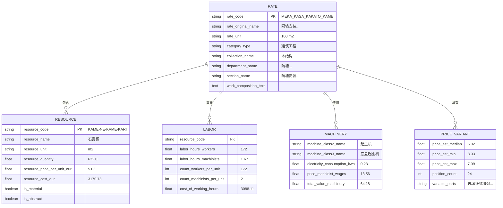
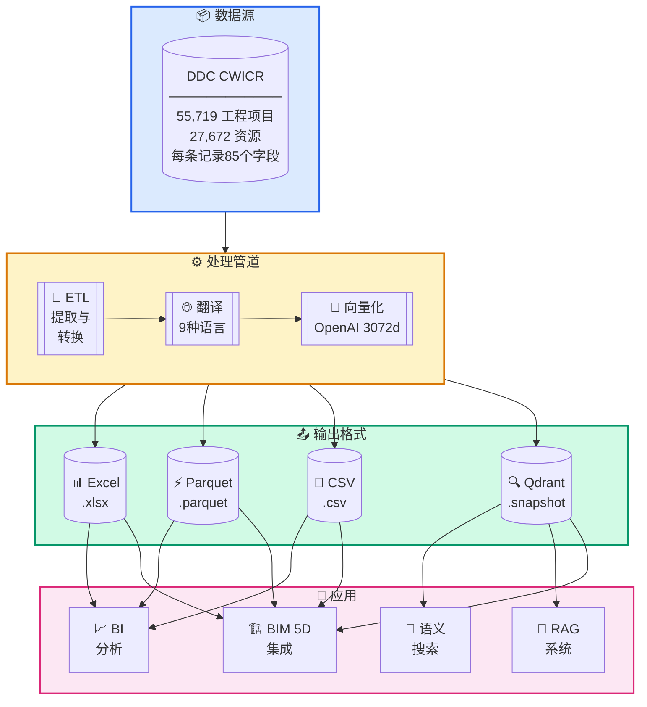
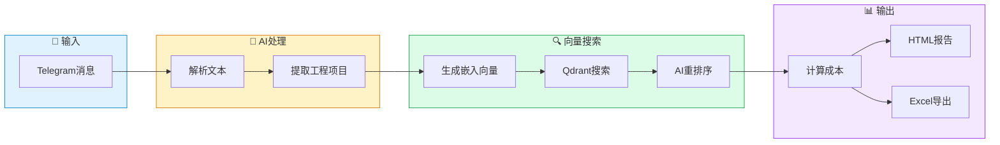
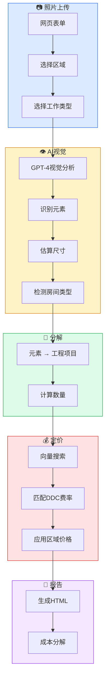
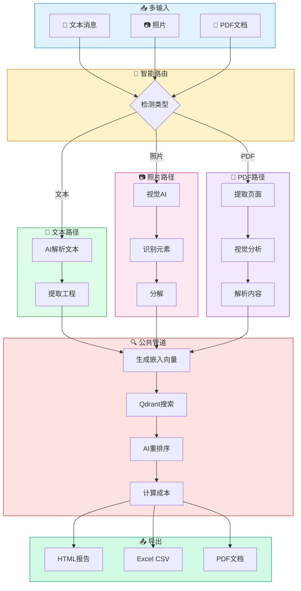
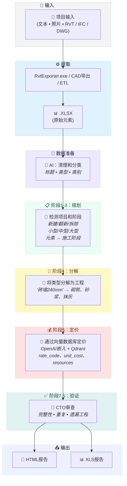

<h3 align="center">DDC CWICR - 建筑工程项目、组件与资源数据库</br>
  + 基于描述、照片和CAD (BIM) 计算估算的 n8n 工作流</h3>

<p align="center">
  <a href="README.md">English</a> •
  <a href="README.zh-CN.md"><b>中文</b></a> •
  <a href="README.es.md">Español</a> •
  <a href="README.pt-BR.md">Português</a> •
  <a href="README.ru.md">Русский</a> •
  <a href="README.ja.md">日本語</a> •
  <a href="README.de.md">Deutsch</a> •
  <a href="README.fr.md">Français</a>
</p>

<p align="center">
  
</p>

<div align="center">
  
  
  
  
</div>

<div align="center">
  
  
  
  
  
</div>

<p align="center">
  
</p>

<h3 align="center">⚡ n8n 工作流</h3>
<p align="center"><code>选择输入类型 → 获取成本估算</code></p>

<br>

<table width="100%">
<tr>

<td align="center" valign="top" width="33%">
<br>
<h3>📝 文本</h3>
<p>从简短描述快速<br>生成估算</p>
<p><b>输入：</b>Telegram / 聊天消息<br>
<b>输出：</b>匹配的工程项目 + 估算</p>
<br>
<a href="#1️⃣-文本估算机器人">📖 文档</a>
<br><br>
<a href="./n8n_1_Telegram_Bot_Cost_Estimates_and_Rate_Finder_TEXT_DDC_CWICR.json">

</a>
<br><br>
</td>

<td align="center" valign="top" width="33%">
<br>
<h3>📷 照片 / PDF</h3>
<p>现场照片、扫描的工程量清单、<br>PDF文档</p>
<p><b>输入：</b>图片或PDF<br>
<b>输出：</b>提取的工程 → 估算</p>
<br>
<a href="#2️⃣-照片成本估算器">📖 照片文档</a> · <a href="#3️⃣-通用估算机器人文本--照片--pdf">📖 通用机器人</a>
<br><br>
<a href="./n8n_2_Photo_Cost_Estimate_DDC_CWICR.json">

</a>
&nbsp;
<a href="./n8n_3_Telegram_Bot_Cost_Estimates_and_Rate_Finder_TEXT_PHOTO_PDF_DDC_CWICR.json">

</a>
<br><br>
</td>

<td align="center" valign="top" width="33%">
<br>
<h3>🧊 CAD / BIM</h3>
<p>基于Revit / IFC / DWG<br>的工程量计算与估算</p>
<p><b>输入：</b>模型导出<br>
<b>输出：</b>4D/5D估算 + 分解</p>
<br>
<a href="#4️⃣-cad-bim-成本估算流水线">📖 文档</a>
<br><br>
<a href="./n8n_4_CAD_(BIM)_Cost_Estimation_Pipeline_4D_5D_with_DDC_CWICR.json">

</a>
<br><br>
</td>

</tr>
</table>

<br>
<p align="center">
  <a href="https://openconstructionestimate.com">
    
  </a>
</p>
<br>
<p align="center">
 DataDrivenConstruction 客户和用户
  <br>
  <a href="https://datadrivenconstruction.io/">
  
  </a>
  <br></br>
</p>


---

## 📑 目录

### AI 集成
- [AI产品的完美燃料](#-ai-产品的完美燃料) — 为什么这个数据库非常适合AI
- [Claude Code](#-claude-code--ai-编程助手) — AI编程助手使用
- [n8n](#-n8n--可视化工作流自动化) — 工作流自动化
- [Dify](#-dify--构建-llm-应用) — LLM应用开发
- [Sim AI及其他](#-sim-ai-及类似平台) — 兼容平台
- [通用使用场景](#-通用使用场景) — 您可以构建什么

### 数据库与数据
- [关于](#关于) — 什么是DDC CWICR
- [可用格式](#可用格式) — Excel、Parquet、CSV、Qdrant
- [数据模式](#数据模式) — 85字段结构
- [字段组](#字段组) — 分类、资源、人工、机械
- [方法论](#方法论) — 资源基础成本核算原则
- [历史背景](#历史背景) — 100+年的标准

### n8n 工作流
- [n8n工作流概览](#-n8n-工作流) — 选择输入类型
- [立即试用 — 演示机器人](#-立即试用--演示机器人) — 在Telegram中即时测试
- [工作流1：文本估算机器人](#1️⃣-文本估算机器人) — 文本输入的Telegram机器人
- [工作流2：照片成本估算器](#2️⃣-照片成本估算器) — 带AI视觉的网页表单
- [工作流3：通用机器人](#3️⃣-通用估算机器人文本--照片--pdf) — 文本 + 照片 + PDF
- [工作流4：CAD/BIM流水线](#4️⃣-cad-bim-成本估算流水线) — Revit/IFC/DWG到估算
- [工作流快速入门](#工作流快速入门) — 4步设置
- [⚠️ n8n 2.0+设置](#️-n8n-20-设置要求) — 启用Execute Command节点

### CAD/BIM 流水线详情
- [前置要求](#-前置要求) — 必需组件
- [流水线阶段](#-流水线阶段) — 10阶段处理
- [LLM模型选择](#️-llm-模型选择) — OpenAI、Claude、Gemini、Grok
- [输出文件](#-输出文件) — HTML和Excel报告
- [故障排除](#️-故障排除) — 常见问题

### 向量数据库
- [向量数据库](#向量数据库) — 使用Qdrant进行语义搜索
- [发布版本](#发布版本) — 下载快照
- [集合](#集合) — 9个语言集合
- [Docker部署](#docker-部署) — 自托管设置

### 入门指南
- [快速入门 - Python](#快速入门) — 表格数据和语义搜索
- [集成用例](#集成) — 从入门到高级

### 社区
- [资源与社区](#资源与社区) — 链接和频道
- [咨询与培训](#咨询与培训) — 专业服务
- [贡献](#贡献) — 提交您的工作流
- [许可证](#许可证) — CC BY 4.0 和 MIT
- [支持项目](#支持项目) — 赞助和捐赠


---

## 🚀 AI 产品的完美燃料

<p align="center">
  <b>只需克隆仓库，描述您想要的内容 — AI完成其余工作</b>
</p>

DDC CWICR不仅仅是一个数据库 — 它是**为AI驱动应用程序准备的即用型燃料**。无论您是构建成本估算机器人、自动化建筑工作流程，还是创建智能助手 — 这些数据可以与现代AI工具开箱即用。

### 为什么这个数据库非常适合AI

| 特性 | 优势 |
|------|------|
| **预计算嵌入向量** | 无需生成向量 — 语义搜索即刻生效 |
| **结构化的85字段模式** | AI可以推理数据关系并提供准确答案 |
| **包含9种语言** | 无需翻译即可构建多语言应用 |
| **55,000+ 工程项目** | 全面覆盖任何建筑估算任务 |
| **基于资源的方法论** | AI可以解释和分解的透明数据 |

### 🛠️ 完美配合以下工具

<table>
<tr>
<td align="center" width="20%">
<br/>
<b>Claude Code</b><br/>
<sub>AI编程助手CLI</sub>
</td>
<td align="center" width="20%">
<br/>
<b>Google Antigravity</b><br/>
<sub>Google Antigravity</sub>
</td>
<td align="center" width="20%">
<br/>
<b>n8n</b><br/>
<sub>工作流自动化</sub>
</td>
<td align="center" width="20%">
<br/>
<b>Dify</b><br/>
<sub>LLM应用开发</sub>
</td>
<td align="center" width="20%">
<br/>
<b>Sim AI 等</b><br/>
<sub>AI平台</sub>
</td>
</tr>
</table>

---

### 💻 Claude Code & Google Antigravity — AI 编程助手

使用DDC CWICR最快捷的方式。只需在Claude Code或Google Antigravity中打开仓库，用自然语言提问。

**快速开始：**
```bash
# 克隆仓库
git clone https://github.com/datadrivenconstruction/OpenConstructionEstimate-DDC-CWICR.git

# 使用Claude Code打开
cd OpenConstructionEstimate-DDC-CWICR
claude
```

**示例提示词：**

| 任务 | 提示词 |
|------|--------|
| **探索数据** | "展示这个建筑数据库的结构，并解释有哪些可用数据" |
| **查找工程项目** | "查找所有与混凝土基础相关的工程项目并显示其成本" |
| **构建查询** | "编写一个Python脚本，搜索工时超过100小时的管道工程项目" |
| **创建报告** | "生成住宅翻新工程的成本分解报告" |
| **分析成本** | "比较不同墙体施工方法的材料成本" |
| **构建集成** | "创建一个连接Qdrant数据库并执行语义搜索的脚本" |

**专业提示：**
- 让Claude指向特定文件：*"分析Parquet文件并总结成本分布"*
- 请求解释：*"解释这个数据库中基于资源的成本核算方法论是如何工作的"*
- 请求修改：*"修改n8n工作流以添加电子邮件通知"*

---

### ⚡ n8n — 可视化工作流自动化

无需编码即可构建强大的自动化管道。将DDC CWICR连接到400+应用和服务。

**使用场景：**

| 工作流 | 描述 |
|--------|------|
| **Telegram机器人** | 用户发送文本/照片 → AI提取工程项目 → 返回成本估算 |
| **邮件自动化** | 通过邮件接收工程量清单 → AI处理 → 发送格式化估算 |
| **CRM集成** | CRM中的新项目 → 自动生成初步估算 → 更新交易价值 |
| **BIM管道** | 从Revit导出 → 提取数量 → 匹配DDC费率 → 生成5D报告 |
| **Slack机器人** | 团队提问 → AI搜索数据库 → 返回相关工程项目 |

**快速入门：**
1. 从此仓库下载工作流JSON
2. 导入到n8n：`Workflows → Import → From File`
3. 配置凭据（OpenAI、Qdrant、Telegram）
4. 激活并测试

查看[n8n工作流](#n8n-工作流--详细描述)部分了解详细设置。

---

### 🤖 Dify — 构建 LLM 应用

使用DDC CWICR作为知识库创建自定义AI应用。

**设置步骤：**
1. 创建新的Dify应用
2. 添加知识库 → 上传Parquet/CSV文件或连接Qdrant
3. 配置带嵌入的RAG管道
4. 构建聊天界面或API

**应用创意：**

| 应用类型 | 描述 |
|----------|------|
| **建筑估算聊天机器人** | 成本查询的对话界面 |
| **工程项目搜索** | 在55,000+项目中进行自然语言搜索 |
| **成本顾问** | 解释成本分解并建议优化的AI |
| **多语言助手** | 自动检测语言并以用户语言响应 |
| **API端点** | 用于与其他系统集成的REST API |

**Dify提示词模板示例：**
```
您是一个建筑成本估算助手，可以访问DDC CWICR数据库。

上下文：{{context}}

用户问题：{{query}}

根据数据库提供准确的成本信息。包括：
- 相关工程项目及代码
- 单位成本和数量
- 资源分解（人工、材料、设备）
- 总成本计算
```

---

### 🔮 Sim AI 及类似平台

DDC CWICR可与任何支持以下功能的AI平台集成：
- **向量数据库**（Qdrant、Pinecone、Weaviate、Milvus）
- **结构化数据**（CSV、Parquet、Excel）
- **OpenAI嵌入**（text-embedding-3-large，3072维）

**兼容平台：**
- **Sim AI** — AI模拟和建模
- **LangChain / LlamaIndex** — LLM应用框架
- **Flowise** — 低代码LLM应用构建器
- **Botpress** — 对话式AI平台
- **Voiceflow** — 语音和聊天设计
- **Stack AI** — 无代码AI工作流
- **Relevance AI** — AI工作力平台

**通用集成模式：**

```python
# 适用于任何支持Qdrant的平台
from qdrant_client import QdrantClient

# 连接到DDC CWICR
client = QdrantClient("your-qdrant-instance", port=6333)

# 语义搜索
results = client.search(
    collection_name="ddc_cwicr_zh",  # 或 en、de、ru 等
    query_vector=your_embedding,
    limit=10
)

# 在您的AI应用中使用结果
for item in results:
    print(f"{item.payload['rate_code']}: {item.payload['rate_original_name']}")
```

---

### 📋 通用使用场景

无论您选择哪种AI工具，DDC CWICR都可以实现：

| 使用场景 | 描述 |
|----------|------|
| **即时成本估算** | 从文本描述或照片获取建筑成本 |
| **工程量清单生成** | 从项目描述自动生成工程量清单 |
| **价格基准对比** | 跨地区和语言比较成本 |
| **资源规划** | 计算人工工时、材料和设备需求 |
| **投资分析** | 具有完全资源透明度的深度成本审计 |
| **多语言支持** | 以9种语言为用户提供本地化定价服务 |
| **BIM集成** | 连接Revit/IFC实现自动化4D/5D估算 |
| **训练AI模型** | 使用结构化数据微调建筑AI |

---

## 关于

**DDC CWICR**（建筑工程项目、组件与资源）是一个用于建筑成本估算的开放数据库，涵盖从土方工程和混凝土浇筑到专业安装工程的全部建筑活动。

该数据库借鉴了描述欧亚大陆和亚太地区现代建筑实践的来源，这些地区的统一技术标准化体系为超过十个快速发展的经济体提供了共同的工程语言。DDC CWICR代表了通过建立多语言资本项目管理统一监管框架来协调开放标准的努力。

<p align="center">
  <br>
  
  <br></br>
</p>

结构化数据可通过表格格式（XLSX、CSV、Parquet）访问，或通过LLM以对话方式查询，使专业人员能够使用自然语言或简洁查询将建筑工程描述（QDRANT向量数据库）集成到自动化管道和工作流中。

### 可用格式

| 格式 | 扩展名 | 大小 | 最适合 | 特性 |
|------|--------|------|--------|------|
| **Excel** | `.xlsx` | ~150–400 MB | 手动分析、筛选、数据透视表 | 人类可读，完整格式 |
| **Parquet** | `.parquet` | ~55 MB | ETL管道、ML训练、大数据 | 列式存储，出色的压缩 |
| **CSV** | `.csv` | ~1.3 GB | 数据库导入、传统系统 | 通用兼容性 |
| **Qdrant** | `.snapshot` | ~1 GB | 语义搜索、RAG、AI助手 | 预计算的OpenAI嵌入 |


在线演示可在[openconstructionestimate.com](https://openconstructionestimate.com/)查看，您可以在那里探索数据并查看向量数据库在语义搜索中的实际应用。

<p align="center">
  
</p>

---

## 数据模式

数据库包含**85个字段**，组织成逻辑组。每条记录代表一个工程项目（费率）或具有完整成本分解的资源。



### 字段组
85个数据库字段被组织成逻辑组，反映基于资源的成本估算方法论。每个组在成本分解结构中执行特定功能：从层次分类和工程项目识别到详细的资源消耗、人工需求、机械成本和汇总合计。这种模块化结构允许用户仅查询与其任务相关的字段 — 无论是生成材料清单、分析劳动生产率还是构建完整估算。

<p align="center">
  <br>
  
  <br></br>
</p>

**分类** - `category_type`、`collection_code`、`collection_name`、`department_code`、`department_name`、`department_type`、`section_name`、`section_type`、`subsection_code`、`subsection_name`

**工程项目（费率）** - `rate_code`、`rate_original_name`、`rate_final_name`、`rate_unit`、`row_type`、`is_scope`、`is_abstract`、`is_machine`、`is_labor`、`is_material`、`work_composition_text`

**资源** - `resource_code`、`resource_name`、`resource_unit`、`resource_quantity`、`parameter_resource_quantity`、`resource_price_per_unit_eur_current`、`resource_cost_eur`

**人工** - `count_workers_per_unit`、`count_engineers_per_unit`、`count_machinists_per_unit`、`count_total_people_per_unit`、`labor_hours_construction_workers`、`labor_hours_machinists`、`labor_hours_engineers`、`total_labor_hours_workers_machinists`、`total_labor_hours_all_personnel`、`cost_of_working_hours`、`count_people_per_day`

**机械** - `machine_class2_name`、`machine_class3_name`、`personnel_machinist_code`、`personnel_machinist_grade`、`price_machinist_wages`、`price_relocation_included`、`price_cost_without_wages`、`electricity_consumption_kwh_per_machine_hour`、`electricity_cost_per_unit`、`electricity_cost_total_sum`、`cost_machinist_sum`、`total_value_machinery_equipment`

**价格变体** - `price_code_prefix`、`price_abstract_resource_common_start`、`price_abstract_resource_variable_parts`、`price_abstract_resource_position_count`、`price_abstract_resource_est_price_min`、`price_abstract_resource_est_price_max`、`price_abstract_resource_est_price_mean`、`price_abstract_resource_est_price_median`、`price_abstract_resource_unit`、`abstract_resource_tech_group`

**汇总** - `total_cost_per_position`、`total_material_cost_per_position`、`total_resource_cost_per_position`、`total_value_abstract_resources`、`materials_resource_cost_eur`

**质量与服务** - `mass_name`、`mass_value`、`mass_unit`、`service_category`、`service_type`、`parameter_service_code`、`parameter_service_unit`、`parameter_service_name`、`parameter_service_quantity`、`service_cost_sum`

### 成本计算公式

| 组成部分 | 技术定额 | × | 区域价格 | = | 成本 |
|----------|----------|---|----------|---|------|
| 👷 **人工** | 172 小时/100m² | × | €17.95/小时 | = | €3,088.11 |
| 🧱 **材料** | 632 m²/100m² | × | €5.02/m² | = | €3,170.73 |
| 🚜 **设备** | 1.67 小时/100m² | × | €38.42/小时 | = | €64.18 |
|  |  |  | **合计** | = | **每100m² €7,725.91** |

---

## 方法论

**基于资源的成本核算**的关键价值在于将不变的生产技术与波动的财务组成部分分离。它基于建筑的物理"第一性原理"：
- 特定工作所需的人工小时
- 每单位工作的材料数量
- 所需的设备时间

**为什么重要：**

- **透明度** — 无隐藏加价的定价，完整的资源分解
- **可审计性** — 投资分析和验证的深度分析能力
- **可移植性** — 适用于不同市场的区域独立定额
- **经过验证** — 建立100+年的行业标准方法论




### 历史背景

该数据库中的建筑工程描述基于资源基础标准化方法论，其根源可追溯到20世纪初的生产定额到今天的数字参考系统。自20世纪20年代以来不断发展和完善，这种方法在欧亚地区得到了特别强劲的发展。

在一百年的发展过程中，该系统已从手动计算过渡到机器可读格式 — 然而其基本原则保持不变：精确测量每单位建筑产出所需的物理资源。现代实现将历史定额数据与实时市场定价联系起来。

该方法论的区域适应版本在各国以不同名称运作：ENIR、GESN、FER、NRR、ESN、AzDTN、ShNQK、MKS ChT、SNT、BNbD、Dinh Muc、Ding'e。

<p align="center">
  
</p>

⭐ <b>如果您想看到新的更新和数据库版本，如果您觉得我们的工具有用，请给我们的仓库点星，以看到更多类似的建筑行业应用。</b>
在GitHub上给DDC工作流点星，即时获得新版本通知。
<p align="center">
  <br>
  
  <br></br>
</p>


---


## 集成

### 使用场景

- **入门级** — 成本基准对比、价格指数化、投标估算

- **中级** — 本地化、ETL/BI管道、CO₂计算

- **高级** — AI/ML训练、CAD (BIM) 5D、深度投资审计

---

## n8n 工作流 — 详细描述

四个生产就绪的工作流用于自动化建筑成本估算。每个工作流通过Qdrant连接到DDC CWICR向量数据库，并使用AI模型进行智能解析和匹配。

| # | 工作流 | 输入 | 最适合 | 下载 |
|---|--------|------|--------|------|
| 1 | [文本估算机器人](#1️⃣-文本估算机器人) | 💬 文本 | 从文本快速估算 | [JSON](./n8n_1_Telegram_Bot_Cost_Estimates_and_Rate_Finder_TEXT_DDC_CWICR.json) |
| 2 | [照片估算器](#2️⃣-照片成本估算器) | 📷 照片 | 现场访问、视觉检查 | [JSON](./n8n_2_Photo_Cost_Estimate_DDC_CWICR.json) |
| 3 | [通用机器人](#3️⃣-通用估算机器人文本--照片--pdf) | 💬📷📄 全部 | 全功能生产使用 | [JSON](./n8n_3_Telegram_Bot_Cost_Estimates_and_Rate_Finder_TEXT_PHOTO_PDF_DDC_CWICR.json) |
| 4 | [CAD/BIM管道](#4️⃣-cad-bim-成本估算流水线) | 🏗️ Revit | 基于BIM的4D/5D估算 | [JSON](./n8n_4_CAD_(BIM)_Cost_Estimation_Pipeline_4D_5D_with_DDC_CWICR.json) |

---

### 1️⃣ 文本估算机器人

**文件：** `n8n_1_Telegram_Bot_Cost_Estimates_and_Rate_Finder_TEXT_DDC_CWICR.json`

用于基于文本的成本估算的Telegram机器人。用自然语言描述建筑工程 — 机器人解析输入，搜索向量数据库，并返回详细的成本分解。

<p align="center">
  <br>
  
  <br></br>
</p>

<h3 align="left">🤖 立即试用 — 演示机器人</h3>
<p align="left"><i>在Telegram中即时测试估算工作流</i></p>
<p><b>@TextOpenConstructionEstimate_bot</b></p>
<p>从文本描述创建完整估算</p>
<a href="https://t.me/TextOpenConstructionEstimate_bot">

</a>




**工作原理：**

| 步骤 | 操作 | 技术 |
|------|------|------|
| 1 | 用户发送文本描述 | Telegram Bot API |
| 2 | AI解析并提取工程项目 | OpenAI / Claude / Gemini |
| 3 | 为每个项目生成嵌入向量 | OpenAI `text-embedding-3-large` |
| 4 | 在数据库中搜索匹配费率 | Qdrant向量搜索 |
| 5 | AI重排序结果以提高准确性 | LLM评分 |
| 6 | 计算成本并生成报告 | HTML / Excel / PDF |

**功能：**

| 功能 | 描述 |
|------|------|
| 💬 自然语言输入 | 接受任何文本格式 — 列表、句子、结构化描述 |
| 🤖 多LLM支持 | 支持OpenAI、Claude或Gemini（可切换） |
| 🔍 语义搜索 | 即使措辞不同也能找到最佳匹配 |
| 🌍 9种语言 | DE、EN、RU、ES、FR、PT、ZH、AR、HI |
| 📊 多种导出 | HTML报告、Excel表格、PDF文档 |
| ✏️ 交互式编辑 | 在最终计算前修改数量 |

**所需凭据：**
- Telegram Bot Token（从@BotFather获取）
- OpenAI API Key（用于嵌入向量 + 可选LLM）
- Qdrant URL + API Key

---

### 2️⃣ 照片成本估算器

**文件：** `n8n_2_Photo_Cost_Estimate_DDC_CWICR.json`

用于基于照片估算的网页表单界面。上传建筑照片 — AI视觉识别元素、估算尺寸并自动计算成本。

<p align="center">
  <br>
  
  <br></br>
</p>




**工作原理：**

| 步骤 | 操作 | 技术 |
|------|------|------|
| 1 | 用户通过网页表单上传照片 | n8n Form Trigger |
| 2 | AI视觉分析图像 | GPT-4 Vision |
| 3 | 识别房间类型、元素、材料 | 结构化JSON提取 |
| 4 | 从参考对象估算尺寸 | AI推理（门、瓷砖等） |
| 5 | 将元素分解为工程项目 | LLM处理 |
| 6 | 通过向量搜索定价每项工作 | Qdrant + OpenAI嵌入 |
| 7 | 生成专业HTML报告 | 样式化输出 |

**功能：**

| 功能 | 描述 |
|------|------|
| 📷 照片分析 | GPT-4 Vision识别建筑元素 |
| 📐 自动尺寸估算 | 使用参考对象（门、瓷砖）估算尺寸 |
| 🏠 房间检测 | 浴室、厨房、卧室、外部等 |
| 🔨 工作类型支持 | 新建/翻新/维修 |
| 🌍 9个区域数据库 | 价格本地化到柏林、多伦多、巴黎等 |
| 📄 专业报告 | 整洁的HTML输出，可供客户使用 |

**所需凭据：**
- OpenAI API Key（GPT-4 Vision + 嵌入向量）
- Qdrant URL + API Key

---

### 3️⃣ 通用估算机器人（文本 + 照片 + PDF）

**文件：** `n8n_3_Telegram_Bot_Cost_Estimates_and_Rate_Finder_TEXT_PHOTO_PDF_DDC_CWICR.json`

全功能Telegram机器人，支持所有输入类型：文本描述、建筑照片和PDF平面图。生产使用最全面的工作流。


<p align="center">
  <br>
  
  <br></br>
</p>

<h3 align="left">🤖 立即试用 — 演示机器人</h3>
<p align="left"><i>在Telegram中即时测试估算工作流</i></p>
<h3>📷 通用机器人</h3>
<p><b>@OpenConstructionEstimate_bot</b></p>
<p>全功能机器人，支持文本、照片和PDF</p>
<a href="https://t.me/OpenConstructionEstimate_bot">

</a>
<br><br>





**工作原理：**

| 步骤 | 操作 | 技术 |
|------|------|------|
| 1 | 用户发送文本、照片或PDF | Telegram Bot API |
| 2 | 路由器检测输入类型 | Content-type分析 |
| 3a | **文本：** AI解析工程项目 | OpenAI / Gemini |
| 3b | **照片：** Vision AI提取元素 | GPT-4 Vision / Gemini 2.0 |
| 3c | **PDF：** 提取并分析页面 | PDF处理 + Vision |
| 4 | 在DDC CWICR中语义搜索 | Qdrant向量数据库 |
| 5 | AI重排序获得最佳匹配 | LLM评分 |
| 6 | 通过机器人菜单交互式编辑 | Telegram内联键盘 |
| 7 | 导出结果 | HTML / Excel / PDF |

**17个机器人操作：**

| 操作 | 描述 |
|------|------|
| `/start` | 语言选择菜单 |
| 上传照片 | 触发AI视觉分析 |
| 文本消息 | 解析并提取工程项目 |
| 上传PDF | 处理平面图 |
| 编辑数量 | 计算前修改 |
| 添加工程 | 手动工程项目输入 |
| 计算 | 运行完整成本估算 |
| 查看详情 | 显示每个项目的资源 |
| 导出Excel | 下载CSV表格 |
| 导出PDF | 生成PDF报告 |
| 帮助 | 显示使用说明 |
| 优化 | 重新分析并进行修正 |

**功能：**

| 功能 | 描述 |
|------|------|
| 📷 双Vision AI | Gemini 2.0 Flash或GPT-4 Vision（可配置） |
| 📄 PDF处理 | 平面图、扫描的工程量清单、文档 |
| 💬 智能文本解析 | 处理列表、表格、自由格式文本 |
| 🔍 AI重排序 | 提高匹配准确性 |
| ✏️ 完整编辑 | 添加、删除、修改工程项目 |
| 📊 多格式导出 | HTML、Excel、PDF |
| 🌍 9种语言 | 完整本地化 |

**所需凭据：**
- Telegram Bot Token
- OpenAI API Key（嵌入向量）
- Gemini API Key（Vision）或OpenAI GPT-4 Vision
- Qdrant URL + API Key

---

### 4️⃣ CAD (BIM) 成本估算流水线

**文件：** `n8n_4_CAD_(BIM)_Cost_Estimation_Pipeline_4D_5D_with_DDC_CWICR.json`

从Revit/IFC/DWG模型自动进行成本估算。提取BIM数据，分类元素，分解为工程项目，并生成带有完整资源分解的4D/5D估算。

<p align="left">
  <a href="https://datadrivenconstruction.io">
    
  </a>
</p>




**n8n提供400+原生集成**，包括Google Sheets、Notion、Slack、Airtable、数据库（PostgreSQL、MongoDB）、云存储等。此工作流中的每个节点都是模块化的 — 您可以：

- 🔄 **切换LLM提供商**（OpenAI ↔ Claude ↔ Gemini ↔ Grok）
- 📊 **连接您的ERP或项目管理系统**
- 📁 **将结果导出到任何目的地**（云存储、电子邮件、仪表板）
- 🔧 **修改任何阶段**以匹配您的估算方法论

工作流完全由您适配。无限制。无许可费。完全控制。

---

## 📋 前置要求

| 组件 | 要求 | 描述 |
|------|------|------|
| **[n8n](https://n8n.io/)** | v1.0+（v2.0+需要[设置](#️-n8n-20-设置要求)） | 用于编排估算管道的工作流自动化平台 |
| **[Qdrant](https://qdrant.tech/)** | 云或自托管实例 | 用于建筑工程项目语义搜索的向量数据库 |
| **[OpenAI API](https://platform.openai.com/)** | 用于嵌入向量（`text-embedding-3-large`） | 为BIM元素生成向量嵌入并与成本数据库匹配 |
| **LLM API** | OpenAI / Claude / Gemini / xAI Grok | 用于工程项目分类和估算生成的AI模型 |
| **[DDC Converter](https://github.com/datadrivenconstruction/cad2data-Revit-IFC-DWG-DGN-pipeline-with-conversion-validation-qto)** | `RvtExporter.exe` | 从Revit模型提取BIM数据到Excel/JSON进行处理 |

---

## 工作流快速入门

### 步骤1：导入工作流

```
n8n → New workflow → Import from File → 选择JSON
```

### 步骤2：配置凭据

在**🔑 TOKEN**节点中，设置您的API密钥：

```json
{
  "bot_token": "您的_TELEGRAM_BOT_TOKEN",
  "OPENAI_API_KEY": "您的_OPENAI_KEY",
  "GEMINI_API_KEY": "您的_GEMINI_KEY",
  "QDRANT_URL": "http://localhost:6333",
  "QDRANT_API_KEY": ""
}
```

### 步骤3：将DDC CWICR加载到Qdrant

从[发布版本](#发布版本)下载快照并导入：

```bash
curl -X POST "http://localhost:6333/collections/ddc_cwicr_zh/snapshots/upload" \
  -H "Content-Type: multipart/form-data" \
  -F "snapshot=@ZH_SHANGHAI_workitems_EMBEDDINGS_3072_DDC.snapshot"
```

### 步骤4：激活并测试

- 在n8n中启用工作流
- 对于Telegram机器人：向您的机器人发送`/start`
- 对于网页表单：打开n8n提供的表单URL

---

## ⚠️ n8n 2.0+ 设置要求

> **从n8n 2.0版本开始，Execute Command节点默认因安全原因被禁用。**
>
> 如果没有以下配置，使用Execute Command的工作流（特别是CAD/BIM管道）**将无法工作** — 节点将显示问号或无法识别。

### 快速修复

**Windows (CMD) — 每次运行：**
```cmd
set NODES_EXCLUDE=[] && npx n8n
```

**永久解决方案 — 创建一次：**

创建文件`C:\Users\您的用户名\.n8n\.env`，内容为：
```
NODES_EXCLUDE=[]
```
然后像往常一样运行`npx n8n`。

**Docker：**
```yaml
environment:
  - NODES_EXCLUDE=[]
```

### 验证设置

1. 启动n8n
2. 点击**+** → 搜索**"Execute Command"**
3. 如果节点出现 → ✅ 设置完成！

> 📚 更多详情：[n8n 2.0 Breaking Changes](https://docs.n8n.io/2-0-breaking-changes/)

---

## 🌍 支持的语言和价格水平

| 代码 | 语言 | 价格水平 | 货币 | Qdrant集合 |
|------|------|----------|------|------------|
| `AR` | 阿拉伯语 | 迪拜 | AED | `ddc_cwicr_ar` |
| `DE` | 德语 | 柏林 | EUR | `ddc_cwicr_de` |
| `EN` | 英语 | 多伦多 | CAD | `ddc_cwicr_en` |
| `ES` | 西班牙语 | 巴塞罗那 | EUR | `ddc_cwicr_es` |
| `FR` | 法语 | 巴黎 | EUR | `ddc_cwicr_fr` |
| `HI` | 印地语 | 孟买 | INR | `ddc_cwicr_hi` |
| `PT` | 葡萄牙语 | 圣保罗 | BRL | `ddc_cwicr_pt` |
| `RU` | 俄语 | 圣彼得堡 | RUB | `ddc_cwicr_ru` |
| `ZH` | 中文 | 上海 | CNY | `ddc_cwicr_zh` |

---

## 📊 流水线阶段

CAD/BIM工作流通过10个阶段处理数据：

| 阶段 | 名称 | 描述 |
|------|------|------|
| **0** | 收集BIM数据 | 通过DDC Converter从Revit提取元素 |
| **1** | 项目检测 | AI识别项目类型（住宅、商业等） |
| **2** | 阶段生成 | AI创建施工阶段 |
| **3** | 元素分配 | AI将BIM类型映射到阶段 |
| **4** | 工程分解 | AI将类型分解为工程项目（"砖墙" → 砌筑、砂浆） |
| **5** | 向量搜索 | 通过Qdrant在DDC CWICR中查找匹配费率 |
| **6** | 单位映射 | 将BIM单位转换为费率单位 |
| **7** | 成本计算 | 每个工程项目的数量 × 单价 |
| **7.5** | 验证 | CTO审查完整性和重复项 |
| **8** | 汇总 | 按阶段和类别求和 |
| **9** | 报告生成 | 创建HTML和Excel输出 |

---

## ⚙️ LLM 模型选择

工作流支持多个AI提供商。在**LLM Models**部分启用您首选的模型：

| 模型 | 节点名称 | 状态 |
|------|----------|------|
| OpenAI GPT-4o | `OpenAI LLM` | ✅ 默认 |
| Claude Opus 4 | `Anthropic Chat Model2` | 已禁用 |
| Gemini 2.5 Pro | `Google Gemini Chat Model` | 已禁用 |
| xAI Grok | `xAI Grok Chat Model1` | 已禁用 |
| DeepSeek | `DeepSeek Chat Model` | 已禁用 |

要切换模型：**启用**所需的模型节点并**禁用**其他模型。

---

## 📁 输出文件

报告保存到项目文件夹：
```
project_YYYY-MM-DD.html   ← 交互式报告（在浏览器中打开）
project_YYYY-MM-DD.xls    ← Excel兼容电子表格
```
<p align="center">
  <br>
  
  <br></br>
</p>

---

## 🔗 Qdrant 集合

工作流根据`language_code`自动选择正确的集合：

```
{LANG}_{CITY}_workitems_costs_resources_EMBEDDINGS_3072_DDC_CWICR
```

示例：`ZH_SHANGHAI_workitems_costs_resources_EMBEDDINGS_3072_DDC_CWICR`

---

## ⚠️ 故障排除

| 问题 | 解决方案 |
|------|----------|
| "Execute Command missing"（n8n 2.0+） | 设置`NODES_EXCLUDE=[]`环境变量。参见[n8n 2.0+设置](#️-n8n-20-设置要求) |
| "No Excel file found" | 检查`path_to_converter`和`project_file`路径 |
| "Qdrant connection failed" | 验证凭据中的Qdrant URL和API密钥 |
| "Rate limit exceeded" | 减少批次大小或在API调用之间添加延迟 |
| "No pricing found" | 检查Qdrant中是否存在正确的语言集合 |
| "Telegram webhook error" | 确保工作流处于活动状态且webhook URL可访问 |
| "Vision API failed" | 验证Gemini或OpenAI Vision API密钥是否有效 |

---

## 向量数据库

带有OpenAI `text-embedding-3-large`嵌入向量的即用型Qdrant集合，用于建筑工程项目的语义搜索。

向量数据库允许您用自然语言与数据"对话" — 使用简单的句子或短语而不是代码或复杂的过滤器。这大大加快了在非常大的数据集中找到正确工程项目或成本行的速度。

这些Qdrant集合可以通过现代自动化和集成工作流（例如，低代码/无代码工作流和管道工具）连接到应用程序。您可以构建搜索、过滤和解释建筑工程项目的助手，或将语义搜索直接集成到现有的估算和项目控制工具中。

---

### 发布版本

从[GitHub Releases](https://github.com/datadrivenconstruction/OpenConstructionEstimate-DDC-CWICR/releases)下载QDRANT和CSV数据集（大于1GB的文件）。

| 语言 | 区域 | CSV文件 | Qdrant快照 |
|------|------|---------|------------|
| 🇸🇦 阿拉伯语 | 迪拜 | `AR_DUBAI_*.csv` | `AR_DUBAI_*_EMBEDDINGS_3072_DDC.snapshot` |
| 🇨🇳 中文 | 上海 | `ZH_SHANGHAI_*.csv` | `ZH_SHANGHAI_*_EMBEDDINGS_3072_DDC.snapshot` |
| 🇩🇪 德语 | 柏林 | `DE_BERLIN_*.csv` | `DE_BERLIN_*_EMBEDDINGS_3072_DDC.snapshot` |
| 🇬🇧 英语 | 多伦多 | `EN_TORONTO_*.csv` | `EN_TORONTO_*_EMBEDDINGS_3072_DDC.snapshot` |
| 🇪🇸 西班牙语 | 巴塞罗那 | `ES_BARCELONA_*.csv` | `ES_BARCELONA_*_EMBEDDINGS_3072_DDC.snapshot` |
| 🇫🇷 法语 | 巴黎 | `FR_PARIS_*.csv` | `FR_PARIS_*_EMBEDDINGS_3072_DDC.snapshot` |
| 🇮🇳 印地语 | 孟买 | `HI_MUMBAI_*.csv` | `HI_MUMBAI_*_EMBEDDINGS_3072_DDC.snapshot` |
| 🇧🇷 葡萄牙语 | 圣保罗 | `PT_SAOPAULO_*.csv` | `PT_SAOPAULO_*_EMBEDDINGS_3072_DDC.snapshot` |
| 🇷🇺 俄语 | 圣彼得堡 | `RU_SPB_*.csv` | `RU_SPB_*_EMBEDDINGS_3072_DDC.snapshot` |

<a href="https://github.com/datadrivenconstruction/OpenConstructionEstimate-DDC-CWICR/releases/tag/v0.1.0">
  
</a>

### 集合

🇸🇦 `ddc_cwicr_ar`（阿拉伯语）· 🇨🇳 `ddc_cwicr_zh`（中文）· 🇩🇪 `ddc_cwicr_de`（德语）· 🇬🇧 `ddc_cwicr_en`（英语）· 🇪🇸 `ddc_cwicr_es`（西班牙语）· 🇫🇷 `ddc_cwicr_fr`（法语）· 🇮🇳 `ddc_cwicr_hi`（印地语）· 🇧🇷 `ddc_cwicr_pt`（葡萄牙语）· 🇷🇺 `ddc_cwicr_ru`（俄语）

每个集合包含**55,719个向量**，带有完整的payload元数据。

### Docker 部署

```yaml
# docker-compose.yml
services:
  qdrant:
    image: qdrant/qdrant:latest
    container_name: ddc-cwicr-qdrant
    ports:
      - "6333:6333"
      - "6334:6334"
    volumes:
      - qdrant_storage:/qdrant/storage
      - ./snapshots:/qdrant/snapshots
    environment:
      - QDRANT__LOG_LEVEL=INFO
    restart: unless-stopped

volumes:
  qdrant_storage:
```

```bash
# 启动
docker-compose up -d

# 导入快照
curl -X POST "http://localhost:6333/collections/ddc_cwicr_zh/snapshots/upload" \
  -H "Content-Type: multipart/form-data" \
  -F "snapshot=@ddc_cwicr_zh.snapshot"

# 仪表板：http://localhost:6333/dashboard
```
---

## 快速入门

### Python - 表格数据

```python
import pandas as pd

# Parquet（推荐）
df = pd.read_parquet("DDC_CWICR_ZH.parquet")

# Excel
df = pd.read_excel("DDC_CWICR_ZH.xlsx")

print(f"记录数：{len(df):,} | 字段数：{len(df.columns)}")
print(df[['rate_code', 'rate_original_name', 'rate_unit', 'total_cost_per_position']].head())
```

### Python - 语义搜索

```python
from qdrant_client import QdrantClient
from openai import OpenAI

client = QdrantClient("localhost", port=6333)
openai = OpenAI()

# 自然语言搜索
query = "钢筋混凝土基础浇筑"
embedding = openai.embeddings.create(
    input=query,
    model="text-embedding-3-large"
).data[0].embedding

results = client.search(
    collection_name="ddc_cwicr_zh",
    query_vector=embedding,
    limit=5
)

for r in results:
    print(f"[{r.score:.3f}] {r.payload['rate_code']}: {r.payload['rate_original_name']}")
```

### 过滤搜索

```python
from qdrant_client.models import Filter, FieldCondition, MatchValue, Range

# 按部门
results = client.search(
    collection_name="ddc_cwicr_zh",
    query_vector=embedding,
    query_filter=Filter(must=[
        FieldCondition(key="department_name", match=MatchValue(value="混凝土和钢筋混凝土"))
    ]),
    limit=10
)

# 按价格范围
results = client.search(
    collection_name="ddc_cwicr_zh",
    query_vector=embedding,
    query_filter=Filter(must=[
        FieldCondition(key="price_est_median", range=Range(gte=1000, lte=50000))
    ]),
    limit=10
)
```


---

## 资源与社区

[](https://datadrivenconstruction.io)
[](https://openconstructionestimate.com)
[](https://github.com/datadrivenconstruction)
[](https://youtube.com/@datadrivenconstruction)
[](https://linkedin.com/company/datadrivenconstruction)
[](https://t.me/datadrivenconstruction)

### 咨询与培训

我们与全球领先的建筑、工程、咨询机构和技术公司合作，帮助他们实施开放数据原则、自动化CAD/BIM处理并构建强大的ETL管道。我们积极支持寻求数字化转型和互操作性实践解决方案的组织，专注于数据质量和分类挑战，同时推动开放和自动化工作流的采用。

如果您想用自己的数据测试此解决方案，或有兴趣将工作流适配到实际项目任务，请随时与我们联系。我们的团队提供实践研讨会、战略咨询，并开发针对实际项目流程的原型。

<a href="mailto:info@datadrivenconstruction.io">
  
</a>

### 贡献

DDC CWICR是一个免费开放的项目，致力于使建筑行业更高效、更透明、更先进。我们正在积极寻找志同道合的爱好者，分享这一使命。如果您创建了有用的解决方案并准备与社区分享，我们在这里帮助您被听到。

我们邀请您提交基于DDC CWICR的开源工作流、管道和集成 — 任何人都可以在工作中自由使用的工具。最佳解决方案将在GitHub上以完整作者署名发布，并通过我们的通讯和社交媒体渠道宣布，覆盖数万名专业订阅者。这将使您的名字直接出现在估算师、BIM专家和项目经理的国际社区面前。

我们一起改变行业。您可以将您的解决方案发送到info@datadrivenconstruction.io，主题为"DDC Open Workflow"，或直接向我们的GitHub仓库提交Pull Request。

使用现成的CAD-BIM n8n工作流自动化建筑数据处理：

<a href="https://github.com/datadrivenconstruction/cad2data-Revit-IFC-DWG-DGN-pipeline-with-conversion-validation-qto">
  
</a>


## 许可证

**数据库**（DDC CWICR）— [CC BY 4.0](https://creativecommons.org/licenses/by/4.0/)。可免费用于商业用途、共享和改编。署名："DDC CWICR by DataDrivenConstruction"

**代码**（工作流、脚本）— [MIT](https://opensource.org/licenses/MIT)。可自由使用、修改和分发，无任何限制。

## 支持项目

如果您觉得有用，请考虑支持：

[](https://github.com/sponsors/datadrivenconstruction)
[](https://buymeacoffee.com/boikoartem)


<p align="left">
  <br/>
  <b>释放建筑数据的力量</b><br/>
  <sub>转向全周期数据管理，只保留统一的结构化数据和流程</sub>
</p>

<p align="left">
  <a href="https://datadrivenconstruction.io">
    
  </a>
</p>

---

<p align="center">
  <b>📖 完整文档请参阅 <a href="README.md">英文 README</a></b>
</p>

<p align="left">
  <sub>© 2025 Artem Boiko · <a href="https://datadrivenconstruction.io">datadrivenconstruction.io</a></sub>
</p>
