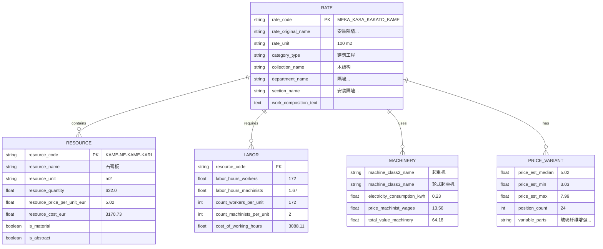
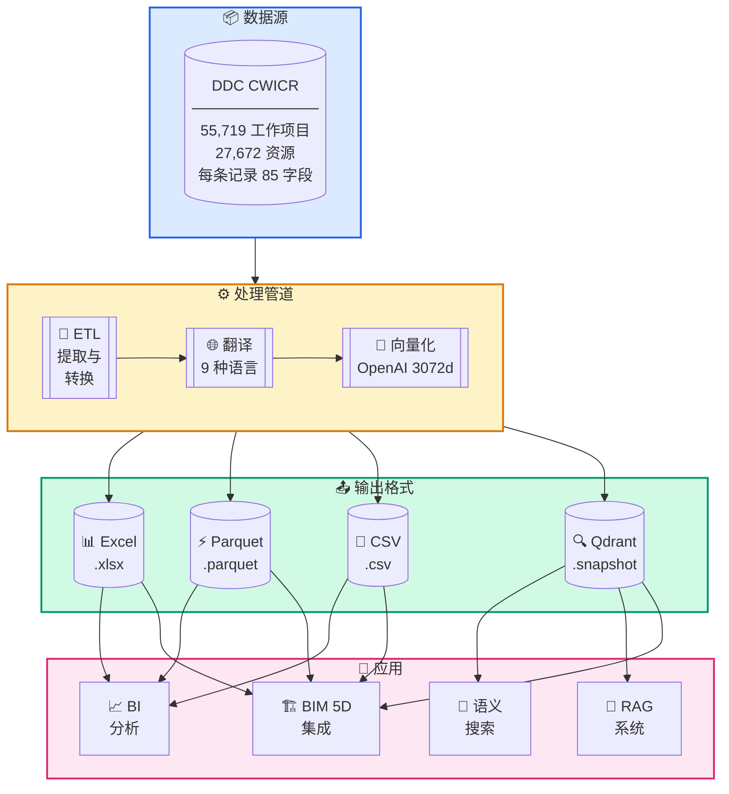
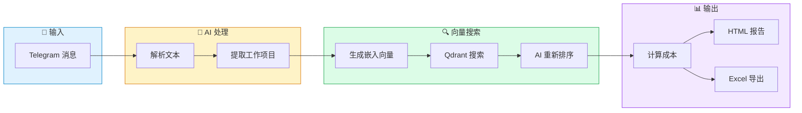
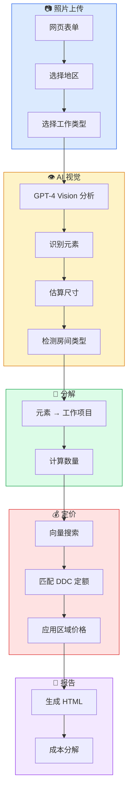
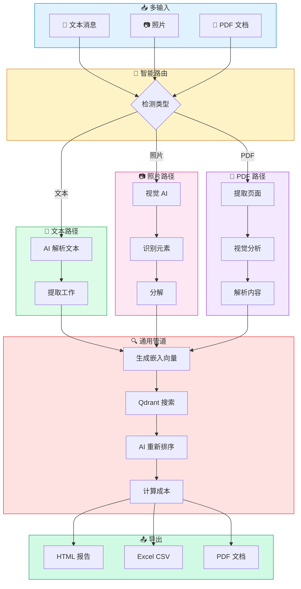
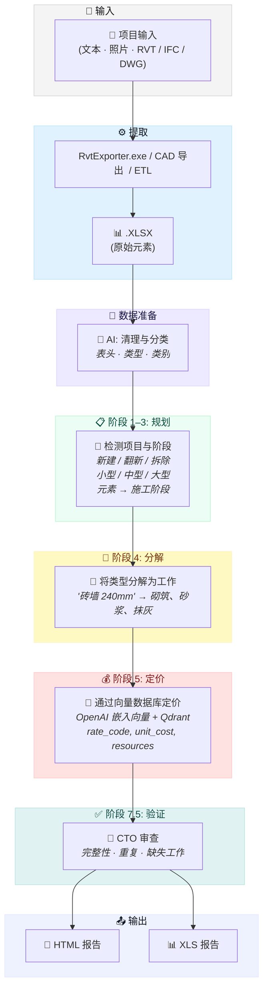

<h3 align="center">DDC CWICR - 建筑工作项目、组件与资源 </br>
  + n8n 管道：基于描述、照片和 CAD (BIM) 的成本估算</h3>

<p align="center">
  <a href="README.md"><b>🇬🇧 English</b></a> •
  <a href="README.zh.md">🇨🇳 中文</a> •
  <a href="README.es.md">🇪🇸 Español</a> •
  <a href="README.pt.md">🇧🇷 Português</a> •
  <a href="README.ru.md">🇷🇺 Русский</a> •
  <a href="README.de.md">🇩🇪 Deutsch</a> •
  <a href="README.fr.md">🇫🇷 Français</a> •
  <a href="README.ar.md">🇸🇦 العربية</a>
</p>

<p align="center">
  
</p>

<div align="center">
  
  
  
  
</div>

<div align="center">
  
  
  
  
  
</div>

<p align="center">
  
</p>

<h3 align="center">⚡ n8n 工作流</h3>
<p align="center"><code>选择输入方式 → 获取成本估算</code></p>

<br>

<table width="100%">
<tr>

<td align="center" valign="top" width="33%">
<br>
<h3>📝 文本</h3>
<p>从简短描述快速<br>生成工程估算</p>
<p><b>输入：</b>Telegram / 聊天消息<br>
<b>输出：</b>匹配的工作项目 + 估算</p>
<br>
<a href="#1️⃣-文本估算机器人">📖 文档</a>
<br><br>
<a href="./n8n_1_Telegram_Bot_Cost_Estimates_and_Rate_Finder_TEXT_DDC_CWICR.json">

</a>
<br><br>
</td>

<td align="center" valign="top" width="33%">
<br>
<h3>📷 照片 / PDF</h3>
<p>现场照片、扫描工程量清单、<br>现场拍摄的照片PDF</p>
<p><b>输入：</b>图片或PDF页面<br>
<b>输出：</b>提取的工作范围 → 估算</p>
<br>
<a href="#2️⃣-照片成本估算器">📖 照片文档</a> · <a href="#3️⃣-通用估算机器人文本--照片--pdf">📖 通用机器人</a>
<br><br>
<a href="./n8n_2_Photo_Cost_Estimate_DDC_CWICR.json">

</a>
&nbsp;
<a href="./n8n_3_Telegram_Bot_Cost_Estimates_and_Rate_Finder_TEXT_PHOTO_PDF_DDC_CWICR.json">

</a>
<br><br>
</td>

<td align="center" valign="top" width="33%">
<br>
<h3>🧊 CAD / BIM</h3>
<p>基于 Revit / IFC / DWG<br>的工程量计算与估算</p>
<p><b>输入：</b>模型导出<br>
<b>输出：</b>4D/5D 估算 + 明细</p>
<br>
<a href="#4️⃣-cad-bim-成本估算管道">📖 文档</a>
<br><br>
<a href="./n8n_4_CAD_(BIM)_Cost_Estimation_Pipeline_4D_5D_with_DDC_CWICR.json">

</a>
<br><br>
</td>

</tr>
</table>

<br>
<p align="center">
  <a href="https://openconstructionestimate.com">
    
  </a>
</p>
<br>
<p align="center">
 DataDrivenConstruction 客户与用户
  <br>
  <a href="https://datadrivenconstruction.io/">
  
  </a>
  <br></br>
</p>


---

## 📑 目录

### 🤖 AI 集成
- [AI 产品的完美燃料](#-您的-ai-产品的完美燃料) — 为什么这个数据库是 AI 的理想选择
- [Claude Code 与 Google Antigravity](#-claude-code--google-antigravity--ai-编程助手) — AI 编程助手
- [n8n](#-n8n--可视化工作流自动化) — 工作流自动化
- [Dify](#-dify--构建-llm-应用) — LLM 应用开发
- [Sim AI 及其他](#-sim-ai--类似平台) — 兼容平台
- [通用场景](#-通用场景) — 您可以构建什么

### 📊 数据库与数据
- [关于](#关于) — 什么是 DDC CWICR
- [可用格式](#可用格式) — Excel、Parquet、CSV、Qdrant
- [数据架构](#数据架构) — 85 字段结构
- [字段分组](#字段分组) — 分类、资源、人工、机械
- [方法论](#方法论) — 基于资源的成本计算原则
- [历史背景](#历史背景) — 100+ 年的标准

### ⚡ n8n 工作流
- [n8n 工作流概述](#-n8n-工作流) — 选择您的输入类型
- [立即体验 — 在线演示机器人](#-立即体验--在线演示机器人) — 在 Telegram 中即时测试
- [工作流 1：文本估算机器人](#1️⃣-文本估算机器人) — 文本输入的 Telegram 机器人
- [工作流 2：照片成本估算器](#2️⃣-照片成本估算器) — 带 AI 视觉的网页表单
- [工作流 3：通用机器人](#3️⃣-通用估算机器人文本--照片--pdf) — 文本 + 照片 + PDF
- [工作流 4：CAD/BIM 管道](#4️⃣-cad-bim-成本估算管道) — Revit/IFC/DWG 转估算
- [工作流快速入门](#工作流快速入门) — 4 步完成设置
- [n8n 2.0+ 设置](#️-n8n-20-设置要求) — 启用执行命令节点

### 🏗️ CAD/BIM 管道
- [先决条件](#-先决条件) — 必需组件
- [管道阶段](#-管道阶段) — 10 阶段处理
- [LLM 模型选择](#️-llm-模型选择) — OpenAI、Claude、Gemini、Grok
- [输出文件](#-输出文件) — HTML 和 Excel 报告
- [故障排除](#️-故障排除) — 常见问题

### 🔍 向量数据库
- [向量数据库](#向量数据库) — 使用 Qdrant 进行语义搜索
- [发布版本](#发布版本) — 下载快照
- [集合](#集合) — 9 种语言集合
- [Docker 部署](#docker-部署) — 自托管设置

### 🚀 快速入门
- [快速入门 - Python](#快速入门) — 表格数据与语义搜索
- [集成场景](#集成) — 入门到高级

### 👥 社区
- [资源与社区](#资源与社区) — 链接与频道
- [咨询与培训](#咨询与培训) — 专业服务
- [贡献](#贡献) — 提交您的工作流
- [许可证](#许可证) — CC BY 4.0 与 MIT
- [支持项目](#支持项目) — 赞助与捐赠
- [🤖 AI 指令](#ai-指令) — AI 助手文档


---

## 🚀 您的 AI 产品的完美燃料

<p align="center">
  <b>只需克隆仓库并描述您想要的内容 — AI 完成其余工作</b>
</p>

DDC CWICR 不仅仅是一个数据库 — 它是 **AI 驱动应用的即用燃料**。无论您是构建成本估算机器人、自动化建筑工作流，还是创建智能助手 — 这些数据可以与现代 AI 工具开箱即用。

### 为什么这个数据库是 AI 的理想选择

| 特性 | 优势 |
|---------|---------|
| **预计算嵌入向量** | 无需生成向量 — 语义搜索即时可用 |
| **结构化的 85 字段架构** | AI 可以推理数据关系并提供准确答案 |
| **包含 9 种语言** | 构建多语言应用无需翻译开销 |
| **55,000+ 工作项目** | 全面覆盖任何建筑估算任务 |
| **基于资源的方法论** | 透明的数据，AI 可以解释和分解 |

### 📋 适用于任何系统的现成工作描述

<p align="center">
  
</p>

DDC CWICR 提供**完整、结构化的工作描述**，可在任何系统或格式中显示。每个工作项目包含不同项目参与者所需的所有信息：

| 参与者 | 获得的内容 |
|--------|-----------|
| 🏢 **业主 / 投资者** | 完全的成本透明度、资源分解、投资决策的价格依据 |
| 📊 **造价工程师** | 详细定额、人工工时、材料数量、设备成本 — 可直接用于编制工程量清单 |
| 👷 **项目经理 / 工长** | 工作组成、资源需求、劳动定额，用于日常规划和执行 |
| 🔧 **承包商 / 施工方** | 完整规格、单价、生产率基准，用于准确报价和进度安排 |

导出至 **Excel、PDF、HTML、ERP系统、BIM平台** — 结构化的85字段架构确保所有输出格式的数据完整性。

### 🛠️ 完美适配

<table>
<tr>
<td align="center" width="20%">
<br/>
<b>Claude Code</b><br/>
<sub>AI 编程助手 CLI</sub>
</td>
<td align="center" width="20%">
<br/>
<b>Google Antigravity</b><br/>
<sub>Google Antigravity</sub>
</td>
<td align="center" width="20%">
<br/>
<b>n8n</b><br/>
<sub>工作流自动化</sub>
</td>
<td align="center" width="20%">
<br/>
<b>Dify</b><br/>
<sub>LLM 应用开发</sub>
</td>
<td align="center" width="20%">
<br/>
<b>Sim AI 及其他</b><br/>
<sub>AI 平台</sub>
</td>
</tr>
</table>

---

### 💻 Claude Code & Google Antigravity — AI 编程助手

使用 DDC CWICR 最快捷的方式。只需在 Claude Code 或 Google Antigravity 中打开仓库，用自然语言提问即可。

**快速入门：**
```bash
# 克隆仓库
git clone https://github.com/datadrivenconstruction/OpenConstructionEstimate-DDC-CWICR.git

# 使用 Claude Code 打开
cd OpenConstructionEstimate-DDC-CWICR
claude
```

**示例提示：**

| 任务 | 提示 |
|------|--------|
| **探索数据** | "显示这个建筑数据库的结构并解释有哪些可用数据" |
| **查找工作项目** | "查找所有与混凝土基础相关的工作项目并显示其成本" |
| **构建查询** | "编写一个 Python 脚本搜索人工工时超过100小时的管道工作项目" |
| **创建报告** | "为住宅装修工程生成成本分解报告" |
| **分析成本** | "比较不同墙体施工方法的材料成本" |
| **构建集成** | "创建一个连接 Qdrant 数据库并执行语义搜索的脚本" |

**专业提示：**
- 指向 Claude 特定文件：*"分析 Parquet 文件并总结成本分布"*
- 请求解释：*"解释这个数据库中基于资源的成本计算方法是如何工作的"*
- 请求修改：*"修改 n8n 工作流以添加邮件通知"*

---

### ⚡ n8n — 可视化工作流自动化

无需编码即可构建强大的自动化管道。将 DDC CWICR 连接到 400+ 个应用和服务。

**使用场景：**

| 工作流 | 描述 |
|----------|-------------|
| **Telegram 机器人** | 用户发送文本/照片 → AI 提取工作项目 → 返回成本估算 |
| **邮件自动化** | 通过邮件接收工程量清单 → AI 处理 → 发送格式化估算 |
| **CRM 集成** | CRM 中新项目 → 自动生成初步估算 → 更新交易价值 |
| **BIM 管道** | 从 Revit 导出 → 提取工程量 → 匹配 DDC 定额 → 生成 5D 报告 |
| **Slack 机器人** | 团队提问 → AI 搜索数据库 → 返回相关工作项目 |

**快速入门：**
1. 从此仓库下载工作流 JSON 文件
2. 导入到 n8n：`工作流 → 导入 → 从文件`
3. 配置凭证（OpenAI、Qdrant、Telegram）
4. 激活并测试

详见 [n8n 工作流](#n8n-工作流--详细说明) 章节的详细设置。

---

### 🤖 Dify — 构建 LLM 应用

使用 DDC CWICR 作为知识库创建自定义 AI 应用。

**设置：**
1. 创建新的 Dify 应用
2. 添加知识库 → 上传 Parquet/CSV 文件或连接到 Qdrant
3. 使用嵌入向量配置 RAG 管道
4. 构建您的聊天界面或 API

**应用创意：**

| 应用类型 | 描述 |
|----------|-------------|
| **建筑估算聊天机器人** | 成本查询的对话界面 |
| **工作项目搜索** | 跨 55,000+ 项目的自然语言搜索 |
| **成本顾问** | 解释成本分解并提供优化建议的 AI |
| **多语言助手** | 自动检测语言并以用户语言回复 |
| **API 端点** | 用于与其他系统集成的 REST API |

**Dify 提示模板示例：**
```
您是一个建筑成本估算助手，可以访问 DDC CWICR 数据库。

上下文：{{context}}

用户问题：{{query}}

根据数据库提供准确的成本信息。包括：
- 带代码的相关工作项目
- 单位成本和数量
- 资源分解（人工、材料、设备）
- 总成本计算
```

---

### 🔮 Sim AI 及类似平台

DDC CWICR 可与任何支持以下功能的 AI 平台集成：
- **向量数据库**（Qdrant、Pinecone、Weaviate、Milvus）
- **结构化数据**（CSV、Parquet、Excel）
- **OpenAI 嵌入向量**（text-embedding-3-large，3072 维度）

**兼容平台：**
- **Sim AI** — AI 模拟与建模
- **LangChain / LlamaIndex** — LLM 应用框架
- **Flowise** — 低代码 LLM 应用构建器
- **Botpress** — 对话 AI 平台
- **Voiceflow** — 语音和聊天设计
- **Stack AI** — 无代码 AI 工作流
- **Relevance AI** — AI 工作流平台

**通用集成模式：**

```python
# 适用于任何支持 Qdrant 的平台
from qdrant_client import QdrantClient

# 连接到 DDC CWICR
client = QdrantClient("your-qdrant-instance", port=6333)

# 语义搜索
results = client.search(
    collection_name="ddc_cwicr_zh",  # 或 en, de, ru 等
    query_vector=your_embedding,
    limit=10
)

# 在您的 AI 应用中使用结果
for item in results:
    print(f"{item.payload['rate_code']}: {item.payload['rate_original_name']}")
```

---

### 📋 通用场景

无论您选择哪种 AI 工具，DDC CWICR 都支持：

| 场景 | 描述 |
|----------|-------------|
| **即时成本估算** | 从文本描述或照片获取建筑成本 |
| **工程量清单生成** | 从项目描述自动生成工程量清单 |
| **价格对标** | 跨地区和语言比较成本 |
| **资源规划** | 计算人工工时、材料和设备需求 |
| **投资分析** | 带完整资源透明度的深度成本审计 |
| **多语言支持** | 以 9 种语言为用户提供本地化定价服务 |
| **BIM 集成** | 连接 Revit/IFC 实现自动化 4D/5D 估算 |
| **训练 AI 模型** | 使用结构化数据微调建筑 AI |

---

## 关于

**DDC CWICR**（建筑工作项目、组件与资源）是一个用于建筑成本估算的开放数据库，涵盖从土方工程和混凝土浇筑到专业安装工作的全部建筑活动。

该数据库借鉴了描述欧亚和亚太地区现代建筑实践的资料来源，统一的技术标准化生态系统为十多个动态发展的经济体提供了通用的工程语言。DDC CWICR 代表了通过建立多语言资本项目管理的统一监管框架来协调开放标准的努力。

<p align="center">
  <br>
  
  <br></br>
</p>

结构化数据可以通过表格格式（XLSX、CSV、Parquet）访问，也可以通过 LLM 进行对话式查询，使专业人员能够使用简单语言或简洁查询将建筑工作描述（QDRANT 向量数据库）集成到自动化管道和工作流中。

### 可用格式

| 格式      | 扩展名   | 大小         | 最适合                              | 特性                             |
|-------------|-------------|--------------|---------------------------------------|--------------------------------------|
| **Excel**   | `.xlsx`     | ~150–400 MB  | 手动分析、筛选、透视表    | 人类可读，完整格式      |
| **Parquet** | `.parquet`  | ~55 MB       | ETL 管道、ML 训练、大数据  | 列式存储，优秀压缩      |
| **CSV**     | `.csv`      | ~1.3 GB      | 数据库导入、遗留系统       | 通用兼容性              |
| **Qdrant**  | `.snapshot` | ~1 GB        | 语义搜索、RAG、AI 助手   | 预计算 OpenAI 嵌入向量       |


在线演示可访问 [openconstructionestimate.com](https://openconstructionestimate.com/)，您可以在这里探索数据并查看向量数据库在语义搜索中的实际应用。

<p align="center">
  
</p>

---

## 数据架构

数据库包含 **85 个字段**，组织成逻辑分组。每条记录代表一个工作项目（定额）或包含完整成本分解的资源。



### 字段分组
85 个数据库字段组织成反映基于资源的成本估算方法的逻辑分组。每个分组在成本分解结构中服务于特定功能：从层次分类和工作项目识别到详细的资源消耗、人工需求、机械成本和汇总合计。这种模块化结构允许用户仅查询与其任务相关的字段 - 无论是生成材料清单、分析人工生产率，还是构建完整的成本估算。

<p align="center">
  <br>
  
  <br></br>
</p>

**分类** - `category_type`, `collection_code`, `collection_name`, `department_code`, `department_name`, `department_type`, `section_name`, `section_type`, `subsection_code`, `subsection_name`

**工作项目（定额）** - `rate_code`, `rate_original_name`, `rate_final_name`, `rate_unit`, `row_type`, `is_scope`, `is_abstract`, `is_machine`, `is_labor`, `is_material`, `work_composition_text`

**资源** - `resource_code`, `resource_name`, `resource_unit`, `resource_quantity`, `parameter_resource_quantity`, `resource_price_per_unit_eur_current`, `resource_cost_eur`

**人工** - `count_workers_per_unit`, `count_engineers_per_unit`, `count_machinists_per_unit`, `count_total_people_per_unit`, `labor_hours_construction_workers`, `labor_hours_machinists`, `labor_hours_engineers`, `total_labor_hours_workers_machinists`, `total_labor_hours_all_personnel`, `cost_of_working_hours`, `count_people_per_day`

**机械** - `machine_class2_name`, `machine_class3_name`, `personnel_machinist_code`, `personnel_machinist_grade`, `price_machinist_wages`, `price_relocation_included`, `price_cost_without_wages`, `electricity_consumption_kwh_per_machine_hour`, `electricity_cost_per_unit`, `electricity_cost_total_sum`, `cost_machinist_sum`, `total_value_machinery_equipment`

**价格变体** - `price_code_prefix`, `price_abstract_resource_common_start`, `price_abstract_resource_variable_parts`, `price_abstract_resource_position_count`, `price_abstract_resource_est_price_min`, `price_abstract_resource_est_price_max`, `price_abstract_resource_est_price_mean`, `price_abstract_resource_est_price_median`, `price_abstract_resource_unit`, `abstract_resource_tech_group`

**汇总** - `total_cost_per_position`, `total_material_cost_per_position`, `total_resource_cost_per_position`, `total_value_abstract_resources`, `materials_resource_cost_eur`

**质量与服务** - `mass_name`, `mass_value`, `mass_unit`, `service_category`, `service_type`, `parameter_service_code`, `parameter_service_unit`, `parameter_service_name`, `parameter_service_quantity`, `service_cost_sum`

### 成本计算公式

| 组件         | 技术定额  | ×   | 区域价格  | =   | 成本                    |
|-------------------|------------------|-----|-----------------|-----|-------------------------|
| 👷 **人工**      | 172 小时/100m²    | ×   | €17.95/小时       | =   | €3,088.11               |
| 🧱 **材料**  | 632 m²/100m²     | ×   | €5.02/m²        | =   | €3,170.73               |
| 🚜 **设备**  | 1.67 小时/100m²   | ×   | €38.42/小时       | =   | €64.18                  |
|                   |                  |     | **合计**       | =   | **€7,725.91 每 100m²** |

---

## 方法论

**基于资源的成本计算**的核心价值在于将不变的生产技术与波动的财务组件分离。它基于建筑的物理"第一性原理"：
- 特定工作所需的人工工时
- 每单位工作的材料数量
- 所需的设备时间

**为什么重要：**

- **透明** - 无隐藏加价的定价，完整的资源分解
- **可审计** - 深入投资分析和验证的能力
- **可移植** - 适用于各市场的地区独立定额
- **经过验证** - 建立 100+ 年的行业标准方法




### 历史背景

该数据库中的建筑工作描述基于一种基于资源的标准化方法，其根源可追溯到 20 世纪初的生产定额到今天的数字参考系统。自 1920 年代以来持续开发和完善，这种方法在欧亚地区经历了特别强劲的发展。

在一百年的发展历程中，该系统已从手工计算过渡到机器可读格式 - 但其基本原则保持不变：精确测量每单位建筑产出所需的物理资源。现代实现将历史规范数据与实时市场定价相结合。

该方法的区域适应版本以各种国家名称运行：ENIR、GESN、FER、NRR、ESN、AzDTN、ShNQK、MKS ChT、SNT、BNbD、Dinh Muc、定额。

<p align="center">
  
</p>

⭐ <b>如果您希望看到新的更新和数据库版本，如果您觉得我们的工具有用，请为我们的仓库点星，以看到更多类似的建筑行业应用。</b>
在 GitHub 上给 DDC 工作流加星，即可立即获得新版本通知。
<p align="center">
  <br>
  
  <br></br>
</p>


---


## 集成

### 使用场景

- **入门级** - 成本对标、价格指数化、招标估算

- **中级** - 本地化、ETL/BI 管道、CO₂ 计算

- **高级** - AI/ML 训练、CAD (BIM) 5D、深度投资审计

---

## n8n 工作流 — 详细说明

四个可用于生产的自动化建筑成本估算工作流。每个工作流通过 Qdrant 连接到 DDC CWICR 向量数据库，并使用 AI 模型进行智能解析和匹配。

| #   | 工作流                                                        | 输入       | 最适合                        | 下载                                                                                            |
|-----|-----------------------------------------------------------------|-------------|---------------------------------|-----------------------------------------------------------------------------------------------------|
| 1   | [文本估算机器人](#1️⃣-文本估算机器人)                    | 💬 文本     | 从文本快速估算       | [JSON](./n8n_1_Telegram_Bot_Cost_Estimates_and_Rate_Finder_TEXT_DDC_CWICR.json)                      |
| 2   | [照片估算器](#2️⃣-照片成本估算器)                     | 📷 照片    | 现场勘查、视觉检查 | [JSON](./n8n_2_Photo_Cost_Estimate_DDC_CWICR.json)                                                  |
| 3   | [通用机器人](#3️⃣-通用估算机器人文本--照片--pdf)   | 💬📷📄 全部  | 全功能生产使用    | [JSON](./n8n_3_Telegram_Bot_Cost_Estimates_and_Rate_Finder_TEXT_PHOTO_PDF_DDC_CWICR.json)            |
| 4   | [CAD/BIM 管道](#4️⃣-cad-bim-成本估算管道)        | 🏗️ Revit   | BIM 4D/5D 估算      | [JSON](./n8n_4_CAD_(BIM)_Cost_Estimation_Pipeline_4D_5D_with_DDC_CWICR.json)                         |

---

### 1️⃣ 文本估算机器人

**文件：** `n8n_1_Telegram_Bot_Cost_Estimates_and_Rate_Finder_TEXT_DDC_CWICR.json`

用于基于文本的成本估算的 Telegram 机器人。用自然语言描述建筑工作 — 机器人解析输入，搜索向量数据库，返回详细的成本分解。

<p align="center">
  <br>
  
  <br></br>
</p>

<h3 align="left">🤖 立即体验 — 在线演示机器人</h3>
<p align="left"><i>在 Telegram 中即时测试估算工作流</i></p>
<p><b>@TextOpenConstructionEstimate_bot</b></p>
<p>从文本描述创建<br>完整的成本估算</p>
<a href="https://t.me/TextOpenConstructionEstimate_bot">

</a>




**工作原理：**

| 步骤  | 操作                                 | 技术                             |
|-------|----------------------------------------|----------------------------------------|
| 1     | 用户发送文本描述            | Telegram Bot API                       |
| 2     | AI 解析并提取工作项目      | OpenAI / Claude / Gemini               |
| 3     | 为每个项目生成嵌入向量      | OpenAI `text-embedding-3-large`        |
| 4     | 在数据库中搜索匹配定额      | Qdrant 向量搜索                   |
| 5     | AI 重新排序以提高准确性        | LLM 评分                            |
| 6     | 计算成本并生成报告    | HTML / Excel / PDF                     |

**功能：**

| 功能                    | 描述                                                          |
|----------------------------|----------------------------------------------------------------------|
| 💬 自然语言输入  | 接受任何文本格式 — 列表、句子、结构化描述 |
| 🤖 多 LLM 支持       | 支持 OpenAI、Claude 或 Gemini（可切换）                    |
| 🔍 语义搜索         | 即使措辞不同也能找到最佳匹配                       |
| 🌍 9 种语言             | DE、EN、RU、ES、FR、PT、ZH、AR、HI                                   |
| 📊 多种导出        | HTML 报告、Excel 电子表格、PDF 文档                         |
| ✏️ 交互式编辑     | 在最终计算前修改数量                           |

**所需凭证：**
- Telegram 机器人令牌（来自 @BotFather）
- OpenAI API 密钥（用于嵌入向量 + 可选 LLM）
- Qdrant URL + API 密钥

---

### 2️⃣ 照片成本估算器

**文件：** `n8n_2_Photo_Cost_Estimate_DDC_CWICR.json`

用于基于照片估算的网页表单界面。上传建筑照片 — AI 视觉识别元素，估算尺寸，并自动计算成本。

<p align="center">
  <br>
  
  <br></br>
</p>




**工作原理：**

| 步骤  | 操作                                        | 技术                           |
|-------|-----------------------------------------------|--------------------------------------|
| 1     | 用户通过网页表单上传照片               | n8n 表单触发器                     |
| 2     | AI 视觉分析图像                  | GPT-4 Vision                         |
| 3     | 识别房间类型、元素、材料       | 结构化 JSON 提取           |
| 4     | 从参考物体估算尺寸    | AI 推理（门、瓷砖等）    |
| 5     | 将元素分解为工作项目            | LLM 处理                       |
| 6     | 通过向量搜索为每项工作定价             | Qdrant + OpenAI 嵌入向量           |
| 7     | 生成专业 HTML 报告             | 样式化输出                        |

**功能：**

| 功能                | 描述                                             |
|------------------------|---------------------------------------------------------|
| 📷 照片分析      | GPT-4 Vision 识别建筑元素           |
| 📐 自动计算尺寸   | 使用参考物体估算大小（门、瓷砖）  |
| 🏠 房间检测      | 浴室、厨房、卧室、外墙等              |
| 🔨 工作类型支持   | 新建 / 翻新 / 维修                  |
| 🌍 9 个区域数据库| 本地化价格：柏林、多伦多、巴黎等        |
| 📄 专业报告| 可供客户使用的整洁 HTML 输出                     |

**所需凭证：**
- OpenAI API 密钥（GPT-4 Vision + 嵌入向量）
- Qdrant URL + API 密钥

---

### 3️⃣ 通用估算机器人（文本 + 照片 + PDF）

**文件：** `n8n_3_Telegram_Bot_Cost_Estimates_and_Rate_Finder_TEXT_PHOTO_PDF_DDC_CWICR.json`

支持所有输入类型的全功能 Telegram 机器人：文本描述、建筑照片和 PDF 平面图。生产使用的最全面工作流。


<p align="center">
  <br>
  
  <br></br>
</p>

<h3 align="left">🤖 立即体验 — 在线演示机器人</h3>
<p align="left"><i>在 Telegram 中即时测试估算工作流</i></p>
<h3>📷 通用机器人</h3>
<p><b>@OpenConstructionEstimate_bot</b></p>
<p>支持文本、照片和 PDF 的全功能机器人</p>
<a href="https://t.me/OpenConstructionEstimate_bot">

</a>
<br><br>





**工作原理：**

| 步骤  | 操作                                    | 技术                     |
|-------|-------------------------------------------|--------------------------------|
| 1     | 用户发送文本、照片或 PDF            | Telegram Bot API               |
| 2     | 路由器检测输入类型                 | 内容类型分析          |
| 3a    | **文本：** AI 解析工作项目            | OpenAI / Gemini                |
| 3b    | **照片：** 视觉 AI 提取元素    | GPT-4 Vision / Gemini 2.0      |
| 3c    | **PDF：** 提取并分析页面        | PDF 处理 + 视觉        |
| 4     | DDC CWICR 语义搜索              | Qdrant 向量数据库         |
| 5     | AI 重新排序以获得最佳匹配             | LLM 评分                    |
| 6     | 通过机器人菜单交互式编辑          | Telegram 内联键盘      |
| 7     | 导出结果                            | HTML / Excel / PDF             |

**17 个机器人操作：**

| 操作           | 描述                         |
|------------------|-------------------------------------|
| `/start`         | 语言选择菜单             |
| 照片上传     | 触发 AI 视觉分析          |
| 文本消息     | 解析并提取工作项目        |
| PDF 上传       | 处理平面图                 |
| 编辑数量  | 计算前修改           |
| 添加工作         | 手动添加工作项目              |
| 计算        | 运行完整成本估算            |
| 查看详情     | 显示每项的资源        |
| 导出 Excel     | 下载 CSV 电子表格            |
| 导出 PDF       | 生成 PDF 报告                 |
| 帮助             | 显示使用说明             |
| 优化           | 重新分析并更正         |

**功能：**

| 功能               | 描述                                        |
|-----------------------|----------------------------------------------------|
| 📷 双视觉 AI     | Gemini 2.0 Flash 或 GPT-4 Vision（可配置）    |
| 📄 PDF 处理     | 平面图、扫描工程量清单、文档                |
| 💬 智能文本解析 | 处理列表、表格、自由格式文本              |
| 🔍 AI 重新排序       | 提高匹配准确性                            |
| ✏️ 完整编辑       | 添加、删除、修改工作项目                     |
| 📊 多格式导出| HTML、Excel、PDF                                   |
| 🌍 9 种语言        | 完整本地化                              |

**所需凭证：**
- Telegram 机器人令牌
- OpenAI API 密钥（嵌入向量）
- Gemini API 密钥（视觉）或 OpenAI GPT-4 Vision
- Qdrant URL + API 密钥

---

### 4️⃣ CAD (BIM) 成本估算管道

**文件：** `n8n_4_CAD_(BIM)_Cost_Estimation_Pipeline_4D_5D_with_DDC_CWICR.json`

从 Revit/IFC/DWG 模型自动估算成本。提取 BIM 数据，分类元素，分解为工作项目，并生成带完整资源分解的 4D/5D 估算。

<p align="left">
  <a href="https://datadrivenconstruction.io">
    
  </a>
</p>




**n8n 提供 400+ 个原生集成**，包括 Google Sheets、Notion、Slack、Airtable、数据库（PostgreSQL、MongoDB）、云存储等。此工作流中的每个节点都是模块化的 — 您可以：

- 🔄 **切换 LLM 提供商**（OpenAI ↔ Claude ↔ Gemini ↔ Grok）
- 📊 **连接到您的 ERP 或项目管理系统**
- 📁 **将结果导出到任何目标**（云存储、邮件、仪表板）
- 🔧 **修改任何阶段**以匹配您的估算方法

工作流由您自由调整。无限制。无许可费。完全控制。

---

## 📋 先决条件

| 组件                                          | 要求                            | 描述                                                           |
|----------------------------------------------------|----------------------------------------|-----------------------------------------------------------------------|
| **[n8n](https://n8n.io/)**                         | v1.0+（v2.0+ 需要[设置](#️-n8n-20-设置要求)）                    | 用于编排估算管道的工作流自动化平台|
| **[Qdrant](https://qdrant.tech/)**                 | 云或自托管实例          | 用于跨建筑工作项目语义搜索的向量数据库    |
| **[OpenAI API](https://platform.openai.com/)**     | 用于嵌入向量（`text-embedding-3-large`）| 为 BIM 元素和成本数据库匹配生成向量嵌入|
| **LLM API**                                        | OpenAI / Claude / Gemini / xAI Grok    | 用于工作项目分类和估算生成的 AI 模型        |
| **[DDC 转换器](https://github.com/datadrivenconstruction/cad2data-Revit-IFC-DWG-DGN-pipeline-with-conversion-validation-qto)** | `RvtExporter.exe` | 从 Revit 模型提取 BIM 数据到 Excel/JSON 进行处理 |

---

## 工作流快速入门

### 步骤 1：导入工作流

```
n8n → 新工作流 → 从文件导入 → 选择 JSON
```

### 步骤 2：配置凭证

在 **🔑 TOKEN** 节点中设置您的 API 密钥：

```json
{
  "bot_token": "您的_TELEGRAM_机器人_令牌",
  "OPENAI_API_KEY": "您的_OPENAI_密钥",
  "GEMINI_API_KEY": "您的_GEMINI_密钥",
  "QDRANT_URL": "http://localhost:6333",
  "QDRANT_API_KEY": ""
}
```

### 步骤 3：将 DDC CWICR 加载到 Qdrant

从[发布版本](#发布版本)下载快照并导入：

```bash
curl -X POST "http://localhost:6333/collections/ddc_cwicr_zh/snapshots/upload" \
  -H "Content-Type: multipart/form-data" \
  -F "snapshot=@ZH_SHANGHAI_workitems_EMBEDDINGS_3072_DDC.snapshot"
```

### 步骤 4：激活并测试

- 在 n8n 中启用工作流
- 对于 Telegram 机器人：向您的机器人发送 `/start`
- 对于网页表单：打开 n8n 提供的表单 URL

---

## ⚠️ n8n 2.0+ 设置要求

> **从 n8n 2.0 版本开始，出于安全原因，执行命令节点默认被禁用。**
>
> 没有以下配置，使用执行命令的工作流（特别是 CAD/BIM 管道）**将无法工作** — 节点会显示问号或无法识别。

### 快速修复

**Windows (CMD) — 每次运行：**
```cmd
set NODES_EXCLUDE=[] && npx n8n
```

**永久解决方案 — 创建一次：**

创建文件 `C:\Users\您的用户名\.n8n\.env`，内容为：
```
NODES_EXCLUDE=[]
```
然后像平常一样运行 `npx n8n`。

**Docker：**
```yaml
environment:
  - NODES_EXCLUDE=[]
```

### 验证设置

1. 启动 n8n
2. 点击 **+** → 搜索 **"Execute Command"**
3. 如果节点出现 → ✅ 设置完成！

> 📚 更多详情：[n8n 2.0 重大变更](https://docs.n8n.io/2-0-breaking-changes/)

---

## 🌍 支持的语言和价格级别

| 代码  | 语言    | 价格级别     | 货币 | Qdrant 集合   |
|-------|-------------|-----------------|----------|---------------------|
| `AR`  | 阿拉伯语      | 迪拜           | AED      | `ddc_cwicr_ar`      |
| `DE`  | 德语      | 柏林          | EUR      | `ddc_cwicr_de`      |
| `EN`  | 英语     | 多伦多         | CAD      | `ddc_cwicr_en`      |
| `ES`  | 西班牙语     | 巴塞罗那       | EUR      | `ddc_cwicr_es`      |
| `FR`  | 法语      | 巴黎           | EUR      | `ddc_cwicr_fr`      |
| `HI`  | 印地语       | 孟买          | INR      | `ddc_cwicr_hi`      |
| `PT`  | 葡萄牙语  | 圣保罗       | BRL      | `ddc_cwicr_pt`      |
| `RU`  | 俄语     | 圣彼得堡  | RUB      | `ddc_cwicr_ru`      |
| `ZH`  | 中文     | 上海        | CNY      | `ddc_cwicr_zh`      |

---

## 📊 管道阶段

CAD/BIM 工作流通过 10 个阶段处理数据：

| 阶段   | 名称                 | 描述                                                       |
|---------|----------------------|-------------------------------------------------------------------|
| **0**   | 收集 BIM 数据     | 通过 DDC 转换器从 Revit 提取元素                     |
| **1**   | 项目检测    | AI 识别项目类型（住宅、商业等）        |
| **2**   | 阶段生成     | AI 创建施工阶段                                    |
| **3**   | 元素分配   | AI 将 BIM 类型映射到阶段                                       |
| **4**   | 工作分解   | AI 将类型分解为工作项目（"砖墙" → 砌筑、砂浆）  |
| **5**   | 向量搜索        | 通过 Qdrant 在 DDC CWICR 中查找匹配定额                       |
| **6**   | 单位映射         | 将 BIM 单位转换为定额单位                                   |
| **7**   | 成本计算     | 每个工作项目的 数量 × 单价                               |
| **7.5** | 验证           | CTO 审查完整性和重复项                        |
| **8**   | 汇总          | 按阶段和类别求和                                      |
| **9**   | 报告生成    | 创建 HTML 和 Excel 输出                                     |

---

## ⚙️ LLM 模型选择

工作流支持多个 AI 提供商。在 **LLM Models** 部分启用您首选的模型：

| 模型            | 节点名称                    | 状态       |
|------------------|------------------------------|--------------|
| OpenAI GPT-4o    | `OpenAI LLM`                 | ✅ 默认   |
| Claude Opus 4    | `Anthropic Chat Model2`      | 已禁用     |
| Gemini 2.5 Pro   | `Google Gemini Chat Model`   | 已禁用     |
| xAI Grok         | `xAI Grok Chat Model1`       | 已禁用     |
| DeepSeek         | `DeepSeek Chat Model`        | 已禁用     |

切换模型：**启用**所需的模型节点并**禁用**其他模型。

---

## 📁 输出文件

报告保存到项目文件夹：
```
project_YYYY-MM-DD.html   ← 交互式报告（在浏览器中打开）
project_YYYY-MM-DD.xls    ← Excel 兼容电子表格
```
<p align="center">
  <br>
  
  <br></br>
</p>

---

## 🔗 Qdrant 集合

工作流根据 `language_code` 自动选择正确的集合：

```
{LANG}_{CITY}_workitems_costs_resources_EMBEDDINGS_3072_DDC_CWICR
```

示例：`ZH_SHANGHAI_workitems_costs_resources_EMBEDDINGS_3072_DDC_CWICR`

---

## ⚠️ 故障排除

| 问题                        | 解决方案                                                    |
|------------------------------|-------------------------------------------------------------|
| "Execute Command missing"（n8n 2.0+） | 设置 `NODES_EXCLUDE=[]` 环境变量。见 [n8n 2.0+ 设置](#️-n8n-20-设置要求) |
| "No Excel file found"        | 检查 `path_to_converter` 和 `project_file` 路径          |
| "Qdrant connection failed"   | 验证凭证中的 Qdrant URL 和 API 密钥                |
| "Rate limit exceeded"        | 减少批量大小或在 API 调用之间添加延迟           |
| "No pricing found"           | 检查 Qdrant 中是否存在正确的语言集合   |
| "Telegram webhook error"     | 确保工作流已激活且 webhook URL 可访问     |
| "Vision API failed"          | 验证 Gemini 或 OpenAI Vision API 密钥是否有效             |

---

## 向量数据库

带有 OpenAI `text-embedding-3-large` 嵌入向量的即用 Qdrant 集合，用于跨建筑工作项目的语义搜索。

向量数据库允许您用自然语言与数据"对话" — 使用简单的句子或短语而不是代码或复杂的过滤器。这大大加快了查找正确工作项目或成本行的速度，即使在非常大的数据集中也是如此。

这些 Qdrant 集合可以通过现代自动化和集成工作流连接到应用程序（例如，低代码/无代码工作流和管道工具）。您可以构建搜索、过滤和解释建筑工作项目的助手，或将语义搜索直接集成到现有的估算和项目控制工具中。

---

### 发布版本

从 [GitHub Releases](https://github.com/datadrivenconstruction/OpenConstructionEstimate-DDC-CWICR/releases) 下载 QDRANT 和 CSV 数据集（大于 1GB 的文件）。

| 语言        | 地区         | CSV 文件             | Qdrant 快照                            |
|-----------------|----------------|-----------------------|--------------------------------------------|
| 🇸🇦 阿拉伯语      | 迪拜          | `AR_DUBAI_*.csv`      | `AR_DUBAI_*_EMBEDDINGS_3072_DDC.snapshot`   |
| 🇨🇳 中文     | 上海       | `ZH_SHANGHAI_*.csv`   | `ZH_SHANGHAI_*_EMBEDDINGS_3072_DDC.snapshot`|
| 🇩🇪 德语      | 柏林         | `DE_BERLIN_*.csv`     | `DE_BERLIN_*_EMBEDDINGS_3072_DDC.snapshot`  |
| 🇬🇧 英语     | 多伦多        | `EN_TORONTO_*.csv`    | `EN_TORONTO_*_EMBEDDINGS_3072_DDC.snapshot` |
| 🇪🇸 西班牙语     | 巴塞罗那      | `ES_BARCELONA_*.csv`  | `ES_BARCELONA_*_EMBEDDINGS_3072_DDC.snapshot`|
| 🇫🇷 法语      | 巴黎          | `FR_PARIS_*.csv`      | `FR_PARIS_*_EMBEDDINGS_3072_DDC.snapshot`   |
| 🇮🇳 印地语       | 孟买         | `HI_MUMBAI_*.csv`     | `HI_MUMBAI_*_EMBEDDINGS_3072_DDC.snapshot`  |
| 🇧🇷 葡萄牙语  | 圣保罗 | `PT_SAOPAULO_*.csv`   | `PT_SAOPAULO_*_EMBEDDINGS_3072_DDC.snapshot`|
| 🇷🇺 俄语     | 圣彼得堡 | `RU_SPB_*.csv`        | `RU_SPB_*_EMBEDDINGS_3072_DDC.snapshot`     |

<a href="https://github.com/datadrivenconstruction/OpenConstructionEstimate-DDC-CWICR/releases/tag/v0.1.0">
  
</a>

### 集合

🇸🇦 `ddc_cwicr_ar`（阿拉伯语） · 🇨🇳 `ddc_cwicr_zh`（中文） · 🇩🇪 `ddc_cwicr_de`（德语） · 🇬🇧 `ddc_cwicr_en`（英语） · 🇪🇸 `ddc_cwicr_es`（西班牙语） · 🇫🇷 `ddc_cwicr_fr`（法语） · 🇮🇳 `ddc_cwicr_hi`（印地语） · 🇧🇷 `ddc_cwicr_pt`（葡萄牙语） · 🇷🇺 `ddc_cwicr_ru`（俄语）

每个集合包含 **55,719 个向量**，带有完整的负载元数据。

### Docker 部署

```yaml
# docker-compose.yml
services:
  qdrant:
    image: qdrant/qdrant:latest
    container_name: ddc-cwicr-qdrant
    ports:
      - "6333:6333"
      - "6334:6334"
    volumes:
      - qdrant_storage:/qdrant/storage
      - ./snapshots:/qdrant/snapshots
    environment:
      - QDRANT__LOG_LEVEL=INFO
    restart: unless-stopped

volumes:
  qdrant_storage:
```

```bash
# 启动
docker-compose up -d

# 导入快照
curl -X POST "http://localhost:6333/collections/ddc_cwicr_zh/snapshots/upload" \
  -H "Content-Type: multipart/form-data" \
  -F "snapshot=@ddc_cwicr_zh.snapshot"

# 仪表板：http://localhost:6333/dashboard
```
---

## 快速入门

### Python - 表格数据

```python
import pandas as pd

# Parquet（推荐）
df = pd.read_parquet("DDC_CWICR_ZH.parquet")

# Excel
df = pd.read_excel("DDC_CWICR_ZH.xlsx")

print(f"记录数：{len(df):,} | 字段数：{len(df.columns)}")
print(df[['rate_code', 'rate_original_name', 'rate_unit', 'total_cost_per_position']].head())
```

### Python - 语义搜索

```python
from qdrant_client import QdrantClient
from openai import OpenAI

client = QdrantClient("localhost", port=6333)
openai = OpenAI()

# 用自然语言搜索
query = "钢筋混凝土基础浇筑"
embedding = openai.embeddings.create(
    input=query,
    model="text-embedding-3-large"
).data[0].embedding

results = client.search(
    collection_name="ddc_cwicr_zh",
    query_vector=embedding,
    limit=5
)

for r in results:
    print(f"[{r.score:.3f}] {r.payload['rate_code']}: {r.payload['rate_original_name']}")
```

### 筛选搜索

```python
from qdrant_client.models import Filter, FieldCondition, MatchValue, Range

# 按部门
results = client.search(
    collection_name="ddc_cwicr_zh",
    query_vector=embedding,
    query_filter=Filter(must=[
        FieldCondition(key="department_name", match=MatchValue(value="混凝土和钢筋混凝土"))
    ]),
    limit=10
)

# 按价格范围
results = client.search(
    collection_name="ddc_cwicr_zh",
    query_vector=embedding,
    query_filter=Filter(must=[
        FieldCondition(key="price_est_median", range=Range(gte=1000, lte=50000))
    ]),
    limit=10
)
```


---

## 资源与社区

[](https://datadrivenconstruction.io)
[](https://openconstructionestimate.com)
[](https://github.com/datadrivenconstruction)
[](https://youtube.com/@datadrivenconstruction)
[](https://linkedin.com/company/datadrivenconstruction)
[](https://t.me/datadrivenconstruction)

### 咨询与培训

我们与全球领先的建筑、工程、咨询机构和技术公司合作，帮助他们实施开放数据原则、自动化 CAD/BIM 处理，并构建强大的 ETL 管道。我们积极支持寻求数字化转型和互操作性实用解决方案的组织，专注于数据质量和分类挑战，同时推动开放和自动化工作流的采用。

如果您想用自己的数据测试此解决方案，或有兴趣将工作流适配到实际项目任务，请随时联系我们。我们的团队提供实践研讨会、战略咨询，并开发针对实际项目流程的原型。

<a href="mailto:info@datadrivenconstruction.io">
  
</a>

### 贡献

DDC CWICR 是一个免费开放的项目，致力于使建筑行业更加高效、透明和技术先进。我们正在积极寻找志同道合的爱好者，他们认同这一使命。如果您创建了有用的解决方案并准备与社区分享，我们将帮助您被更多人知道。

我们邀请您提交基于 DDC CWICR 工具的开源工作流、管道和集成 — 任何人都可以在工作中自由使用的工具。优秀的解决方案将在 GitHub 上以完整的作者署名发布，并通过我们的新闻通讯和社交媒体渠道宣布，触达数万名专业订阅者。这将使您的名字直接展示在国际估算师、BIM 专家和项目经理社区面前。

我们一起改变行业。您可以将您的解决方案发送到 info@datadrivenconstruction.io，主题为"DDC Open Workflow"，或直接向我们的 GitHub 仓库提交 Pull Request。

使用现成的 CAD-BIM n8n 工作流自动化建筑数据处理：

<a href="https://github.com/datadrivenconstruction/cad2data-Revit-IFC-DWG-DGN-pipeline-with-conversion-validation-qto">
  
</a>

---

## 🤖 AI 指令

`AI_INSTRUCTIONS/` 文件夹包含 AI 编程助手有效使用此建筑成本数据库的全面文档。

### 什么是 DDC CWICR？

**DDC CWICR**（建筑工作项目、组件与资源）是一个开源建筑成本数据库，包含：
- **55,719 个工作项目** — 带完整成本分解的详细建筑操作
- **27,672 个资源** — 材料、人工和设备，带区域定价
- **85 个数据字段** — 用于准确成本计算的结构化架构
- **9 种语言** — 带特定区域定价（EUR、USD、CAD、RUB、CNY 等）
- **预计算嵌入向量** — 3072 维 OpenAI 向量，用于语义搜索

### 基于资源的方法论

数据库使用**基于资源的成本计算方法**，将以下内容分离：
- **技术定额**（不变） — 人工工时、材料数量、设备时间
- **区域价格**（波动） — 小时费率、材料成本、燃料价格

```
实际成本 = 技术定额 × 区域价格
```

这允许在不同地区和时间段进行准确估算。

### AI 指令文件

| 文件 | 用途 |
|------|---------|
| `INSTRUCTIONS.md` | 主要概述、快速入门、数据格式 |
| `CLAUDE.md` | Claude Code 特定模式和示例 |
| `OPENCODE.md` | Opencode 简明指南 |
| `ANTIGRAVITY.md` | GCP 集成（BigQuery、Vertex AI、Qdrant） |
| `DATABASE_SCHEMA.md` | 完整的 85 字段架构参考 |

### n8n 工作流 — 示例与模板

包含的 n8n 工作流是**示例和模板**，演示成本估算逻辑。它们可以：
- ✅ 直接使用进行快速部署
- ✅ 部分适配特定业务需求
- ✅ 学习以理解成本计算方法
- ✅ 在任何平台上构建自定义集成时参考

工作流演示：数据库查询、工作项目匹配、区域定价逻辑和报告生成。AI 可以分析这些以理解完整的估算流程。

### 为什么重要

AI 助手可以帮助您：
- 使用自然语言查询数据库
- 通过语义搜索查找工作项目
- 使用区域定价计算成本
- 生成报告和导出数据
- 构建与云服务的集成
- 从工作流示例理解成本计算方法

### 使用 AI 快速入门

1. 在支持 AI 的 IDE 中打开项目
2. 询问：*"显示所有混凝土工作项目及其成本"*
3. AI 将使用指令正确查询数据

**书籍**：有关方法论详情，请参阅 [Data-Driven Construction 书籍](https://datadrivenconstruction.io/book)

---

## 许可证

**数据库**（DDC CWICR）- [CC BY 4.0](https://creativecommons.org/licenses/by/4.0/)。可自由商业使用、分享和改编。署名："DDC CWICR by DataDrivenConstruction"

**代码**（工作流、脚本）- [MIT](https://opensource.org/licenses/MIT)。可自由使用、修改和分发，无限制。

## 支持项目

如果您觉得有用，请考虑支持：

[](https://github.com/sponsors/datadrivenconstruction)
[](https://buymeacoffee.com/boikoartem)


<p align="left">
  <br/>
  <b>释放建筑数据的力量</b><br/>
  <sub>迈向只有统一结构化数据和流程的全周期数据管理</sub>
</p>

<p align="left">
  <a href="https://datadrivenconstruction.io">
    
  </a>
</p>

<p align="left">
  <sub>© 2025 Artem Boiko · <a href="https://datadrivenconstruction.io">datadrivenconstruction.io</a></sub>
</p>
